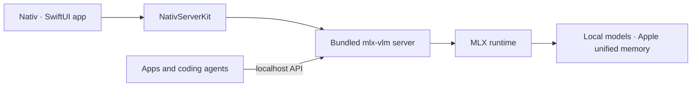

<p align="center">
  
</p>

<h1 align="center">Nativ</h1>

<p align="center">
  <strong>Local AI, native to your Mac.</strong>
</p>

<p align="center">
  Chat, serve, monitor, and connect MLX models from one macOS app.
</p>

<p align="center">
  
  
  
  
</p>

Nativ is a native macOS workspace for running AI models locally on Apple silicon. It bundles an [`mlx-vlm`](https://github.com/Blaizzy/mlx-vlm) server, finds compatible models in your Hugging Face cache, and wraps the whole experience in a polished SwiftUI app.

Use Nativ as a private chat app, a model manager, a performance dashboard, or an OpenAI- and Anthropic-compatible local inference server for the tools you already use.

## What Nativ can do

| Feature | What you get |
|---|---|
| **Local chat and vision** | Streaming conversations, image attachments, reasoning output, response metrics, and persistent chat history. |
| **Model library** | Discover installed MLX models, browse compatible models on Hugging Face, download them, inspect capabilities, switch models, or remove old ones. |
| **Performance analytics** | Track request volume, token usage, time to first token, decode speed, model performance, and recent activity. |
| **Local APIs** | OpenAI-compatible chat, Responses, image, audio, and model endpoints, plus Anthropic Messages endpoints. |
| **Coding-tool integrations** | Configure and launch Codex, Claude Code, Pi, Hermes, and OpenCode against models served by Nativ. |
| **Developer workspace** | Inspect runtime details, copy endpoint URLs, search and filter live server logs, and monitor server health. |
| **Menu bar controls** | Start or stop the server, change the loaded model, check serving statistics, and open the main app without breaking focus. |
| **Advanced inference controls** | Tune sampling, thinking budgets, structured output, KV-cache quantization, prefix caching, and speculative decoding. |

Inference runs on your Mac after a model has been downloaded. Model downloads and first-time build dependencies still require network access.

## Coming soon

Support for dedicated audio-only and image-generation-only models is coming soon.

## How it works



`NativServerKit` owns the embedded Python distribution and server lifecycle. The app adds model discovery, chat, analytics, configuration, integrations, logs, menu bar controls, and software updates around that runtime.

## Requirements

To run the app:

- A Mac with Apple silicon.
- macOS 26 or newer.
- Enough unified memory for the model you choose.

To build from source, you will also need:

- Xcode with the macOS 26 SDK.
- [`xcodegen`](https://github.com/yonaskolb/XcodeGen).
- Python 3.
- Network access to GitHub Releases and PyPI while the embedded Python bundle is first assembled or refreshed.

## Get started

### Download a release

Download the latest DMG from [GitHub Releases](https://github.com/Blaizzy/nativ/releases/latest), drag **Nativ** to Applications, and launch it. Nativ uses Sparkle for subsequent in-app updates.

On first launch:

1. Choose an installed language model, or continue with load-on-demand.
2. Optionally generate an API key to protect the server's management endpoints.
3. Open **Models** to download or select a compatible model.
4. Start chatting, inspect analytics, or connect one of the supported coding tools.

### Build from source

```sh
brew install xcodegen
make xcode-generate
make xcode-build
open build/XcodeDerivedData/Build/Products/Debug/Nativ.app
```

The first build can take a while because `NativServerKit` creates a relocatable Python runtime and installs the pinned `mlx-vlm` server dependencies into the framework resources. Later builds reuse the bundle until an input changes.

## Use Nativ as a local API server

By default, the app exposes its server at `http://127.0.0.1:8080`. The Developer page lists every available endpoint and lets you copy URLs directly.

For example, with a model selected:

```sh
curl http://127.0.0.1:8080/v1/chat/completions \
  -H 'Content-Type: application/json' \
  -d '{
    "model": "your-model-id",
    "messages": [{"role": "user", "content": "Why is the sky blue?"}],
    "stream": false
  }'
```

If you enabled a server API key, also send it as a Bearer token:

```sh
-H 'Authorization: Bearer your-api-key'
```

The server includes:

- OpenAI-compatible `/v1/chat/completions`, `/v1/responses`, `/v1/models`, image, and audio routes.
- Anthropic-compatible `/v1/messages` and token-counting routes.
- `/health`, `/metrics`, cache statistics, cache reset, and model unload endpoints.

## Project layout

```text
Sources/
├── Nativ/                       # SwiftUI application
│   ├── Features/
│   │   ├── Chat/
│   │   ├── Dashboard/
│   │   ├── Developer/
│   │   ├── ImageGeneration/
│   │   ├── Integrations/
│   │   └── Models/
│   ├── Assets.xcassets/
│   ├── ModelProviderIcons/
│   └── Utilities/
└── NativServerKit/              # Embedded server and Swift clients
PythonDistribution/
├── Launcher/                    # Relocatable server launcher
├── Requirements/                # Pinned Python dependencies
└── Scripts/                     # Bundle assembly and verification
Configuration/                   # App metadata and signing settings
Design/                          # Brand source files and README artwork
scripts/                         # Archive, signing, notarization, and release tools
project.yml                      # XcodeGen project definition
```

## Development

### Build and smoke tests

Generate and build the Xcode project:

```sh
make xcode-generate
make xcode-build
```

Verify that the bundled executable can launch and print `mlx_vlm.server` help:

```sh
make xcode-smoke
```

Exercise the long-running process lifecycle and `/metrics` readiness:

```sh
make xcode-lifecycle-smoke
```

To generate a few real requests and compare metrics before and after:

```sh
scripts/run_metrics_queries.py
```

The first request may take longer while its model downloads and loads.

---

<p align="center">
  Built for fast, local inference on Apple silicon.
</p>
