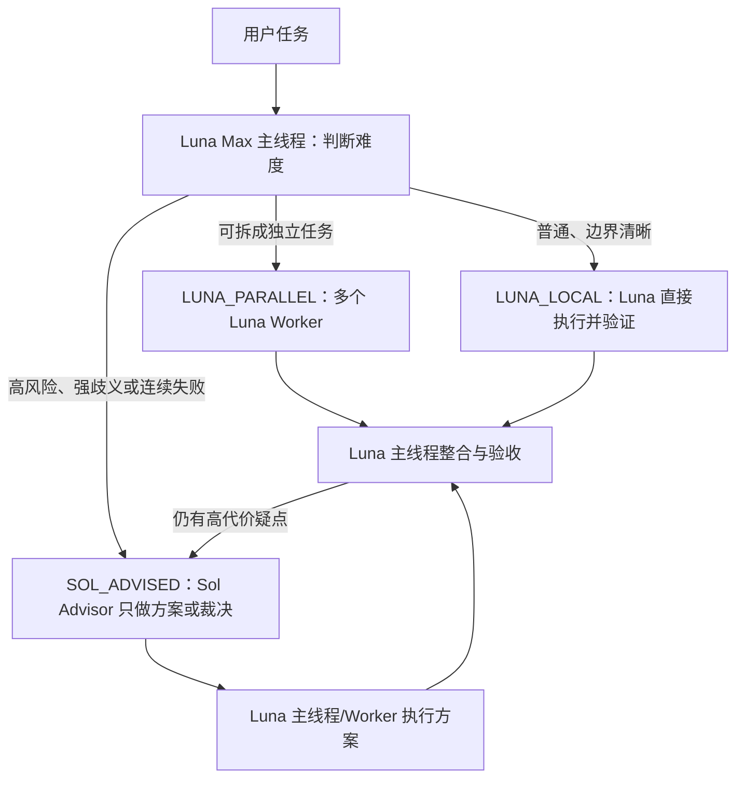

# Luna-first / Sol-advisor Codex 工作流

[English](README.en.md)

这套配置把 **GPT-5.6 Luna Max** 设为日常主模型和执行层，只在真正困难的判断上调用 **GPT-5.6 Sol Advisor**。

> “无限子弹”是比喻。子 Agent 仍消耗 Token，并受账户额度、模型权限和并发上限约束。这套方案的目标是减少 Sol 消耗，而不是绕过额度限制。

## 新架构



与旧版相比：

- 主线程从 Sol Medium 改为 Luna Max；
- 普通任务不再为了路由和验收固定消耗 Sol；
- 复杂但可拆解的工作由多个 Luna Max Worker 并行执行；
- Sol 变成按需调用的 Advisor，只回答明确的困难问题、制定高风险方案或做必要的高风险复核；
- Sol 给出决策后，常规实现立即回到 Luna。

## 安装

将以下文件合并到项目中：

```text
.codex/config.toml
.codex/agents/luna-worker.toml
.codex/agents/sol-advisor.toml
AGENTS.md
```

个人全局安装时，将两个 Agent 文件复制到 `~/.codex/agents/`。不要只写 `model` 和 `model_reasoning_effort`：Codex 自定义 Agent 还必须包含 `name`、`description` 和 `developer_instructions`。

配置通常在新任务中加载，因此安装后新建一个 Codex 任务。

## 自动路由

默认不需要特殊口令。`AGENTS.md` 会要求主线程按以下规则自动判断：

- `LUNA_LOCAL`：需求明确、风险低或中等、一个线程完成更便宜；
- `LUNA_PARALLEL`：存在至少两个真正独立、文件互斥、可单独验证的任务包；
- `SOL_ADVISED`：架构、安全、数据完整性、破坏性迁移、跨系统接口、强歧义，或两次基于证据的尝试仍失败。

Sol Advisor 不应接收“完成整个功能”这种宽泛任务。它只接收一个明确的决策问题和已有证据，返回方案、约束、风险与验收条件。

## 显式控制

```text
优先由 Luna Max 单线程完成；只有命中升级条件才咨询 sol_advisor。
```

```text
把可独立的执行工作拆给 luna_worker 并行处理；每个可写文件只能有一个负责人。
```

```text
这个问题按 SOL_ADVISED 处理：让 sol_advisor 只给方案和风险边界，随后由 Luna 实现。
```

## 为什么不是“所有复杂任务都用 Sol”

任务大不等于判断难。大量文件修改、补测试、机械重构和已定义方案的实现，可以很大但仍适合 Luna Max。只有不确定性、错误代价和推理难度达到阈值时才值得花 Sol 额度。

## 真实性门禁

配置文件存在不代表当前 Codex、账户和调用工具一定加载了对应模型。只有 Agent 活动或工具结果明确标识 `gpt-5.6-luna` / `gpt-5.6-sol`，才可以报告实际使用了该模型。详见 [验证指南](docs/verification.md)。

## 许可协议

[MIT](LICENSE)
