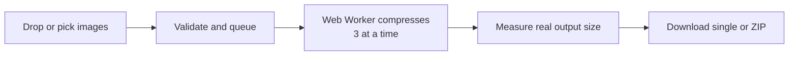

<div align="center">


# Image Size Reducer

**Reduce image size. Keep the quality.**<br/>
Fast, private, batch image compression that runs entirely in your browser.

<br/>


[**Features**](#-features) · [**Quick start**](#-quick-start) · [**Deploy**](#-deploy-to-vercel) · [**Privacy**](#-privacy) · [**Contributing**](#-contributing) · [**Creators**](#%EF%B8%8F-creators)

</div>

<br/>

## ✨ Features

| | |
|---|---|
| 🗂️ **Batch compression** | Drop in many images; a queue processes three at a time so the tab stays responsive. |
| 🔒 **100% local** | Compression runs in your browser with the Canvas API in a Web Worker. Nothing is uploaded. |
| 🎚️ **Quality control** | Four presets, a 1–100% quality slider, output format and a longest-side limit. |
| 🖼️ **Multiple formats** | Reads any format your browser can decode and exports JPEG, PNG or WebP. |
| 📉 **Real numbers** | Every size and saving is measured from the actual output file. Nothing is estimated or faked. |
| 📦 **Bulk download** | Download one image, or all results in a single dated ZIP. |
| 🔍 **Workspace tools** | Search, sort, filter by status, retry, recompress, cancel and remove. |
| 🌗 **Light and dark** | Follows your system theme, with a manual toggle. Preferences are saved locally. |

## 🧭 How it works



## 🎛️ Presets

| Mode | Quality | Format | Longest side |
|---|---|---|---|
| Balanced | 75% | Original | Original |
| High compression | 50% | WebP | 2048 px |
| High quality | 90% | Original | Original |
| Custom | You choose | You choose | You choose |

> **Good to know:** quality applies to JPEG and WebP. PNG stays lossless in browsers, so pair PNG with WebP output or a smaller size. Animated images are flattened to one frame, and metadata is removed on export. AVIF is not offered because browsers cannot encode it reliably through Canvas.

## 🚀 Quick start

```bash
git clone https://github.com/Itz-Anya/Image-Size-Reducer.git
cd Image-Size-Reducer
npm install
npm run dev
```

| Command | What it does |
|---|---|
| `npm run dev` | Start the dev server |
| `npm run check` | Type-check with svelte-check |
| `npm run build` | Production build |
| `npm run preview` | Preview the production build |

## ▲ Deploy to Vercel

[](https://vercel.com/new/clone?repository-url=https://github.com/Itz-Anya/Image-Size-Reducer)

1. Import the repository in Vercel.
2. Keep the detected **SvelteKit** preset (uses `@sveltejs/adapter-vercel`).
3. Deploy. No environment variables or backend are needed.

## 🛠️ Tech stack

SvelteKit 2 · Svelte 5 (runes) · TypeScript · Tailwind CSS 4 · Lucide Svelte · `browser-image-compression` · JSZip · Bricolage Grotesque and Geist fonts

## 🗺️ Project structure

```text
src/
├── app.css                 design tokens and base styles
├── app.html                icons, theme colors, early dark-mode script
├── lib/
│   ├── queue.svelte.ts     queue, settings, compression, ZIP
│   └── utils.ts            formatting, filenames, saving files
└── routes/
    ├── +layout.svelte      header, footer, SEO and social meta tags
    ├── +layout.ts          prerender
    └── +page.svelte        workspace, features, about, creators
static/
└── logo.png
```

## 🔐 Privacy

Your images never leave your device. They are decoded and compressed locally, with no upload, no server and no image analytics. Image contents are never stored. Only your theme and compression settings are saved in `localStorage`. The code is public, so you can verify it.

## 🤝 Contributing

Contributions are welcome.

1. Fork the repo and create a branch: `git checkout -b feature/my-change`
2. Make your change and run `npm run check`
3. Open a pull request describing what and why

Ideas that would be great additions: before/after slider, pause and resume, per-image settings, grid/list toggle, multi-select.

## 👩‍💻 Creators

<table width="100%">
    <tr>
      <td align="center" width="50%">
        <br><br>
        <b>𝜜ɴყꫝㅤ𓆩💗𓆪</b><br><br>
        <a href="https://github.com/itz-Anya">
          
        </a>
      </td>
      <td align="center" width="50%">
        <br><br>
        <b>𝐌 𝐔 𝐑 𝚨 𝐋 𝐈 𓂃ִֶָ⋆.˚</b><br><br>
        <a href="https://github.com/Itz-Murali">
          
        </a>
      </td>
    </tr>
  </table>

## 📄 License

Released under the [MIT License](LICENSE). © 2026 Image Size Reducer. Built by Murali and Anya.
