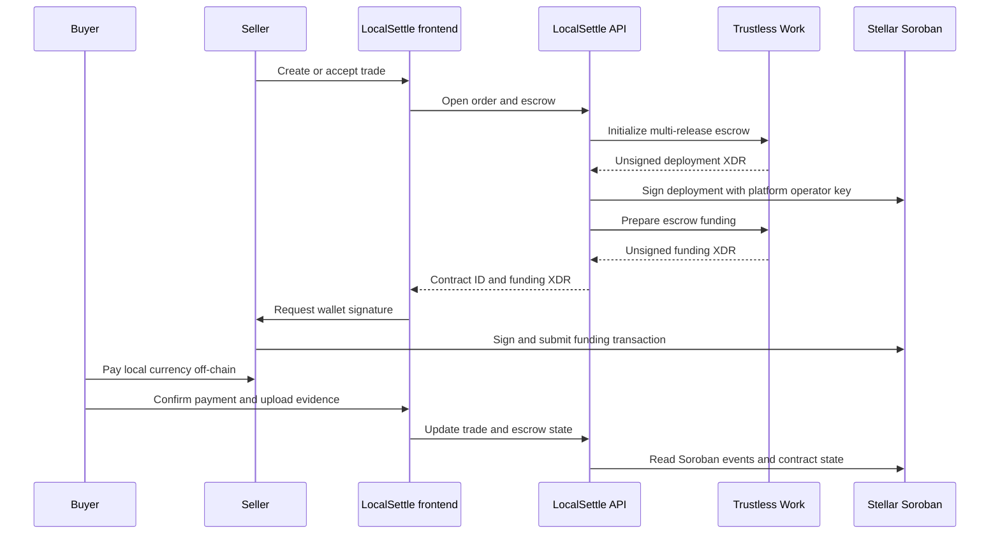

# LocalSettle API

LocalSettle is a peer-to-peer marketplace that connects local payment methods with USDC settlement on Stellar. This repository contains the NestJS API: it manages accounts, offers, orders, chat, payment evidence, wallet-authenticated sessions, transaction preparation, and escrow coordination. The Next.js client is maintained in the [LocalSettle frontend repository](https://github.com/Local-Settle/local-settle-frontend).

> **Network status:** configuration defaults to Stellar Testnet and the Trustless Work development API. Testnet assets have no real-world value. Configure production services, network, issuer, and secrets deliberately before any mainnet deployment.

## What the API does

- Authenticates Stellar wallet owners by issuing a one-time challenge, verifying the wallet signature, and issuing a JWT.
- Reads Stellar accounts, balances, and payment history through Horizon.
- Resolves a recipient address or LocalSettle alias and prepares an unsigned USDC payment transaction for the user to sign.
- Coordinates order lifecycle, payment details, chat, KYC status, receipt uploads, and audit events.
- Integrates with Trustless Work to deploy and operate USDC multi-release escrow on Soroban, and polls Soroban RPC for contract events.

## Stellar transaction flows

### Wallet authentication

`POST /auth/challenge` creates a short-lived random challenge for a public key. The connected wallet signs it locally. `POST /auth/login` verifies the signature, consumes the challenge once, and returns a session token. The API verifies public-key ownership; it does not need the user's secret key for this flow.

### Direct USDC payment

The authenticated client calls `GET /send/resolve` for a Stellar address or LocalSettle alias, then `POST /send/prepare`. The API reads recipient account information, builds an unsigned Stellar transaction XDR, and returns it for review. The client asks the user's wallet to sign. `POST /send/submit` broadcasts the signed XDR through Horizon and returns the transaction result.

### Peer-to-peer escrow

The API opens a Trustless Work multi-release escrow for an order. It signs and broadcasts the deployment transaction with the configured platform operator key, then returns an unsigned funding transaction for the seller to sign with their wallet. Soroban events and escrow API operations update the application view of the trade. Local fiat transfer, payment instructions, chat, and evidence remain off-chain.



### On-chain and off-chain boundaries

| Responsibility | System |
| --- | --- |
| USDC transfer and escrow contract state | Stellar network; escrow operations are orchestrated through Trustless Work |
| Wallet challenge and user transaction signatures | User-selected wallet, requested by the frontend |
| Offers, orders, aliases, chat, KYC status, and audit records | LocalSettle API and PostgreSQL |
| Payment evidence files | Configured storage provider (Google Cloud Storage or mock provider) |
| Local bank or cash payment | Directly between the marketplace participants, outside Stellar |

Escrow is currently limited to USDC. The backend holds a separate configured operator secret for escrow deployment; deployments must restrict and protect it. The application does not provide an in-app on-chain refund operation. This repository integrates with Trustless Work; it does not contain or independently audit the escrow contract.

## Architecture

- `src/modules/` — NestJS feature modules for auth, Stellar, offers, orders, escrow, users, chat, KYC, storage, and audit logs.
- `src/common/` — shared guards, validation, error handling, and request utilities.
- `prisma/schema.prisma` — PostgreSQL data model; migrations and seed data are under `prisma/`.
- `test/` — end-to-end test configuration and suites.
- `docs/architecture.md` — component map, data flows, and trust boundaries.

The API uses `@stellar/stellar-sdk` for Horizon account and transaction operations. Soroban contract events are read from RPC. PostgreSQL stores application workflow state; it is not a substitute for reading the on-chain contract state.

Protocol references: [Stellar developer documentation](https://developers.stellar.org/docs), [Horizon API guide](https://developers.stellar.org/docs/data/apis/horizon), and [Stellar RPC methods](https://developers.stellar.org/docs/data/apis/rpc/api-reference/methods).

## Run locally

Requirements: Node.js 20+, npm, and PostgreSQL. Copy `.env.example` to `.env`; configure `DATABASE_URL`, `DIRECT_URL`, and a local `JWT_SECRET`. For Stellar features, configure `STELLAR_HORIZON_URL`, `STELLAR_RPC_URL`, `STELLAR_NETWORK`, and the relevant issuer and Trustless Work values. Use test credentials and Testnet accounts only.

```bash
npm install
npx prisma generate
npx prisma migrate dev
npm run start:dev
```

The API listens on port `3001` by default. The frontend should point `NEXT_PUBLIC_API_URL` at `http://localhost:3001`. Never commit real secrets. The existing `IKASH_*` escrow environment variable names are retained for deployment compatibility; see `.env.example` before configuring them.

## Useful API routes

| Route | Purpose |
| --- | --- |
| `POST /auth/challenge`, `POST /auth/login` | Wallet challenge-response session |
| `GET /stellar/account/:publicKey`, `GET /stellar/balances/:publicKey` | Stellar account and balance reads |
| `GET /stellar/transactions` | Authenticated wallet payment history |
| `GET /send/resolve`, `POST /send/prepare`, `POST /send/submit` | Prepare and submit a signed USDC payment |
| `POST /escrows/open`, `POST /escrows/sync`, `GET /escrows/:id/status` | Escrow workflow and status |

Routes have endpoint-specific validation and guards. Check the controller and DTO before relying on an endpoint's authentication or ownership behavior.

## Development checks

```bash
npm run build       # Compile the NestJS application
npm test            # Run Jest unit tests
npm run test:e2e    # Run API and gateway end-to-end tests
npm run test:cov    # Collect Jest coverage
npm run format      # Format TypeScript source and tests
```

Unit tests use Jest `*.spec.ts` files near the implementation. Add regression coverage for authentication, transaction preparation, escrow transitions, access control, and event processing when changing those areas.

## Contributing to the Stellar ecosystem

See [CONTRIBUTING.md](CONTRIBUTING.md) for setup, security, commit, and pull request expectations. Keep API changes coordinated with the [frontend](https://github.com/Local-Settle/local-settle-frontend). Explain the affected user flow and include tests, migrations, or environment changes in your pull request. Drips Wave repository participation requires applying to the relevant program and organizer approval; see the [Drips maintainer guide](https://docs.drips.network/wave/maintainers/participating-in-a-wave/).

## Security

Never commit or log private keys, JWTs, webhook secrets, full bank details, or identity documents. Keep the escrow operator key in a secret manager with restricted access. Treat fiat payment evidence, profile data, and KYC status as sensitive application data. Report vulnerabilities privately through the repository's GitHub security channel rather than a public issue.

## License

LocalSettle is licensed under the MIT License. See [LICENSE](LICENSE).
