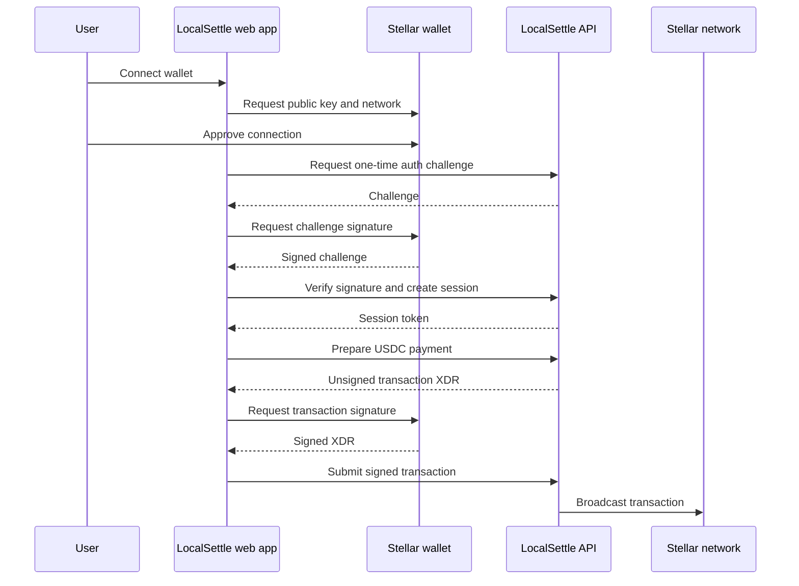

# LocalSettle Frontend

LocalSettle connects peer-to-peer marketplace activity with Stellar wallet actions. People can publish offers, open trades, coordinate local payment, and settle the crypto side with USDC on Stellar. This repository is the Next.js web client; the API and Stellar integrations live in the [LocalSettle backend](https://github.com/Local-Settle/local-settle-backend).

> **Network status:** the app defaults to Stellar Testnet. Testnet balances and transactions have no real-world value. Mainnet behavior depends on deployment configuration and should not be inferred from this source tree alone.

## What the app does

- Connects Stellar wallets through [Stellar Wallets Kit](https://github.com/Creit-Tech/Stellar-Wallets-Kit), including Freighter, LOBSTR, Albedo, xBull, Rabet, and Hana.
- Lets users sign a short-lived wallet challenge to authenticate without entering a private key into LocalSettle.
- Provides a peer-to-peer offer and order flow with counterparty chat, local payment instructions, evidence uploads, and escrow status.
- Prepares direct USDC sends to a Stellar address or LocalSettle alias, requests the user's wallet signature, and shows the resulting transaction status.
- Shows wallet balances, activity, transaction history, profile, and security settings.

## How LocalSettle uses Stellar

The browser delegates wallet connection, network checks, message signing, and transaction signing to Stellar Wallets Kit. The backend never receives a user's wallet secret through this flow.



For peer-to-peer trades, the API coordinates a USDC multi-release escrow through Trustless Work on Soroban. A configured platform operator key signs escrow deployment; the seller's wallet signs the funding transaction. Local fiat payments happen between the users outside Stellar. Stellar escrow state and API order state are synchronized for the app to display. The platform signer and the external escrow integration are important trust assumptions; this client is not itself an escrow contract.

For protocol background, see Stellar's [developer documentation](https://developers.stellar.org/docs), [Horizon API guide](https://developers.stellar.org/docs/data/apis/horizon), and [Stellar RPC guide](https://developers.stellar.org/docs/data/apis/rpc).

### On-chain and off-chain responsibilities

| Activity | Where it happens |
| --- | --- |
| Wallet connection and user transaction signatures | User-selected Stellar wallet |
| USDC transfers and escrow state | Stellar; escrow orchestration uses Trustless Work |
| Offers, order chat, payment instructions, and evidence | LocalSettle API and configured storage |
| Local bank or cash payment | Between the two users, outside Stellar |

Escrow currently accepts USDC. The application has no in-app on-chain refund operation; cancelling an order must not be described as reversing funds already deposited into escrow.

## Architecture and code map

- `src/app/` — Next.js App Router pages, public information pages, and protected product screens.
- `src/features/wallet/` — wallet providers, network validation, authentication, and transaction signing.
- `src/features/offer/`, `src/features/order/`, `src/features/escrow/`, `src/features/chat/` — marketplace and trade workflows.
- `src/features/transactions/`, `src/features/dashboard/`, `src/features/settings/` — wallet activity and account experience.
- `src/lib/` — API client and shared integration helpers.
- `public/` — static assets and LocalSettle brand marks.

The public pages in the app also describe the current project: `/info`, `/info/features`, and `/info/security`.

## Run locally

Requirements: Node.js 20+ and pnpm. Start the backend separately; see its [setup guide](https://github.com/Local-Settle/local-settle-backend#local-development).

```bash
pnpm install
cp .env.example .env.local
```

Set the API URL and Stellar network in `.env.local`:

```dotenv
NEXT_PUBLIC_API_URL=http://localhost:3001
NEXT_PUBLIC_STELLAR_NETWORK=TESTNET
```

Then run the app at `http://localhost:3000`:

```bash
pnpm dev
```

Do not put wallet secrets or server credentials in `NEXT_PUBLIC_*` values; Next.js exposes those values to the browser. For demo-only UI validation, `NEXT_PUBLIC_DEMO_MODE` is disabled by default and should not be enabled in production.

## Quality checks

```bash
pnpm lint       # ESLint
pnpm test       # Vitest and Testing Library
pnpm build      # Production build
pnpm analyze    # Build with bundle analysis
```

Tests use `*.test.ts` or `*.test.tsx` and commonly live beside the feature or in `__tests__/`. Add coverage for wallet network handling, user-signature flows, API errors, and order state changes when touching those paths.

## Contributing

Read [CONTRIBUTING.md](CONTRIBUTING.md) before opening a pull request. Keep frontend and backend API changes coordinated, describe user impact, link the relevant issue, and include screenshots for visible UI changes. Drips Wave participation requires repository application and organizer approval; see the [maintainer guide](https://docs.drips.network/wave/maintainers/participating-in-a-wave/) for the process.

## Security and trust

Never request or commit a wallet secret, recovery phrase, token, or real user payment data. User transaction signing is requested from the connected wallet. Escrow deployment also depends on a separately configured platform operator key in the backend, so deployments must secure and restrict that key. See the [backend architecture notes](https://github.com/Local-Settle/local-settle-backend/blob/main/docs/architecture.md) for the complete trust boundary.

## License

LocalSettle is licensed under the MIT License. See [LICENSE](LICENSE).
