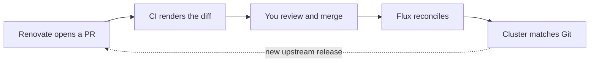

<div align="center">


# Awesome Homelab [](https://awesome.re)

**Your homelab, as a Git repository.**<br>
Free tools, real configs, and learning materials for self-hosting with GitOps.

[](LICENSE)
[](CONTRIBUTING.md)
[](https://github.com/Minh141120/awesome-homelab/actions/workflows/lint.yml)

[The Map](#the-map) · [App Cookbook](#10-apps) · [Real Repos](#real-repos) · [Explore](#explore) · [Community](#community)

</div>

<br>

Most homelabs that last end up as a Git repo: every VM, cluster, and app is described in files, and a machine makes reality match them.
This list is organized **like that repo**. Each folder below is a layer you will build, with the free tools for it, links to how experienced homelabbers do it **in the wild**, and what to **read** first.
Within each layer, the first entries are what most home-ops repos use today.

> [!TIP] > **New to this?** Work through 00 to 03 in order, then take one app from [10 Apps](#10-apps) all the way to production before you add a second.

## The Map

```text
home-ops/
├── infrastructure/          01  hypervisors, VMs, host config
├── talos/  bootstrap/       02  operating system and cluster bootstrap
├── kubernetes/
│   ├── flux/                03  the GitOps engine
│   ├── apps/network/        05  ingress, DNS, certificates, remote access
│   ├── components/          06  storage and backups
│   ├── apps/observability/  07  metrics, logs, uptime
│   ├── apps/security/       08  single sign-on
│   └── apps/<your-app>/     10  the app cookbook
├── .sops.yaml               04  secrets, encrypted in Git
├── .renovaterc.json5        09  automated updates
└── .github/workflows/       09  CI for your cluster
```

| [00 Hardware](#00-hardware) | [01 Infrastructure](#01-infrastructure) | [02 Bootstrap](#02-bootstrap) | [03 GitOps](#03-gitops)               |
| --------------------------- | --------------------------------------- | ----------------------------- | ------------------------------------- |
| [04 Secrets](#04-secrets)   | [05 Network](#05-network)               | [06 Storage](#06-storage)     | [07 Observability](#07-observability) |
| [08 Identity](#08-identity) | [09 Automation](#09-automation)         | [10 Apps](#10-apps)           | [Real Repos](#real-repos)             |

**The loop you are building:**



## 00 Hardware

`the rack` · Small, quiet, and low-power beats big and loud.

- [Project TinyMiniMicro](https://www.servethehome.com/introducing-project-tinyminimicro-home-lab-revolution/) - 1L business mini PCs as homelab nodes.
- [ServeTheHome](https://www.servethehome.com) - Reviews of servers, mini PCs, and networking gear.
- [geerlingguy/mini-rack](https://github.com/geerlingguy/mini-rack) - Builds and parts for 10-inch mini racks.
- [geerlingguy/sbc-reviews](https://github.com/geerlingguy/sbc-reviews) - Benchmarks and power data for single-board computers.
- [Matt Gadient: 7 W Idle Server](https://mattgadient.com/7-watts-idle-on-intel-12th-13th-gen-the-foundation-for-building-a-low-power-server-nas) - Low-power build guide covering C-states and ASPM.
- [Powertop](https://wiki.archlinux.org/title/Powertop) - Diagnose and tune idle power consumption.

## 01 Infrastructure

`infrastructure/` · Hypervisors, VM templates, and host configuration, all from code.

- [Proxmox VE](https://www.proxmox.com/en/products/proxmox-virtual-environment/overview) - Debian-based KVM and LXC hypervisor.
- [OpenTofu](https://opentofu.org) - Open-source infrastructure as code, a fork of Terraform.
- [bpg/terraform-provider-proxmox](https://github.com/bpg/terraform-provider-proxmox) - The most complete OpenTofu and Terraform provider for Proxmox.
- [Telmate/terraform-provider-proxmox](https://github.com/Telmate/terraform-provider-proxmox) - The original Proxmox provider.
- [Packer Proxmox Plugin](https://developer.hashicorp.com/packer/integrations/hashicorp/proxmox) - Build Proxmox VM templates with Packer.
- [cloud-init](https://docs.cloud-init.io) - First-boot configuration for VM templates.
- [Ansible](https://github.com/ansible-collections/community.general) - The `community.general` collection, including Proxmox modules.
- [lae/ansible-role-proxmox](https://github.com/lae/ansible-role-proxmox) - Install and cluster Proxmox with Ansible.
- [community-scripts/ProxmoxVE](https://github.com/community-scripts/ProxmoxVE) - One-line scripts to create LXCs and VMs on Proxmox.
- [ChristianLempa/boilerplates](https://github.com/ChristianLempa/boilerplates) - Templates for Packer, Terraform, Ansible, Compose, and Kubernetes.
- [NixOS](https://nixos.org) - Declarative, reproducible Linux for hosts that are not Kubernetes nodes.
- [Incus](https://linuxcontainers.org/incus/) - Community fork of LXD for system containers and VMs.
- [Harvester](https://harvesterhci.io) - Open-source HCI built on Kubernetes, KubeVirt, and Longhorn.
- [TrueNAS](https://www.truenas.com) - ZFS-based NAS operating system.

**In the wild**

- **joryirving** — [terraform/](https://github.com/joryirving/home-ops/tree/main/terraform)
- **Mafyuh** — [terraform/](https://github.com/Mafyuh/iac/tree/main/terraform)
- **bjw-s** — [ansible/](https://github.com/bjw-s-labs/home-ops/tree/main/ansible)
- **khuedoan** — [metal/](https://github.com/khuedoan/homelab/tree/master/metal)

**Read**

- [Managing a Proxmox Homelab with OpenTofu](https://blog.bengauger.com/posts/managing-proxmox-homelab-with-opentofu/)
- [NixOS and Flakes Book](https://nixos-and-flakes.thiscute.world)

## 02 Bootstrap

`talos/` `bootstrap/` · An OS built for Kubernetes, and the first few charts that bring a cluster to life.

- [Talos Linux](https://www.siderolabs.com/talos-linux/) - Immutable, API-driven OS built only for Kubernetes.
- [onedr0p/cluster-template](https://github.com/onedr0p/cluster-template) - The most common starting point for a Talos and Flux home cluster.
- [siderolabs/terraform-provider-talos](https://github.com/siderolabs/terraform-provider-talos) - Generate and apply Talos machine configs from OpenTofu.
- [talstomize](https://github.com/mirceanton/talstomize) - Kustomize-style patching for Talos configs.
- [topf](https://github.com/postfinance/topf) - Talos cluster orchestrator.
- [tuppr](https://github.com/home-operations/tuppr) - Controller that upgrades Talos and Kubernetes from Git.
- [Helmfile](https://helmfile.readthedocs.io) - Install the first charts (CNI, Flux) before GitOps takes over.
- [k3s](https://docs.k3s.io) - Lightweight Kubernetes for any Linux host.
- [timothystewart6/k3s-ansible](https://github.com/timothystewart6/k3s-ansible) - HA k3s with kube-vip and MetalLB.
- [kind](https://github.com/kubernetes-sigs/kind) - Throwaway local clusters for testing manifests.

**In the wild**

- **onedr0p** — [talos/](https://github.com/onedr0p/home-ops/tree/main/talos)
- **onedr0p** — [bootstrap/helmfile/](https://github.com/onedr0p/home-ops/tree/main/bootstrap/helmfile)
- **buroa** — [talos/](https://github.com/buroa/home-ops/tree/main/talos)

## 03 GitOps

`kubernetes/flux/` · Git is the source of truth. A controller in the cluster makes reality match it.

- [Flux](https://fluxcd.io) - GitOps controller used by most home-ops repos.
- [Flux Operator](https://fluxoperator.dev/docs/) - Install and upgrade Flux itself declaratively.
- [Argo CD](https://argo-cd.readthedocs.io) - GitOps controller with a web UI and app-of-apps pattern.
- [bjw-s app-template](https://bjw-s-labs.github.io/helm-charts/docs/app-template/) - One Helm chart to deploy almost any container.
- [Kustomize](https://kubectl.docs.kubernetes.io/) - Template-free overlays for Kubernetes manifests.
- [home-operations/containers](https://github.com/home-operations/containers) - Rootless, semantically versioned app images.
- [Reloader](https://github.com/stakater/Reloader) - Restart workloads when ConfigMaps or Secrets change.

**In the wild**

- **onedr0p** — [kubernetes/flux/](https://github.com/onedr0p/home-ops/tree/main/kubernetes/flux/cluster)
- **khuedoan** — [system/ (Argo CD)](https://github.com/khuedoan/homelab/tree/master/system)

**Read**

- [Ways of structuring your repositories](https://fluxcd.io/flux/guides/repository-structure/)
- [Argo CD best practices](https://argo-cd.readthedocs.io/en/stable/user-guide/best_practices/)

## 04 Secrets

`.sops.yaml` · Secrets live in Git encrypted, or in a password manager the cluster can read.

- [SOPS](https://github.com/getsops/sops) - Encrypt values in YAML so they can be committed.
- [age](https://github.com/FiloSottile/age) - Simple file encryption, the usual SOPS backend.
- [External Secrets Operator](https://external-secrets.io) - Sync secrets from Bitwarden, 1Password, Vault, and others.

**In the wild**

- **szinn** — [.sops.yaml](https://github.com/szinn/k8s-homelab/blob/main/.sops.yaml)
- **xunholy** — [.sops.yaml](https://github.com/xunholy/k8s-gitops/blob/main/.sops.yaml)
- **onedr0p** — [external-secrets/](https://github.com/onedr0p/home-ops/tree/main/kubernetes/apps/external-secrets)

**Read**

- [Manage Kubernetes secrets with SOPS](https://fluxcd.io/flux/guides/mozilla-sops/)

## 05 Network

`kubernetes/apps/network/` · Get traffic in safely, with real certificates and no open ports.

**In the cluster**

- [Cilium](https://cilium.io) - eBPF CNI with load balancing, Gateway API, and BGP.
- [Envoy Gateway](https://gateway.envoyproxy.io) - Gateway API implementation built on Envoy.
- [cert-manager](https://cert-manager.io) - Automate Let's Encrypt certificates.
- [external-dns](https://github.com/kubernetes-sigs/external-dns) - Create DNS records from routes and ingresses.
- [MetalLB](https://metallb.io) - LoadBalancer services for bare-metal clusters.
- [Spegel](https://spegel.dev) - Peer-to-peer image mirror inside the cluster.
- [Traefik](https://doc.traefik.io/traefik/) - Reverse proxy with service discovery and automatic TLS.
- [Caddy](https://caddyserver.com) - Web server and reverse proxy with automatic HTTPS.

**At the edge**

- [Cloudflare Tunnel](https://developers.cloudflare.com/cloudflare-one/networks/connectors/cloudflare-tunnel/) - Expose services without opening ports.
- [Tailscale](https://tailscale.com/docs) - WireGuard mesh VPN with a free personal plan.
- [Headscale](https://headscale.net) - Self-hosted Tailscale control server.
- [NetBird](https://github.com/netbirdio/netbird) - Open-source, self-hostable WireGuard mesh VPN.
- [Pangolin](https://github.com/fosrl/pangolin) - Self-hosted tunneled reverse proxy with SSO.
- [WireGuard](https://www.wireguard.com) - Fast, modern VPN protocol.
- [OPNsense](https://opnsense.org) - Open-source firewall and router.
- [pfSense CE](https://www.pfsense.org) - FreeBSD-based firewall and router.
- [Blocky](https://0xerr0r.github.io/blocky/) - Stateless DNS proxy and ad-blocker that suits Kubernetes.
- [AdGuard Home](https://github.com/AdguardTeam/AdGuardHome) - Network-wide ad and tracker blocking DNS.
- [Pi-hole](https://pi-hole.net) - DNS sinkhole for ad blocking.

**In the wild**

- **onedr0p** — [network/](https://github.com/onedr0p/home-ops/tree/main/kubernetes/apps/network)

**Watch**

- [So, you want to start self-hosting? Part 1](https://www.youtube.com/watch?v=zngSuqCM4d8)

## 06 Storage

`kubernetes/components/` · Replicated volumes, databases, and backups you have actually restored.

- [Rook](https://rook.io) - Ceph storage orchestration for Kubernetes.
- [Longhorn](https://longhorn.io) - Distributed block storage for Kubernetes.
- [Piraeus Operator](https://github.com/piraeusdatastore/piraeus-operator) - LINSTOR and DRBD replicated storage.
- [OpenEBS](https://github.com/openebs/openebs) - Container-attached storage engines.
- [CloudNativePG](https://cloudnative-pg.io) - PostgreSQL operator with backups and failover.
- [VolSync](https://volsync.readthedocs.io) - Replicate and back up PVCs with restic or kopia.
- [kopiur](https://github.com/home-operations/kopiur) - Kopia-native Kubernetes backup operator.
- [Velero](https://velero.io) - Back up and restore cluster resources and volumes.
- [Restic](https://restic.net) - Fast, encrypted backups to many backends.
- [Kopia](https://kopia.io) - Fast, encrypted backups with a UI.
- [Borg](https://www.borgbackup.org) - Deduplicating, encrypted backups.

**In the wild**

- **onedr0p** — [components/kopiur/](https://github.com/onedr0p/home-ops/tree/main/kubernetes/components/kopiur)
- **xunholy** — [components/volsync/](https://github.com/xunholy/k8s-gitops/tree/main/kubernetes/components/volsync)
- **onedr0p** — [rook-ceph/](https://github.com/onedr0p/home-ops/tree/main/kubernetes/apps/rook-ceph)

**Read**

- [Storage on Talos Linux with LINSTOR and DRBD](https://www.pimwiddershoven.nl/entry/storage-on-talos-linux-with-linstor-and-drbd/)
- [Self-Hosting a Container Registry on k3s with zot](https://thethoughtprocess.xyz/en/series/home-server/self-hosting-container-registry-k3s-zot)
- [Perfect Media Server](https://perfectmediaserver.com/)

## 07 Observability

`kubernetes/apps/observability/` · Know it broke before your family does.

- [kube-prometheus-stack](https://github.com/prometheus-community/helm-charts) - Prometheus, Alertmanager, and Grafana in one chart.
- [VictoriaMetrics](https://github.com/VictoriaMetrics/VictoriaMetrics) - Lightweight Prometheus-compatible metrics and logs.
- [Grafana Loki](https://grafana.com/docs/loki/latest/) - Log aggregation that pairs with Grafana.
- [Gatus](https://gatus.io) - Health checks and status page configured in YAML.
- [gatus-sidecar](https://github.com/home-operations/gatus-sidecar) - Generate Gatus checks from routes and services.
- [kromgo](https://github.com/home-operations/kromgo) - README badges from PromQL queries.
- [Uptime Kuma](https://github.com/louislam/uptime-kuma) - Uptime monitoring with a web UI.
- [Homepage](https://gethomepage.dev) - Dashboard with service widgets and Kubernetes discovery.

**In the wild**

- **onedr0p** — [o11y/](https://github.com/onedr0p/home-ops/tree/main/kubernetes/apps/o11y)
- **bjw-s** — [gatus/](https://github.com/bjw-s-labs/home-ops/tree/main/kubernetes/apps/observability/gatus)

## 08 Identity

`kubernetes/apps/security/` · One login for every app, ideally with passkeys.

- [Authentik](https://goauthentik.io) - Identity provider with OIDC, SAML, LDAP, and proxy auth.
- [Pocket ID](https://github.com/pocket-id/pocket-id) - Simple passkey-only OIDC provider.
- [Authelia](https://www.authelia.com) - Lightweight forward-auth and OIDC portal.

**In the wild**

- **joryirving** — [authentik/](https://github.com/joryirving/home-ops/tree/main/kubernetes/apps/base/security/authentik)
- **joryirving** — [Authentik as code](https://github.com/joryirving/home-ops/tree/main/terraform/authentik)

## 09 Automation

`.renovaterc.json5` `.github/workflows/` · Updates arrive as pull requests, and CI shows exactly what will change.

- [Renovate](https://docs.renovatebot.com) - Dependency update PRs for images, charts, and providers.
- [home-operations/renovate-presets](https://github.com/home-operations/renovate-presets) - Shared Renovate config for home-ops repos.
- [flate](https://github.com/home-operations/flate) - Validate and render Flux resources offline, in CI.
- [konflate](https://github.com/home-operations/konflate) - Pull request review tool that shows rendered Flux diffs.
- [mise](https://mise.jdx.dev) - Pin every CLI tool version in the repo.
- [just](https://just.systems) - Command runner for repeatable ops tasks.
- [Task](https://taskfile.dev) - YAML-based task runner, common in older home-ops repos.

**In the wild**

- **onedr0p** — [.renovaterc.json5](https://github.com/onedr0p/home-ops/blob/main/.renovaterc.json5)
- **buroa** — [.renovate/](https://github.com/buroa/home-ops/tree/main/.renovate)
- **buroa** — [flate workflow](https://github.com/buroa/home-ops/blob/main/.github/workflows/flate.yaml)
- **xunholy** — [flux-local workflow](https://github.com/xunholy/k8s-gitops/blob/main/.github/workflows/flux-local.yaml)

## 10 Apps

`kubernetes/apps/<your-app>/` · The point of all this. For each app, browse dozens of real deployments on [kubesearch.dev](https://kubesearch.dev), then copy the one closest to your setup.

| App                                                             | What it does                          | Real deployments                                                                                                                                                                                     |
| --------------------------------------------------------------- | ------------------------------------- | ---------------------------------------------------------------------------------------------------------------------------------------------------------------------------------------------------- |
| [Home Assistant](https://www.home-assistant.io)                 | Home automation                       | [kubesearch](https://kubesearch.dev/hr/ghcr.io-bjw-s-labs-charts-app-template-home-assistant) · [onedr0p](https://github.com/onedr0p/home-ops/tree/main/kubernetes/apps/default/home-assistant)      |
| [Immich](https://immich.app)                                    | Photo and video backup                | [kubesearch](https://kubesearch.dev/hr/ghcr.io-bjw-s-labs-charts-app-template-immich) · [szinn](https://github.com/szinn/k8s-homelab/tree/main/kubernetes/main/apps/media/immich)                    |
| [Jellyfin](https://jellyfin.org)                                | Media server                          | [kubesearch](https://kubesearch.dev/hr/ghcr.io-bjw-s-labs-charts-app-template-jellyfin) · [bjw-s](https://github.com/bjw-s-labs/home-ops/tree/main/kubernetes/apps/media/jellyfin)                   |
| [Paperless-ngx](https://github.com/paperless-ngx/paperless-ngx) | Document archive with OCR             | [kubesearch](https://kubesearch.dev/hr/ghcr.io-bjw-s-labs-charts-app-template-paperless) · [bjw-s](https://github.com/bjw-s-labs/home-ops/tree/main/kubernetes/apps/selfhosted/paperless)            |
| [Vaultwarden](https://github.com/dani-garcia/vaultwarden)       | Bitwarden-compatible password manager | [kubesearch](https://kubesearch.dev/hr/ghcr.io-bjw-s-labs-charts-app-template-vaultwarden)                                                                                                           |
| [Nextcloud](https://nextcloud.com)                              | Files, calendar, and contacts         | [kubesearch](https://kubesearch.dev/hr/nextcloud.github.io-helm-nextcloud) · [bjw-s](https://github.com/bjw-s-labs/home-ops/tree/main/kubernetes/apps/selfhosted/nextcloud)                          |
| [Audiobookshelf](https://audiobookshelf.org)                    | Audiobooks and podcasts               | [kubesearch](https://kubesearch.dev/hr/ghcr.io-bjw-s-labs-charts-app-template-audiobookshelf) · [bjw-s](https://github.com/bjw-s-labs/home-ops/tree/main/kubernetes/apps/media/audiobookshelf)       |
| [Navidrome](https://www.navidrome.org)                          | Music streaming                       | [kubesearch](https://kubesearch.dev/hr/ghcr.io-bjw-s-labs-charts-app-template-navidrome) · [bjw-s](https://github.com/bjw-s-labs/home-ops/tree/main/kubernetes/apps/media/navidrome)                 |
| [Frigate](https://frigate.video)                                | NVR with object detection             | [kubesearch](https://kubesearch.dev/hr/ghcr.io-bjw-s-labs-charts-app-template-frigate) · [bjw-s](https://github.com/bjw-s-labs/home-ops/tree/main/kubernetes/apps/home-automation/frigate)           |
| [Zigbee2MQTT](https://www.zigbee2mqtt.io)                       | Zigbee devices without vendor hubs    | [kubesearch](https://kubesearch.dev/hr/ghcr.io-bjw-s-labs-charts-app-template-zigbee2mqtt) · [xunholy](https://github.com/xunholy/k8s-gitops/tree/main/kubernetes/apps/base/home-system/zigbee2mqtt) |
| [ESPHome](https://esphome.io)                                   | Firmware for DIY sensors              | [kubesearch](https://kubesearch.dev/hr/ghcr.io-bjw-s-labs-charts-app-template-esphome)                                                                                                               |
| [Actual](https://actualbudget.org)                              | Personal budgeting                    | [kubesearch](https://kubesearch.dev/hr/ghcr.io-bjw-s-labs-charts-app-template-actual) · [bjw-s](https://github.com/bjw-s-labs/home-ops/tree/main/kubernetes/apps/selfhosted/actual)                  |
| [Mealie](https://mealie.io)                                     | Recipes and meal planning             | [kubesearch](https://kubesearch.dev/hr/ghcr.io-bjw-s-labs-charts-app-template-mealie)                                                                                                                |
| [Karakeep](https://karakeep.app)                                | Bookmarks with AI tagging             | [kubesearch](https://kubesearch.dev/hr/ghcr.io-bjw-s-labs-charts-app-template-karakeep) · [bjw-s](https://github.com/bjw-s-labs/home-ops/tree/main/kubernetes/apps/selfhosted/karakeep)              |
| [Linkding](https://linkding.link)                               | Minimal bookmark manager              | [kubesearch](https://kubesearch.dev/hr/ghcr.io-bjw-s-labs-charts-app-template-linkding)                                                                                                              |
| [Miniflux](https://miniflux.app)                                | RSS reader                            | [kubesearch](https://kubesearch.dev/hr/ghcr.io-bjw-s-labs-charts-app-template-miniflux)                                                                                                              |
| [Memos](https://usememos.com)                                   | Lightweight notes                     | [kubesearch](https://kubesearch.dev/hr/ghcr.io-bjw-s-labs-charts-app-template-memos)                                                                                                                 |
| [Syncthing](https://syncthing.net)                              | Peer-to-peer file sync                | [kubesearch](https://kubesearch.dev/hr/ghcr.io-bjw-s-labs-charts-app-template-syncthing)                                                                                                             |
| [Atuin](https://atuin.sh)                                       | Synced shell history                  | [kubesearch](https://kubesearch.dev/hr/ghcr.io-bjw-s-labs-charts-app-template-atuin) · [onedr0p](https://github.com/onedr0p/home-ops/tree/main/kubernetes/apps/default/atuin)                        |
| [Forgejo](https://forgejo.org)                                  | Self-hosted Git forge                 | [kubesearch](https://kubesearch.dev/hr/code.forgejo.org-forgejo-helm-forgejo) · [bjw-s](https://github.com/bjw-s-labs/home-ops/tree/main/kubernetes/apps/dev/forgejo)                                |
| [Open WebUI](https://openwebui.com)                             | Chat UI for local LLMs                | [kubesearch](https://kubesearch.dev/hr/ghcr.io-bjw-s-labs-charts-app-template-open-webui) · [joryirving](https://github.com/joryirving/home-ops/tree/main/kubernetes/apps/base/llm/open-webui)       |
| [Ollama](https://ollama.com)                                    | Run LLMs locally                      | [kubesearch](https://kubesearch.dev/hr/ghcr.io-bjw-s-labs-charts-app-template-ollama) · [xunholy](https://github.com/xunholy/k8s-gitops/tree/main/kubernetes/apps/base/ai-system/ollama)             |
| [n8n](https://n8n.io)                                           | Workflow automation                   | [kubesearch](https://kubesearch.dev/hr/ghcr.io-bjw-s-labs-charts-app-template-n8n) · [xunholy](https://github.com/xunholy/k8s-gitops/tree/main/kubernetes/apps/base/ai-system/n8n)                   |

**More apps**

- [awesome-selfhosted](https://github.com/awesome-selfhosted/awesome-selfhosted)
- [selfh.st/apps](https://selfh.st/apps/)

### No Kubernetes? GitOps works for Docker Compose too

- [doco-cd](https://github.com/kimdre/doco-cd) - Deploy Docker Compose stacks from Git on push or poll.
- [Komodo](https://github.com/moghtech/komodo) - Build and deploy Compose stacks across many servers from Git.
- [Renovate for Docker](https://docs.renovatebot.com/docker/) - The same update PRs, for `compose.yaml` image tags.

**In the wild**

- **bjw-s** — [docker/ with doco-cd](https://github.com/bjw-s-labs/home-ops/tree/main/docker)

## Real Repos

The best documentation in this hobby is other people's Git history. Start where the last column points.

| Repo                                                                                                        | Stack                                      | Start reading at                                                                                                                                                                                                     |
| ----------------------------------------------------------------------------------------------------------- | ------------------------------------------ | -------------------------------------------------------------------------------------------------------------------------------------------------------------------------------------------------------------------- |
| [onedr0p/home-ops](https://github.com/onedr0p/home-ops)                                                     | Talos · Flux · Rook                        | [`talos/`](https://github.com/onedr0p/home-ops/tree/main/talos), then [`kubernetes/flux/`](https://github.com/onedr0p/home-ops/tree/main/kubernetes/flux)                                                            |
| [bjw-s-labs/home-ops](https://github.com/bjw-s-labs/home-ops)                                               | Talos · Flux · Compose                     | [`docker/`](https://github.com/bjw-s-labs/home-ops/tree/main/docker) for GitOps without Kubernetes                                                                                                                   |
| [buroa/home-ops](https://github.com/buroa/home-ops)                                                         | Talos · Flux                               | [`.renovate/`](https://github.com/buroa/home-ops/tree/main/.renovate) for update automation                                                                                                                          |
| [catdevsecops/home-automated-infrastructure](https://github.com/catdevsecops/home-automated-infrastructure) | Raspberry Pi · Talos · Argo CD · Terraform | [`terraform/bootstrap/`](https://github.com/catdevsecops/home-automated-infrastructure/tree/main/terraform/bootstrap), with the [write-up](https://dev.to/claycavaleiro/the-shoemakers-children-arent-barefoot-3m8h) |
| [joryirving/home-ops](https://github.com/joryirving/home-ops)                                               | Talos · Flux · OpenTofu                    | [`terraform/`](https://github.com/joryirving/home-ops/tree/main/terraform) for managing apps as code                                                                                                                 |
| [szinn/k8s-homelab](https://github.com/szinn/k8s-homelab)                                                   | Talos · Flux                               | [`kubernetes/main/components/`](https://github.com/szinn/k8s-homelab/tree/main/kubernetes/main/components)                                                                                                           |
| [xunholy/k8s-gitops](https://github.com/xunholy/k8s-gitops)                                                 | Talos · Flux                               | [`kubernetes/components/`](https://github.com/xunholy/k8s-gitops/tree/main/kubernetes/components)                                                                                                                    |
| [khuedoan/homelab](https://github.com/khuedoan/homelab)                                                     | Argo CD · Ansible                          | [`metal/`](https://github.com/khuedoan/homelab/tree/master/metal) → [`system/`](https://github.com/khuedoan/homelab/tree/master/system) → [`platform/`](https://github.com/khuedoan/homelab/tree/master/platform)    |
| [billimek/k8s-gitops](https://github.com/billimek/k8s-gitops)                                               | Flux                                       | One of the original Flux home clusters                                                                                                                                                                               |
| [toboshii/home-ops](https://github.com/toboshii/home-ops)                                                   | Flux                                       | A smaller cluster, easier to read end to end                                                                                                                                                                         |
| [Mafyuh/iac](https://github.com/Mafyuh/iac)                                                                 | OpenTofu · Ansible · Kubernetes            | [`terraform/`](https://github.com/Mafyuh/iac/tree/main/terraform)                                                                                                                                                    |
| [zimmertr/TJs-Kubernetes-Service](https://github.com/zimmertr/TJs-Kubernetes-Service)                       | Proxmox · Talos · OpenTofu                 | Kubernetes on Proxmox, fully automated                                                                                                                                                                               |
| [christianlempa/homelab](https://github.com/christianlempa/homelab)                                         | Docker · Terraform                         | Configs behind Christian Lempa's videos                                                                                                                                                                              |
| [JamesTurland/JimsGarage](https://github.com/JamesTurland/JimsGarage)                                       | Proxmox · k3s                              | Scripts behind Jim's Garage videos                                                                                                                                                                                   |
| [TechHutTV/homelab](https://github.com/TechHutTV/homelab)                                                   | Proxmox · Docker                           | Beginner-friendly guides and Compose files                                                                                                                                                                           |
| [ironicbadger/infra](https://github.com/ironicbadger/infra)                                                 | Ansible · Nix                              | Infrastructure from the Self-Hosted podcast host                                                                                                                                                                     |
| [ryan4yin/nix-config](https://github.com/ryan4yin/nix-config)                                               | Nix                                        | Multi-host flake configuration                                                                                                                                                                                       |
| [EmergentMind/nix-config](https://github.com/EmergentMind/nix-config)                                       | Nix                                        | Multi-host NixOS configuration                                                                                                                                                                                       |
| [bradfitz/homelab](https://github.com/bradfitz/homelab)                                                     | Notes                                      | Design notes from Tailscale's Brad Fitzpatrick (2020)                                                                                                                                                                |

Find more on [kubesearch.dev](https://kubesearch.dev), which indexes hundreds of home-ops repos.

## Explore

### Start Here

- [So, you want to start self-hosting? Part 2](https://www.youtube.com/watch?v=guHoZ68N3XM) - Install Immich, Audiobookshelf, and Home Assistant.
- [What's Actually Running in My Homelab?](https://www.youtube.com/watch?v=efl2kuPNEpE) - Techno Tim's tour of 50+ self-hosted services.
- [Ansible 101](https://www.jeffgeerling.com/blog/2020/ansible-101-jeff-geerling-youtube-streaming-series) - Jeff Geerling's free video series.
- [khuedoan/homelab docs](https://homelab.khuedoan.com) - How a fully automated homelab fits together.
- [Kubernetes the Hard Way](https://github.com/kelseyhightower/kubernetes-the-hard-way) - Bootstrap Kubernetes by hand to learn the internals.
- [Ansible for DevOps](https://github.com/geerlingguy/ansible-for-devops) - Example code from Jeff Geerling's book.
- [iximiuz Labs](https://labs.iximiuz.com) - Browser-based Linux, container, and Kubernetes playgrounds.
- [Killercoda](https://killercoda.com) - Free interactive Kubernetes and Linux scenarios.
- [roadmap.sh DevOps](https://roadmap.sh/devops) - Visual DevOps learning roadmap.

### Blogs

- [Ben Gauger](https://blog.bengauger.com) - Proxmox and OpenTofu.
- [Clay Cavaleiro](https://dev.to/claycavaleiro) - Talos, Argo CD, and Home Assistant on Raspberry Pi.
- [Jeff Geerling](https://www.jeffgeerling.com) - Ansible, Raspberry Pi clusters, and hardware.
- [Nick Cunningham](https://nickcunningh.am/blog) - Homelab and self-hosting write-ups.
- [noted.lol](https://noted.lol) - Self-hosted app reviews and guides.
- [Pim Widdershoven](https://www.pimwiddershoven.nl) - Talos, Kubernetes, and storage.
- [Techno Tim Docs](https://technotim.com) - Copy-paste configs for Techno Tim videos.
- [The Thought Process](https://thethoughtprocess.xyz/en/series/home-server/) - A home server series built on k3s.
- [TheOrangeOne](https://theorangeone.net) - Self-hosting and infrastructure.
- [Virtualization Howto](https://www.virtualizationhowto.com) - Proxmox, Kubernetes, and home server tutorials.

### YouTube

- [apalrd's adventures](https://www.youtube.com/@apalrdsadventures) - Proxmox, IPv6, and deep dives.
- [Christian Lempa](https://www.youtube.com/@christianlempa) - DevOps-flavored homelab tutorials.
- [Craft Computing](https://www.youtube.com/@CraftComputing) - Server hardware and virtualization.
- [DB Tech](https://www.youtube.com/@DBTechYT) - Self-hosted app walkthroughs.
- [Dreams of Autonomy](https://www.youtube.com/@dreamsofautonomy) - Terminal and self-hosting workflows.
- [Hardware Haven](https://www.youtube.com/@HardwareHaven) - Budget and low-power builds.
- [Jeff Geerling](https://www.youtube.com/@JeffGeerling) - Hardware, SBCs, and Ansible.
- [Jim's Garage](https://www.youtube.com/@Jims-Garage) - k3s, Proxmox, and self-hosting.
- [Lawrence Systems](https://www.youtube.com/@LAWRENCESYSTEMS) - pfSense, TrueNAS, and networking.
- [Mischa van den Burg](https://www.youtube.com/@mischavandenburg) - Kubernetes homelab and DevOps careers.
- [Raid Owl](https://www.youtube.com/@RaidOwl) - Homelab hardware and software.
- [TechHut](https://www.youtube.com/@TechHut) - Linux and homelab.
- [Techno Tim](https://www.youtube.com/@TechnoTim) - Homelab, Kubernetes, and self-hosting.
- [Virtualization Howto](https://www.youtube.com/@VirtualizationHowto) - Video companion to the blog.
- [Wolfgang's Channel](https://www.youtube.com/@WolfgangsChannel) - Power-efficient servers and NixOS.

### Podcasts and Newsletters

- [selfh.st](https://selfh.st) - Weekly self-hosting newsletter.
- [Self-Hosted](https://selfhosted.show) - Weekly podcast on self-hosting and homelabs.

## Community

- [Home Operations Discord](https://discord.gg/home-operations) - Where most of the repos above are discussed.
- [r/homelab](https://www.reddit.com/r/homelab/) - The main homelab subreddit.
- [r/selfhosted](https://www.reddit.com/r/selfhosted/) - Self-hosting discussion.
- [r/Proxmox](https://www.reddit.com/r/Proxmox/) - Proxmox discussion.
- [r/minilab](https://www.reddit.com/r/minilab/) - Small-form-factor homelabs.
- [Proxmox Forum](https://forum.proxmox.com) - Official Proxmox support forum.
- [ServeTheHome Forums](https://forums.servethehome.com) - Server hardware discussion.
- [Lawrence Systems Forums](https://forums.lawrencesystems.com) - Networking, firewalls, and storage.

**Related lists**

- [awesome-selfhosted](https://github.com/awesome-selfhosted/awesome-selfhosted)
- [awesome-proxmox-ve](https://github.com/Corsinvest/awesome-proxmox-ve)
- [awesome-kubernetes](https://github.com/ramitsurana/awesome-kubernetes)
- [awesome-gitops](https://github.com/weaveworks/awesome-gitops)
- [awesome-sysadmin](https://github.com/awesome-foss/awesome-sysadmin)
- [awesome-tf](https://github.com/shuaibiyy/awesome-tf)
- [awesome-sre](https://github.com/dastergon/awesome-sre)
- [awesome-scalability](https://github.com/binhnguyennus/awesome-scalability)

---

<div align="center">
<sub>Free resources only. Found something that belongs here? <a href="CONTRIBUTING.md">Open a pull request</a>.</sub>
</div>
