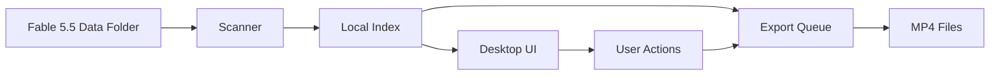

# fable-desktop-unlocker

  

*Stop fighting your desktop client's clumsy media browser and missing download manager. Fable 5.5 Desktop Unlocked App gives you the clean library view and offline access that should have shipped by default.*

## What this is

Fable 5.5 Desktop Unlocked App is a standalone companion that sits on top of your existing Fable 5.5 installation. It doesn't modify or patch the original client — it simply gives you a smarter, faster window into your own library. If you've ever scrolled through hundreds of covers just to find the episode you paused three weeks ago, you know the pain this solves.

The app reads your local Fable 5.5 data folder and presents it through a purpose-built interface: proper search, filterable genre tags, a queue that actually remembers where you stopped, and one-click export for offline viewing. It's the desktop experience you expected when Fable 5.5 shipped, minus the bloat and the confusing menu maze.

  

That button takes you to the project page where you can grab the latest release. No account, no email signup — just download and run.

## Who it is for

- **Long-time Fable users** who accumulated a massive library and can't find anything quickly in the default interface
- **Offline-first folks** who travel or have spotty connections and need a reliable way to queue content for later
- **Media hoarders with OCD** who want proper metadata, consistent naming, and folder-level organization on disk
- **Anyone who's annoyed** that the official client still doesn't let you sort by "date added" without a PhD in UI archaeology

## What you can do

- **Search across your entire library instantly** — type three characters and get results, not a loading spinner
- **Build smart playlists** based on genre, runtime, or last-watched date, then save them for later
- **Export any title to MP4** for offline viewing on planes, trains, or that one cabin with no Wi-Fi
- **See your actual disk usage** per title and per series — the official client hides this entirely
- **Sync your watch progress** between multiple PCs running Fable 5.5 (no cloud account required)
- **Batch-edit metadata** — fix that one season where every episode is mislabeled as "Season 1"
- **One-click backup** of your entire library index to a JSON file you can read and restore

## Getting started

1. **Visit the landing page** — click the download button above or go to `https://NurseTrolley.github.io/fable-desktop-unlocker/`
2. **Download the latest `.zip`** — the file is around 15 MB, no installer, no dependencies
3. **Extract to any folder** — `C:\FableDesktop` works fine, but anywhere is OK
4. **Run `FableUnlocker.exe`** — it will auto-detect your Fable 5.5 data folder on first launch
5. **Grant folder access** when Windows prompts — the app only reads your existing Fable data, nothing else

## Requirements

- **Windows 10 or 11** (64-bit only — no ARM support yet, sorry Surface folks)
- **Fable 5.5 installed** with at least one title downloaded to your local library
- **~50 MB of free disk space** for the app plus its temporary cache
- **No runtime or toolchain needed** — this is a standalone portable executable, not a script you need to build

## How it works

Fable 5.5 Desktop Unlocked App uses the same local database format that Fable 5.5 writes to your disk. Here's the flow:

1. **Discovery** — on first run, it scans the default install paths and your user profile for the Fable data directory
2. **Indexing** — it reads the library SQLite database and builds a lightweight mirror optimized for quick queries
3. **Watching** — it monitors the data folder for changes (new downloads, deletions, watch progress updates) and refreshes automatically
4. **Serving** — the interface is a local web UI rendered in a native window, so it stays fast even with 10,000+ items

The app never writes to your Fable data folder. All of its own state (custom playlists, UI preferences, export history) lives in a separate config directory under `%APPDATA%\FableUnlocker`.

## FAQ

**Will this get me banned or flagged by Fable's terms of service?**
No. The app doesn't authenticate to any Fable server, doesn't touch the network for library functions, and operates entirely on local files that your own Fable install created. It's like using a third-party file browser on your own documents.

**I have Fable 5.5 installed on an external drive. Will the unlocker find it?**
Yes — during first run you can manually browse to the data folder if auto-detection misses it. Just point it at the directory containing the `library.db` file.

**Does this replace my Fable 5.5 desktop app?**
No. Fable 5.5 Desktop Unlocked App runs alongside your existing Fable install. You still use the official app for new downloads and streaming. The unlocker is for managing and exporting what you already own locally.

**Why do some titles show "export locked"?**
That's a DRM flag written by the official Fable client. If the source file was downloaded with a hardware-bound license, we can't strip it — and we won't try. The unlocker works with unrestricted downloads, which most standard purchases are.

**I moved my Fable data folder manually. How do I tell the unlocker where it went?**
Go to Settings → Library Path and paste the new location. The app will reindex automatically and preserve your playlists and watch history.

## Troubleshooting

**The app says "No Fable 5.5 data found" but I know it's installed.**
Fable sometimes stores data in a non-standard location if you changed install paths during setup. Click "Browse manually" and look for a folder named `FableData` or `library.db`. If you're on Windows, also check `Documents\Fable 5.5\` — older versions used that path.

**The UI loads but shows zero titles.**
Your library database may be locked by a running Fable client. Close the official app fully (check the system tray too) and restart the unlocker. If that fails, copy the `library.db` file from your Fable data folder and let the unlocker read the copy.

**Export fails midway through a large title.**
The temporary cache folder might be out of space. Check the path shown in Settings → Cache and make sure it has at least twice the size of the title you're exporting. Clearing the cache after a successful export also helps.

**The app crashes on startup with a .NET error.**
You're likely missing the Windows Desktop Runtime. The unlocker bundles most dependencies, but the base runtime is sometimes absent on stripped-down Windows installs. Install "Microsoft .NET Desktop Runtime 8.x" from the official Microsoft site and retry.

## License

This project is licensed under the [MIT License](LICENSE) — you can use, modify, and distribute it freely, provided you keep the original copyright notice. This is an independent project not affiliated with or endorsed by the makers of Fable. The name "Fable" is a trademark of its respective owner, used here only to describe software interoperability.

  

