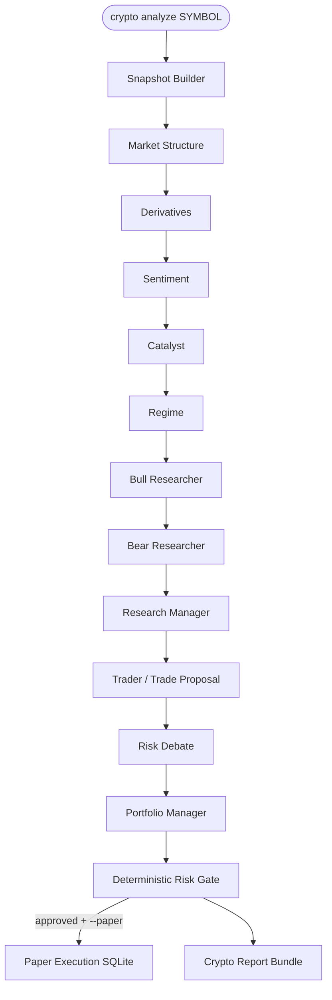

# Circuit Framework

A **crypto-native** multi-agent research and paper-trading framework where specialized agents analyze market structure, derivatives, sentiment, catalysts and market regime before a **deterministic risk engine** approves or rejects each trade.

Circuit Framework is a fork of [TradingAgents](https://github.com/TauricResearch/TradingAgents) (Apache 2.0). The internal Python package remains `tradingagents` for compatibility; user-facing branding, CLI help and crypto workflows are Circuit Framework.

> **Research only — not financial advice.** LLM output can be incorrect. Paper results do not represent live execution. **No real trades are placed.** This software never calls the Hyperliquid Exchange endpoint and never requests wallet credentials.

## Architecture



All crypto analysts share one immutable `CryptoMarketSnapshot` built at the start of the run. Strategies differ by YAML profile (prompts + risk knobs), not by separate data paths.

## Crypto analyst roles

| Analyst | Focus |
| --- | --- |
| Market Structure | OHLC, indicators, order book imbalance / spread |
| Derivatives | Funding, OI, premium (public Info API) |
| Sentiment | Social / news signals when available |
| Catalyst | Event / narrative catalysts |
| Regime | Trend, volatility, liquidity, risk-on/off |

After debate, the Trader emits a structured `CryptoTradeProposal` (`LONG` / `SHORT` / `NO_TRADE`). The Deterministic Risk Gate sizes, clamps, and may reject.

## Hyperliquid public data

Market data uses only `POST https://api.hyperliquid.xyz/info` (candles, L2 book, meta/asset contexts, funding history). No authentication. Unit tests load fixtures from `tests/fixtures/hyperliquid/` and must not hit the network.

## Supported symbols

Normalize inputs such as `BTC`, `BTC-USD`, `BTC-USDT`, `BTC/USDC`, `BTC-PERP`, `ETH`, `SOL-PERP`, `HYPE`. Hyperliquid perps use the base as `venue_symbol` (e.g. `BTC`).

## Strategy profiles

Ship-in YAML under `tradingagents/strategies/`:

`balanced`, `momentum`, `mean_reversion`, `derivatives`, `narrative`, `macro_regime`, `quant_systematic`

Same snapshot, fees, risk engine and paper executor — only weights, overlays and risk limits differ.

## Structured proposals & risk

Proposals include entry band, stop, take-profits, requested size/leverage, confidence, thesis and `snapshot_id`. Risk rules include stale-data rejection, stop / R:R checks, spread limits, leverage and position clamps, volatility and confidence scalars. `NO_TRADE` is preserved, never converted into a fill.

## Paper trading CLI

```bash
pip install -e ".[dev]"

tradingagents crypto analyze BTC
tradingagents crypto analyze ETH --strategy momentum
tradingagents crypto analyze SOL --interval 1h
tradingagents crypto analyze HYPE --strategy derivatives --paper
tradingagents crypto portfolio
tradingagents crypto positions
tradingagents crypto leaderboard
```

Paper DB default: `~/.tradingagents/circuit/paper.db` (`TRADINGAGENTS_PAPER_DATABASE_PATH`).

Programmatic crypto run:

```python
from tradingagents.graph.trading_graph import TradingAgentsGraph
from tradingagents.default_config import DEFAULT_CONFIG
from tradingagents.graph.setup import CRYPTO_DEFAULT_ANALYSTS

config = DEFAULT_CONFIG.copy()
ta = TradingAgentsGraph(
    selected_analysts=list(CRYPTO_DEFAULT_ANALYSTS),
    config=config,
    asset_type="crypto",
    strategy_profile="balanced",
)
state, decision = ta.propagate(
    "BTC",
    "2026-07-14",
    asset_type="crypto",
    strategy_profile="balanced",
)
```

## Environment variables

Common overrides (see `.env.example`):

- LLM: `TRADINGAGENTS_LLM_PROVIDER`, `TRADINGAGENTS_DEEP_THINK_LLM`, `TRADINGAGENTS_QUICK_THINK_LLM`, provider API keys
- Crypto: `TRADINGAGENTS_CRYPTO_VENUE`, `TRADINGAGENTS_CRYPTO_DEFAULT_INTERVAL`, `TRADINGAGENTS_DEFAULT_CRYPTO_STRATEGY`
- Paper: `TRADINGAGENTS_PAPER_STARTING_BALANCE`, `TRADINGAGENTS_PAPER_FEE_BPS`, `TRADINGAGENTS_PAPER_SLIPPAGE_BPS`, `TRADINGAGENTS_PAPER_MAX_LEVERAGE`, `TRADINGAGENTS_PAPER_DATABASE_PATH`

## Testing

```bash
python3 -m pip install -e ".[dev]"
python3 -m pytest -q
python3 scripts/crypto_smoke.py
```

Crypto tests are offline (fixtures / mocks). No LLM API key required for the unit suite.

## Known limitations

- On-chain data is not included until a verified provider is configured.
- Liquidation fields may be unavailable from public Info coverage.
- LLM analysts can be wrong; the risk gate is deterministic but cannot invent edge.
- Paper fills use mid ± slippage and configured fees — not exchange matching.

## Upstream attribution

Built on **TradingAgents** by Tauric Research ([arXiv:2412.20138](https://arxiv.org/abs/2412.20138)), licensed under **Apache License 2.0**. See `LICENSE` and the [upstream repository](https://github.com/TauricResearch/TradingAgents).

---

## Stock research mode (upstream)

The original stock multi-agent pipeline remains available (`asset_type="stock"`, interactive `tradingagents analyze`). Analysts: Fundamentals, Sentiment, News, Technical. Data vendors include Yahoo Finance / Alpha Vantage; optional FRED and Polymarket.

```bash
tradingagents          # interactive stock CLI
python -m cli.main analyze
```

```python
from tradingagents.graph.trading_graph import TradingAgentsGraph
from tradingagents.default_config import DEFAULT_CONFIG

ta = TradingAgentsGraph(config=DEFAULT_CONFIG.copy())
state, decision = ta.propagate("AAPL", "2026-01-15")
```

### Installation

```bash
git clone <this-repo>
cd circuit-framework
python3 -m pip install -e ".[dev]"
cp .env.example .env   # add LLM API keys for live analysis
```

Docker: `docker compose run --rm tradingagents` (see upstream compose file).

### LLM providers

OpenAI, Google, Anthropic, xAI, DeepSeek, Qwen, GLM, MiniMax, OpenRouter, Ollama, Azure, Bedrock (`pip install ".[bedrock]"`), and any OpenAI-compatible endpoint via `openai_compatible`.

### Persistence

- Decision log: `~/.tradingagents/memory/trading_memory.md` (crypto entries can include a `CRYPTO_META` block for structured evaluation).
- Optional LangGraph checkpoints: `--checkpoint` / `TRADINGAGENTS_CHECKPOINT_ENABLED`.

### Citation (upstream)

```
@misc{xiao2025tradingagentsmultiagentsllmfinancial,
      title={TradingAgents: Multi-Agents LLM Financial Trading Framework},
      author={Yijia Xiao and Edward Sun and Di Luo and Wei Wang},
      year={2025},
      eprint={2412.20138},
      archivePrefix={arXiv},
      primaryClass={q-fin.TR},
      url={https://arxiv.org/abs/2412.20138},
}
```
