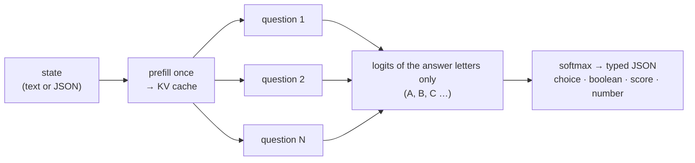

<div align="center">


# Rizzo Flow

### The open, local take on Jev: typed decisions from an LLM, without generating a single token

**_Unstructured state in → typed, probabilistic decisions out. On your own machine._**

<p>


</p>

<p>


</p>

<sub>🌐 <a href="https://rizzo-ai-academy.github.io/rizzo-flow/"><b>Website</b></a> · A project by <a href="https://www.rizzoaiacademy.com"><b>Rizzo AI Academy</b></a> · 🇮🇹 <a href="docs/README.it.md">Documentazione dettagliata in italiano</a></sub>

</div>

**Rizzo Flow** is an open-source, local-first implementation of the idea behind
[**Jev**](https://typesafe.ai/blog/introducing-system-one-models-and-jev), TypeSafe's "System One"
model: a *function call with judgment* that takes unstructured state and returns **typed decisions
with probabilities** — a yes/no, a choice among options, a score on a rubric, a number — instead
of text you then have to parse.

Jev is a closed, hosted service. Rizzo Flow gives you the same programming model **on your own
hardware, with open weights, and with the same HTTP interface**, so code written against the
TypeSafe API can point at `localhost` by changing one URL.

> **Independent project.** Rizzo Flow is not affiliated with TypeSafe and does not reproduce Jev's
> proprietary architecture or its RLCD training. It reproduces the *interface pattern* with an
> off-the-shelf open model, in the spirit of [SemIf](https://github.com/TheoLeeCJ/SemIf), which
> inspired it. Probabilities are **uncalibrated** unless you calibrate them on your own data, and
> we make no claim of matching Jev or SemIf in quality. Every number below comes with its caveats.

<div align="center">
<br />
<a href="assets/snake_run.gif"></a>

<sub>🐍 <b>Fast enough to play Snake</b> — every move is one <code>POST /v1/decisions</code>. Recorded at <b>real speed</b>, not sped up:
140 moves in 25.6 s (≈ 5.5 per second), about <b>150 ms per decision</b> round trip, <b>0 generated tokens</b>.<br />
Spark-X2.5-4B at 8 bit on an RTX 5060 Ti (CUDA) · one game, not a benchmark · <a href="#snake-demo">about the demo ↓</a> · <a href="#quickstart">run it yourself ↓</a></sub>
</div>

---

## Why "System One"

An LLM asked to classify something *writes* an answer: token by token, slowly, in a format you
hope is valid JSON. But for a decision you do not need text — you need **which option, and how
sure**. That information is already in the model after a single forward pass: it is the
probability it assigns to each possible answer.

Rizzo Flow reads exactly that and nothing else:



1. **Every question becomes a multiple choice.** Each candidate answer is mapped to one uppercase
   letter. The tokenizer is checked at request time: every letter must be exactly one token, in
   context. 26 letters → at most **26 answer slots** per question.
2. **The state is processed once.** It sits at the start of the prompt, so it is prefilled a
   single time (in 512-token chunks) and its KV cache is **cloned for every question** — both the
   full-attention and the sliding-window caches. Question suffixes run in padded micro-batches.
3. **Only the needed logits are computed.** The last hidden state is multiplied by just the
   vocabulary rows of the allowed letters — also with quantized weights. Verified identical to the
   full-vocabulary projection.
4. **Plain Python turns logits into typed output.** Softmax, optional temperature, expected values
   for scores and numbers, abstention policy, and a schema-validated JSON response.

No decoding loop, no output parsing, no JSON repair, no type errors by construction.
"Zero generated tokens" is not zero latency: prefill and suffixes still cost compute.

---

## Primitives

### Native API — `POST /v1/decisions`

| Type | You provide | You get |
| --- | --- | --- |
| `boolean` | optional descriptions of *true* / *false* | `value`, probability of true |
| `choice` | `options` (id + description), up to 26 | `choice`, probability of every option |
| `score` | ordered `levels`, low → high | probability-weighted `score`, `normalized_score`, spread |
| `numeric` | increasing `anchors` (value + description) and a `unit` | probability-weighted `value`, median, spread, below/above-range probability |

Every type can **abstain**: a built-in `__insufficient__` option (on by default), plus
`__below_range__` / `__above_range__` for `numeric`. When those win, the primary value is `null`
and `status` says why: `ok`, `insufficient_evidence`, `out_of_range`, `uncertain`. Thresholds are
a per-question `policy`. Special options use answer slots too: 26 options without abstention, 25
with it, 24/23 anchors for `numeric`.

```json
{
  "state": {"measurement": 75, "unit": "percent"},
  "questions": {
    "fill": {
      "type": "numeric",
      "instructions": "Read the reported fill percentage.",
      "unit": "percent",
      "anchors": [
        {"value": 0, "description": "Empty"},
        {"value": 50, "description": "Half full"},
        {"value": 75, "description": "Three quarters full"},
        {"value": 100, "description": "Completely full"}
      ]
    }
  }
}
```

Anchors are representative values, **not statistical intervals**; the mean stays inside the
extreme anchors; reported quantiles are those of the discrete distribution over anchors. Details:
[docs/README.it.md](docs/README.it.md#cosa-significa-un-numero).

### Jev-compatible API — `POST /v1/systemone`, `GET /v1/models`

Same request and response shape as the public [TypeSafe API reference](https://docs.typesafe.ai/api):

| Type | `criteria` | Answer |
| --- | --- | --- |
| `noul` | optional `{true, false}` descriptions | `noul`: probability of yes, 0–1 |
| `choice` | map *option → description* (or `null`), up to 26 | `choice`, `probabilities`, `confidence` |
| `score` | ordered array of level descriptions, up to 10 | `score`, `legend`, `probabilities`, `confidence` |

```bash
curl http://127.0.0.1:8017/v1/systemone \
  -H 'Content-Type: application/json' \
  -d '{
    "state": "Help! My payouts have been failing for 3 days.",
    "model": "rizzo-latest",
    "questions": {
      "is_urgent": {"type": "noul", "instructions": "Does this convey urgency?"},
      "department": {"type": "choice", "instructions": "Which team should handle this?",
        "criteria": {"billing": "Payments, invoicing, refunds", "technical": "Bugs, outages", "sales": null}},
      "frustration": {"type": "score", "instructions": "How frustrated is the customer?",
        "criteria": ["Calm", "Frustrated", "Very angry"]}
    }
  }'
```

A real response from the 8-bit model (values rounded, `x_rizzo` omitted):

```json
{
  "model": "rizzo-spark-x2.5-4b-q8",
  "answers": {
    "is_urgent":   {"type": "noul", "noul": 0.99998},
    "department":  {"type": "choice", "choice": "billing",
                    "probabilities": {"billing": 0.99999, "technical": 0.00001, "sales": 0.0}, "confidence": 0.99999},
    "frustration": {"type": "score", "score": 1.0, "legend": {"0": "Calm", "1": "Frustrated", "2": "Very angry"},
                    "probabilities": {"0": 0.0, "1": 1.0, "2": 0.0}, "confidence": 1.0}
  },
  "usage": {"input_tokens": 287, "output_tokens": 0}
}
```

A client written for the hosted API can target Rizzo Flow by changing only the base URL (for the
official SDKs: `TYPESAFE_BASE_URL=http://127.0.0.1:8017` — designed for it, not yet tested with
the real SDK). **The interface is compatible, the model is not Jev:**

- `model` accepts `rizzo-latest`, the local id, and any `jev-*` name as a convenience alias. The
  response **always reports the local model id** — no answer ever presents itself as Jev.
- `instructions` and `criteria` may be strings, objects or arrays, as in the original.
- No abstention in this format (`allow_abstain: false`); `noul` is P(yes) over two options.
- `confidence = (n · p_max − 1) / (n − 1)`, the statistic shown on TypeSafe's Confidence page;
  Jev's exact formula is not public. It describes the *shape* of the distribution, not the
  probability of being right.
- `usage.input_tokens` counts the state once plus the question suffixes; `output_tokens` is always 0.
- `x_rizzo` (timings, fingerprint) is an extension outside the contract.
- Bearer auth like the original, enforced only if `RIZZO_API_KEY` is set. Errors: 401, 422.

**Asking many questions at once is the point.** All questions in one request share the state's KV
cache: 8 yes/no questions on one document cost 1 prefill + 2 micro-batches (932 ms total on an M4
Pro at 8 bit), not 8 full passes.

---

## A model with a native 1M-token context

Rizzo Flow runs [**XHToken/Spark-X2.5-4B**](https://huggingface.co/XHToken/Spark-X2.5-4B) by
default, or the smaller [**Spark-X2.5-1.7B**](https://huggingface.co/XHToken/Spark-X2.5-1.7B)
(both Apache-2.0). The model handles up to **1M tokens** (1,048,576, native). Out of the box a
question (state + question) is limited to **8,192 tokens**; raise it with `--ctx` — it is a
guard, not a memory reservation. Beyond ~60k tokens also raise the 256 KB `state` cap in
`schema.py`. Budget ~36 KiB of cache per token on the 4B (× `--batch-size`), and note that we
have only measured states up to ~2,000 tokens. Oversized inputs are rejected, never truncated.

| Input context | Rizzo Flow | Jev (TypeSafe) | SemIf |
| --- | ---: | ---: | ---: |
| Model maximum | **1M tokens** (native) | 32k for state + longest question · 64k per request | 262k native (Qwen3.5-4B; ~1M with YaRN) |
| Default limit | 8,192 (`--ctx`) | — | 4,096 (`--max-tokens`) |

Sources: [TypeSafe models](https://docs.typesafe.ai/models),
[Qwen3.5-4B model card](https://huggingface.co/Qwen/Qwen3.5-4B), SemIf's CLI at commit `ca3ba65`.

---

## Quickstart

Rizzo Flow runs on macOS, Windows and Linux. You need Python ≥ 3.11, git and
[uv](https://docs.astral.sh/uv/). **The only platform-specific step is the install**: you pick one
compute backend (`mlx`, `cuda` or `cpu`) and activate the environment. From step 2 onwards every
command is identical on every system, and the backend is detected automatically.

**1 · Install — copy the block for your machine**

<details open>
<summary><b>🍎 macOS — Apple Silicon (Metal GPU)</b></summary>

```bash
git clone https://github.com/Rizzo-AI-Academy/rizzo-flow
cd rizzo-flow
uv sync --locked --extra mlx
source .venv/bin/activate
```
</details>

<details open>
<summary><b>🪟 Windows — NVIDIA GPU (PowerShell)</b></summary>

```powershell
git clone https://github.com/Rizzo-AI-Academy/rizzo-flow
cd rizzo-flow
uv sync --locked --extra cuda
.venv\Scripts\activate
```

Needs a recent NVIDIA driver (CUDA 13; check with `nvidia-smi`). No CUDA toolkit install is
required: the libraries come with the Python packages and Rizzo Flow finds them by itself. If
PowerShell refuses to run the activation script, run
`Set-ExecutionPolicy -Scope Process RemoteSigned` first, or skip activation (see below).
</details>

<details open>
<summary><b>🐧 Linux — NVIDIA GPU</b></summary>

```bash
git clone https://github.com/Rizzo-AI-Academy/rizzo-flow
cd rizzo-flow
uv sync --locked --extra cuda
source .venv/bin/activate
```
</details>

<details>
<summary><b>🐢 Windows or Linux without a GPU (CPU only — very slow, last resort)</b></summary>

Same as above with `uv sync --locked --extra cpu`. See the status table before choosing this.
</details>

Check what was detected — this works the same everywhere:

```bash
rizzo devices        # → "available": ["cuda", "cpu"], "auto_selects": "cuda"   (or mlx / cpu)
```

Prefer not to activate the environment? Prefix any command with `uv run --no-sync`, on any system:
`uv run --no-sync rizzo serve --bits 8`. (`--no-sync` matters: a plain `uv run` would re-sync the
environment without your backend extra and remove it.)

| Extra | Hardware | Status |
| --- | --- | --- |
| `mlx` | Apple Silicon | reference platform: every published result (M4 Pro) |
| `cuda` | NVIDIA GPU, Windows / Linux | tested on Windows 10 + RTX 5060 Ti 16 GB (4B Q8: 4 questions in ~310 ms warm). Linux not tried. The very first request compiles GPU kernels and can take up to a minute; later runs reuse them |
| `cpu` | any x86-64 / ARM PC | **installs and passes the unit tests, but was impractically slow in our only attempt** (Windows, i7-7700K: ~3 minutes for an 8-token forward pass of the 1.7B at 8 bit). Treat as a last resort |

All three are the same [MLX](https://github.com/ml-explore/mlx) runtime with a different compute
backend, so prompts, API and results format are identical. `cuda` and `cpu` cannot be installed
together. Add `--extra test` if you want to run the test suite.

**2 · Download a model** — pick one; weights go to `models/` (git-ignored):

```bash
rizzo download                 # Spark-X2.5-4B   · ~8 GB   · default
rizzo download --size 1.7b     # Spark-X2.5-1.7B · ~3.4 GB · smaller and faster
```

| `--size` | Checkpoint | Weights | Status |
| --- | --- | ---: | --- |
| `4b` (default) | [XHToken/Spark-X2.5-4B](https://huggingface.co/XHToken/Spark-X2.5-4B) | ~8 GB | every result in this README unless it says 1.7B |
| `1.7b` | [XHToken/Spark-X2.5-1.7B](https://huggingface.co/XHToken/Spark-X2.5-1.7B) | ~3.4 GB | runs, ~2× faster, **much less accurate** (below) |

Both are the same Spark2.5 architecture with the same tokenizer and native 1M-token context, at
pinned revisions. Measured on CUDA at 8 bit with prompt v3: on our own 20-decision smoke set the
1.7B scores 0.45 against 0.95 for the 4B; on SemIf's fixtures 0.700 / 0.633 against 0.829 / 0.865
([below](#same-fixtures-with-the-shipped-prompt-v3-windows--cuda-rtx-5060-ti)), at about half
the latency. With abstention enabled it picks "cannot determine" almost every time; use it with `"allow_abstain": false` (the
Jev-compatible endpoint always does) and check it on your own data before relying on it.

**3 · Start the backend**

```bash
rizzo serve --bits 8                 # 4B, 8 bit, ~5 GiB
rizzo serve --size 1.7b --bits 8     # 1.7B
```

Loading takes a few seconds; the server is ready when it prints
`Uvicorn running on http://127.0.0.1:8017`. Useful flags: `--bits 4|8` (omit for BF16),
`--device auto|mlx|cuda|cpu` (default `auto`: the GPU if the install has one), `--port`, `--host`, `--batch-size` (question micro-batch, default 4), `--ctx` (context limit in tokens, default 8192),
`--model /path/to/checkpoint` (overrides `--size`), `--calibration fit.json`.
Set `RIZZO_API_KEY=...` before starting if you want Bearer auth on the Jev-compatible endpoints.

**4 · Open the playground**

Open <http://127.0.0.1:8017/playground> in your browser.

<div align="center">
<br />
<a href="assets/playground.webp"></a>

<sub>🦔 <b>The built-in playground</b> — one support ticket, two questions answered in parallel in <b>484 ms</b>:
one state prefill (116 tokens, 187 ms), one micro-batch, <b>0 generated tokens</b>.<br />
Spark-X2.5-4B at 8 bit on an M4 Pro · interface in Italian or English</sub>
</div>

Pick an example from the **Examples…** menu (or write your own state and questions), press
**Run** or `Cmd/Ctrl + Enter` — or click the hedgehog — and read the probabilities, the timings and
the generated cURL. The badge in the header shows which checkpoint and precision is answering.
The interface is bilingual: switch **IT / EN** in the header (it follows your browser language the
first time and remembers your choice).

**5 · Or call it from code**

```bash
curl http://127.0.0.1:8017/v1/systemone \
  -H 'Content-Type: application/json' \
  -d '{"state": "Help! My payouts have been failing for 3 days.", "model": "rizzo-latest",
       "questions": {"is_urgent": {"type": "noul", "instructions": "Does this convey urgency?"}}}'
```

On Windows PowerShell, where `curl` quoting differs, the same call is:

```powershell
$body = @{ state = "Help! My payouts have been failing for 3 days."; model = "rizzo-latest"
           questions = @{ is_urgent = @{ type = "noul"; instructions = "Does this convey urgency?" } }
         } | ConvertTo-Json -Depth 5
Invoke-RestMethod http://127.0.0.1:8017/v1/systemone -Method Post -ContentType "application/json" -Body $body |
  ConvertTo-Json -Depth 6
```

No server needed for one-off runs: `rizzo decide examples/ticket.json --bits 8`.

BF16 is the default precision; `--bits 8` / `--bits 4` quantize in memory (affine, group size 64).
Quantization changes probabilities: compare on your own workload. So does the backend: Metal and
CUDA round differently, and a calibration is bound to the backend it was fitted on.

### Playground

<http://127.0.0.1:8017/playground> ([screenshot above](#quickstart), in step 4) is a single self-contained page served by the backend, with no
external calls: a question builder for noul / choice / score, ready-made examples, a raw JSON
editor for both endpoints (so you can try `numeric` and abstention too), probability bars,
timings (round-trip, inference, state prefill, micro-batches, cached state tokens) and the
equivalent cURL.

### Snake demo

<http://127.0.0.1:8017/snake> is a Snake game where **every move is one `POST /v1/decisions`
request**: the state describes the board, a `choice` question lists the legal moves, and the model's
answer-letter probabilities are drawn live on the candidate cells, next to bars, logits, timings
and a decision log. No text is generated. **Record GIF** captures the board plus the decision
panel in the page itself (hand-written GIF89a encoder, no dependencies) and saves the file to your
downloads when you stop.

What the model sees is selectable, and it matters. With *per-move sensors* (content of the next
cell, distance to the food, reachable free cells — all computed by the game; only the choice is
the model's) Q8 on an M4 Pro plays at about 2 moves/s (≈ 490 ms per decision, ~300 input tokens):
in three informal 10×10 games it ate 12 and 7 foods in 80 moves without dying, and 22 foods in
208 moves before boxing itself in with no safe move left. With the *ASCII grid only* it died
within 26 and 13 moves with 0 points in two games: a 4B model does not read a grid spatially.
These are a handful of games, not a benchmark. Options are shuffled every move to dampen position
bias; an optional safety net (off by default, every intervention logged) replaces a lethal pick
with the most probable safe move.

Interactive OpenAPI docs: <http://127.0.0.1:8017/docs>. Schemas: `request.schema.json`,
`response.schema.json`. `GET /health` reports model provenance and file hashes.

---

## Results so far

Hardware for everything we ran: **Apple M4 Pro, 24 GiB**. Timings exclude model load and warm-up
and include request compilation plus synchronized GPU inference. All reports are committed,
create-only, with logits, prompt hashes and weight hashes: [results/](results/README.md) (Italian).

### Own development fixtures (prompt v2)

| Measure | BF16 | 8 bit |
| --- | ---: | ---: |
| Median over 17 smoke requests | 389 ms | 304 ms |
| Peak MLX allocation | 8.38 GiB | 4.88 GiB |
| Correct argmax, 20 labelled decisions | 17/20 | 18/20 |
| Correct argmax, 9 perturbations | 8/9 | 9/9 |
| Long state, 4 questions: shared vs direct | 2.75× faster | 2.83× faster |

These fixtures are small and were read while writing the prompt: they are a smoke test, not an
independent benchmark.

### SemIf's fixtures, SemIf's metric code (historical: prompt v2, 8 bit, Mac)

> These are the first numbers, measured with the **previous** prompt (v2). The shipped prompt is
> v3: its numbers are in the next section.

We ran [SemIf](https://github.com/TheoLeeCJ/SemIf)'s committed fixtures (file hashes verified)
through Rizzo Flow and scored them with SemIf's own `benchmarks/evaluate.py`
(`scripts/semif_compare.py`). Same rows, same metric, same timing scope; each system keeps its own
prompt and model.

| Measure | Rizzo Flow · Spark-X2.5-4B Q8 (M4 Pro) | SemIf · Qwen3.5-4B Q8, published (M5 Max) |
| --- | ---: | ---: |
| `authored144`, mean-family balanced accuracy | 0.758 | 0.819 |
| `perturbations108`, same metric | 0.706 | 0.766 |
| Per-decision latency, short state (p50 / p95) | 254 / 259 ms | not comparable |
| `shape777` shared: 37 states (~2k tokens) × 21 criteria | 3.92 decisions/s · 5.33 s per state | not comparable |
| `shape777` fresh (3 states) | 0.31 decisions/s | not comparable |
| Argmax changes, shared vs fresh (63 decisions) | 0 (max Δp 0.057) | — |

Reading this honestly:

- **With prompt v2 Rizzo Flow was ~6 points behind SemIf's published quality** on these sets.
  The weakest family is `rule_application` (0.689; 0.481 under perturbation, NLL 1.83 —
  confidently wrong).
- **Shared-state reuse is ~12.6× faster** than fresh scoring here, with no argmax change.
- SemIf's numbers were measured on a different Mac: **valid for quality, not for timing**. The
  same-hardware run of SemIf (needs the Qwen3.5-4B weights) is **not done yet**.
- Not included: WANLI, the TypeSafe subset (not redistributable) and Every sets. SemIf states its
  labels are model-reviewed, not human-adjudicated; 6 points on 144 rows is about 9 rows.

### Same fixtures with the shipped prompt (v3), Windows + CUDA (RTX 5060 Ti)

| Measure | Rizzo v3 Q8 | Rizzo v3 BF16 | SemIf Q8 (MLX, published) | SemIf BF16 (RTX 3090, published) |
| --- | ---: | ---: | ---: | ---: |
| `authored144`, mean-family balanced accuracy | 0.829 | 0.819 | 0.819 | 0.813 |
| — held-out half only (72 rows) | 0.824 | 0.806 | 0.811 | 0.802 |
| `perturbations108` | 0.865 | 0.842 | 0.766 | 0.766 |
| — held-out half only (54 rows) | 0.875 | 0.843 | 0.824 | 0.824 |
| Argmax flips: option reversal / wrapper / irrelevant context | 4 / 2 / 3 | 4 / 3 / 4 | 9 / 7 / 4 | 10 / 9 / 4 |
| Missing evidence (36 rows): accuracy | 0.778 | 0.750 | 0.861 | 0.861 |
| — confident (p ≥ 0.8) answers where `insufficient` was right | **6** | **6** | 1 | 1 |
| Per-decision latency, short state (p50 / p95) | 87 / 94 ms | 76 / 78 ms | not comparable | not comparable |
| `shape777` shared, 777 decisions | 7.52 decisions/s · 1.76 s per state | 15.99 decisions/s · 1.31 s per state | not comparable | not comparable |
| `shape777` fresh, 777 decisions | 1.65 decisions/s | 1.97 decisions/s | not comparable | not comparable |
| Argmax changes, shared vs fresh (777 decisions) | 2 (max Δp 0.144) | 2 (max Δp 0.100) | — | 6 |

- **Half of these rows are the dev split the v3 prompt was chosen on**, so the totals are
  optimistic. The held-out half, looked at once, agrees (0.824 / 0.875).
- **On `authored144` the two systems are tied**: paired source-group bootstrap (SemIf's code)
  gives +0.010, 95% interval [−0.051, +0.076]. We claim no superiority.
- **Rizzo Flow is worse at admitting missing evidence**: 6 confident wrong answers out of 36
  against SemIf's 1. `rule_application` is still weak under perturbation (0.630, NLL 1.63).
- **On this GPU BF16 is faster than Q8** (2.1× on shared microbatches, peak 10.13 GiB against
  6.55 GiB): MLX-CUDA's quantized kernels cost more than a BF16 matmul, so Q8 only buys memory.
- **The 1.7B checkpoint** on the same run (Q8): `authored144` 0.700, `perturbations108` 0.633
  (held-out halves 0.697 / 0.514), 17 of 36 argmax flips under option reversal, `rule_application`
  0.296 under perturbation. It is 2.2–2.7× faster (40 ms per decision, 20.6 decisions/s shared,
  2.8 GiB peak) but clearly worse: paired difference from the 4B −0.128 [−0.211, −0.046].
- Still not run: WANLI, Every, the TypeSafe subset, SemIf on this same GPU. Details and reports:
  [`results/README.md`](results/README.md).

### How prompt v3 was chosen (dev split only)

The fixtures were split by source group into dev and held-out halves, and prompt variants were
compared **on dev only** (`scripts/prompt_lab.py`, logs in `results/prompt-lab/*.txt`):

| Variant (dev: 72 base + 54 perturbed rows, 8 bit) | base | perturbed | flips on option reversal | own smoke |
| --- | ---: | ---: | ---: | ---: |
| current v2 (JSON state, JSON question) | 0.754 | 0.711 | 6 | 0.90 |
| new short system prompt + plain-text multiple choice, state as text | 0.827 | 0.852 | 2 | 0.95 |
| new short system prompt + plain-text multiple choice, state as JSON | 0.806 | 0.852 | 1 | 0.95 |
| …plus longer guidance (rules, abstention, "order is arbitrary") | 0.79–0.81 | 0.80–0.82 | 2–3 | 0.90–0.95 |

A plain-text multiple-choice question and a short, decision-focused system prompt both help and
reduce position bias; longer instructions do not. The shipped prompt is now the
second row (`a-text-all`, `spark-decisions-v3`). The dev numbers chose a candidate, they do not
prove it: the held-out half was then run once, on CUDA, and agrees (0.824 / 0.875, section
above; the dev half reproduced there to the third decimal). Numbers measured on the Mac — the
v2 SemIf table, the smoke and long-state results — are still prompt v2.
Exact prompts, every variant and the per-family numbers: [docs/prompt-lab.md](docs/prompt-lab.md) (Italian).

---

## Calibration

Out of the box the distributions are often extremely peaked (0.9999 where Jev's docs show 0.88),
so thresholds designed for Jev's `confidence` do not transfer. Temperature scaling is built in,
per primitive, and bound to a fingerprint of weights, tokenizer, precision, runtime and prompt
version:

```bash
rizzo calibrate calibration.jsonl --fingerprint MODEL_HASH --output calibration-fit.json
rizzo serve --bits 8 --calibration calibration-fit.json
```

You need labelled data from your own domain, a separate calibration set, and a held-out test. The
evaluator reports accuracy, NLL, Brier, ECE and coverage.

## Known limitations

- Probabilities are uncalibrated by default; `status: ok` does not mean *correct*.
- The model under-uses abstention and out-of-range options (documented cases in
  [results/README.md](results/README.md)).
- Residual position bias; permutation debiasing is not implemented.
- 26 options per question (Jev: 255; SemIf: 16). Beyond that you need two stages.
- MLX runtime only (Metal, CUDA or CPU backend), one resident model, concurrent requests are serialized.
- English is strongest; an Italian boolean flipped between BF16 and 8 bit in our smoke set.
- Localhost by default; no rate limiting; not hardened for public exposure.

## Development

```bash
pytest -q                         # 41 tests, no weights needed
ruff check src tests scripts
rizzo evaluate benchmarks/smoke.jsonl --compare-modes --output results/local-smoke.json
python scripts/semif_compare.py --system rizzo --semif ../SemIf --bits 8 --output results/local-semif
```

Architecture notes and the current state of the work: [CLAUDE.md](CLAUDE.md) (Italian).

## Credits

- [TypeSafe — *Introducing System One models and Jev*](https://typesafe.ai/blog/introducing-system-one-models-and-jev)
  and the [TypeSafe docs](https://docs.typesafe.ai/introduction): the idea, the primitives and the
  API shape this project mirrors. "Jev" and "TypeSafe" belong to their owners.
- [SemIf](https://github.com/TheoLeeCJ/SemIf) by TheoLeeCJ (MIT): the open option-logit baseline
  that inspired this work, and the fixtures and evaluator used for the comparison. No SemIf source
  files are copied here.
- [Spark-X2.5-4B](https://huggingface.co/XHToken/Spark-X2.5-4B) (revision `0bcb3567…`),
  [Spark-X2.5-1.7B](https://huggingface.co/XHToken/Spark-X2.5-1.7B) (revision `14d6e83c…`) and the
  official [Spark MLX runtime](https://github.com/XHToken/Spark-MLX-LLM) (commit `de2b4379…`),
  both Apache-2.0. MLX `0.32.2`, MLX-LM `0.31.3`.

## License

Released under the **[Apache License 2.0](LICENSE)** © 2026 Simone Rizzo — Rizzo AI Academy — the
same license as the Spark-X2.5 models it runs. Third-party attributions are in [NOTICE](NOTICE);
model weights and the Spark runtime are downloaded from their sources and keep their own licenses.

---

<div align="center">

**Author** — Simone Rizzo · **A project by** [Rizzo AI Academy](https://www.rizzoaiacademy.com)

→ [www.rizzoaiacademy.com](https://www.rizzoaiacademy.com)

</div>
