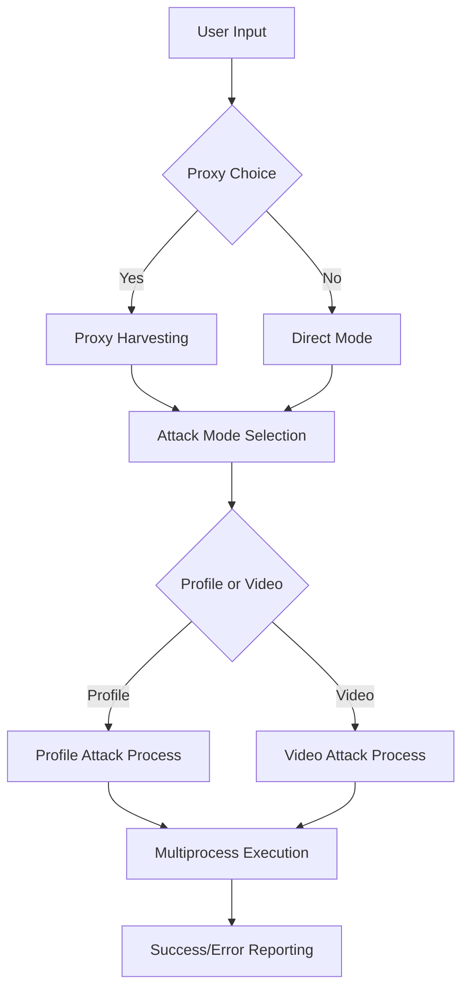

# 🎯 Instagram Report BOT 
  
  <p align="center"></p>
<h2 align="center">Telegram: https://t.me/snirepor</h2>
## What Is an Instagram Reporting Bot/Tool❓
<p>
  * Definition:
  * <p>An Instagram reporting bot or automation tool is software designed to streamline the process of submitting reports for accounts or content that may violate Instagram’s rules and Community Guidelines.</p>
## How Does the Tool Work❓
* <p>The tool can automate certain reporting actions according to predefined criteria. It may be used to report suspected spam, impersonation, fake accounts, abusive behavior, or other potential policy violations,reports are ultimately reviewed according to Instagram’s own systems and policies.</p>

## How Can I Get the Tool or Submit a Report❓
  * Join our Telegram channel here: <a href="https://t.me/snirepor"></a>
  * Review the available demonstrations and information.
  * Contact us through the Telegram username provided below the relevant content.
</pre>
</p>
</details>


**Legal Notice**

```console
This tool is intended for legitimate reporting of content that may violate platform policies. Users are responsible for ensuring that their reports are truthful and comply with Instagram’s Terms and Community Guidelines. 
```

----
<br>

<div align="center">  
  
```

██╗███╗░░██╗░██████╗████████╗░█████╗░░██████╗░██████╗░░█████╗░███╗░░░███╗
██║████╗░██║██╔════╝╚══██╔══╝██╔══██╗██╔════╝░██╔══██╗██╔══██╗████╗░████║
██║██╔██╗██║╚█████╗░░░░██║░░░███████║██║░░██╗░██████╔╝███████║██╔████╔██║
██║██║╚████║░╚═══██╗░░░██║░░░██╔══██║██║░░╚██╗██╔══██╗██╔══██║██║╚██╔╝██║
██║██║░╚███║██████╔╝░░░██║░░░██║░░██║╚██████╔╝██║░░██║██║░░██║██║░╚═╝░██║
╚═╝╚═╝░░╚══╝╚═════╝░░░░╚═╝░░░╚═╝░░╚═╝░╚═════╝░╚═╝░░╚═╝╚═╝░░╚═╝╚═╝░░░░░╚═╝

        ░░██╗  ████████╗░█████╗░░█████╗░██╗░░░░░  ██╗░░
        ░██╔╝  ╚══██╔══╝██╔══██╗██╔══██╗██║░░░░░  ╚██╗░
        ██╔╝░  ░░░██║░░░██║░░██║██║░░██║██║░░░░░  ░╚██╗
        ╚██╗░  ░░░██║░░░██║░░██║██║░░██║██║░░░░░  ░██╔╝
        ░╚██╗  ░░░██║░░░╚█████╔╝╚█████╔╝███████╗  ██╔╝░
        ░░╚═╝  ░░░╚═╝░░░░╚════╝░░╚════╝░╚══════╝  ╚═╝░░
```

<h1 align="center" style="
color:#ff00ff;
text-shadow:
0 0 6px #ff00ff,
0 0 12px #00ffff,
0 0 18px #00ff99;">
🚀 Instagram Report BOT
</h1>

<p align="center" style="
color:#ffffff;
font-size:16px;
text-shadow:
0 0 5px #00ffff,
0 0 10px #8a2be2;">
Fully working <b>Windows</b> & <b>Android</b> applications with powerful <b>Python scripts</b> included.<br>
Fast • Automated • Clean • Reliable<br><br>
Premium services available on request
</p>

<p align="center">
<a href="https://t.me/snirepor" target="_blank" style="
color:#00ff99;
font-size:18px;
font-weight:bold;
text-decoration:none;
text-shadow:
0 0 6px #00ff99,
0 0 12px #00ff99,
0 0 18px #00ff99;">
👉 Contact on Telegram: https://t.me/snispy777
</a>
</p>


  
**🚀 Advanced Instagram Content Reporting Automation Tool**  
  
*Streamline your content moderation workflow with intelligent proxy rotation and multiprocessing* 

[](https://python.org)  
[](LICENSE)  


[](https://github.com/otterai/Instagram-tool)  
  
</div>  
  
---  
  
## 🌟 Features  
  
### 🎯 **Dual Attack Modes**  
- **Profile Reporting**: Target specific Instagram user profiles  
- **Video Content Reporting**: Report individual video posts  
  
### ⚡ **High-Performance Architecture**  
- **Multiprocessing Engine**: Up to 5 concurrent processes for maximum efficiency  
- **Smart Load Distribution**: Automatic proxy chunking (10 proxies per process)  
- **Intelligent Fallback**: No-proxy mode with 10 requests per process  
  
### 🛡️ **Advanced Anonymity System**  
- **Dynamic Proxy Support**: Built-in proxy harvesting from internet sources  
- **Custom Proxy Lists**: Support for user-provided proxy files (max 50)  
- **User Agent Rotation**: 90+ realistic browser user agents  
- **Protocol Intelligence**: Automatic HTTP/HTTPS proxy configuration  
  
### 🎨 **Professional User Interface**  
- **Colorized Console Output**: Beautiful terminal interface with status indicators  
- **Real-time Progress Tracking**: Live transaction monitoring  
- **Error Handling**: Comprehensive error reporting with detailed diagnostics  
  
---  
  
## 🚀 Quick Start  
  
### Prerequisites  
  
```bash  
# Python 3.7 or higher required  [1](#header-1)
python --version  
```  
  
### Installation  
  
1. **Clone the repository**  
```bash  

```  
  
2. **Install dependencies**  
```bash  
pip install requests colorama asyncio proxybroker  
```  
  
3. **Run the application**  
```bash  
 
```  
  
---  
  
## 📋 Usage Guide  
  
### 🎯 **Interactive Mode**  
  
The application provides an intuitive step-by-step interface:  
  
1. **Proxy Configuration**  
   - Choose to use proxies or run without them  
   - Auto-harvest proxies from the internet  
   - Or provide your own proxy list file  
  
2. **Attack Mode Selection**  
   - `1` - Report Instagram profiles  
   - `2` - Report Instagram videos  
  
3. **Target Specification**  
   - Enter the username (for profiles)  
   - Enter the video URL (for videos)  
  
### 📁 **Proxy File Format**  
  
Create a text file with one proxy per line:  
```  
proxy1.example.com:8080  
proxy2.example.com:3128  
192.168.1.100:8080  
```  
  
---  
  
## 🏗️ Architecture Overview  
  
### 🔧 **Core Components**  
  
- **Main Orchestrator** (`Reporter.py`): Process management and user interaction  
- **Attack Engine** (`libs/attack.py`): HTTP request handling and form submission  
- **Proxy Harvester** (`libs/proxy_harvester.py`): Automatic proxy discovery  
- **Utility Suite** (`libs/utils.py`): Console interface and file operations  
  
### 🔄 **Workflow Architecture**  
  

  
### 🎯 **Attack Process Flow**  
  
1. **Session Initialization**: Create HTTP session with proxy configuration  
2. **Authentication Chain**: Facebook → Instagram cookie extraction  
3. **Form Parameter Extraction**: Dynamic token and session data parsing  
4. **Report Submission**: POST request to Instagram's help infrastructure  
5. **Response Validation**: Success/error status verification  
  
---  
  
## ⚙️ Configuration  
  
### 🔧 **Performance Tuning**  
  
| Parameter | Default | Description |  
|-----------|---------|-------------|  
| Max Processes | 5 | Concurrent attack processes |  
| Proxies per Process | 10 | Proxy distribution ratio |  
| No-Proxy Requests | 10 | Fallback request count |  
| HTTP Timeout | 10s | Request timeout duration |  
  
### 🛡️ **Security Features**  
  
- **Dynamic User Agents**: Automatic browser user agent rotation  
- **Cookie Management**: Automatic session handling  
- **Error Resilience**: Comprehensive exception handling  
- **Protocol Flexibility**: HTTP/HTTPS proxy support  
  
---  
  
## 📊 System Requirements  
  
### 🖥️ **Minimum Requirements**  
- **OS**: Windows 7+, macOS 10.12+, Linux (any modern distro)  
- **Python**: 3.7 or higher  
- **RAM**: 512MB available memory  
- **Network**: Stable internet connection  
  
### 📦 **Dependencies**  
- `requests[socks]` - HTTP client with SOCKS proxy support  
- `colorama` - Cross-platform colored terminal text  
- `asyncio` - Asynchronous I/O operations  
- `proxybroker` - Proxy discovery and validation  
  
---  
  
## 🛠️ Development  
  
### 📁 **Project Structure**  
  
```  
InstaReporter/  
├── InstaReporter.py          # Main application entry point  
├── libs/  
│   ├── attack.py            # Core attack functionality  
│   ├── proxy_harvester.py   # Automatic proxy discovery  
│   ├── user_agents.py       # Browser user agent rotation  
│   ├── utils.py             # Utility functions  
│   ├── logo.py              # Branding and UI elements  
│   └── check_modules.py     # Dependency validation  
└── README.md                # This file  
```  
  
### 🔍 **Key Functions**  
  
- `chunks()`: Proxy list segmentation for multiprocessing  
- `profile_attack_process()`: Profile reporting worker  
- `video_attack_process()`: Video reporting worker  
- `report_profile_attack()`: Core profile attack logic  
- `report_video_attack()`: Core video attack logic  
  
---  
  
## ⚠️ Legal Disclaimer  
  
This tool is designed for **educational and research purposes only**. Users are responsible for:  
  
- ✅ Complying with Instagram's Terms of Service  
- ✅ Following local and international laws  
- ✅ Using the tool ethically and responsibly  
- ❌ Not engaging in harassment or malicious activities  
  
**The developers assume no responsibility for misuse of this software.**  
  
---  
  
## 🤝 Contributing  
  
We welcome contributions! Here's how you can help:  
  
1. **🍴 Fork the repository**  
2. **🌿 Create a feature branch** (`git checkout -b feature/amazing-feature`)  
3. **💾 Commit your changes** (`git commit -m 'Add amazing feature'`)  
4. **📤 Push to the branch** (`git push origin feature/amazing-feature`)  
5. **🔄 Open a Pull Request**  
  
### 🐛 **Bug Reports**  
Found a bug? Please open an issue with:  
- Detailed description  
- Steps to reproduce  
- Expected vs actual behavior  
- System information  
  
---  
  
## 📄 License  
  
This project is licensed under the **Educational License** - see the [LICENSE](LICENSE) file for details.  
  
---  
  
<div align="center">  
  
**⭐ If this project helped you, please give it a star! ⭐**  
  
*Made with ❤️ by [@SniperSpy](https://t.me/snirepor)*  
  
</div>