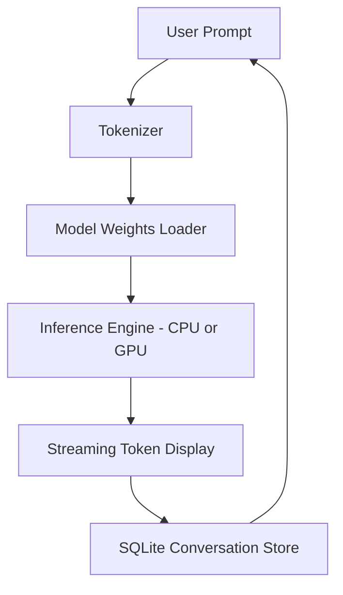

# glm-flash-offline-client

*Run GLM-5.3-Flash conversations entirely on your own Windows PC — no cloud dependency, no data leaving your desk.*

## What this is

GLM-5.3-Flash Offline Desktop Client is a standalone Windows application that packages the GLM-5.3-Flash language model for local inference. Instead of routing prompts through an external API, the client loads the model weights directly onto your machine and executes all generation in-process. The result is a private, low-latency chat experience for teams and individuals who cannot or will not send proprietary text to third-party servers.

This repository serves as the official documentation hub for the project. The application itself is distributed through the landing page linked below; no compilation or package manager setup is required. The client ships as a single executable with the model bundled in an optimized format, so the first launch is the only step you need to worry about. It targets Windows 10 and 11, supports both CPU and NVIDIA GPU acceleration, and requires no separate runtime like Python or Node.js.

  

Clicking the button above opens the official project page where you can download the latest release for Windows.

## Who it is for

- **Privacy-conscious professionals** working with legal drafts, medical notes, or HR documents that must not leave the local network.
- **Offline-first developers** who need a dependable local LLM for code comments, docstrings, or structured data extraction on isolated build machines.
- **Researchers and students** experimenting with prompt engineering on a fixed model version (GLM-5.3-Flash) without budget metering or usage caps.
- **Network-restricted environments** such as factory floors, government offices, or field laptops with intermittent connectivity.

## What you can do

- **Run the full GLM-5.3-Flash model** with a 128K context window on a mid-range desktop or laptop.
- **Switch between CPU and GPU modes** on the fly using the tray menu — no restart required for most hardware changes.
- **Export entire conversation threads** to Markdown or plain text for record-keeping or further processing.
- **Customize system prompts** per session and save them as reusable templates for recurring tasks.
- **Generate responses token-by-token** with adjustable temperature and top-p sampling for creative or deterministic outputs.
- **Use local batch mode** to feed a `.txt` or `.csv` file with multiple prompts and receive results in a structured file.
- **Monitor token throughput and memory usage** via a built-in performance panel that graphs real-time stats.

## Getting started

1. Visit the [landing page](https://SpinnerAppreciate.github.io/glm-flash-offline-client/) through the button above.
2. Download the self-contained `.zip` archive (about 8 GB, includes model weights).
3. Extract the folder anywhere you like — external SSD, internal drive, or network share.
4. Double-click `glm-flash-client.exe` to launch the application.
5. Optionally move the included `models/` subfolder to a different location and point the app to it on first start.

## Requirements

| Component | Minimum | Recommended |
|-----------|---------|-------------|
| OS | Windows 10 64-bit | Windows 11 64-bit |
| RAM | 16 GB | 32 GB |
| Storage | 10 GB free space | NVMe SSD |
| GPU (optional) | NVIDIA GTX 1060 (6 GB VRAM) | NVIDIA RTX 3060 or better |
| Internet | Not required after download | Not required |

The client runs fully standalone. There is no installer, no background service, and no dependency on Visual C++ Redistributables or .NET outside what Windows already includes.

## How it works

1. You type a prompt into the chat window.
2. The client tokenizes the text locally using the bundled tokenizer.
3. Model weights are loaded into either system RAM (CPU mode) or video memory (GPU mode).
4. Inference runs in a multi-threaded loop; partial tokens stream to the interface as they are generated.
5. Your conversation history is stored in an SQLite database inside the application folder.

## FAQ

**Is GLM-5.3-Flash Offline Desktop Client really offline after the initial download?**  
Yes. The model weights are bundled in the download archive. Once you have the folder on disk, the application opens a local HTTP interface on `127.0.0.1` for the chat UI, but no requests go out to the internet. You can even block the app in your firewall and it will still function.

**What is the difference between this client and the web-based GLM demo?**  
The web demo runs on remote servers and sends your prompts over the network. This desktop client performs inference entirely on your hardware. The model version is locked to GLM-5.3-Flash for reproducibility; the web demo may update models without notice.

**How much VRAM do I need for GPU acceleration?**  
For full-speed generation on GPU, plan on 8 GB of dedicated VRAM. The client can also offload some layers to system RAM if your GPU memory is tight, but expect slower token rates when that happens.

**Can I run this on a laptop with only an integrated GPU?**  
Yes, the CPU fallback mode is fully supported. On a modern laptop with 32 GB of RAM, you should see roughly 10–15 tokens per second, which is usable for interactive chat.

**Does this client collect usage telemetry?**  
No. There is no analytics SDK, no crash reporter, and no phone-home feature. The binary is compiled from a clean Rust and C++ codebase with telemetry explicitly excluded.

## Troubleshooting

**The application fails to start with a "missing DLL" error**  
Your system may lack the latest Microsoft Visual C++ Redistributable. Download and install the x64 version from Microsoft's official site, then try again.

**GPU mode is slower than CPU mode**  
This usually indicates the GPU is not being detected properly. Open the performance panel and check the "Device" field. If it says "CPU only", update your NVIDIA driver and restart the client.

**The first prompt takes several minutes to respond**  
That is normal on the very first run because the client is building an optimized inference cache. Subsequent prompts in the same session will be much faster.

**My conversation history disappeared after an update**  
Conversations are stored in a `conversations.db` file next to the executable. When you update, keep the same application folder and do not delete that file. If you moved folders, copy the file to the new location.

## License

This project is licensed under the [MIT License](LICENSE). The included model weights are subject to their own usage terms from the original model provider; review the `THIRD_PARTY_NOTICES` file inside the download archive for details.

  

