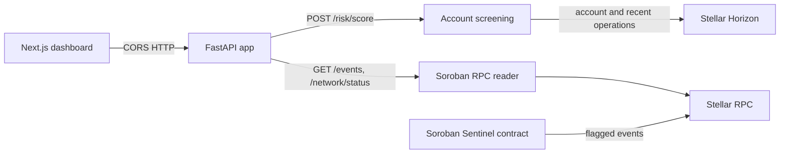

# Stellar Sentinel Backend

[](https://github.com/Stellar-Sentinel/sentinel-backend/actions/workflows/ci.yml)

Read-only FastAPI service for screening Stellar accounts and reading Soroban contract events. It fetches account activity from Horizon, exposes network status and events from Stellar RPC, and does not hold signing keys or submit transactions. Screening scores are transparent heuristics, not proof of fraud or financial/compliance advice.

## Architecture



The backend is an event reader, not a transaction writer. The example configuration points to the current Testnet deployment. Set `CONTRACT_ID` to a deployed contract on the selected network; without it, `/events` returns HTTP 503 rather than fabricated data.

### Current Testnet contract

The configured contract is [`CCZAAZ3FJ7LKZA7E7A6EKQTU2HCNVI3YUVIHKWHSULGZSWAJFS2D2XVX`](https://stellar.expert/explorer/testnet/contract/CCZAAZ3FJ7LKZA7E7A6EKQTU2HCNVI3YUVIHKWHSULGZSWAJFS2D2XVX), initialized with threshold `70`. `GET /events` is connected to its Soroban RPC event stream and currently returns an empty event list; no monitoring agent has been authorized yet. See the contract repository's [Testnet deployment runbook](https://github.com/Stellar-Sentinel/sentinel-contracts#testnet-deployment) for transaction links and redeployment commands.

## Project layout

- `app/main.py` — FastAPI app, CORS, and route registration.
- `app/config.py` — environment-backed settings.
- `app/routers/` — health, screening, and event endpoints.
- `app/stellar.py` — Horizon scoring data and Soroban RPC clients/event decoding.
- `app/agents/pipeline.py` — standalone deterministic scoring utility; the HTTP screening route uses live Horizon data through `app/stellar.py`.
- `tests/test_api.py` — mocked API tests; no external chain calls are required.

## Run locally

Requires Python 3.11 or newer.

```bash
python -m venv .venv
source .venv/bin/activate       # Windows PowerShell: .venv\Scripts\Activate.ps1
pip install -r requirements.txt
cp .env.example .env
uvicorn app.main:app --reload
```

Open [http://localhost:8000/docs](http://localhost:8000/docs). Set the frontend's `NEXT_PUBLIC_API_BASE_URL` to this API origin and allow the frontend origin in `CORS_ORIGINS`.

## Commands

| Command | Purpose |
| --- | --- |
| `uvicorn app.main:app --reload` | Run the development API server. |
| `python -m pytest` | Run tests with mocked Horizon and Soroban RPC responses. |

No Python linter is configured in the repository or CI yet. The CI workflow installs `requirements.txt` and runs `python -m pytest`.

## Configuration

Copy `.env.example` to `.env`; environment variables override file values. Use matching Horizon, Soroban RPC, and network passphrase values for one Stellar network.

| Variable | Default | Purpose |
| --- | --- | --- |
| `HORIZON_URL` | `https://horizon-testnet.stellar.org` | Account and operations data source. |
| `SOROBAN_RPC_URL` | `https://soroban-testnet.stellar.org` | Network status and contract event source. |
| `NETWORK_PASSPHRASE` | `Test SDF Network ; September 2015` | Network identifier returned to the UI. |
| `CONTRACT_ID` | Stellar Sentinel Testnet contract | Deployed contract ID for `/events`; use a contract on the configured network. |
| `ENVIRONMENT` | `development` | Runtime environment label. |
| `REQUEST_TIMEOUT_SECONDS` | `8.0` | Outbound HTTP timeout. |
| `OPERATION_SCAN_LIMIT` | `200` | Maximum recent operations examined (Horizon limit is 200). |
| `ACTIVITY_WINDOW_DAYS` | `7` | Recent activity screening window. |
| `EVENTS_LOOKBACK_LEDGERS` | `50000` | First-page event search window, clamped to RPC retention. |
| `CORS_ORIGINS` | `http://localhost:3000` | Comma-separated browser origins allowed to call the API. |

Do not commit `.env`, account secrets, signing keys, or tokens. The current service requires no secrets.

## Data and scoring limits

The score uses a bounded sample of recent Horizon operations, up to 200, and fixed baseline thresholds. It is not a trained model. RPC event history is provider-limited and is not a complete archive. Configure a persistent indexer for long-term event history.
