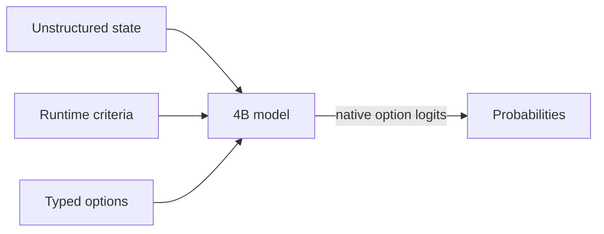

# OpenJev

<div align="center">

**Can we run something like Jev on a 3090 at home?**

**Wow! No waitlist.** [Run it in your browser today.](https://openjev.com)

[](demo/index.html)

*Same frozen 4B model · same state · same 21 questions · measured separately, aligned at t=0 in the replay*

</div>


Most agent decisions are small: *route this*, *retry that*, *does the evidence support X?* A chat model can answer them, but it spends time generating text that software immediately parses back into an `if` statement.

Jev is TypeSafe's closed service for runtime-defined semantic decisions. This project reproduces that **interface pattern** with open models; it does not reproduce Jev's undisclosed model or training.

This baseline reads typed option probabilities directly from a model. No answer sentence, JSON repair, or decoding loop.

## Quick start

Python 3.10+, CUDA, and a GPU that can hold a 4B BF16 model:

```bash
python -m venv .venv
. .venv/bin/activate
export HF_HOME=/path/to/large-drive/huggingface
pip install -e '.[test]'
```

Run the owned examples:

```bash
CUDA_VISIBLE_DEVICES=0 openjev-score \
  --mode direct \
  --model Qwen/Qwen3.5-4B \
  --revision 851bf6e806efd8d0a36b00ddf55e13ccb7b8cd0a \
  --input examples/decisions.jsonl \
  --output results.jsonl
```

Each result contains typed option scores, timing, the exact model revision, and a prompt hash.

If every row has the same exact state, switch to `--mode shared` to prefill it once and evaluate the criteria in parallel.

## How it works



- **Runtime-defined:** criteria and option descriptions arrive with the request.
- **Decision-native:** one forward pass reads declared option logits; no answer token is sampled.
- **Shared-state aware:** one long state can be prefetched once, then branched across many criteria.
- **Auditable:** the owned fixture, exact runners, row-level outputs, revisions, prompts, and known failures are committed.

## Speed

### Decisions versus a compact generated array

Same frozen Qwen3.5-4B, same owned state, same 21 binary criteria, one RTX 3090:

| Output path | Time | Output tokens | Result |
|---|---:|---:|---|
| Direct typed logits, median of 3 | **1.023 s** | **0** | 21 probability pairs |
| Autoregressive JSON array, median of 3 | 5.332 s | 111 | Valid ordered 21-value array |

The compact generative baseline emits only ordered `"yes"`/`"no"` values—no keys, confidence objects, or explanations. Its median first-token time was 0.489 s, but completing the array took **5.21×** as long as direct readout. All three arrays were valid and identical. Their choices agreed with direct argmax on 18/21 criteria, so this is a systems comparison rather than a claim that the two readouts are semantically equivalent. [Exact prompt, outputs, token timeline, and runs](results/raw/decision-vs-compact-array.json) are committed.

### Reusing a state across 21 decisions

On an owned 37-state × 21-criterion workload:

| Execution path | Decisions/s | 777 decisions |
|---|---:|---:|
| Fresh direct scoring | 2.33 | 333.1 s |
| Serial prefix reuse | 10.75 | 72.3 s |
| Parallel suffixes | **20.03** | **38.8 s** |
| Native reranker | 1.86 | 417.3 s |

The owned [37×21 fixture](benchmarks/data/shape777.jsonl), [direct/reuse runner](benchmarks/shape777.py), [reranker runner](benchmarks/shape777_reranker.py), [raw timings](results/raw/shape777-direct.json), and [row-level predictions](results/raw/shape777-direct.predictions.jsonl) are included. The fast reuse paths are experimental: BF16 execution changed 5–6 of 777 argmaxes relative to fresh scoring.

## Quality

| Frozen workload | Rows | Direct logits | Native reranker | Published Jev |
|---|---:|---:|---:|---:|
| Authored decisions, balanced accuracy | 144 | **0.813** | 0.625 | — |
| WANLI, balanced accuracy | 256 | **0.637** | 0.522 | — |
| TypeSafe selected subset, modal agreement | 102 across 20 cases | **0.845** | 0.560 | 0.883 |
| Every judgment grid, accuracy | 36 | **0.806** | 0.694 | — |

The reranker remained strong at retrieval ranking, but direct logits were the better general-decision baseline.

The Jev number is read from TypeSafe's published records; we did not run a live Jev endpoint. The comparison covers the 102 rows that could be aligned from public artifacts, not TypeSafe's reported 711-row aggregate.

## Input

```json
{
  "id": "route-1",
  "state": "Customer cannot access an account after a password reset.",
  "question": "Which queue should handle this request?",
  "options": [
    {"id": "access", "description": "Account access support."},
    {"id": "billing", "description": "Billing support."}
  ]
}
```

Returned probabilities are conditional on the supplied options. Calibrate and validate them on the workload where they will make decisions.
`state` may also be a nonempty JSON object or array. Direct modes preserve it as structured JSON; reranker mode renders it as document text.

## Documentation

- [Results](docs/RESULTS.md) — quality, speed, perturbations, and claim boundaries
- [Method](docs/METHOD.md) — frozen prompts, metrics, and timing scope
- [Reproduce](docs/REPRODUCE.md) — exact environment, pinned commands, perturbations, and verification
- [Interactive replay](demo/index.html)
- [Browser-only WebGPU demo](webgpu-demo/index.html) — no waitlist; use it today
- [Machine-readable summary](results/phase1-summary.json)
- [Benchmark bundle](benchmarks/README.md) — fixtures, runners, selection IDs, and reproduction commands
- [Raw results and checksums](results/raw/)
- [Third-party sources](THIRD_PARTY.md)

## Evaluation sources

- [TypeSafe public evaluations](https://evals.typesafe.ai/) — public comparison cases used for selected-subset agreement
- [Every parallel judgment lab](https://typesafe-parallel-judgment-lab.every-4573.chatgpt.site/) and its [downloadable experiment data](https://typesafe-parallel-judgment-lab.every-4573.chatgpt.site/downloads/experiments.json)
- [WANLI](https://huggingface.co/datasets/alisawuffles/WANLI) — external natural-language inference check
- [Qwen3.5-4B](https://huggingface.co/Qwen/Qwen3.5-4B) and [Qwen3-Reranker-4B](https://huggingface.co/Qwen/Qwen3-Reranker-4B) — frozen baseline models

This is an independent research project. Model weights and third-party records without a redistribution grant are excluded; immutable selection IDs and fetch manifests are included. Upstream models retain their licenses. Project code is released under the [MIT License](LICENSE).
