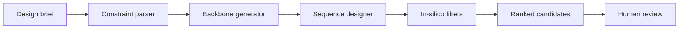

# NovoWeave

[](#project-status)
[](pyproject.toml)
[](LICENSE)
[](SECURITY.md)

**A conceptual generative protein-design framework.** NovoWeave is a
research-oriented software blueprint for weaving backbone generation, sequence
design, evaluation, and provenance into one end-to-end deep-learning workflow.
It presents the architecture, interfaces, configuration system, and engineering
conventions that a production project could use


## Why this repository exists

Protein-design projects often mix data ingestion, geometric modeling, sequence
generation, ranking, and experiment tracking in one code path. This blueprint
separates those concerns behind small, testable contracts so researchers can
discuss system design before committing to an implementation.

## Conceptual workflow



The conceptual pipeline has four replaceable stages:

1. **Backbone proposal** — a diffusion-style geometric model interface.
2. **Sequence design** — a structure-conditioned transformer interface.
3. **Evaluation** — confidence, geometry, and diversity metric contracts.
4. **Selection** — auditable multi-objective ranking with human review gates.

## Repository layout

```text
configs/                 Example experiment configurations
docs/                    Architecture, model card, and research scope
src/novoweave/           Typed Python package and pseudocode interfaces
tests/                   Contract tests for implemented scaffolding
.github/                 CI and community health files
```

## Illustrative usage

The following snippet documents the intended API. It is not an executable
protein-design example.

```python
from novoweave import DesignBrief, DesignPipeline

brief = DesignBrief(
    name="example_scaffold",
    length=120,
    objective="Demonstrate the software contract only",
)

pipeline = DesignPipeline.from_config("configs/base.yaml")
result = pipeline.design(brief)  # intentionally raises NotImplementedError
```

The planned command-line surface is similarly illustrative:

```bash
novoweave validate-config configs/base.yaml
novoweave design --config configs/base.yaml --brief examples/brief.yaml
```

## Project status

This is a **conceptual scaffold / design document in code form**, not a model
release. The following are deliberately absent:

- trained weights, datasets, and downloadable checkpoints;
- working tensor kernels, loss functions, or samplers;
- experimentally validated scoring functions;
- synthesis instructions or biological claims;
- benchmark results.

Implemented pieces are limited to configuration/data contracts, boundary
validation, logging conventions, and repository tooling. See
[the roadmap](docs/ROADMAP.md) for a hypothetical implementation sequence.

## Design principles

- **Explicit scientific boundaries:** interfaces distinguish hypotheses from
  validated outputs.
- **Reproducibility by construction:** every planned run records configuration,
  code revision, seed, and provenance.
- **Modular research:** geometry, sequence, evaluation, and ranking components
  can evolve independently.
- **Responsible defaults:** no autonomous wet-lab handoff and no claims of
  safety or efficacy.

## Development

For repository and documentation work only:

```bash
python -m pip install -e ".[dev]"
pytest
ruff check .
```

These checks validate the scaffold; they do not test protein-design capability.
See [CONTRIBUTING.md](CONTRIBUTING.md) before proposing changes.

## Citation

If this blueprint is useful in a discussion or teaching context, cite the
repository metadata in [CITATION.cff](CITATION.cff).

## License

Released under the [MIT License](LICENSE). Scientific validity, fitness for a
particular purpose, and biological safety are explicitly not warranted.
