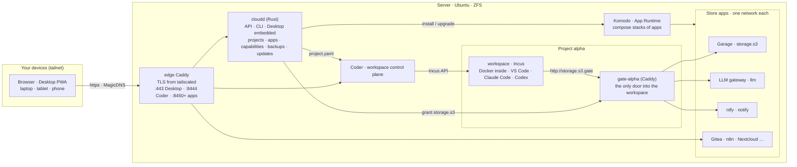

<p align="center">
  
</p>

<p align="center">
  <a href="#quick-start"></a>
  <a href="cloudd/"></a>
  <a href="desktop/"></a>
  <a href="store/"></a>
  <a href="LICENSE"></a>
  
</p>

**AgentVerse OS** is a personal cloud operating system for a developer and their AI agents: your own cloud running on a single server,
used from any device through the browser. It is built as a cross-platform vibe coding flow: the same desktop, workspaces and agents
open on a laptop, a tablet or a phone, the workspace and its agents stay on the server, and the work continues where you left it.
One command installs it on a clean Ubuntu; everything after that happens in the browser: a windowed desktop, isolated workspaces with
VS Code and agents (Claude Code, Codex), a store of 944 self-hosted apps, backups and updates. Nothing is exposed to the internet:
access goes through Tailscale with real certificates, no root CAs to install on your devices.

> The project is in alpha and lives on a single test box. It works as a personal server for one person; there are no user accounts or
> permissions yet. See [Status](#status) for what is done and what is not.

## What it looks like

<p align="center">
  
</p>
<p align="center"><sub>Desktop on a computer: the Store catalog, a project card with its workspace and capabilities, widgets. Monolith theme, glass surfaces.</sub></p>

<table>
  <tr>
    <td width="50%" valign="top">
      
      <p align="center"><sub>Light theme: projects and appearance settings. Seven presets, including OLED and high contrast.</sub></p>
    </td>
    <td width="50%" valign="top">
      
      <p align="center"><sub>Tablet: the same windows and widgets, portrait wallpaper.</sub></p>
    </td>
  </tr>
</table>

<p align="center">
  
</p>
<p align="center"><sub>Phone: a home screen instead of a desktop, full-screen windows, PWA. One Desktop adapts to the device.</sub></p>

## What it does

- **Projects and workspaces.** Every project gets its own network, its own gate and an isolated Incus container with Docker inside.
  Inside: VS Code in the browser, a terminal and agents; Claude Code and Codex log in with your subscriptions. Stop/start keeps the
  instance, resources are changed from the project card.
- **A Store of 944 apps.** The Runtipi, Coolify and Umbrel catalogs merged into one, with source badges. Guided install, login
  credentials right in the card, logs, automatic repair of data-directory permissions, links between apps (e.g. n8n → LiteLLM),
  per-app snapshots and rollback.
- **Capabilities instead of addresses.** A project asks for `storage.s3`, `llm` or `notify`; the core connects the project's gate to
  the provider's network and drops environment variables into the workspace. Swapping Garage for another S3 does not touch the project.
- **Browser only.** The first-run wizard joins Tailscale via a link or QR code, checks DNS and the certificate, creates the first project.
  System and app updates come from the Updates window: a package with automatic rollback if the new version does not come up.
- **Backups.** Scheduled ZFS snapshots and a restic repository taken from a snapshot; roll back a single app in two clicks. Off by default.
- **A desktop like a desktop OS.** Windows, taskbar, start menu, widgets (monitor, clock, news, weather, projects), Files over app data
  and workspace homes, Passwords & Access, themes and wallpapers, boot screen, offline overlay, screensaver. The UI speaks English,
  Russian, Ukrainian and Spanish; the language follows the browser or is set once for all devices.
- **Two assistants already in the catalog.** Hermes Agent with a web panel, and Pipecat Voice, a voice assistant in the browser with local
  speech recognition and synthesis. Voice control of the system itself is on the roadmap.

## Architecture



The core is small: seven entities (project, workspace, gate, app, capability, grant, route) and four contracts. Everything else is
proven third-party software: Coder runs the workspaces, Incus isolates them, Komodo deploys compose stacks, Caddy holds the entry
point, Tailscale provides the network and certificates.

## Quick start

You need a clean Ubuntu 22.04+ (tested on 26.04), 8 GB of RAM or more, preferably a separate disk for ZFS, and a Tailscale account.

From the [release package](https://github.com/agentverse-os/AgentVerse-OS/releases), nothing to build:

```bash
curl -LO https://github.com/agentverse-os/AgentVerse-OS/releases/download/v0.2.0/agentverse-os-0.2.0-x86_64.tar.gz
mkdir agentverse-os && tar xzf agentverse-os-0.2.0-x86_64.tar.gz -C agentverse-os && cd agentverse-os
sudo DISKS="/dev/disk/by-id/<disk for ZFS>" bootstrap/install.sh
```

Or from source:

```bash
git clone https://github.com/<owner>/agentverse-os && cd agentverse-os
cd desktop && npm install && npm run build && cd ..        # Desktop → cloudd/static
cd cloudd && cargo build --release && cd ..                # core with the Desktop embedded
sudo DISKS="/dev/disk/by-id/<disk for ZFS>" bootstrap/install.sh
```

The installer goes step by step: host checks → ZFS → Docker and Incus → **Tailscale** (a link and QR code to authorize the node, waits
for your confirmation, checks MagicDNS and HTTPS Certificates) → Coder → Komodo → edge → core → catalog → template → summary with
addresses. A checkout can also install from a package instead of a locally built binary: `PACKAGE=agentverse-os-<version>-<arch>.tar.gz`
(a file or an https URL); packages are built by `scripts/release.sh`.

When it finishes, open `https://<node>.<tailnet>.ts.net/` and the first-run wizard completes the setup in the browser. Updates come
from the Updates window or `sudo agentverse-update`; the update channel is the `stable.json` of the latest release, e.g.
`https://github.com/agentverse-os/AgentVerse-OS/releases/download/v0.2.0/stable.json`.

## Repository

| Directory | Contents |
|---|---|
| [`cloudd/`](cloudd/) | the core in Rust (axum, rusqlite, bollard): the `/api/*` API (60 routes, OpenAPI at `/api/openapi.json`), CLI, embedded Desktop; adapters for Incus, Docker, Coder, Komodo, Caddy; backups, updates, first-run wizard |
| [`desktop/`](desktop/) | the Desktop in Svelte 5 and Vite, PWA: windows, widgets, Store, Files, Passwords, Settings; dictionaries for four languages in `src/lib/i18n/`; `npm run build` outputs to `cloudd/static/` |
| [`store/`](store/) | app manifests: `manifest.yaml` + `compose.yaml`; 938 imported from Runtipi, Coolify and Umbrel, 6 hand-written; `recommended.yaml` |
| [`bootstrap/`](bootstrap/) | `install.sh`, `update.sh` (installed as `agentverse-update`), compose files for edge / Coder / Komodo / docker-proxy, host scripts, systemd unit |
| [`templates/incus/`](templates/incus/) | the Coder → Incus workspace template |
| [`assets/`](assets/) | the Monolith mark, lockups, PWA icons, wallpapers, font, screenshots; `build.py` assembles everything into `desktop/public` |
| [`scripts/`](scripts/) | `release.sh` builds the update package and channel manifest; `demo/` holds demo data and the screenshot pipeline for this README |
| [`tests/`](tests/) | end-to-end tests on the live test box, shell tests for the installer; Desktop e2e with Playwright lives in `desktop/e2e/` |

## Development

```bash
cd cloudd && cargo test                       # 40 unit tests: contracts, gate and edge rendering, storage, updates
cd desktop && npm run dev                     # Vite with /api proxied to cloudd (CLOUDD_URL)
cd desktop && npm run check                   # svelte-check, including dictionary keys across the four languages
tests/shell/install_functions_test.sh         # installer functions against a tailscale shim, no sudo needed
sudo tests/e2e-stand.sh                       # on the test box: full scenario against live Incus, Docker, Coder, Komodo
```

The Desktop is embedded into the core binary with rust-embed: after `npm run build`, rebuild `cloudd`. Desktop e2e tests run on the
test box inside a Playwright container; see the headers of the tests in `desktop/e2e/`.

## Status

| Done and verified on the test box | Partial | Not yet |
|---|---|---|
| core, projects, workspaces, capabilities, gate | voice: the assistant talks but does not control the system | user accounts and permissions, a second user |
| Store, install, links, logs, permission repair, snapshots, app updates | backups: no remote repository, no whole-system restore | a Host section in the UI: reboot, disks, core logs |
| Desktop on three devices and three browser engines, themes, wallpapers | a from-scratch install has been verified step by step, not in one run | |
| Tailscale, first-run wizard, self-update with rollback, update channel on GitHub Releases | UI in four languages; messages from the core (events, API errors) are Russian only | |

## License

Apache-2.0. The apps in the Store belong to their authors and ship under their own licenses; this repository only holds manifests and
compose files imported from the open Runtipi, Coolify and Umbrel catalogs.
