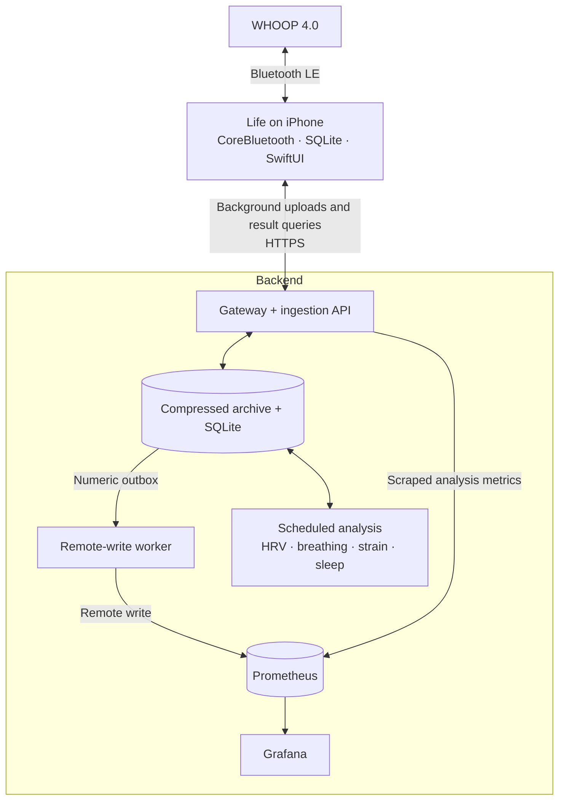

# Life

Personal health telemetry, stored on your own server. Life connects directly to a
WHOOP 4.0 over Bluetooth, buffers readings on your iPhone, and uploads over Tailscale
to a backend with Prometheus and Grafana. No WHOOP account or subscription is required.

<table>
  <tr>
    <td width="28%" valign="top"></td>
    <td width="72%" valign="top"></td>
  </tr>
</table>

The Grafana screenshot shows an earlier UI prototype with placeholder HRV, strain,
and sleep scores. Current app and dashboard scores use recorded data.

## Architecture



The phone saves history before acknowledging it to the strap. The backend saves each
upload before acknowledging it to the phone; Prometheus export happens separately.
Original packets remain archived for later decoding. [Bluetooth flow and packet layouts](docs/BLUETOOTH.md).

## Feature parity

Life covers part of the WHOOP 4.0 app's functionality. **Available** means implemented,
not equivalent physiological accuracy or the same scoring algorithm.

| Feature | Life | Implementation / difference |
| --- | --- | --- |
| Live heart rate and history | Available | Local charts, automatic reconnection and stored-history backfill. |
| Battery | Available | Standard and custom readings must agree before publication. |
| HRV | Partial | Five-minute PPG RMSSD; whole-night summaries need sufficient qualifying coverage. |
| Skin temperature | Available | Wrist temperature and a baseline from prior logged nights; not core temperature. |
| Blood oxygen / SpO₂ | Partial | Device-calculated values; missing, error and ambiguous `98` results are withheld. |
| Respiratory rate | Experimental | Estimated from qualifying pulse timing. No device-calculated breathing field identified. |
| Strain | Custom | Recorded cardiovascular load mapped to Life's own 0–21 scale; no muscular strain. |
| Sleep | Manual | Editable bedtime/wake history and duration / chosen target; no automatic detection or stages. |
| Resting heart rate | Partial | Median heart rate during logged sleep; not WHOOP's RHR algorithm. |
| Recovery, stress, steps, calories, workout detection, haptic alarm | Not implemented | No substitute scores or automatic classifications. |
| Private storage and dashboards | Available | Local archive, Prometheus, Grafana and authenticated result APIs. |

See [scoring methods](docs/SCORING.md) and [comparison scope and sources](docs/BLUETOOTH.md#feature-comparison-scope).

## Signals we decode

| Signal | Source | Use |
| --- | --- | --- |
| Heart rate and contact flags | Standard BLE Heart Rate Measurement; HR also in R24 history | Live charts and timestamped HR metrics; live contact flags and zero-HR checks filter invalid readings. |
| Battery percentage | Standard BLE Battery Level + custom battery response | Cross-checked battery metric. |
| Ordered pulse intervals | R24 history, up to four millisecond intervals per record | Inputs to HRV and respiratory analysis; raw words remain archived. |
| Wrist temperature | R24 signed word at byte `76`, divided by `10` | Firmware-gated °C reading and overnight baseline. |
| SpO₂ result / status | R24 byte `86` | Firmware-gated oxygen value with explicit invalid-code handling. |
| Motion and optical channels | Candidate R10/R11/R21 research layouts | Raw counts only; axes, wavelengths, scaling and accuracy remain unvalidated. |
| Events, commands, unknown fields and R25 history | Custom BLE notifications | Archived for research; unknown bytes do not become health metrics. |

Firmware-derived temperature, oxygen and interval interpretations currently target
**WHOOP 4.0 / Harvard 41.17.4.0**. Standard live BLE interval words are preserved but
are not used for HRV because their units and continuity remain unverified.
[Full GATT map, decoding status and source files](docs/BLUETOOTH.md#decoded-and-archived-signals).

## Run the backend

Use a Linux server with Docker, Docker Compose, Python 3, and Tailscale installed.
Clone this repository into a persistent directory, then run:

```sh
cd life
./life setup
sh scripts/bootstrap_pc.sh
```

The bootstrap enables Docker at boot and configures Docker group access and the
Tailscale operator. Open a new terminal or SSH session afterward, then run:

```sh
./life start
./life expose
./life status
```

`./life start` starts the backend, analysis, Prometheus, Grafana and any additional
integrations. Services restart after a reboot once Docker is running. Data lives in
`data/`; credentials and machine settings stay out of Git.

Grafana is available at your private Tailscale URL. Its initial username is `admin`
(configurable in `.env`), with the password in `secrets/grafana_password`.
The iPhone endpoint is `https://YOUR-TAILSCALE-HOST/v1/batches`, using the token in
`secrets/ingest_token`.

Use `./life logs`, `./life stop`, and `./life backup` for routine operations.

## Build the iPhone app

Requires full Xcode, XcodeGen, and an iPhone running iOS 17 or later.

```sh
cp Config/Local.xcconfig.example Config/Local.xcconfig
# Set your bundle identifier and signing team in Config/Local.xcconfig.
xcodegen generate
open Life.xcodeproj
```

Enable Developer Mode on your iPhone and run the **Life** scheme. Enter the backend
URL and token in Settings, then connect your WHOOP. Set your maximum heart rate and
sleep target under **Strain & sleep → Set up**.

Keep the same bundle identifier when updating an existing installation. iOS controls
background execution; reopen Life after force-quitting it.

## Development

```sh
swift test
swift run CoreChecks
python3 scripts/check_backend.py
```

Additional integrations live under `integrations/<name>/compose.yaml` and join the
same `./life start` command. WHOOP 4.0 is the only implemented device integration.

- [Architecture](DESIGN.md) · [Operations and backups](docs/OPERATIONS.md)
- [Strain and sleep methods](docs/SCORING.md) · [HRV](docs/HRV.md)
- [Temperature](docs/TEMPERATURE.md) · [Breathing and oxygen](docs/RESPIRATION-OXYGEN.md)
- [Reliability](docs/RELIABILITY.md) · [Validation](docs/VALIDATION.md)
- [Protocol research](docs/PROTOCOL-RESEARCH.md) · [Public release preparation](docs/PUBLIC-RELEASE.md)

Life is an independent project, unaffiliated with WHOOP.
