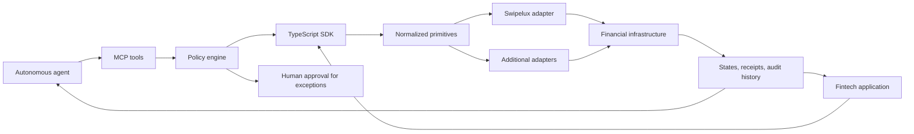

<div align="center">

# Neobank Primitives

### Agent-native financial primitives for fintechs and software that can act.

Build accounts, identity flows, deposits, payouts, wallet transfers, and compliance-aware operations on a provider-neutral contract. Start with the working neobank demo; extend it into policy-controlled MCP tools and a TypeScript SDK.

[](https://neobank-starter.vercel.app/)
[](https://www.typescriptlang.org/)
[](https://react.dev/)
[](#project-status)

[Run locally](#run-it-locally) · [Explore the primitives](#the-primitive-surface) · [See the architecture](#agent-native-architecture) · [Read the roadmap](#project-status)

</div>


## Money movement should be composable

Most financial APIs expose endpoints. Autonomous software needs a safer abstraction: explicit intent, policy evaluation, normalized execution, durable state, and receipts it can reason about.

Neobank Primitives is building that layer for two consumers:

- **Fintech applications** that want reusable identity, account, balance, and transaction building blocks.
- **AI agents** that need narrowly scoped financial tools, machine-readable outcomes, and human approval when policy requires it.

The repository is useful now as a fully interactive neobank starter with realistic demo data and a Swipelux sandbox integration. The MCP server, standalone SDK, policy engine, and full KYB surface described below are the direction of the project and are **not yet shipped as a production runtime**.

## The primitive surface

| Primitive | Working product flow | Target MCP + SDK contract |
| --- | --- | --- |
| **Identity** | Customer onboarding and KYC state | Create, retrieve, and monitor customer identity |
| **Businesses** | Business account persona | Create organizations and track KYB requirements |
| **Accounts** | Fiat accounts, stablecoin wallets, and balances | Provision and query normalized financial accounts |
| **Transactions** | Quotes, bank payouts, and wallet transfers | Quote, authorize, execute, and inspect money movement |
| **Storage** | Local demo ledger and provider-backed state | Persist normalized operation state, receipts, and metadata |
| **Controls** | Human-readable execution explainers | Evaluate policies, require approval, and expose audit history |

The contract is designed to stay provider-neutral. **Swipelux is the first adapter**, not the shape every integration must inherit.

## A working financial product, not a static mock

Demo mode runs without credentials and remains interactive across personal and business accounts, onboarding, deposits, payouts, and wallet transfers. Turn on **How it works** to see the financial steps behind each product action.

<table>
  <tr>
    <td width="33%" align="center">
      
      <br /><sub><b>Business accounts</b> · fiat and stablecoin balances</sub>
    </td>
    <td width="33%" align="center">
      
      <br /><sub><b>Identity</b> · KYC and account provisioning</sub>
    </td>
    <td width="33%" align="center">
      
      <br /><sub><b>Deposit rails</b> · SEPA and USDC</sub>
    </td>
  </tr>
  <tr>
    <td colspan="3" align="center">
      
      <br /><sub><b>Transaction execution</b> · quote, compliance context, conversion, and payout</sub>
    </td>
  </tr>
</table>

## Agent-native architecture

Agents should not receive an unrestricted payment endpoint. They should receive constrained tools backed by the same typed SDK used by the application, with policy checks between intent and execution.



Every operation follows the same lifecycle:

```text
validate intent → evaluate policy → authorize → execute → normalize → audit
```

The target contract treats idempotency, limits, destination rules, approvals, status, and receipts as first-class concerns—not application-specific afterthoughts.

### What an agent call should look like

> Target interface — illustrative, not yet part of the published runtime.

```json
{
  "name": "transactions.quote",
  "arguments": {
    "sourceAccountId": "acct_operating_eur",
    "destination": { "type": "bank_recipient", "id": "rcpt_maria" },
    "amount": { "value": "250.00", "currency": "EUR" },
    "purpose": "invoice_payment",
    "idempotencyKey": "inv_2041_quote"
  }
}
```

The tool response should give the agent enough information to make the next bounded decision:

```json
{
  "status": "approval_required",
  "quoteId": "quote_01",
  "recipientGets": { "value": "247.75", "currency": "EUR" },
  "fee": { "value": "2.25", "currency": "EUR" },
  "policy": {
    "decision": "review",
    "reason": "new_destination"
  },
  "expiresAt": "2026-07-13T18:30:00Z"
}
```

## Policy-controlled autonomy

The intended safety model is simple:

1. An application or agent submits a structured financial intent.
2. Policy validates identity state, permissions, limits, destination rules, purpose, and idempotency.
3. Allowed operations execute automatically; exceptions pause for an authorized human.
4. The adapter returns normalized status, provider references, receipts, and audit events.

This makes autonomy configurable instead of binary. A treasury agent might rebalance approved wallets automatically while a first-time bank recipient always requires review.

## Run it locally

```bash
git clone https://github.com/andry-lebedev/neobank-primitives.git
cd neobank-primitives
npm install
npm run dev
```

No `.env` file is required for demo mode. Open the local URL, switch between personal and business personas, onboard a customer, add funds, request a payout quote, and inspect the execution story.

### Connect the first adapter

Click **Go live** in the app and provide a Swipelux sandbox API key. The key is held in the browser session and the same screens switch from realistic local data to the live adapter.

The existing integration lives under [`src/data/live`](src/data/live), behind the same `DataSource` contract used by the demo implementation. Provider documentation: [Swipelux API reference](https://platform.swipelux.com/api-reference) · [Swipelux docs](https://docs.swipelux.com)

## Project status

| Area | Available now | Next |
| --- | --- | --- |
| Product demo | Personal + business personas, onboarding, balances, deposits, payouts, transfers, activity | More operational and approval workflows |
| Identity | Customer onboarding and KYC product states | Full KYB primitives and requirement handling |
| Integrations | Demo data source and Swipelux sandbox adapter | Additional provider adapters |
| Developer surface | Typed in-app domain and `DataSource` boundary | Published TypeScript SDK |
| Agent surface | Human-readable operation explainers | MCP server backed by the SDK |
| Controls | Explicit demo/live modes and operation events | Policy engine, approval queue, durable receipts, audit API |

This is an early build. Do not use demo addresses for real funds, and do not treat the current UI as a production compliance or custody system. Production users remain responsible for provider onboarding, credentials, jurisdictional requirements, policy configuration, and operational controls.

## Make the starter yours

The UI is intentionally easy to fork. Give the following prompt to a coding agent after cloning:

```text
Read AGENTS.md and PROMPT.md, then adapt this neobank starter to my product.
Ask for my company name, audience, and brand direction. Work on a new branch,
keep financial flows and tests intact, edit the documented brand surfaces first,
run the quality checks, and show me the finished local app.
```

Brand-only changes are concentrated in `src/theme.css` and `src/brand.config.ts`. Feature extensions should preserve the domain boundary so future SDK and MCP surfaces can share the same primitives.

## Quality commands

```bash
npm test
npm run lint
npm run typecheck
npm run build
```

## Contributing

The most valuable contributions strengthen the primitive boundary: normalized transaction states, adapter contracts, policy decisions, approvals, receipts, KYB requirements, and deterministic demo scenarios. Open an issue before making a large architectural change so the application, SDK, and MCP direction stay aligned.

---

<div align="center">
  <b>Build financial products for humans. Expose financial primitives to agents.</b>
</div>
