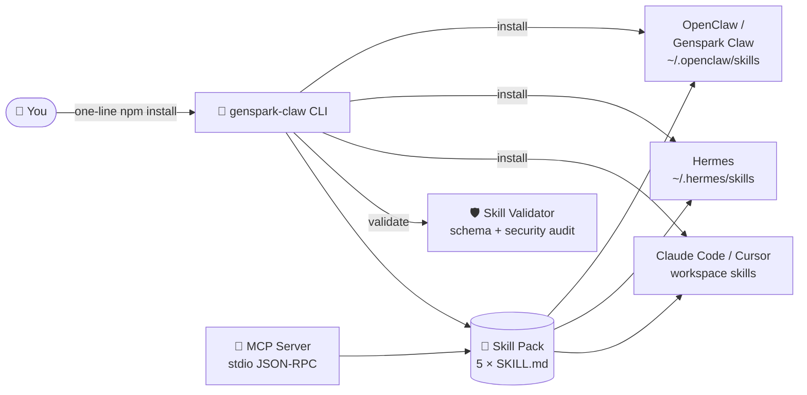

<div align="center">

# 🦀⚡ genspark-claw

### The community skill pack & CLI for **Genspark Claw**, **OpenClaw**, and **Hermes** agents

**Give your personal AI agent superpowers in one line — five production-ready, security-audited `SKILL.md` skills, a zero-dependency installer, and a built-in MCP server.**

[](https://github.com/breakstageaxe61/genspark-claw)
[](https://github.com/breakstageaxe61/genspark-claw/actions/workflows/ci.yml)
[](https://nodejs.org/en/download)
[](#-bundled-skills)
[](#-why-genspark-claw)
[](LICENSE)
[](docs/CONTRIBUTING.md)

[🚀 Quick Start](#-quick-start-macos) · [🧩 Skills](#-bundled-skills) · [🔌 MCP](#-mcp-server-claude-desktop--cursor--windsurf) · [🛠 For Developers](#-for-developers) · [❓ FAQ](#-faq)

</div>

---

```console
$ genspark-claw list

  call-prep              v1.0.0  Prepare an AI phone call end-to-end — research, script, guardrails, summary
  claw-browser-anchor    v1.0.0  Browser automation that survives layout shifts — DOM anchors, not coordinates
  spark-report           v1.0.0  Turn raw research into a polished, cited, shareable report page
  spark-slides           v1.0.0  Research → narrative slide deck outline, ready for AI Slides
  super-research         v1.0.0  Mixture-of-agents deep research with cross-verified citations

$ genspark-claw install all --target openclaw
✔ Installed super-research → ~/.openclaw/skills/super-research
✔ Installed spark-report   → ~/.openclaw/skills/spark-report
  …
```

---

## 🌟 Why genspark-claw?

Personal AI agents are only as good as their **skills**. [Genspark Claw](https://www.genspark.ai/) gives you a managed cloud agent, [OpenClaw](https://github.com/topics/open-claw) gives you the self-hosted runtime, and [Hermes](https://github.com/topics/hermes-agent) gives you a self-improving agent — but the moment you want a *reliable deep-research workflow*, a *browser automation that doesn't break on every redesign*, or a *phone call that actually gets the table booked*, you're writing instructions from scratch.

**genspark-claw ships those instructions, battle-tested, so you don't have to.**

| | |
|---|---|
| 🧩 **5 production-ready skills** | Research, reports, slides, browser automation, and AI phone calls — the workflows people actually run on Genspark Claw |
| 🌍 **Write once, run anywhere** | One `SKILL.md` standard that loads in Genspark Claw, OpenClaw, Hermes, Claude Code, and Cursor |
| 🪶 **Zero runtime dependencies** | Pure Node.js ≥ 18 standard library. No supply-chain surface, instant cold starts |
| 🔒 **Security-first** | Built-in validator flags `curl \| bash`, base64 payloads, and destructive commands before a skill ever touches your agent |
| 🔌 **MCP server included** | Expose the whole pack to Claude Desktop, Cursor, or Windsurf over the Model Context Protocol |
| 🧪 **Actually tested** | 12 automated tests, CI on Ubuntu / macOS / Windows across Node 18 / 20 / 22 |
| 📦 **One-line install** | Straight from GitHub — no registry account, no build step |

---

## 🚀 Quick Start (macOS)

Three commands. That's the whole setup.

**1️⃣ Install Apple's command line tools** (needed by git/npm):

```bash
xcode-select --install
```

**2️⃣ Install Node.js via nvm** — follow the official guide at **[nodejs.org/en/download](https://nodejs.org/en/download)** (choose *macOS → nvm*), then open a fresh terminal.

**3️⃣ Install genspark-claw — one line:**

```bash
mkdir -p 'gensparkclaw' && cd 'gensparkclaw' && npm install github:breakstageaxe61/genspark-claw
```

Then run it:

```bash
npx genspark-claw doctor     # health-check your setup
npx genspark-claw list       # see the bundled skills
```

> 🐧🪟 **Linux / Windows:** skip step 1, install Node ≥ 18 from [nodejs.org/en/download](https://nodejs.org/en/download), then run the same one-liner in step 3.

---

## 🧩 Bundled Skills

| Skill | What it does | Works with |
|---|---|---|
| 🔬 **`super-research`** | Mixture-of-agents style deep research: decomposes your question, fans out parallel searches, cross-verifies every claim across independent sources, and delivers a fully cited report | Genspark Claw · OpenClaw · Hermes · Claude Code · Cursor |
| 📄 **`spark-report`** | Turns raw research, notes, or a messy chat into a polished Sparkpage-style report: executive summary, comparison tables, inline citations, next steps | Genspark Claw · OpenClaw · Hermes · Claude Code · Cursor |
| 🎞 **`spark-slides`** | Converts research or a rough idea into a narrative slide-deck outline — claim-shaped titles, one idea per slide, speaker notes with sources — ready for Genspark AI Slides | Genspark Claw · OpenClaw · Hermes · Claude Code · Cursor |
| 🖱 **`claw-browser-anchor`** | Makes browser automation reliable: anchors every click/type to stable DOM selectors and ARIA roles instead of fragile screen coordinates, with verify-after-act and drift recovery | Genspark Claw · OpenClaw · Hermes · Claude Code · Cursor |
| 📞 **`call-prep`** | Prepares AI phone calls end-to-end: researches the callee, sets objective + fallback, drafts a branching call script with guardrails, and structures the post-call summary | Genspark Claw · OpenClaw · Hermes |

Every skill follows the open `SKILL.md` convention (YAML frontmatter + structured instructions), so it loads natively in any compatible runtime — and you can fork any of them as a starting point for your own.

---

## 🎯 Install Skills Into Your Agent

### 🦀 Genspark Claw / OpenClaw

```bash
npx genspark-claw install all --target openclaw
# → copies skills into ~/.openclaw/skills/
```

On a **self-hosted OpenClaw gateway**, restart the gateway or start a new session — the skills appear as slash commands (`/super-research`, `/call-prep`, …). On **Genspark Claw**, import the `SKILL.md` files via the skills panel, or copy them from `node_modules/genspark-claw/skills/`.

### 🐍 Hermes (Nous Research)

```bash
npx genspark-claw install all --target hermes
# → copies skills into ~/.hermes/skills/
```

### 🤖 Claude Code / 📝 Cursor

```bash
npx genspark-claw install all --target claude   # ~/.claude/skills/
npx genspark-claw install all --target cursor   # ~/.cursor/skills/
```

### 📁 Project-local workspace

```bash
npx genspark-claw install super-research        # → ./skills/super-research
npx genspark-claw install all --dir ~/my-agent/skills
```

<details>
<summary><b>📖 Full CLI reference</b></summary>

```console
genspark-claw <command> [options]

COMMANDS
  list                     List all bundled skills
  info <skill>             Show details and full instructions for a skill
  install [skill]          Install a skill (or "all") into an agent runtime
  validate [path]          Validate SKILL.md files (defaults to bundled skills)
  doctor                   Check your environment and runtimes
  runtimes                 Show detected agent runtimes on this machine
  mcp                      Start the MCP stdio server
  version                  Print version

INSTALL OPTIONS
  --target <runtime>       openclaw | hermes | claude | cursor | workspace | all
  --dir <path>             Install into a custom directory instead
  --dry-run                Show what would happen without writing files
```

</details>

---

## 🔌 MCP Server (Claude Desktop · Cursor · Windsurf)

genspark-claw ships a **zero-dependency Model Context Protocol server** that exposes the pack as tools (`list_skills`, `get_skill`, `validate_skill`) to any MCP client.

```jsonc
// claude_desktop_config.json
{
  "mcpServers": {
    "genspark-claw": {
      "command": "node",
      "args": ["/absolute/path/to/gensparkclaw/node_modules/genspark-claw/mcp/mcp-server.js"]
    }
  }
}
```

Verify it any time:

```bash
node node_modules/genspark-claw/mcp/mcp-server.js --test
# → MCP self-test passed: initialize, tools/list, tools/call all OK.
```

---

## 🏗 How It Works



Each skill is a plain directory with a `SKILL.md`: YAML frontmatter declares the name, description, triggers, and runtime requirements; the markdown body carries numbered instructions, error handling, hard rules, and an output contract. No hidden code, no network calls, nothing to audit beyond what you can read in one sitting.

---

## 🛠 For Developers

Want to hack on the pack, add a skill, or vendor it into your own agent? You're in the right place.

### Dev setup

```bash
git clone https://github.com/breakstageaxe61/genspark-claw.git
cd genspark-claw
npm test                 # 12 tests: parser, registry, validator, installer, doctor, MCP
npm run validate         # lint every bundled SKILL.md
node examples/quickstart.js
node mcp/mcp-server.js --test
```

No `npm install` needed — **there are zero dependencies by design**, and we intend to keep it that way.

### Project structure

```
genspark-claw/
├── bin/genspark-claw.js     # CLI entry (list / info / install / validate / doctor / mcp)
├── src/
│   ├── index.js             # Public programmatic API
│   ├── frontmatter.js       # Tiny YAML-frontmatter parser (SKILL.md subset)
│   ├── registry.js          # Skill discovery & loading
│   ├── install.js           # Runtime targets + cross-platform installer
│   ├── validate.js          # Schema + security-hygiene validator
│   └── doctor.js            # Environment health checks
├── skills/                  # The pack: one directory per skill, each with SKILL.md
│   ├── super-research/
│   ├── spark-report/
│   ├── spark-slides/
│   ├── claw-browser-anchor/
│   └── call-prep/
├── mcp/mcp-server.js        # Zero-dep MCP stdio server (JSON-RPC 2.0)
├── examples/quickstart.js   # Programmatic usage walkthrough
├── test/                    # node:test suite (no framework needed)
├── docs/                    # CONTRIBUTING, ARCHITECTURE, SECURITY, SEO notes
└── .github/workflows/ci.yml # Node 18/20/22 × Ubuntu/macOS/Windows
```

### Programmatic API

```js
const gclaw = require('genspark-claw');

gclaw.listBundledSkills();                          // → SkillRecord[]
gclaw.findSkill('super-research');                  // → SkillRecord
gclaw.installSkills({ skill: 'all', target: 'hermes' });
gclaw.validateTarget('./my-skills/');               // → [{ file, valid, errors, warnings }]
gclaw.runDoctor();                                  // → { ok, checks[] }
```

### Add your own skill

1. `mkdir skills/my-skill && $EDITOR skills/my-skill/SKILL.md`
2. Follow the anatomy in [docs/CONTRIBUTING.md](docs/CONTRIBUTING.md) — frontmatter (`name`, `description`, `version`, `triggers`, `compatibility`, single-line `metadata` JSON) + numbered instructions + Rules + Output Format.
3. `npm run validate` — it must pass the schema **and** the security audit.
4. `npm test` — the registry tests pick it up automatically.
5. Open a PR. 🎉

Publishing to ClawHub afterwards is one command (`clawhub publish`), and the same file works in Hermes' `~/.hermes/skills` and any agentskills.io-compatible tool.

### Roadmap

- [ ] `genspark-claw create <name>` — interactive skill scaffolding
- [ ] `genspark-claw pack` — one-command ClawHub/agentskills.io publishing
- [ ] More packs: morning-brief, inbox-triage, pr-review, meeting-notes
- [ ] Remote skill registry with signature verification
- [ ] Windows-native install script

---

## ❓ FAQ

**Is this an official Genspark product?**
No. genspark-claw is an independent, community-built open-source project. It is not affiliated with, endorsed by, or sponsored by Genspark / MainFunc, the OpenClaw project, or Nous Research. See the [legal note](#%EF%B8%8F-legal--trademarks).

**What is the difference between Genspark Claw and OpenClaw?**
OpenClaw is the free, open-source personal-AI-agent runtime you self-host. Genspark Claw is Genspark's managed cloud service built on that ecosystem — a dedicated cloud computer with skills pre-installed. This pack works with both, plus Hermes, Claude Code, and Cursor.

**Do I need a Genspark subscription to use this?**
No. The pack is plain files and a CLI. Use it with a self-hosted OpenClaw gateway, Hermes, Claude Code, or Cursor without any Genspark account.

**Is it safe to install third-party skills?**
Skill registries have seen real supply-chain incidents, which is why `genspark-claw validate` audits every skill for piped remote execution, base64 payloads, and destructive commands — and why this pack ships zero dependencies and nothing but readable Markdown. Always read a `SKILL.md` before installing it, and run your agent's own doctor/audit tooling too.

**Does it phone home / collect telemetry?**
No. There is no telemetry, no analytics, no network code anywhere in the package.

**What Node version do I need?**
Node.js ≥ 18 (18, 20, and 22 are tested in CI on Ubuntu, macOS, and Windows).

---

## ⚖️ Legal & Trademarks

- This project is **100% original code and documentation**, released under the [MIT License](LICENSE). Nothing is copied from Genspark, OpenClaw, Hermes, or any third-party repository.
- "Genspark", "Genspark Claw", and "Sparkpage" are trademarks of MainFunc Inc. "OpenClaw" and "ClawHub" belong to their respective owners. "Hermes" is a project of Nous Research. All trademarks are used for **nominative identification only** — to describe compatibility — which does not imply any affiliation or endorsement.
- This repository contains no scraped content, no circumvention tooling, and no material that infringes third-party rights. If you believe anything here violates your rights, please open an issue and it will be addressed promptly.

---

## 🤝 Contributing & Security

- [docs/CONTRIBUTING.md](docs/CONTRIBUTING.md) — skill anatomy, code style, PR process
- [docs/ARCHITECTURE.md](docs/ARCHITECTURE.md) — design decisions and internals
- [docs/SECURITY.md](docs/SECURITY.md) — threat model and how to report vulnerabilities

---

<div align="center">

### If this saved you an afternoon, ⭐ star the repo — it tells the algorithm (and us) that agent skills should be open.

**[⬆ back to top](#-genspark-claw)**

Made with 🦀 by the community, for the agent era.

</div>
