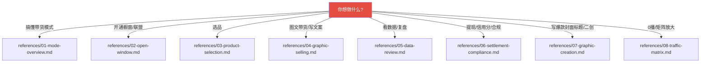
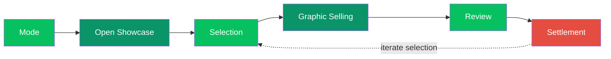
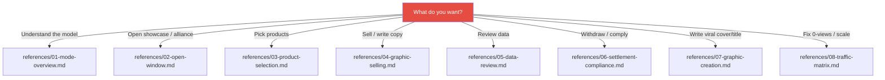

<p align="center">
  
</p>

<p align="center">
  
  
  
  
  
  
</p>

<p align="center">
  <a href="#中文说明">🇨🇳 中文</a> &nbsp;|&nbsp; <a href="#english">🇺🇸 English</a>
</p>

---

<span id="中文说明"></span>

# 🇨🇳 中文说明

> ## 用 AI 玩转微信图文（小绿书）带货，从选品到提现一条龙
> 一份**工具无关的 AI 方法论**（见 `UNIVERSAL.md`），给任意 AI 助手当「程序化工作流」使用，覆盖：**模式认知 → 开通橱窗 → 选品 → 图文带货 → 数据复盘 → 结算合规 → 图文创作 → 矩阵放大** 全流程 8 阶段。
> 适用于 Cursor、Claude、Claude Code、Cline、Copilot、Codex、ChatGPT 自定义指令、通义灵码、WorkBuddy 等**任何支持项目上下文 / 系统指令的 AI 工具**。

## 💬 加入 AI 破局社群

<h1 align="center"><b>想要加入自媒体 AI 破局社群可联系微信：JZX_AI1203</b></h1>

---

## 📖 目录

- [它能帮你做什么](#-它能帮你做什么)
- [核心闭环流程图](#-核心闭环流程图)
- [快速开始（任何 AI 工具都能装）](#-快速开始)
- [决策树：该读哪一份](#-决策树该读哪一份)
- [目录结构](#-目录结构)
- [合规红线](#-合规红线)
- [贡献 / Roadmap](#-贡献--roadmap)
- [License](#-license)

## ✨ 它能帮你做什么

| 🚀 能力 | 💡 说明 |
|---|---|
| **零门槛带货** | 不自己开店、不碰发货售后，只做「选品 + 图文带货」赚分佣 |
| **全流程 8 阶段** | 从「开通橱窗」到「矩阵放大」全流程拆解，含图文创作与限流应对 |
| **程序化决策树** | 你说一句需求，AI 自动加载对应阶段的方法论 |
| **即取即用的模板** | 选品自查清单 + 四型文案提示词，复制就能用 |
| **合规红线内建** | 不承诺收益、对标≠搬运、信用分规则等雷区已标红 |

## 🗺️ 核心闭环流程图


## 🚀 快速开始（任何 AI 工具都能装）

本仓库**不绑定任何单一工具**。任选一种方式接入：

**① 任意 AI 工具（通用，推荐）**

把整个仓库作为**项目上下文**交给你的 AI，或把 `UNIVERSAL.md` 的内容粘贴为**系统指令 / 自定义指令**，然后让它按需读取 `references/*.md`：

> 「先读 `UNIVERSAL.md` 和 `references/03-product-selection.md`，帮我按『高佣金 + 七天无理由 + 好评率高』筛一批图书类图文带货商品。」

适用工具（不限于）：Cursor、Claude、Claude Code、Cline、Copilot、Codex、ChatGPT 自定义指令、通义灵码、CodeBuddy、WorkBuddy 等。

**② Skills 生态（可选集成）**

若你的 AI 工具支持「Skills」机制（如 WorkBuddy / Claude 等），把整个文件夹复制到其 skills 目录即可作为 Skill 自动触发：

- WorkBuddy：`~/.workbuddy/skills/wechat-graphic-monetization/`
- Claude Code：`~/.claude/skills/wechat-graphic-monetization/`

其余工具用 ① 即可，无需此步。

> 💡 两条路径内容等价：`SKILL.md` 是带自动触发元数据的入口，`UNIVERSAL.md` 是工具无关版。

## 🧭 决策树：该读哪一份



## 📦 目录结构

```
wechat-graphic-monetization/
├── SKILL.md                      # 带自动触发元数据的入口（Skills 机制）
├── UNIVERSAL.md                  # 工具无关版，供其他 AI 工具使用
├── README.md                     # 本文件（中英双语）
├── LICENSE                       # MIT
├── PROMO.md                      # 三风格推广文案（geek / 小红书 / Twitter）
├── assets/                       # 视觉资产 + 交付物模板
│   ├── banner.svg                # Hero Banner
│   ├── badges/                   # 离线 SVG 徽章（MIT / 8阶段 / 微信 / AI / 双语 / 更新）
│   ├── product-selection-checklist.md  # 选品自查清单
│   ├── prompt-recipes.md         # 图文带货文案提示词库（四型钩子）
│   ├── graphic-structure-template.md   # 合格图文结构模板
│   ├── title-formulas.md         # 标题公式库
│   ├── dedup-checklist.md        # 素材去重清单
│   ├── weekly-review-template.md # 周复盘表
│   ├── account-matrix-template.md     # 账号矩阵规划表
│   ├── 30-day-launch-calendar.md # 30 天冷启动日历
│   └── pre-publish-compliance.md # 发布前合规自检
└── references/                   # 按阶段拆分的详细方法论
    ├── 01-mode-overview.md       # 模式认知：达人带货 vs 小店、矩阵逻辑、8 大赛道
    ├── 02-open-window.md         # 开通橱窗：实名→橱窗→权限→互绑→联盟
    ├── 03-product-selection.md   # 选品：佣金·销量·好评率、供应链 vs 联盟
    ├── 04-graphic-selling.md     # 图文带货：结构公式、插商品卡片、发布节奏
    ├── 05-data-review.md         # 数据复盘：销售额 vs 佣金、结算、周复盘
    ├── 06-settlement-compliance.md  # 结算合规：提现、信用分、违规、FAQ
    ├── 07-graphic-creation.md    # 图文创作：封面/标题/正文、模块化、AI 仿写、去重
    └── 08-traffic-matrix.md      # 限流应对 + 矩阵放大 + RPA 自动化
```

## ⚠️ 合规红线

> ⚠️ **请务必读完再动手**，以下雷区踩中会被扣信用分甚至暂停橱窗：

1. **平台规则会变**：橱窗 / 联盟门槛、保证金、信用分、佣金比例以微信官方最新规则为准。
2. **不承诺收益**：佣金 1%–50% 只是参考区间，所有销量 / 佣金 / 案例不作收益承诺。
3. **对标 ≠ 搬运**：带货图文属营销行为，搬运第三方内容易被举报侵权，坚持原创。
4. **选品强相关**：货品要与内容高度相关、解决痛点或满足爽点；同账号建议稳定做一类货品。
5. **敏感信息不外泄**：认证主体、提现银行卡、微信号 / 手机号不写进公开仓库。

本仓库内容基于公开方法论与微信官方规则整理，仅供学习与个人操作参考，**不构成任何收益承诺**。请遵守微信公众平台运营规范与所在国家 / 地区法律法规。

## 🤝 贡献 / Roadmap

- **贡献**：欢迎提 Issue / PR，补充新选品策略、新文案钩子或更优的合规话术。
- **Roadmap**：更多平台联动（视频号短视频 / 直播带货）、图文带货自动化脚本、数据复盘模板。

## 📄 License

[MIT](./LICENSE) —— 自由使用、修改、再分发，注明出处即可。

---

<span id="english"></span>

# 🇺🇸 English

> ## Monetize WeChat Photo-Text (小绿书) with AI · From Selection to Commission
> A programmatic workflow written for the **AI assistant**, covering the full flow:
> **Mode → Open Showcase → Selection → Graphic Selling → Review → Settlement & Compliance → Creation → Matrix**.
> Both a **WorkBuddy Skill** and a **tool-agnostic AI methodology** (see `UNIVERSAL.md`) — works with Cursor / Claude / Cline / Copilot / Codex.

---

## 📖 Table of Contents

- [What it does](#-what-it-does)
- [The core loop](#-the-core-loop)
- [Quick start (works with any AI tool)](#-quick-start-works-with-any-ai-tool)
- [Decision tree: which file to read](#-decision-tree-which-file-to-read)
- [Directory structure](#-directory-structure-1)
- [Compliance red lines](#-compliance-red-lines)
- [Contribute / Roadmap](#-contribute--roadmap)
- [License](#-license-1)

## ✨ What it does

| 🚀 Capability | 💡 Description |
|---|---|
| **Zero-threshold affiliate selling** | No store, no shipping, no after-sales — just pick products + post 图文 to earn commission |
| **8-stage full flow** | From opening a showcase window to matrix scaling — creation & traffic recovery included |
| **Programmatic decision tree** | State one need, the AI auto-loads the right stage's methodology |
| **Ready-to-use templates** | Product-selection checklist + four copywriting prompt types — copy & use |
| **Built-in compliance guardrails** | No-income-promises, no-plagiarism, credit-score rules flagged |

## 🗺️ The core loop



## 🚀 Quick start (works with any AI tool)

This repo is **not tied to any single tool**. Pick whichever way fits:

**① Any AI tool (universal, recommended)**

Give the whole repo as **project context** to your AI, or paste `UNIVERSAL.md` as **system / custom instructions**, then ask it to read the relevant `references/*.md`:

> "Read `UNIVERSAL.md` and `references/03-product-selection.md` first, then filter a batch of book products for 图文 selling by high commission + 7-day return + high rating."

Works with (not limited to): Cursor, Claude, Claude Code, Cline, Copilot, Codex, ChatGPT custom instructions, Tongyi Lingma, CodeBuddy, WorkBuddy, etc.

**② Skills ecosystems (optional integration)**

If your AI tool supports a "Skills" mechanism (e.g. WorkBuddy / Claude), copy the folder into its skills directory to auto-trigger it:

- WorkBuddy: `~/.workbuddy/skills/wechat-graphic-monetization/`
- Claude Code: `~/.claude/skills/wechat-graphic-monetization/`

Other tools just use ① — no extra step needed.

> 💡 Both paths are equivalent: `SKILL.md` is the entry with auto-trigger metadata, `UNIVERSAL.md` is the tool-agnostic version.

## 🧭 Decision tree: which file to read



## 📦 Directory structure

```
wechat-graphic-monetization/
├── SKILL.md                      # Entry with auto-trigger metadata (Skills mechanism)
├── UNIVERSAL.md                  # Tool-agnostic version
├── README.md                     # This file (bilingual)
├── LICENSE                       # MIT
├── PROMO.md                      # Three-style promo copy (geek / RED / Twitter)
├── assets/                       # Visual assets + copy-ready templates
│   ├── banner.svg                # Hero banner
│   ├── badges/                   # Offline SVG badges (MIT / 8 stages / WeChat / AI / bilingual / updated)
│   ├── product-selection-checklist.md  # Product-selection checklist
│   ├── prompt-recipes.md         # 图文 selling copywriting prompts (four hook types)
│   ├── graphic-structure-template.md   # Qualified 图文 structure template
│   ├── title-formulas.md         # Title formula library
│   ├── dedup-checklist.md        # Image de-duplication checklist
│   ├── weekly-review-template.md # Weekly review table
│   ├── account-matrix-template.md     # Account matrix planning table
│   ├── 30-day-launch-calendar.md # 30-day cold-start calendar
│   └── pre-publish-compliance.md # Pre-publish compliance checklist
└── references/                   # Methodology split by stage
    ├── 01-mode-overview.md       # Mode: affiliate vs. store, matrix logic, 8 niches
    ├── 02-open-window.md         # Open showcase: real-name → window → permission → bind → alliance
    ├── 03-product-selection.md   # Selection: commission · sales · rating, supply chain vs. alliance
    ├── 04-graphic-selling.md     # Graphic selling: structure formula, product cards, cadence
    ├── 05-data-review.md         # Review: GMV vs. commission, settlement, weekly review
    ├── 06-settlement-compliance.md  # Settlement: withdrawal, credit score, violations, FAQ
    ├── 07-graphic-creation.md    # Creation: cover/title/body, modularity, AI rewrite, de-dup
    └── 08-traffic-matrix.md      # Traffic recovery + matrix scaling + RPA
```

## ⚠️ Compliance red lines

> ⚠️ **Read before you act** — violations cost credit points or even get your showcase suspended:

1. **Platform rules change**: showcase / alliance thresholds, deposit, credit score, commission rates follow WeChat official latest rules.
2. **No income promises**: the 1%–50% commission is a reference range only; no sales / commission / case figure is a guarantee.
3. **Benchmark ≠ plagiarism**: 图文 selling is marketing — copying third-party content risks infringement; stay original.
4. **Selection must match content**: products must be highly relevant and solve pain / satisfy desire; keep one category per account.
5. **No sensitive data leaks**: certification identity, withdrawal bank card, WeChat ID / phone number stay out of public repos.

Compiled from public methodology and official WeChat rules for learning only — **no income promise**. Comply with WeChat Official Platform specs and your local laws.

## 🤝 Contribute / Roadmap

- **Contribute**: Issues / PRs welcome — new selection strategies, new copy hooks, or better compliance wording.
- **Roadmap**: Cross-platform links (Channels short-video / live selling), 图文 automation scripts, data-review templates.

## 📄 License

[MIT](./LICENSE) — free to use, modify, and redistribute with attribution.
