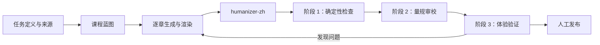

# Teach Yourself Skill

用于把课程当作可验证、可迭代的教学产品：先定义任务与来源，再规划、生成、质检并发布 Markdown/HTML 课程。它提供六类正文写法、课程评价量规与无外部依赖的确定性检查器。

> 基于当前 Skill 生成的单个完整课程参考：[如何实现高质量的 AI Code Review](https://chokcoco.github.io/courses/high-quality-ai-code-review/index.html)

## 内容

```text
teach-yourself-skill/
├── SKILL.md                 # Agent 工作流
├── scripts/                 # 第一阶段确定性质检与测试
├── references/              # 评价量规、写法指引、讲师风格与依赖约定
├── templates/               # 可组合的章节结构模板（可自行扩充）
└── examples/
    └── high-quality-ai-code-review/  # 完整案例课程
```

## 使用

可通过 [skills](https://github.com/vercel-labs/skills) CLI 直接从 GitHub 安装：

```bash
npx skills@latest add chokcoco/teach-yourself-skill
```

面向 Codex 的全局安装可显式指定目标：

```bash
npx skills@latest add chokcoco/teach-yourself-skill --agent codex --global --yes
```

安装后，在课程生成、改写、审阅和发布任务中使用 `$teach-yourself-skill`。也可以将本目录放入 Codex 的 skills 根目录，或在任务中显式引用其 `SKILL.md`。

第一阶段检查不需要安装依赖：

```bash
node scripts/validate-course.mjs examples/high-quality-ai-code-review
node --test scripts/validate-course.test.mjs
```

`examples/high-quality-ai-code-review` 是一门 9 章的静态课程案例，包含 Markdown 事实源、渲染后的 HTML 页面、参考资料与静态资源。可直接用浏览器打开其 `index.html`。

## How to Use

从零创建一门类似 `examples/high-quality-ai-code-review` 的课程，分五个阶段推进。

### 阶段 0：初始化（1 回合）

告诉 LLM 你要做什么课、面向谁、用什么材料、交付什么格式。

让 Skill 帮你把模糊的"做一门课"改写成可验收的任务定义，自动创建课程目录和 workspace 文件：

```text
<course-root>/
├── workspace/
│   ├── MISSION.md              # 课程任务定义
│   ├── RESOURCES.md            # 来源包与证据映射
│   ├── COURSE-GENERATION-SPEC.md  # 章节规格、字符限制、交付格式
│   ├── COURSE-BLUEPRINT.md     # 逐章蓝图（模块、学习成果、代码证据）
│   ├── NOTES.md                # 设计笔记与确认记录
│   └── learning-records/        # 生成批次、审核意见和关键决策记录
├── lessons/                    # 逐章 Markdown + HTML
├── reference/                  # 术语表、速查页等参考材料
├── quality/                    # 质检报告
└── course.json                 # 课程元数据（标题、章节列表、状态）
```

关键动作：**收集真实来源而非编造内容**。告诉 Skill 你的代码仓库、文档、PPT、Confluence 页面、截图等，它会建立来源包并逐条映射断言。代码优先、文档校准、材料辅助——三种来源可信等级不同，Skill 会在蓝图中显式标注。

### 阶段 1：蓝图与计划（1-2 回合）

在开始写作前，用 7 个问题把课程框架推敲清楚：

1. 模块怎么拆？每个模块解决什么阶段能力？
2. 每章的学习成果是什么？终点要能观察、可验证。
3. 每章的"自有学习路径"是什么？从已知到未知的推理线？
4. 哪些仓库代码用作证据？哪段代码支撑哪个知识点？
5. 哪些外部官方文档需要引用？版本号锁定了吗？
6. 每章选什么模板组合？主模板 + 1-2 个辅助模块？为什么？
7. 整门课的 20%-30% 核心内容是什么？在哪几章给更高解释深度？

Skill 会产出 `COURSE-BLUEPRINT.md`（逐章蓝图）和 `CHAPTER-TEMPLATE-MAP.md`（逐章模板组合）。**用户批准蓝图后再开始写作**——这个阶段是"把方向聊清楚"，不是生成正文。

### 阶段 2：标杆章与校准（1-2 回合）

不要一口气写完全部课程。先写 **2 章标杆章**：一章代表你的语言基础风格，一章代表你的工程实战风格。标杆章的验收标准：

- 用户读完后说"这就是我想要的深度和节奏"
- Skill 用标杆章校准后续所有章节的解释粒度、代码粒度和阅读节奏

标杆章通过 Humanizer（≥45/50）和第一阶段质检（0 error）后再继续。如果标杆章返工，调整的是一整门课的风格，不是 40 章逐一返工。

### 阶段 3：逐章生成（按批次）

长课程（30-40 章）按 **3-4 章一批**依次生成。每批是一个完整交付单元：写完 Markdown → 生成 HTML → Humanizer → 第一阶段检查 → 第二阶段量规审校 → 第三阶段浏览器检查。

批次之间 Skill 会读取前一章、当前批次、后一章的蓝图，确保术语首次出现、前置知识、示例延续、难度曲线平稳衔接。每批质量报告中的"待办项"会在下一批开始前解决。

### 阶段 4：单章质量闭环

每章写完后执行固定顺序的质检，不能跳过任何一步：

1. **Humanizer 闸门**：中文正文必须经过 `humanizer-zh` 检查，去除填充词、宣传腔、模糊归因、破折号过度、机器人结论。低于 45/50 时重新修改直到达标。
2. **第一阶段：确定性硬检查**：运行 `node scripts/validate-course.mjs <course-root>`——检查目录结构、Markdown 围栏闭合、HTML 结构、本地链接、Mermaid 类型、外链白名单、信息泄露。0 error 才能进入下一步。
3. **第二阶段：课程量规审校**：按 `references/course-rubric.md` 从六个维度打分——学习覆盖、事实证据、受众适配、解释深度、练习反馈、语言教师感。总分低于 85 或有 major 问题需要返工。
4. **第三阶段：产物体验检查**：浏览器中验证 HTML 渲染、导航、响应式、Mermaid 图、代码高亮、锚点和跨章链接。

内容修改后旧质检报告失效，必须从第一阶段重新开始。同一章最多自动返工三轮——三轮仍有问题，转人工判断。

### 马上试试

```bash
# 1. 安装到 skills 目录后，对 LLM 说：
#    "用 $teach-yourself-skill 创建一门面向初学者的 Python 爬虫课"
# 2. Skill 会引导你完成阶段 0-2，然后逐章生成
# 3. 每完成一批（3-4 章），在浏览器中打开 index.html 验收

# 查看示例课程
open examples/high-quality-ai-code-review/index.html

# 运行质检
node scripts/validate-course.mjs examples/high-quality-ai-code-review
node --test scripts/validate-course.test.mjs
```

## 必需的协作 Skill：humanizer-zh

中文学生可见文本需要通过 [Humanizer-zh](https://github.com/op7418/Humanizer-zh) 的语言质量闸门。Skill 系统目前没有可在 frontmatter 中声明并自动安装另一个 Skill 的通用机制；因此本仓库将它作为**显式运行时依赖**写入 [依赖说明](references/humanizer-dependency.md) 和 `SKILL.md`。

安装时，将 `teach-yourself-skill` 与 `humanizer-zh` 放在同一个 skills 根目录：

```text
<skills-root>/
├── teach-yourself-skill/
└── humanizer-zh/
```

获取或安装 `humanizer-zh`： [op7418/Humanizer-zh](https://github.com/op7418/Humanizer-zh)。

未安装 `humanizer-zh` 时，可进行课程规划和确定性检查，但不能声称中文课程已通过完整质量闭环。

## 自定义模板

`templates/` 仅保留通用、可组合的章节结构，不包含完整课程写法样例。请按课程领域、受众、合规要求和已有材料自行新增或维护模板文件；不要把私有项目名、内部架构、真实数据或受限材料提交到本仓库。


## 开源流程概览


