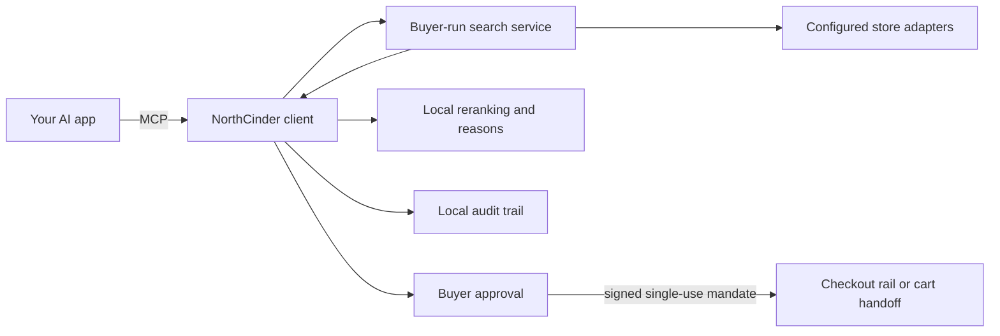

# NorthCinder

**Make your shopping agent compare, explain, and ask before buying.**

NorthCinder is an open-source MCP server that helps an AI agent compare products against your brief. It
returns a ranked shortlist with reasons, reports which stores it could and could not search, and requires a
separate approval before checkout. Seller payment and affiliate data never improve a result's position.

NorthCinder is software you run. It works on your computer alongside the AI app you already use. The
repository owner does not operate a NorthCinder service. There is no NorthCinder account, hosted control
plane, or telemetry service.

## Get started

You need Node.js 20 or later and an AI app that supports MCP.

```sh
npx northcinder init
```

The initializer walks you through local setup and prints the MCP configuration for your AI app. After you
connect it, try a specific brief:

> Find black wool running shoes under $130. Compare price, delivery, fit, and merchant trust. Tell me why
> the winner ranked first and which options were ruled out.

## What you get

NorthCinder's response includes:

- the offers that matched the required criteria;
- the score and machine-readable reasons for each recommendation;
- rejected offers and the requirement each one missed;
- merchant-trust evidence and missing evidence;
- a store-by-store coverage report; and
- sponsorship and source labels that remain attached to every offer.

## The contract you can inspect

| Concern | NorthCinder's rule | Evidence |
| --- | --- | --- |
| Ranking | Buyer criteria determine the order. Seller payment is not an input. | [Ranking specification](./docs/RANKING.md) and [ranking source](./packages/protocol/src/ranking/rank.ts) |
| Sponsored offers | Labeled sponsored offers remain below every organic result. | [Neutrality audit](./docs/NEUTRALITY-AUDIT.md) |
| Coverage | Unavailable and unconfigured stores stay visible in the response. | [Adapter contract](./packages/protocol/src/adapter/store-adapter.ts) |
| Merchant trust | Every merchant carries explicit evidence or an honest unknown state. | [Trust specification](./docs/TRUST.md) |
| Checkout | A signed, single-use mandate binds the exact offer, quantity, and spending cap. | [Checkout package](./packages/checkout) |
| Audit | Recommendations, approvals, and checkout attempts are written to a local audit trail. | [Client source](./client/src) |

The client reruns the deterministic ranking over the service-disclosed inputs. This verifies the order it
received; it does not prove that an upstream catalog was complete or that every store-supplied fact was true.

## How NorthCinder works



The repository owner is not in this runtime path. You run the client and aggregation engine, choose the
store connections, and keep the local configuration and audit data.

## Store coverage

Store access varies because each platform has different rules. NorthCinder reports a store as unavailable
or blocked when it cannot search it instead of presenting partial coverage as a complete market search.

| Store | What works today |
| --- | --- |
| [Shopify](./adapters/shopify/README.md) | Catalog search is available after additional Shopify setup. The older per-store connection is no longer current. |
| [WooCommerce](./adapters/woocommerce/README.md) | Works with stores that expose WooCommerce's public Store API. |
| [eBay](./adapters/ebay/README.md) | Native search requires approved eBay Buy API access. |
| [Etsy](./adapters/etsy/README.md) | Native search requires approved Etsy app access. |
| [Amazon](./adapters/amazon/README.md) | Read-only comparison can use a browser profile you control. It stops at challenges and does not check out. |

When a native store connection is unavailable, your agent may still compare permitted product pages with
browser tools it already controls. NorthCinder accepts normalized product facts, not cookies, raw HTML,
screenshots, page instructions, passwords, one-time codes, or your AI-provider key. Agent-observed offers
must be confirmed by a native adapter or merchant protocol before automated checkout or an unattended watch.

## Privacy and purchase control

- Your AI-provider key stays in your AI app. Store credentials stay with you and the store.
- NorthCinder does not send your searches, settings, or local history to the repository owner.
- Raw card details are rejected. Automated rails use opaque delegated payment tokens when available.
- Search and price watches are not permission to buy. Every automated checkout needs approval for that
  specific purchase.
- The approval mandate is single use and protected by a cross-process nonce ledger.

Read [privacy and software ownership](./docs/INDEPENDENCE.md) and the [security policy](./SECURITY.md) for
the complete boundary.

## Project status

`northcinder` 0.1.2 is the initial public release. The repository includes offline build, typecheck, test,
dependency, secret, packaging, and public-surface checks. Fixture and harness coverage does not prove current
third-party credentials, production access to every store, or a completed real purchase. Read the relevant
adapter documentation before relying on a specific integration.

The package is not yet listed in the official MCP Registry, and the marketing site in this repository has
not been published at a canonical production origin.

## Build from source

This is a pnpm workspace. Product packages require Node.js 20 or later; the private site workspace requires
Node.js 22.12 or later.

```sh
corepack pnpm install --frozen-lockfile
corepack pnpm build
```

Then run the local initializer from the checkout:

```sh
node northcinder/bin/northcinder.js init
```

Contributors can find the full release-verification commands in [CONTRIBUTING.md](./CONTRIBUTING.md).

## Contributing and support

- Read [CONTRIBUTING.md](./CONTRIBUTING.md) before proposing a change.
- Use [GitHub Issues](https://github.com/cinderline/northcinder/issues) for reproducible bugs and focused work.
- Use [GitHub Discussions](https://github.com/cinderline/northcinder/discussions) for questions and open-ended ideas.
- Report vulnerabilities through [GitHub private vulnerability reporting](https://github.com/cinderline/northcinder/security/advisories/new), not a public issue.

NorthCinder is open source under the [MIT License](./LICENSE).
