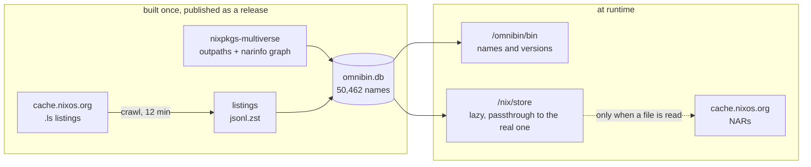

# omnibin

Every binary nixpkgs ever shipped, on your PATH.

```console
$ ls /omnibin/bin | wc -l
51468

$ python3 --version
Python 3.14.6

$ python3@3.6.2 --version
Python 3.6.2
```

That machine had none of those packages a moment ago and still has almost none
of them. `/omnibin/bin` is a filesystem, `/nix/store` underneath it is a
filesystem, and a package's bytes are fetched from
[cache.nixos.org](https://cache.nixos.org) the first time something reads a
file inside it.

Every command it knows about is browsable at **<https://omnibin.dev/>**, with
every version of each, what it costs to fetch, and what is inside it.

**Documentation:** [Design](./docs/design.md) ·
[Using it](./docs/using.md) ·
[Building the index](./docs/building-the-index.md) ·
[Caveats](./docs/caveats.md)

## Status


<!-- BEGIN index-status -->

| system          | executables | `name@version` | package versions | store paths |
| --------------- | ----------- | -------------- | ---------------- | ----------- |
| `aarch64-linux` | 47,644      | 791,507        | 224,246          | 619,270     |
| `x86_64-linux`  | 51,468      | 881,933        | 253,817          | 619,915     |

Store paths from 2012-07-05 to 2026-09-08, 60.7 TB unpacked. Commands are nameable from 2017-03-23 on, which is when Hydra started publishing file listings. Built from nixpkgs-multiverse `data-20260924`.
<!-- END index-status -->

## Why

Every sandbox an agent works in begins with somebody guessing which packages it
will need. Guess short and the agent is stuck halfway through a task; guess
long and you ship a ten gigabyte image so that something can run `jq` twice.
Either way the agent's first move on a real task is to install something, which
is what a sealed environment exists to prevent.

omnibin removes the guess. The machine starts with every version of every
package on its PATH, weighing nothing, and pays only for what gets run.

The other half is history. [nixpkgs-multiverse] resolves any
`(attribute, version)` in thirteen years of nixpkgs to the store path Hydra
built for it, so an old version costs a download rather than a build. 610
packages have shipped something called `python3`, and reaching any of them is
one command.

The store paths reach back to 2012. The commands inside them can only be named
from March 2017, because that is when Hydra started publishing a file listing
beside each narinfo. Older paths still fetch and still run; they just cannot be
searched for by command name. See [caveats](./docs/caveats.md).

## How it works

Hydra publishes a `.ls` file beside every narinfo on cache.nixos.org: the
complete listing of a store path's contents as JSON, with each entry's type,
size, executable bit and symlink target. That is the metadata half of a Nix
store, already served, at about nine kilobytes per path. omnibin crawls those
listings once, which is the only data this project adds to what
[nixpkgs-multiverse] already publishes, and keeps them in a database. That
crawl is 233,690 store paths and **282 million files**, and it is what every
answer on this page and on the site is made of.



The filesystem answers every question about what exists out of that database,
with no network at all:

```console
$ ls /nix/store/2lb6nn8ivk1alhckv43n7734lqwbw7h9-python3-3.6.2/bin
2to3      idle     pydoc     python   python3.6          python3-config  pyvenv
2to3-3.6  idle3    pydoc3    python3  python3.6-config   python-config   pyvenv-3.6
          idle3.6  pydoc3.6           python3.6m         python3.6m-config
```

That is CPython from 2017 and it is not on the machine. Listing it cost
nothing. Reading one byte out of `python3.6` fetches the NAR, once, after which
the path is served from the unpacked copy like any other directory.

## Finding things

`/omnibin/bin` is the second filesystem and the one people use. `ls` shows the
bare names, one per executable anybody ever shipped, each resolving to the
newest package that provides it. The versioned forms resolve too but are
deliberately not listed, because there are 881,933 of them and a directory
nothing can read is worse than one that answers the questions you ask it.

So ask. `omnibin which` is the ergonomic way in and costs no downloads:

```console
$ omnibin which python3
/nix/store/gxzhl7aaiid7zp3y47jqqiq7zg5mqpwp-python3-3.14.6/bin/python3

$ omnibin which --all python3 | wc -l
610

$ omnibin which --all ffmpeg | head -2
ffmpeg@3.1.7  ffmpeg  0.4 MB  /nix/store/0adpc3…-ffmpeg-3.1.7-bin/bin/ffmpeg
ffmpeg@3.2.4  ffmpeg  0.4 MB  /nix/store/nhfgdv…-ffmpeg-3.2.4-bin/bin/ffmpeg
```

The size is what running that version costs the first time. When you want to
ask something `which` does not answer, the database is a plain SQLite file at
`/omnibin/index.db`:

```console
$ sqlite3 /omnibin/index.db \
    "SELECT name FROM latest WHERE name LIKE 'gcc%'"
```

## Three ways in

**A shell, on any Linux.** The lazy store is mounted over `/nix/store` inside a
user and mount namespace belonging to this shell, which dies with it. Your real
store is served through it untouched, so the software you already have keeps
working, including the shell you are typing into.

```console
$ nix run github:fzakaria/omnibin
omnibin: tree at /run/user/1000/omnibin, cache at /home/you/.cache/omnibin

$ python3@3.6.2 -c 'import sys; print(sys.version.split()[0])'
3.6.2

$ jq --version
jq-1.8.1

$ exit
```

**A NixOS machine.** One module, and every package is installed on it.

```nix
{
  imports = [ inputs.omnibin.nixosModules.default ];
  services.omnibin.enable = true;
}
```

**A container.** [`fmzakari/omnibin`](https://hub.docker.com/r/fmzakari/omnibin)
mounts on start, so it works as a base for anything that wants a full toolbox
without choosing one:

```dockerfile
# syntax=docker/dockerfile:1
FROM fmzakari/omnibin:latest

COPY <<'SH' /demo.sh
python3@3.6.2 -c 'import sys; print(sys.version.split()[0])'
jq --version
gcc@10.2.0 --version | head -1
SH

CMD ["bash", "/demo.sh"]
```

```console
$ docker build -t example .
$ docker run --rm --device /dev/fuse --cap-add SYS_ADMIN example
3.6.2
jq-1.8.1
gcc (GCC) 10.2.0
```

Three eras of toolchain in one image that contains none of them.

```console
$ docker run --rm -it --device /dev/fuse --cap-add SYS_ADMIN fmzakari/omnibin
$ ls /omnibin/bin | wc -l
51468
```

FUSE inside a container needs the device and the capability, and nothing else.
`SYS_ADMIN` is for `mount` and `/dev/fuse` is for FUSE.

The packages arrive when the container runs, not when it builds. `docker build`
gives a `RUN` step neither `/dev/fuse` nor the capability to mount, so a `RUN`
that calls `jq` fails the same way it would on any base image without it. Put
the work in `CMD` or `ENTRYPOINT`, where the mount is up.

## What it costs

Measured on a machine that had never seen CPython 3.6.2:

```console
$ time python3@3.6.2 -c 'import sys; print(sys.version.split()[0])'
3.6.2
real    0m2.690s

$ time python3@3.6.2 -c 'print(6*7)'
42
real    0m0.035s
```

The cold run fetched three store paths and 92 MB: the interpreter, its glibc,
and one more. The warm run touched the network zero times. That is the trade,
disk and bandwidth for exactly the packages that got used, against an image
sized for the packages somebody guessed would be.

## License

MIT, please see [LICENSE](LICENSE).

The Nix expressions and tooling are original work. The published listings are
generated metadata about store paths, being names, sizes and modes crawled from
cache.nixos.org, and are not nixpkgs source.

[nixpkgs-multiverse]: https://github.com/fzakaria/nixpkgs-multiverse
