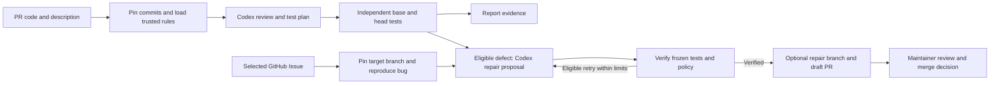

# RepoPilot

**Verification-driven software iteration, powered by the OpenAI Codex SDK and hosted on your own worker.**

[中文说明](README.zh-CN.md) · [Architecture](docs/ARCHITECTURE.md) · [Security](SECURITY.md) · [Verification](docs/VERIFICATION.md)

RepoPilot turns GitHub Issues and pull requests into a bounded cycle of test generation, failure reproduction, code repair and independent verification. It uses Codex to review repository rules, generate requirement-driven tests, and propose fixes. A separate Docker runner checks the code before the controller can publish a repair branch and draft PR. Maintainers retain the merge decision.

## Why RepoPilot?

We believe software development is approaching an era in which AI takes a growing role in automated iteration and updates. Agents will carry more work from understanding a problem and adding tests through changing code, checking results and proposing further improvements. Developers can devote more attention to product direction, architectural tradeoffs and quality standards while agents work within explicit goals and constraints.

That future needs a trustworthy engineering process: changes have a clear rationale, failures can be reproduced, fixes are independently verified, unsuccessful work can stop, and decisions remain traceable. People retain control over critical decisions. These foundations become more important as automation takes on more responsibility.

RepoPilot is a step toward that future. Starting from GitHub Issues and PRs, it connects Codex's code understanding and repair capabilities with tests, repository rules and human review to explore verifiable, controlled iteration. The current release focuses on maintainer-selected problems and bounded repair attempts. Broader autonomous iteration is a project vision; unattended product development, merging and deployment are not current capabilities.

## What problem does it solve?

A passing existing test suite may miss a new requirement or an untested edge case. Maintainers also need to check repository-specific conventions, reproduce reported failures, and confirm that a proposed fix preserves existing behavior. RepoPilot brings these steps into one repeatable workflow.

| Maintainer problem | How RepoPilot addresses it |
| --- | --- |
| An Issue describes a bug without a regression test | Codex proposes a test tied to the Issue description; reproducible failure is required before repair. |
| A PR changes behavior that existing tests do not cover | Codex generates new tests from the PR description and changed code; the runner compares base and head results. |
| Project conventions live in AGENTS.md and are easy to miss | Static rules and Codex semantic review use trusted base-branch policy, with cited rules and code evidence. |
| A suggested fix has no reproducible verification | Tests are frozen before repair; candidates must preserve test identities and pass independent execution and policy rechecks. |
| An environment failure or flaky test looks like a code defect | Environment failures receive bounded retries; unstable or incomplete evidence blocks automatic repair. |
| Review evidence is scattered across logs and patches | Local JSON/Markdown reports retain findings, test outcomes, repair attempts and publication state. |

## Who is it for?

- **Open-source maintainers** who want help reviewing same-repository PRs, checking contribution rules and producing regression evidence.
- **Small development teams** that need additional test coverage and repair proposals without building a custom agent controller.
- **QA and developer-tooling engineers** who maintain JavaScript, Python, Go or Java suites, monorepos and test environments with database or Redis dependencies.
- **Developers building with Codex** who want an inspectable example of SDK orchestration, structured model output, independent verification and bounded repair.

These are intended users, not claims of existing adoption. The current scope is public, text-based repositories; version 1.3.0 supports Node, Vitest, pytest, Go and compatible JUnit XML evidence. Fork PR execution, browser E2E and a hosted dashboard are outside the current implementation.

## How it uses OpenAI Codex

RepoPilot directly depends on `@openai/codex-sdk`. OpenAI documents the SDK as a way to embed Codex in applications and engineering workflows; RepoPilot uses its TypeScript interface for review, test planning and repair proposals. See the [official Codex SDK documentation](https://learn.chatgpt.com/docs/codex-sdk).

The [agent entry point](src/adapters/codex/entry.ts) creates `Codex` with `OPENAI_API_KEY`, starts a thread and calls `thread.run()` with a JSON output schema. The [container adapter](src/adapters/codex/docker-agent.ts) supplies scoped repository context and accounts for reported model usage. The [pipeline](src/application/pipeline.ts) validates proposed changes and delegates test execution to a separate runner.

| Codex responsibility | RepoPilot controller responsibility |
| --- | --- |
| Review natural-language repository rules and cite violations | Load trusted rules from the pinned base and compare historical findings |
| Design tests for requested behavior and edge cases | Freeze generated tests and execute them against pinned snapshots |
| Propose production-code replacements | Enforce protected paths, verify candidates and publish only eligible results |

The controller, test execution and reports run on your machine or worker. Model calls use OpenAI services and send selected repository text and task context; self-hosting does not mean offline model inference. GitHub credentials stay in the controller. This is an independent MIT-licensed project built with Codex, not an official OpenAI product.

## Automated iteration workflow

For a hypothetical PR that adds an input-validation rule, Codex can propose boundary tests tied to the requested behavior. RepoPilot runs them on both revisions. A new-behavior test that fails on base and passes on head needs an exact supporting requirement quote; an existing-behavior test that passes on base and fails on head is a regression candidate. Only reproducible regressions or eligible policy violations proceed to repair.



Start with a local `check`; enable `watch` for GitHub polling and `publish` when you want verified proposals submitted for human review. Agent review, repair and publishing are separately configurable and disabled in the example configuration.

For an Issue, run `fix --issue 123 --config config.local.json`: establish a passing original baseline, reproduce the reported bug with a new frozen test, then attempt a repair. Iteration stays within configured attempt, call and time limits; insufficient evidence stops the task for review. Issue selection is explicit; RepoPilot does not autonomously choose a product roadmap or merge changes.

## Implemented

Version **1.3.0** brings [goal-driven iteration](docs/ITERATION.md): explicit acceptance criteria and path scopes, resumable step plans, feature implementation, bounded verification feedback, opt-in Issue queues, PR follow-up, version-scoped experience, evidence-based improvement proposals and isolated preview/rollback health checks. These capabilities are included in the portable packages and matching 1.3.0 Agent image. Maintainers retain task selection, merge and deployment decisions.

Version **1.3.0** includes [Issue → reproduction → repair PR](docs/ISSUE-REPAIR.md) through `fix --issue`, [pytest, Go test and JUnit XML](docs/MULTILINGUAL-TESTS.md) reporters, and [owned-resource crash recovery](docs/RECOVERY.md). Use the matching 1.3.0 controller and Agent image.

- Pinned base/head SHAs and title/body digest; continuous freshness checks and cancellation.
- Scoped literal rules and JavaScript/TypeScript AST call rules, conflict detection and expiring exceptions.
- Nested AGENTS.md semantic review with verbatim rule/code citations and historical finding comparison.
- Proactive test plans and new test files, frozen before production-code repair.
- Structured Node, Vitest, pytest, Go and compatible JUnit XML results: test discovery, stable identities, repeated failure fingerprints and same-case verification.
- Monorepo working directories, multiple named test commands and disposable dependency services; see [test environments](docs/TEST-ENVIRONMENTS.md).
- Bounded repair attempts, task retries, publication retries, call/token budgets and process-tree cleanup.
- Failure categories and bounded phase-level environment retries; unstable failures or changed discovery block automatic repair.
- Separate autofix branches/draft PRs, executable-mode preservation and collision-safe publication recovery.
- Atomic JSON reports, Markdown evidence summaries, previous-execution archives and exclusive controller lock.

Developer preview. See [verification coverage](docs/VERIFICATION.md) for the current validation scope and [security](SECURITY.md) for execution boundaries.

## Setup

Download a [1.3.0 portable release](https://github.com/indada/repopilot/releases/tag/v1.3.0) for Linux, Windows or macOS to run without installing Node.js. See [portable quickstart](docs/QUICKSTART.md). The following commands are for source installations.

Node.js 22 recommended, npm and Git. Test and agent execution requires Docker with Linux containers.

```sh
npm ci
npm run check
npm test
npm run build
cp repopilot.example.json config.local.json
```

PowerShell can use Copy-Item instead of cp. Set repository and the trusted test command in the local config, outside reviewed snapshots.

```sh
npm run dev -- check --config config.local.json --repo /path/to/project --base main --head feature
npm run dev -- watch --config config.local.json --once
npm run dev -- watch --config config.local.json
```

Local check never publishes or edits the source checkout. Watch polls non-draft same-repository PRs, excluding autofix branches. Publishing requires publish=true.

The default reporter is node with node --test. Build first to produce the trusted reporter. For Vitest, set reporter=vitest and use an explicit vitest run command backed by a trusted image containing pinned dependencies. Tests have no network by default; configured services use a disposable internal Docker network. Images and dependencies must be provisioned beforehand. Reporter flags belong to the controller. reporter=command collects output only and cannot verify or publish.

Omit runner for policy-only review; tests remain not_run. Zero/all-skipped tests, malformed reports and missing test identities never count as passing.

## Trusted rules

Commit .repopilot/policy.json to the target base branch; see [examples](examples/policy.json).

```json
{
  "rules": [
    {
      "id": "no-disabled-tests",
      "kind": "forbid-call",
      "extensions": [".ts", ".js"],
      "callee": "test.skip",
      "message": "Keep regression tests enabled.",
      "severity": "error"
    }
  ],
  "exceptions": []
}
```

Kinds are literal (forbiddenText), forbid-call and require-call (callee). AST rules inspect direct/qualified calls and string property access; they do not resolve aliases or perform whole-program analysis. Literal rules can match comments. Overlapping require/forbid rules conflict and stop review.

Exceptions specify ruleId, exact path, reason, expiresAt (UTC ISO timestamp), and optional exact evidence. They come only from base policy; expired exceptions do not suppress findings. Nested base AGENTS.md rules are supplied by scope for semantic review. Prose conflicts still require human interpretation.

PRs changing trusted rule files require maintainer review and cannot authorize their own repair.

## Codex and repair

```sh
docker build -f Dockerfile.agent -t repopilot-agent:local .
```

Set OPENAI_API_KEY in the controller environment; only the agent container receives it. GITHUB_TOKEN or GH_TOKEN stays in the controller. Publishing requires repository Contents and Pull requests write permissions. Desktop ChatGPT credentials are not reused.

agent.enabled enables semantic review and test planning. agent.repair enables repair proposals. The SDK runs in a separate container with no writable host checkout; the controller applies validated file replacements to independent snapshots.

Automatic repair needs passing original baseline evidence. Generated scenarios are regression (default) or new_behavior, in separate files. New behavior requires an exact requirementQuote from the PR title/body. For the same executed case, base-pass/head-fail is a regression; base-fail/head-pass is accepted only for cited new behavior. Both-fail, skipped/missing cases, execution errors and changes to original test results require review. A model label alone never overrides runner evidence.

A PR may combine verified new behavior with regressions. Regressions must repeat with identical failing identities/fingerprints. Repair candidates must preserve and pass original base/head/generated cases and pass static/semantic rechecks. Missing base exports must be checked inside executing test cases rather than crashing top-level imports. Reports retain intent, requirement quotes and per-case classifications. Existing tests, manifests, configuration, policies and hidden paths are protected.

Publication rechecks SHAs and description. Existing branches/PRs are reusable only when their parent/tree match the verified result. No force push or automatic merge.

## Operations and limits

Version 1.3.0 includes `recover` to preview and explicitly clean owned crash leftovers and retain interrupted task evidence. See [recovery](docs/RECOVERY.md) for lock states, preview tokens and legacy-resource handling.

Task management commands:

```sh
npm run dev -- tasks list --config config.local.json --status running --limit 20 --offset 0
npm run dev -- tasks show TASK_ID --config config.local.json --format markdown
npm run dev -- tasks cancel TASK_ID --config config.local.json
npm run dev -- tasks resume TASK_ID --config config.local.json
npm run dev -- tasks rerun TASK_ID --config config.local.json
```

List/show/cancel work while the controller holds its writer lock. Cancel registers a persistent request checked every 250 ms during verification/publication; the response acknowledges the request, while the report records completion. It cannot undo remote writes already completed. The watcher does not restart a cancelled task while its marker remains. Cancellation applies to that task, not future PR revisions.

Resume/rerun require the controller lock. Resume keeps task identity/configuration and execution limits, reruns verification from the beginning, or continues publication of an already-verified task. Retry delays still apply. Permanent/terminal/exhausted tasks need rerun. Rerun creates a new linked task using the original pinned commits and current configuration; it preserves prior reports and cancellation markers.

Replay needs the recorded local repository or git-cache. PR inputs are rechecked before and during replay; updated PRs need watch. Older reports without replay metadata can be enriched by repeating the original check/watch. Stale crash locks still require checking that the old process stopped before removal.

Reports and snapshots live in .repopilot-data. Each task has JSON and Markdown; retries archive previous evidence as TASK.execution-N.json. JSON holds bounded full outputs and candidate patches; Markdown/PR output is abbreviated.

Task timeout, maxCalls, maxAttempts and maxTaskExecutions are bounded. maxTokens accounts for reported usage after each model call; a single call may exceed it. It is not a hard monetary budget.

Public text-only repositories, up to 10,000 files / 16 MiB. Symlinks, submodules, binaries and case collisions fail closed. Context is batched around changed files plus related imports/tests; oversized individual files fail explicitly. One controller runs serially. After a crash, use the recovery preview and validated apply flow; legacy locks and resources require manual inspection.

No dashboard, webhook server, distributed queue, browser E2E, automatic dependency installation or fork execution. Test execution is evidence, not tamper-proof attestation against malicious code. See SECURITY.md.

## Development

```sh
npm run check
npm test
npm run build
```

Tests use mocked APIs/agents/runners and synthetic local Git/Node fixtures. They do not use model credits, launch Docker or write GitHub content. MIT licensed; independent project, not an official OpenAI product.
