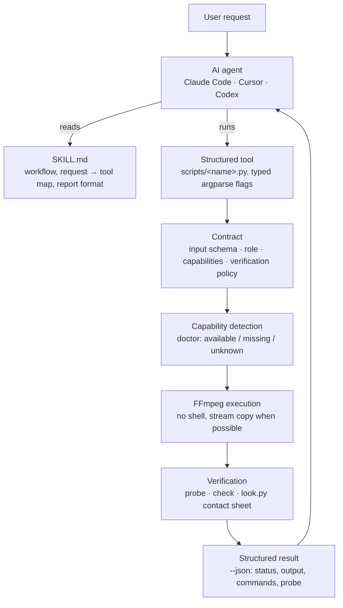
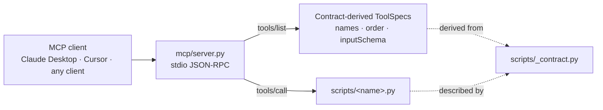

<p align="center">
  
</p>

<h1 align="center">ffmpeg-skill</h1>

<p align="center"><strong>Give your coding agent a video editor.</strong></p>

<p align="center">
  Local FFmpeg · No cloud · No API keys · Python standard library<br>
  Claude Code · Cursor · Codex · MCP
</p>

<p align="center">
  <a href="https://github.com/kajisho5/ffmpeg-skill/actions/workflows/ci.yml"></a>
  <a href="https://www.npmjs.com/package/ffmpeg-skill"></a>
  
  
  <a href="LICENSE"></a>
</p>

```bash
npx ffmpeg-skill
```


`ffmpeg-skill` is an [Agent Skill](https://docs.anthropic.com/en/docs/agents-and-tools/agent-skills) for Claude Code, Cursor, Codex and any agent that reads `SKILL.md`. It teaches the agent a fixed workflow (probe → edit losslessly where possible → check → verify) and ships **28 tools** that do the actual work with `ffmpeg` / `ffprobe`: cut, join, silence removal, fit to duration and aspect, captions and karaoke, overlays and motion graphics, HDR → SDR and LUTs, audio clean-up and typed dynamics, sync with drift correction, multicam, loudness, delivery checks, whole-edit project rendering, batch folders. Every tool is also an MCP tool, and the whole set is described by a machine-readable contract.

If `ffmpeg` and `python3` are on your PATH, it works: offline, on footage you would rather not upload.

> **SPEC** (Self-Producing Execution Contract), coined by this project's author
> [kajisho5](https://github.com/kajisho5): each tool's `input_schema` — the part of its contract
> and MCP tool definition that has to track the CLI flag-for-flag — is never hand-authored beside
> the code. It's derived, at run time, from the same `argparse` parser that already defines the
> CLI, and CI fails the build if any of it drifts. → [full explanation](#what-is-spec)

---

## Standalone, and in an ecosystem

**Standalone**, this is a local FFmpeg engine: probe → edit → verify, `npx ffmpeg-skill` and nothing else. No API key, no account, no other repo required. Everything above and below this section describes that standalone tool, and none of it changes if you never read the rest of this one.

**In [kajisho5](https://github.com/kajisho5)'s wider video-production ecosystem**, this repo is the *hands*: it cuts, measures and exports files, and reports back in structured JSON. It does not decide what to cut, whether a deliverable is approvable, or what makes a highlight interesting — those are a *brain*'s job, sitting in front of this engine, not inside it.

| You want to... | Use |
|---|---|
| Cut / join / measure / export a file right now | **this repo** (`ffmpeg-skill`), standalone |
| Decide cut points, approve a deliverable, plan a whole edit | [`video-production-agent`](https://github.com/kajisho5/video-production-agent) / [`AI-video-production-OS`](https://github.com/kajisho5/AI-video-production-OS) |
| Build a typed editing graph across a workspace, without writing raw `ffmpeg` | [`video-editing-skill`](https://github.com/kajisho5/video-editing-skill) / [`audio-production-skill`](https://github.com/kajisho5/audio-production-skill) |

Other repos in the ecosystem — [`media-analysis-skill`](https://github.com/kajisho5/media-analysis-skill), [`transcription-skill`](https://github.com/kajisho5/transcription-skill), [`subtitle-skill`](https://github.com/kajisho5/subtitle-skill), [`thumbnail-skill`](https://github.com/kajisho5/thumbnail-skill), [`color-grading-skill`](https://github.com/kajisho5/color-grading-skill), [`motion-graphics-skill`](https://github.com/kajisho5/motion-graphics-skill), [`qc-skill`](https://github.com/kajisho5/qc-skill) — read this repo's `contract --json`, its tools' `--json` output and `doctor`, the same way any agent framework would; this repo does not call into any of them. The dependency runs one way.

---

**Contents**
[Standalone, and in an ecosystem](#standalone-and-in-an-ecosystem) · [Why](#why) · [Quick start](#quick-start) · [How it works](#how-it-works) · [Design principles](#design-principles) · [Tools](#tools) · [Audio](#audio-is-a-first-class-input) · [Built for agents](#built-for-agents) · [FFmpeg compatibility](#ffmpeg-compatibility) · [Tested on real footage](#tested-on-real-footage) · [Install](#install) · [Requirements](#requirements) · [Development](#development) · [Docs](#docs)

---

## Why

An agent that "knows FFmpeg" still guesses: it assumes a frame rate, picks a codec the container cannot hold, re-encodes a file that only needed a stream copy, and reports "done" without opening the result. ffmpeg-skill exists to take the guessing out:

- **Real files first.** Every job starts with `probe.py`; the agent decides from the measured duration, fps, resolution, colour and audio layout, not from the file name.
- **Structured tools, not shell strings.** Each operation is a script with typed arguments. Nothing runs through a shell; no filter graph is accepted from the caller.
- **A contract the agent can read.** `contract --json` states, for every tool, what it takes, what it writes, which FFmpeg components it needs and how the result is verified. The MCP surface is derived from it.
- **Verification after execution.** The result is probed, checked against the destination's spec and, when the picture changed, looked at as a contact sheet.
- **Local first.** No cloud, no API keys, no Python dependencies. Optional local transcription is used when a whisper is installed, never required.

## Quick start

```bash
# 1. install the skill for Claude Code (Cursor: --cursor, Codex: --codex, all three: --all)
npx ffmpeg-skill

# 2. check the machine: ffmpeg, ffprobe and every FFmpeg component the tools need
npx ffmpeg-skill doctor

# 3. (for agent frameworks) read the machine-readable contract
npx ffmpeg-skill contract --json | head -40
```

Already installed? re-run `npx ffmpeg-skill` to refresh `~/.claude/skills/ffmpeg-skill`. Copies are not updated automatically.

`doctor`'s overall `ok` and a single tool's `usable: no` are different signals: `ok` means nothing *required by every tool* is missing, but a plain Homebrew `ffmpeg` on macOS can still be `ok` while `caption.py` specifically can't run (no `subtitles` filter) — check `doctor --json`'s `tools` field for the per-tool answer, not just `ok`.

Then talk to your agent:

> "Take `interview.mp4`, keep 0:45–3:10 and 5:00–6:30, and make it exactly 60 seconds for Reels."

The agent runs `probe.py`, `cut.py --segments 0:45-3:10,5:00-6:30`, `fit.py --duration 60 --aspect 9:16 --fit crop`, `export.py --preset reels`, `check.py --platform reels` and `look.py`, then reports "final.mp4: 59.98 s, 1080×1920, 30 fps, AAC stereo" with the contact sheet it inspected.

The tools also work on their own, from any shell:

```bash
S=~/.claude/skills/ffmpeg-skill/scripts
python3 $S/probe.py input.mp4 --compact
python3 $S/fit.py input.mp4 --duration 60 --aspect 9:16 --dry-run    # print the plan, run nothing
python3 $S/export.py input.mp4 --preset reels --json                 # structured result with a probe of the output
```

On Windows in Git Bash, `python3` is only on PATH if Python was installed from the Microsoft Store; a python.org install exposes `python` (or the `py` launcher) instead — replace `python3` with `python` above if you see a "command not found". `bin/install.js` and `doctor`/`contract` already handle this for you; only the raw script examples above need it spelled out manually.

More requests and the commands behind them: [examples/README.md](examples/README.md). To see everything run end-to-end on generated footage: `npm run demo`.

## How it works



Over MCP the same tools are reached through a transport that holds no tool table of its own:



Names, order and `inputSchema` in `tools/list` are translated from each tool's argparse parser at start-up, so a new flag or a new script appears in MCP with no edit to `mcp/`. A test copies the skill, adds, removes and edits a script, and reads `tools/list` again to prove it.

## Design principles

These are the rules the skill file gives the agent and the code enforces. Together they are what separates this from a list of FFmpeg one-liners.

1. **Probe first.** No tool decides from the file name. `probe.py` measures duration, fps (with variable-frame-rate detection), resolution, rotation, bit depth, HDR format including Dolby Vision, colour tags and every audio stream before anything is cut.
2. **Lossless when possible.** `cut.py`, `join.py` and `loudness.py` stream-copy what they do not need to touch. Re-encoding happens only when it must: frame-accurate cuts, filters, format changes, or a keyframe farther than the tolerance.
3. **Plan before render.** Every tool takes `--dry-run` (print the ffmpeg command lines, write nothing), `--json` (structured result with a probe of the output), `--fast` (preview quality) and `--progress` (percent and ETA). A test runs every tool under `--dry-run` behind a fake ffmpeg and asserts that no ffmpeg call happened and no file appeared.
4. **Machine-readable contract.** `contract --json` describes all 28 tools: input schema generated from the parser, output schema, role, required and conditional FFmpeg capabilities, dry-run support, the verification tools to run afterwards, whether a visual check is required, `mutates_input: false`. `provides` lists all 28 by a cross-repository Capability id (`ffmpeg-skill.cut`, `ffmpeg-skill.loudness`, ...) for [`kajisho5/AI-video-production-OS`](https://github.com/kajisho5/AI-video-production-OS)'s `CapabilityContract.provides` — see `docs/contract.md`.
5. **Contract-derived MCP.** `mcp/server.py` builds its `tools/list` from the contract. Tool names, order and `inputSchema` cannot drift from the scripts; a test keeps the two byte-identical.
6. **Capability detection.** `doctor` reads `ffmpeg -encoders / -filters / -bsfs` and reports which of the components the tools need are present on this build (libx264, libass, zscale, loudnorm, xfade, …), before a job fails inside ffmpeg.
7. **Unknown is not missing.** When a listing cannot be read (a layout the parser does not know, ffmpeg exiting non-zero) the affected capabilities are `unknown`: never `missing`, never silently `available`. An installed filter is not reported absent; a failed detection is not a pass.
8. **Verify the result.** The output is probed, and when the picture changed (captions, overlays, crops, colour, transitions) the agent runs `look.py` and inspects the PNG. The report is not finished until its `Look:` line names that image; audio-only jobs say `Look: not needed`. **"Inspects" means the calling agent's own vision, not a feature of this skill:** `look.py` only renders a PNG; nothing in this repository detects faces, products, subjects, or "the interesting part" of a frame or a scene. When a crop or reframe needs to keep a specific part of the frame (`fit.py --fit crop --crop-x/-y`, see [Tools](#tools)), it is the multimodal agent looking at that PNG and choosing the anchor — a non-visual caller (a script, a CLI user without eyes on the sheet) has to supply that decision itself, and the default is a plain centre crop. Likewise `scenes.py --highlights` ranks candidate scenes by a measured proxy (`--rank-by audio` or `--rank-by duration`), never by content; it is the agent that turns a look at the sheet into a judgement.
9. **Keep originals.** No tool overwrites its input. Outputs are new files named `<input>_<operation>.<ext>` unless told otherwise, and a test hashes every input after the run.

## Tools

28 public tools, all Python 3.9 standard library, all with `--help`, `--dry-run`, `--json`, non-zero exit and a reason on stderr on failure.

**Analysis and inspection**

| Tool | What it does |
|---|---|
| `probe.py` | Duration, fps (+ VFR detection), resolution, codecs, bit depth, HDR format incl. Dolby Vision, colour space, rotation, every audio stream; `--analyze` flags Log footage |
| `scenes.py` | Scene changes, audio peaks, highlight proposals (`--rank-by audio` loudest, or `--rank-by duration` longest — both proxies, not "best") and a per-scene sheet; cut list for `cut.py --segments` |
| `look.py` | Contact sheet, single frames, side-by-side comparison as PNG so the agent can see what it made |

**Editing**

| Tool | What it does |
|---|---|
| `cut.py` | In/out or multi-segment cuts, lossless `-c copy` first, re-encode fallback, `--accurate` for frame-exact video and sample-exact audio; reports `precision` |
| `join.py` | Concatenate clips with xfade transitions, normalising size, fps and audio; audio-only inputs are joined as audio |
| `silence.py` | Detect and remove dead air (jump cuts) with a margin around speech; list or export the cut list |
| `fit.py` | Fit to a duration (pitch-preserving speed change or trim, smooth slow-mo) and/or aspect ratio (pad or crop, with `--crop-x`/`--crop-y` to keep an off-centre subject) and/or exact `--width`/`--height`; rotate 90/180/270, flip h/v; force constant fps |
| `crop.py` | Crop to an exact pixel rectangle (`--x --y --width --height`) — distinct from `fit.py --fit crop`, which crops to an aspect ratio it computes itself |
| `insert.py` | Turn a still image into a silent, fixed-duration video clip (title card, end slate) at an exact frame size / fps, with an optional Ken Burns zoom/pan |
| `background.py` | Generate a solid-colour or two-colour gradient clip at an exact size/duration — no input file |
| `reverse.py` | Reverse playback (video and, unless `--no-audio`, audio) |
| `stabilize.py` | Two-pass motion stabilisation (`vidstabdetect`/`vidstabtransform`) |
| `sequence.py` | Numbered (`frame_%04d.png`) or glob-matched still images into a video |

**Audio**

| Tool | What it does |
|---|---|
| `audio.py` | Voice clean-up chain, FFT denoise, typed compressor / limiter / gate, music bed with sidechain ducking, fades, 5.1 → stereo, track replacement, extraction (`-o out.wav`), `--audio-stream N` |
| `sync.py` | Offset between two recordings by audio cross-correlation (1 ms, pure Python), clock-drift correction; aligned video or audio out (audio-to-audio only — no lip-sync/face detection) |
| `loudness.py` | Two-pass EBU R128 `loudnorm` to −14 LUFS / −1 dBTP or any target, video stream-copied; `--measure-only` |

**Picture**

| Tool | What it does |
|---|---|
| `caption.py` | Burn SRT/ASS with font, size, colour, outline, position; build SRT from timed plain text; animated and word-by-word karaoke timed to the speech energy; optional local transcription |
| `overlay.py` | Logos, watermarks and titles with position, time range, opacity, fades; `--video` for picture-in-picture, `--chromakey` for green-screen compositing |
| `graphics.py` | Lower-thirds, title cards, chapter chips, progress bars, countdowns, corner bugs drawn by FFmpeg from a brand kit |
| `color.py` | HDR10 / HLG / Dolby Vision → SDR BT.709 tone mapping, DV layer stripping, 3D LUT (.cube), colour-tag rewriting, typed primary correction (exposure/contrast/saturation/gamma/white balance/lift-gain/levels/curves) |

**Delivery**

| Tool | What it does |
|---|---|
| `export.py` | Presets `youtube`, `youtube4k`, `reels`, `x`, `prores`, `h265`, `gif`, all tagged BT.709 |
| `proxy.py` | Small, low-bitrate proxy for downstream AI analysis/preview/editing decisions — resize by `--width`/`--scale`, proxy-grade `--crf`, `--fps`, `--no-audio`; not a delivery preset |
| `check.py` | PASS / WARN / FAIL against YouTube, Shorts, Reels, TikTok, X, LinkedIn, broadcast and podcast specs, with the fix for each failure and a `format` / `judgement` kind per row |
| `report.py` | Single-file HTML delivery report: before/after sheets, media facts, loudness, compliance, the commands run |

**Orchestration**

| Tool | What it does |
|---|---|
| `render.py` | Render a whole edit from a declarative `project.json` (clips, transitions, captions, overlays, music, loudness, export, check); `--init`, `--dry-run`, `--stop-after` |
| `batch.py` | Apply a step recipe or a project to a folder with a content-hash cache; `--watch` |
| `multicam.py` | Align any number of cameras and recorders by audio (with drift correction) and cut between them from a switch list |
| `verify.py` | Run the toolchain on real device files and report PASS / FAIL per step |

Not tools, but part of the surface: `mcp/server.py` (the MCP transport) and `scripts/_contract.py` (`contract --json`, `doctor`). Per-flag reference for every tool: [references/scripts.md](references/scripts.md).

## Audio is a first-class input

WAV, FLAC, MP3, M4A/AAC, OGG and Opus go through `probe`, `cut`, `join`, `silence`, `loudness`, `audio`, `sync` and `check --platform podcast` with the same commands as video. The output extension picks the codec: `-o out.wav` writes PCM, `-o out.flac` FLAC, `-o out.mp3` MP3, `-o out.m4a` AAC.

- **Extraction.** An audio extension on a video input drops the picture: `audio.py talk.mp4 -o talk.wav`, or `--voice -o talk.m4a` to clean it on the way. `--audio-stream N` picks a track; `probe` lists them under `audio_streams`.
- **Join.** `join.py intro.wav episode.m4a outro.wav -o full.flac` resamples every clip to one rate and channel layout and crossfades them (`--transition none` for a butt join). Audio and video inputs cannot be mixed in one join.
- **Sample-accurate trims.** `cut.py talk.wav --start 1.2345 --end 2.3456 --accurate` trims at the sample; the JSON reports `precision` (`packet` for a stream copy, `sample` for PCM / FLAC, `codec_frame` when a lossy encoder frames the audio again, `frame` for video) and the measured `duration_error_ms`. A `.wav` never receives compressed packets.
- **Typed dynamics.** `audio.py --compress --comp-threshold -20 --comp-ratio 4`, `--limit --limit-ceiling -1`, `--gate --gate-threshold -45`. Each flag is one documented option of FFmpeg's `acompressor`, `alimiter` or `agate`, range-checked before ffmpeg runs; no filter string is accepted from the caller.
- **Loudness.** `loudness.py talk.wav -I -16 --tp -1.5 -o talk.m4a` for podcast levels; `check.py talk.m4a --platform podcast` measures LUFS and true peak.

Picture tools (`fit`, `caption`, `overlay`, `graphics`, `color`, `export`, `scenes`, `look`) refuse an audio file with "input has no video stream" instead of inventing a picture.

## Built for agents

### What is SPEC?

This project's author, [kajisho5](https://github.com/kajisho5), coined **SPEC** (Self-Producing
Execution Contract) for the pattern this skill's tool layer is built on: each tool's `input_schema`
— the part of its contract that has to track the CLI exactly, flag for flag — is never
hand-authored side by side with the code. It is derived, at run time, from the one thing that
actually has to be correct for the CLI to work at all: the script's own `argparse` parser.

Concretely, `scripts/_contract.py`'s `_capture_parser()` imports every tool script and
intercepts its `parse_args()` call to get the live, fully-built parser object — flags, types,
choices, defaults, required/positional, mutually exclusive groups, all of it. `input_schema` is
built straight from that object. (The rest of a `ToolSpec` — `role`, `capabilities`, `inputs`,
`outputs`, `output_schema` — comes from a hand-authored table, `TOOL_META`, since those facts
aren't things a parser can express; only `input_schema` is parser-derived.)

- **The contract**'s `input_schema` for every tool is generated from the live parser directly.
- **The MCP server** (`mcp/server.py`) carries no schema of its own; `tools/list` is translated
  straight from the contract, `input_schema` included.
- **The docs** (`docs/contract.md`'s field reference, this README's tool table) describe the same
  shape. `tests/test_contract.py` runs on every CI run and fails the build if any of them drift
  out of sync with what the code actually does — it catches drift, it doesn't fix it for you.

The result: add a flag to a script's `argparse` block, and `input_schema` and the MCP tool
definition follow with no second edit; if a docs page or a `TOOL_META` entry falls behind, CI
catches it rather than letting it drift silently. There is no separate `input_schema` file to
forget to update, and no version of "what CLI flags does this tool accept" that can quietly go
stale.

### Machine-readable contract

```bash
npx ffmpeg-skill contract --json            # or: python3 scripts/_contract.py --json
npx ffmpeg-skill contract --json --static   # without environment detection
```

The contract is generated from the code that runs, not maintained beside it. For each of the 28 tools (`ffmpeg-skill/<name>`) it states:

| Field | Meaning |
|---|---|
| `input_schema` | generated from the tool's argparse parser: properties, types, enums, defaults, required, positional order, mutually exclusive groups |
| `output_schema` | what `--json` prints: `status`, `output`, `commands`, `probe`, plus tool-specific fields (`precision`, `checks`, `offset_seconds`, …) |
| `role` | `analysis`, `analysis_and_execution`, `execution` or `verification` |
| `capabilities` | the FFmpeg encoders, filters and bitstream filters the tool always needs, and the ones needed only for a flag or input |
| `supports_dry_run`, `supports_json` | measured by the tests, not declared |
| `verification` | which tools to run on the output afterwards (`probe`, `check`, `look`) |
| `requires_visual_verification` | the picture changed; inspect the contact sheet |
| `audio_only`, `video_required` | whether an audio-only input is accepted or refused |
| `mutates_input` | always `false` |
| `idempotency_hint` | `bit_exact`, `content_equivalent`, `cached` or `environment_dependent` |

`contract_version` (1.0) is separate from the skill version, so a consumer can pin the shape and read the version for provenance. The document also states the invocation mapping (structured arguments → argv), the JSON shapes for success and failure (`{"status": "failed", "error": {"kind": "input | ffmpeg | missing_tool", "message": …}}`), and that no tool runs a shell or executes anything other than the named script, `ffmpeg` and `ffprobe`. Field-by-field reference: [docs/contract.md](docs/contract.md).

### MCP

```json
{"mcpServers": {"ffmpeg-skill": {"command": "python3", "args": ["/Users/you/.claude/skills/ffmpeg-skill/mcp/server.py"]}}}
```

On Windows, `python3` is only on PATH if Python was installed from the Microsoft Store; a python.org install exposes `python` (or the `py` launcher) instead — if your MCP client reports the server failed to start, change `"command"` above to `"python"` (or the full path from `where python`).

`mcp/server.py` is a stdio JSON-RPC transport with no tool table of its own. `tools/list` is derived from the contract at start-up: the same 28 names, the same order, and `inputSchema` translated from each tool's `input_schema`. `tools/call` maps structured arguments to argv and runs the named script; a raw `argv` form is accepted for compatibility and marked non-canonical. `python3 mcp/server.py --list` prints the tools; `--call probe '{"inputs": ["a.mp4"]}'` runs one from the shell.

### Capability detection

```bash
npx ffmpeg-skill doctor          # human-readable
npx ffmpeg-skill doctor --json   # available / missing / missing_optional / unknown / detection / errors / tools / gpu_encoders
```

`doctor` reads `ffmpeg -encoders`, `-filters` and `-bsfs` and resolves every capability the contract declares against this machine's build. Three states per capability: `available`, `missing`, `unknown`. Exit 0 when everything required is available, 1 when something required is missing, 2 when nothing is proven missing but a required capability is unknown. With detection on (the default), `contract --json` carries the same lists under `capabilities`. `doctor --json`'s `tools` field folds that down to one answer per tool — `{"caption": {"usable": "no", "missing": ["filter:subtitles"], "fix": "..."}, ...}` — so "is `doctor` overall `ok`" and "can I run `caption.py` on this machine" are answered separately: a plain Homebrew `ffmpeg` is `ok` for tools that don't need `subtitles`/`drawtext`/`zscale`, while `caption`'s own `usable` is `"no"`.

`doctor --json`'s `gpu_encoders` reports which GPU-backed encoders (`nvenc`, `videotoolbox`, `qsv`, `vaapi`, `amf`) this ffmpeg *build* was compiled with — read from `-encoders` alone, so it proves the capability shipped, not that the GPU/driver on this machine will actually accept a job (that needs a real encode, which `doctor`'s introspection never runs). No tool here uses one yet — every tool still assumes CPU x264/x265 — so this is purely informational and never affects `ok` or any tool's `usable`. GPU-accelerated encoding stays deliberately off the roadmap until there's a real-hardware-verified design for it (build-presence alone is not proof a job will succeed) — not a promised feature, just an honest "not yet, and not without proof it actually works."

## FFmpeg compatibility

The tools need FFmpeg 5.0 or later. The capability parser has been run against the listings of these builds:

| FFmpeg | `-filters` row layout | Source |
|---|---|---|
| 6.1.1 | three flag characters: `..C acompressor A->A` | Ubuntu 24.04 apt, captured |
| 7.x | same as 6.x | constructed fixture (no capture at hand) |
| 8.1.2 | two flag characters: `TS aap AA->A`, three-character legend, `------` separator | Homebrew on the macOS CI runner, captured |
| 9.0.1 | same as 8.x, CRLF | gyan.dev build on the Windows CI runner, captured |

FFmpeg 8 shortened the flag column of `ffmpeg -filters`. A parser anchored on the old width matches nothing on FFmpeg 8 and, if "nothing matched" is read as "nothing installed", reports every filter missing; that is what 0.9.0 did on macOS and Windows. Since 0.9.1 rows are recognised by their io-spec token (`A->A`, `AA->A`, `|->V`, `N->N`), so the flag width, the legend and the separator do not matter, and a listing that still cannot be read yields `unknown` rather than `missing`. The captured listings live in [tests/fixtures/](tests/fixtures/README.md) with their provenance; CI uploads each runner's listing and `doctor --json` as an artifact so a new layout is visible before it bites.

## Tested on real footage

| Result | Measurement |
|---|---|
| **92 / 92** | verification steps on a 10-file real-device corpus (GoPro, DJI, iPhone incl. Dolby Vision, Android screen recordings, HDR10, 24p, Tears of Steel), 0.8.0, local ffmpeg 6.1 |
| **40 / 40 within 10 ms** | `sync.py` offset detection, ±30 s offsets with gain, noise and EQ changes on real dialogue and music, 120 s windows (max error 1.1 ms); 60 s stress windows 95 % within 10 ms, 4 of 5 misses flagged by confidence |
| **0 missed gaps** | `silence.py`, 20 cases with known gaps, ≤ 1 ms leftover silence |
| **F1 0.97** | `scenes.py`, 53 hard cuts between single takes, precision 0.95, recall 1.00 at the default threshold |
| **exact to the sample** | `cut.py --accurate` on WAV, FLAC (44.1 kHz) and AAC → WAV; WAV stream copy within 2 ms; AAC output +21 ms of encoder priming, reported as `codec_frame` (0.9.1) |
| **72 / 72** | agent runs of 24 prompts (12 English edits, 8 Japanese, 4 that must be declined), three repeats, graded by an independent model: routing, honest refusals and user's language 72/72, report format 71/72, visual check whenever the picture changed 24/24 (0.8.4) |
| **6 / 6** | 0.9.1 audio evals (audio join, extraction, track selection, sample-accurate trim, typed dynamics; 2 in Japanese): routing, report format and audio-as-audio handling 6/6 |

```bash
python3 tests/corpus.py --fetch --verify     # ~1.4 GB download, then verify (slow on 4K)
python3 tests/bench_sync.py --cases 100
python3 tests/bench_silence.py
python3 tests/bench_scenes.py
```

Benchmarks live in `tests/bench_*.py`, agent evals in [evals/](evals/), results by iteration in `evals/results/`.

## Install

```bash
npx ffmpeg-skill              # Claude Code   → ~/.claude/skills/ffmpeg-skill
npx ffmpeg-skill --cursor     # Cursor        → ~/.cursor/skills/ffmpeg-skill
npx ffmpeg-skill --codex      # Codex         → ~/.codex/skills/ffmpeg-skill
npx ffmpeg-skill --all        # all three
npx ffmpeg-skill --project    # this project  → ./.claude/skills/ffmpeg-skill
npx ffmpeg-skill --dir ./my-skills
npx ffmpeg-skill --uninstall  # remove from the selected targets
```

Without Node: clone this repository and copy `SKILL.md`, `scripts/`, `references/` and `mcp/` into your agent's skills directory.

After installing:

```bash
npx ffmpeg-skill doctor           # every required FFmpeg component present?
npx ffmpeg-skill contract --json  # what the agent framework will see
```

FFmpeg itself:

| OS | Command |
|----|---------|
| macOS | `brew install ffmpeg-full` (the plain `ffmpeg` formula lacks the subtitles, drawtext and zscale filters) |
| Ubuntu / Debian | `sudo apt install ffmpeg` |
| Windows | `winget install Gyan.FFmpeg` |

## Requirements

- FFmpeg 5.0+. Always required: `libx264`, `aac`, and the `drawtext`, `subtitles` (libass), `loudnorm`, `xfade`, `acrossfade`, `scdet`, `silencedetect` and `tile` filters. Needed only by the flags that use them: `libx265`, `prores_ks`, `libzimg` / `zscale`, `libmp3lame`, `libopus`, `libvorbis`, the `ass` filter. `doctor` tells you which are present. The apt and gyan.dev builds carry all of them; some Homebrew bottles lack `libass` / `libfreetype` / `libzimg`, which `doctor` reports as missing.
- Python 3.9+, standard library only
- Node 16+ only for the `npx` installer

`doctor`'s own introspection calls (`ffmpeg -filters`/`-encoders`/`-bsfs`/`-version`) time out after 10s and report `failed` rather than hanging forever — those are meant to be fast. Every tool's actual media-processing `ffmpeg` invocation (cut, fit, caption, ...) has no timeout: a legitimate `--accurate` re-encode of a long file can genuinely take a long time, so bounding it would risk killing real work. `-nostdin` is always passed, so a hung ffmpeg process waiting on stdin cannot happen; a caller that needs a hard ceiling on a specific job should apply its own external timeout/kill around that one invocation.

## Development

```bash
npm test                      # tests/test_all.py (end-to-end incl. VFR, rotated, 5.1, HDR10, drifting sources) + tests/test_contract.py
npm run release-check         # pack, install, contract from the installed copy, MCP == contract, doctor, tests, contract evals
npm run demo                  # generate footage, run every tool, rebuild assets/demo.gif
python3 evals/run.py --list   # agent eval prompts (see evals/)
node bin/install.js --dir /tmp/skills   # try the installer without touching ~/.claude
```

CI (`.github/workflows/ci.yml`) runs on every pull request and on pushes to `main`, on Ubuntu (FFmpeg 6.1), macOS (Homebrew FFmpeg 8.x) and Windows (gyan.dev FFmpeg 9.x), and uploads each runner's FFmpeg listings as an artifact.

`tests/test_contract.py` runs on all three OSes, but a handful of its tests build a fake `ffmpeg` as a `#!/bin/sh` script on a PATH shim to force specific FFmpeg 6/7/8/9 fixture layouts through `doctor`'s parser — that technique isn't portable to Windows, so `test_dry_run_never_runs_ffmpeg_and_writes_nothing` and the whole `DoctorDetectionTests` class (fixture-driven layout parsing) are individually `skipIf`'d there and show as `skipped`, not silently absent, in the Windows job's log. Everything else — contract schema, `reencodes_*`, `doctor.tools`, MCP derivation, and every tool exercised through the contract, including `cut.py`'s provenance fields — runs against the real Windows `ffmpeg` on every PR. See [references/ci-platform-pitfalls.md](references/ci-platform-pitfalls.md) for this and other per-OS behaviour differences already diagnosed, before spending a CI cycle re-diagnosing a platform-only failure.

**Releasing**: bump `version` in `package.json`, merge to `main`, then tag that commit (`git tag vX.Y.Z && git push origin vX.Y.Z`). `.github/workflows/release.yml` picks up from there: it verifies the tag matches `package.json`'s version, extracts that version's `CHANGELOG.md` section, and publishes the GitHub Release automatically — tagging stays a deliberate, manual act; only the release-notes step is automated. A repo that depends on this one (an editing skill, an agent) should pin an `ffmpeg-skill` version by tag or npm version, not by tracking `main` — `main` can be ahead of the last published npm version.

Contributing a change: see [CONTRIBUTING.md](CONTRIBUTING.md).

## Docs

| | |
|---|---|
| [CONTRIBUTING.md](CONTRIBUTING.md) | scope, dev setup, tests, PR expectations |
| [SKILL.md](SKILL.md) | what the agent reads: workflow, request → tool map, audio-only rules, report format, pitfalls |
| [references/scripts.md](references/scripts.md) | per-flag reference for every tool |
| [references/devices.md](references/devices.md) | real-device notes (iPhone HDR, GoPro, DJI, screen recordings) |
| [references/ci-platform-pitfalls.md](references/ci-platform-pitfalls.md) | per-OS ffmpeg/CI behaviour differences already diagnosed once — read before re-diagnosing a Windows/macOS-only test failure |
| [references/process-pitfalls.md](references/process-pitfalls.md) | process mistakes already made once (breaking a pinned test by narrowing a capability list, retrying a git/GitHub operation this environment can't do, re-designing a fixture instead of recognising a real platform difference) — a living record, add to it whenever one recurs |
| [docs/contract.md](docs/contract.md) | the execution contract field by field, MCP relationship, how a planner consumes it |
| [examples/README.md](examples/README.md) | natural-language requests and the commands behind them, `brand.json`, `project.json`, batch recipes |
| [tests/fixtures/README.md](tests/fixtures/README.md) | captured and constructed FFmpeg listings, which is which |
| [CHANGELOG.md](CHANGELOG.md) | what changed in each release |

## Support

If this skill saves you time, you can help keep it maintained through [GitHub Sponsors](https://github.com/sponsors/kajisho5). Issues and pull requests are just as welcome.

## License

[MIT](LICENSE)
