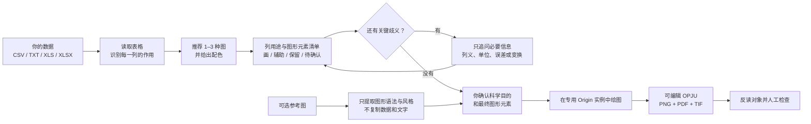

<div align="center">
  
  <h1>EditaPlot · 艾迪图</h1>
  <p><strong>AI 驱动的可编辑科研绘图工作流</strong><br>AI-guided editable scientific figures</p>
  <p>
    
    
    
    
    
    
    <a href="https://github.com/liushunqi8-hash/editaplot2026"></a>
  </p>
  <p><a href="README.en.md">English</a> · <a href="README.zh-TW.md">繁體中文</a> · <strong>简体中文</strong>（双语简介见下方，完整版本见对应语言文件）</p>
</div>

EditaPlot 是一个面向 Codex 的 Windows 本地科研绘图 Skill。你把自己的实验数据交给它后，它会依次理解数据、逐列说明用途、推荐图形、请你确认图形元素、调用 Origin 并验证结果，最后生成**可编辑 OPJU**，同时导出 PNG、PDF、TIF。

EditaPlot is a Codex skill for editable scientific plotting on Windows. You hand it your experimental data; it reads the table, proposes chart types, asks you to confirm each column's role and the figure elements, drives a dedicated Origin instance, and finally produces an **editable OPJU** together with PNG, PDF, and TIF exports.

EditaPlot 是一個導向 Codex 的 Windows 本機科學繪圖 Skill。你把實驗資料交給它後，它會依序理解資料、逐欄說明用途、推薦圖形、請你確認圖形元素、呼叫 Origin 並驗證結果，最後產出**可編輯 OPJU**，同時匯出 PNG、PDF、TIF。

我不希望它只是一套"替换数字"的静态模板，也不会让 Python 预览图冒充 Origin 成图。科学含义和最终选择始终由你决定；遇到把握不足的数据，EditaPlot 会把不确定的列单独列出来请你确认，不会擅自补列、拟合或推断结论。

It is not a static "replace-the-numbers" template, and it never passes a Python preview off as the real Origin figure. Scientific meaning and the final choice stay with you; ambiguous columns are surfaced for your confirmation rather than silently filled in, fitted, or reinterpreted.

它不只是一套「替換數字」的靜態範本，也不會讓 Python 預覽圖冒充 Origin 成品圖。科學意義與最終選擇始終由你決定；遇到不確定的資料，EditaPlot 會把有疑慮的欄位單獨列出請你確認，不會擅自補欄、擬合或推論結論。

> [!WARNING]
> **中文：** 目前只完成了 Windows 10/11 x64 实体电脑上的完整验证。暂未提供 macOS（Intel 与 Apple Silicon）、Linux、WSL、Wine/CrossOver、Parallels 或其他虚拟机版本。如果你使用 Mac，请换用 Windows 实体电脑完成 Origin 全流程。
>
> **English:** Fully verified only on a physical Windows 10/11 x64 machine. macOS (Intel and Apple Silicon), Linux, WSL, Wine/CrossOver, Parallels, and other virtual machines are not supported yet. If you are on a Mac, please use a physical Windows host for the full Origin pipeline.

> [!IMPORTANT]
> **中文：** 按 [Apache License 2.0](LICENSE) 开源。本 fork 唯一针对并实测于 Origin/OriginPro 2026 / 10.30。你不必提前打开 Origin，EditaPlot 会在绘图前自动启动一个专用实例；它不会替你安装或修改 Origin。
>
> **English:** Released under [Apache License 2.0](LICENSE). This fork targets and has been verified only on Origin/OriginPro 2026 (10.30). You do not need to open Origin beforehand — EditaPlot launches a dedicated instance itself and never installs or modifies Origin for you.

## 一眼看懂



当我说“已经画好”时，你会拿到可继续编辑的 Origin 项目和 PNG、PDF、TIF；我还会检查原始数据没有被改动、坐标轴和文字完整，并确认全部必需产物通过格式、对象反读和人工视觉检查。

## 先理解数据，再决定画什么

很多科研表格并不是“每个数字都要画”。我会先把**每一列**放进下面一种用途，并用大白话请你确认：

| 用途 | 在图中怎么处理 |
|---|---|
| 主要证据 | 作为实测点、主曲线、柱体等核心元素绘制 |
| 可见辅助 | 作为背景、拟合线、残差、参考线或物相刻线绘制 |
| 仅用于计算或验证 | 保留用于权重、筛选、坐标或布局，不画成曲线 |
| 保留但不绘制 | 留在数据映射和可编辑项目中，图上不显示 |
| 仍不确定 | 暂停规划，先问清楚用途，不能自动猜成新曲线 |

确认时你会看到“这是什么数据、哪些列会画、哪些列不会画、会出现哪些图形元素、哪些计算不会自动做”。只要源文件、列映射或理解结果发生变化，这次确认就会失效，需要重新核对。

### GSAS / GSAS-II XRD Rietveld 示例

我已为普通 XRD、GSAS-II Powder CSV 和 Publication CSV 加入专门的理解规则。以精修表为例，EditaPlot 可以把 Observed 识别为实测点、Calculated 识别为计算线，并按文件实际提供的内容加入 Background、Difference 和具备明确身份的 Phase 刻线；`weight`、`Q`、`Used`、`diff/sigma`、`Axis-limits` 等列会保留为辅助或控制数据，不会被误画成强度曲线。

Publication CSV 中已经带显示位置的 `Diff` 会按源值直接绘制，不会再次偏移。我也不会自动计算背景、差值、Rwp、χ²，或替你识别物相和峰归属。仓库内提供了 [`example_gsas_powder.csv`](runtime/templates/xrd/example_gsas_powder.csv) 与 [`example_gsas_publication.csv`](runtime/templates/xrd/example_gsas_publication.csv)，可以先拿它们熟悉格式。

### 用参考图告诉我“想要这种表达”

你也可以上传一张 PNG、JPEG 或 TIFF 参考图。我会先把它理解为“图形简报”：提取面板、插图、点线柱等图形元素、数据编码和有限的视觉风格，再把**适合当前模板且有用户数据支撑**的部分列出来请你单独确认。

这条路线不会从像素反推实验数据，不复制参考图中的数值、文字、拟合结果、物相、Logo 或水印，也不会把参考图片塞进 OPJU。它的目标是安全借鉴图形语法，而不是承诺任意图片 1:1 复刻；当前模板表达不了的关键元素会明确拒绝或保留模板默认值。

参考图只是建议，你自己的明确选择优先。你可以直接指定想要的系列颜色、线宽、填充透明度、
画幅比例，以及图例是否显示、是否无框和放置位置。我会在绘图前逐项告诉你哪些会**采用**、哪些
暂时**保留模板默认**、哪些因当前模板尚未验证而**拒绝**；不会把“你可以提出偏好”包装成
“所有模板都已自动支持”。对 XPS，参考图和外观偏好都不能改写原始数据、列用途、结合能轴方向、
峰组分身份或稳定的单区域渐变填充 API。

也就是说，你可以在三种方式中选择：直接使用模板默认；让参考图提供近似风格建议；或给出精确
自定义值。三者冲突时，以你明确确认的精确值为准，但仍须通过当前模板的能力和反读门禁。

XPS 想精确改样式时，我建议你直接这样说：“Raw 用 `#173F5F`、Envelope 用 `#C94C4C`，
线宽 `2.4 pt`、填充透明度 `38%`、画幅 `18 × 18 cm`，隐藏图例；科学含义保持不变。”
我会把确认值冻结到 `--visual-style-json`，不合法的精确值会直接请你修正，不会静默退回默认。

## Star 趋势

这是我从开源首日开始记录的 GitHub Star 总数。首个快照是一个真实的 31 Stars 起点；后续每日快照会自然连成折线。

<div align="center">
  <a href="https://github.com/liushunqi8-hash/editaplot2026"></a>
</div>

我只保存“日期 + 仓库 Star 总数”，不读取或保存用户名、账号 ID、个人加星时间或名单。

## 能力覆盖

| 领域 | 已覆盖图形与证据 |
|---|---|
| 材料与光谱 | XPS 扫描/拟合、XPS 多谱线对比、普通 XRD、GSAS/GSAS-II XRD Rietveld、XAS、FTIR/IR、NMR、DSC、PL/TRPL、UV–Vis/Tauc、EIS、CV、LSV、三维多条件 Nyquist |
| 通用统计 | 柱状/条形、误差棒、堆叠/百分比堆叠、饼图、桑基、多阶段环形有向加权网络、折线、趋势、散点、气泡、雷达、热力图（支持高密度矩阵自适应布局） |
| 分布与效应 | 原始点汇总、箱线、小提琴、Raincloud、直方图、森林效应图、三维双密度曲线与用户提供的基线焦点 |
| 医学与深度学习 | ROC、PR、校准、DCA、混淆矩阵、Bland–Altman、配对纵向轨迹、分组箱线、复合预计算 SHAP（蜂群 + Mean \|SHAP\| + 真实色标 + 可选分组贡献）、医学多面板规划 |

我不会擅自平滑数据、删除异常值、补峰、计算误差、拟合曲线、识别物相或训练模型。寿命、带隙、SHAP 等分析结果也只有在你明确提供后才会画进图里。

SHAP 路线只读取你在上游已经计算好的逐样本长表，最少需要 `Feature + SHAP value + Feature value`；
还可提供 `Sample ID`、`Feature Order`、`Mean absolute SHAP`、`Feature Group` 和
`Group contribution (%)`。我会按实际列自动选择“仅蜂群”“蜂群 + Mean |SHAP|”或
“蜂群 + Mean |SHAP| + 分组贡献”三种 profile。缺少的汇总量若需要从已提供 SHAP 值派生，
会单独列出公式、来源与用途并等你确认；源 CSV 不会被重写。可先查看
[`medical_shap_summary.csv`](examples/gallery/medical_shap_summary.csv)。

### SHAP 分栏重要性与双层环图

我新增了独立的 `shap_dashboard` 模板：左侧是特征重要性和占比，右侧保留每个样本的 SHAP
贡献，双环用外环表示特征组、内环表示组内特征。空白足够时双环内嵌在条形图区，否则自动放入
下方独立区域，避免遮挡数据。
支持 2–20 个特征和 2–5 个特征组，原有 `shap_summary` 叠加式模板继续可用。

准备四个必需列：`Feature`、`SHAP value`、`Feature value`、`Feature Group`，也兼容中文列名。
每个特征至少 3 个观测，可从 [1,440 行合成数据样例](examples/gallery/shap_dashboard.csv) 开始。
我不会训练模型或计算 SHAP；重要性、占比和显示变换会先列明公式并请你确认。

直接说：“请用 `$editaplot` 的 SHAP 分栏与双层环图，配色选紫绿金，保留所有数据。”
三种配色对应 `dashboard_blue_red`（蓝白酒红）、`dashboard_viridis`（紫绿金）和
`dashboard_red_blue`（红黄蓝），由 Codex 写入列映射的 `plot_mode`。

<div align="center">
  
  
  
</div>

### 新增材料与关系数据怎样准备

| 想画的图 | 最少需要的数据 | 我会坚持的边界 |
|---|---|---|
| XPS 多谱线对比 | 结合能 + 至少两条独立实测强度 | 默认直接叠加；背景、包络、残差和分峰列不会被误当成样品 |
| FTIR / IR | 波数 + 一条或多条吸光度/透过率 | 波数从高到低显示；不自动校正、平滑、标峰或指认官能团 |
| NMR | 化学位移（ppm）+ 一条或多条强度 | 化学位移从高到低显示；不自动相位校正、积分、认峰或归属 |
| DSC | 温度 + 一条或多条热流 | 先确认吸热/放热方向；不自动识别 Tg、Tm、Tc 或计算焓变 |
| PL / TRPL | 波长或时间 + 发光强度；拟合列可选 | 支持多样品/多条件；拟合和寿命必须由你提供 |
| UV–Vis / Tauc | 波长 + 吸光度/透过率；Tauc 数据可选 | 支持多样品；不自动换算光子能量、选指数、拟合或计算带隙 |
| 桑基图 | `Source + Target + Value` 正权重长表 | 表达流量或组成传递；不补节点、不推断缺失流量 |
| 环形有向加权网络 | [`Panel + Source + Target + Weight`](examples/gallery/circular_network.csv)；`Sign` 与最多 4 个节点组可选 | 比较多个面板中的定向关系；共享节点位置和统一线宽尺度，单面板超过 12 条边时保留但隐藏边标签，不把相关关系解释成因果 |
| 三维双密度曲线与基线焦点 | [`Condition ID + Condition Position + Density X + Solid Density + Dashed Density + Focal X`](examples/gallery/density_ridgeline3d.csv)；2–6 个真实条件 | 两条密度和每组一个焦点都必须由你在上游提供；焦点固定在 Z=0，不自动做 KDE、找峰、求交点或阈值 |

高密度热力图会保留矩阵中的每一个值和原始顺序，只减少屏幕上的重复刻度文字：矩阵较密时隐藏单元格数字、稀疏显示行列标签，并把 colorbar 与数据区分开。公开页面只展示一张真实 Origin 生成的 30×30 案例；它已经完成 OPJU/PNG/PDF/TIF、轴与颜色条对象反读及人工视觉检查。原来的小矩阵和 40×40 案例仍保留在验证资产中，供回归与审计使用，不再重复展示。

## 真实 Origin 示例

我用合成教学数据制作并人工检查了下面这些示例。公开图片已去除可能泄露信息的元数据，每个文件的校验值都记录在清单中。

<div align="center">
  
  
  
  
  
  
</div>

➡️ [浏览 48 个对外展示案例与简要用途](docs/gallery.md)

当前公开能力包含 41 条 Origin 绘图路线。仓库保留 50 张通过实机产物、对象反读、人工视觉检查和公开图片审计的验证 PNG，其中 48 张进入页面展示；两个未展示案例只是热力图的历史回归证据。DSC、NMR、FTIR/IR、XPS 多谱线对比、PL 多条件、UV–Vis 多样品、30×30 高密度热力图、576 点复合 SHAP、多阶段环形有向加权网络图与三维双密度基线焦点图都已完成 Origin 2024b 实机门禁。

### 一次正常运行要多久

如果项目环境已经配好、数据量正常，而且必要确认已经完成或无需继续补充，我把**本地识别、真实 smoke、启动 Origin、绘图、导出和验证在 4–5 分钟内完成**视为合理范围。它不是对每台电脑的固定秒数承诺：第一次安装依赖、大型 Excel、复杂图层、较慢磁盘或 Windows 安全扫描都可能增加一些时间。

**在没有等待你确认或批准权限、并且没有新的本地进度事件时，30–60 分钟不属于正常绘图耗时。**
新版会在可安全恢复的瞬时启动故障后尝试清理自有实例；只有清理成功才自动重试一次，同时保留实时进度。它不会为了
制造一个“超时结束”而强杀可能正在管理隐藏 Origin 的 Python 进程；遇到长时间无进度时，我会让
Codex 先报告“当前停在哪一阶段”和该阶段已经耗时多久，保留现有诊断，再做最小排查：

1. `setup` / 下载依赖：检查 GitHub、Python 包源、代理和网络，而不是责怪 Origin；
2. 数据理解与确认：检查是否在等待你的回复或权限批准；
3. `origin-smoke`：检查本机 Origin Automation 是否已启动或返回稳定错误；
4. `render` / 导出：检查 Origin 是否弹出了对话框、文件夹是否可写、是否被同步软件锁定；
5. `verify`：检查 OPJU、PNG、PDF、TIF 与反读报告，而不是重新画一遍。

正式绘图本身不应依赖持续联网；网络主要出现在首次下载、更新和安装锁定依赖时。阶段没有变化时，不要让 Codex 无限制重试、反复重装环境或扩大系统权限。
瞬时启动故障会在半启动实例清理成功后自动再试一次；清理失败或第二次启动仍失败都会停止。后续
经用户同意再试时，要用新的空白同级输出目录保留首次诊断，绝不会静默接管已经打开的用户项目。
如果最初的启动和随后清理都失败，EditaPlot 会同时保留两组脱敏信息：最初启动的短错误代码/阶段，
以及清理步骤的短错误代码/阶段。它们帮助我区分“为什么没启动”和“为什么没清理完”，不会包含
Windows 账户名、本地路径或原始 COM 报错全文，也不会因此继续自动重试。

你可以同时打开多个 Codex 任务做数据理解、选图和制定方案；这些非 Origin 工作可以并行进行。
真正进入 EditaPlot 的 `origin-smoke` 或 `render` 后，同一 Windows 登录会话一次只运行一个
Origin 自动化阶段，其余任务自动等待。等待事件名为 `origin_job_queue`，大约每 30 秒更新一次；
队列不承诺严格先来先服务。等待满 30 分钟时只停止这个等待任务，不会强杀或打断正在占用 Origin
的任务。任务结束或进程异常退出后，Windows 会释放队列锁；绘图成功后按你的选择保留 Origin
窗口，也不会继续占用队列。这个保护只协调新版 EditaPlot worker，不能替其他手动脚本、旧版本或
第三方程序管理 Origin，所以看到排队提示时不要重复启动同一任务。

## 中文科研配色


我在首屏准备了 8 套推荐色组，完整目录另含 2 套进阶色组。你只需选择喜欢的配色，EditaPlot 会记住具体颜色和使用限制，让以后重画保持一致。对 XPS 组分、正负值、热力图、诊断参考线等有科学含义的颜色，我不会为了美观随意改变。

如果你明确指定了每条系列对应的颜色，我会让这一选择优先于参考图，并先检查当前模板是否已验证
该精确覆盖；结果仍会逐项写成采用、保留默认或拒绝，不会悄悄打乱组分含义。

这些配色由我重新设计和抽象，不复制期刊封面、水印或版式，也不是任何期刊的官方模板。详见[配色指南](docs/palette-guide.md)。

## 开始使用

### 1. 准备环境

| 项目 | 你需要知道的事 |
|---|---|
| 系统 | 我目前完整验证的是 Windows 10/11 x64 实体电脑；Mac、Linux、WSL 与虚拟机版本暂未提供 |
| Origin | 本 fork 唯一针对并实机验证于 Origin/OriginPro 2026 / 10.30；其他版本不在本 fork 支持范围 |
| Python | 需要 64 位 Python 3.10–3.12；启动器会自动选择，你无需手动配置 |
| 数据 | 你可以使用 CSV、TXT、XLS 或 XLSX，也可以保留中文列名与中文路径 |

你不必先弄懂 Python 环境。我让根目录的 `editaplot.cmd` 先寻找电脑上已有的兼容 Python，再创建只属于本项目的环境。若完全找不到，启动器会返回明确的缺少 Python 诊断；此时 Codex 必须先用中文解释这项系统变更并等你同意，之后才可通过官方 winget 安装用户范围的 Python 3.12。没有 winget 时，我在安装指南中给出了 python.org 官方路径。这个过程不会安装或修改 Origin。Doctor 只做只读发现；正式绘图前的真实 smoke 才会自动启动专用 Origin 实例并验证连接。

### Codex 需要哪些权限

我建议按下面的最小范围批准，不需要把整台电脑交给 Codex：

| 允许的范围 | 用途 |
|---|---|
| 读取完整 EditaPlot 仓库、你的数据文件和可选参考图 | 安装 Skill、理解列含义、制定绘图计划 |
| 写入 EditaPlot 仓库和当前用户的 `$HOME\.codex\skills\editaplot` | 创建项目隔离环境并安装/更新 Skill |
| 写入原始数据所在文件夹 | 在源文件旁新建时间戳交付文件夹；不会覆盖原文件 |
| 运行本地 `editaplot.cmd`、PowerShell、Python，并在当前 Windows 用户会话启动 Origin | 完成环境检查、Automation smoke、绘图、导出和反读 |
| 首次安装或更新时访问 GitHub、Python 包源；缺少 Python 时另行确认 winget | 下载公开源码和锁定依赖 |

普通使用**不需要**管理员权限、鼠标控制、整个 C 盘写权限，也不需要修改 DCOM、注册表、防火墙或 Origin 安装。若 Windows“受控文件夹访问”、单位策略、OneDrive/网盘同步或只读目录阻止写入，请只放行当前仓库与当前数据文件夹，或明确选择另一个可写输出目录；不要把全局提权当作修复方法。

Codex 桌面版的普通命令可能由隔离账户运行。这个进程即使继承了你的 `USERNAME` 或
`USERPROFILE`，也不一定拥有当前登录用户启动 Origin 的权限，所以我让 EditaPlot 读取当前进程
真实的 Windows 安全令牌，而不是相信环境变量。检测到 Codex 沙箱时，它会在调用 Origin COM
之前停止，并让 Codex 只针对这一条精确的 `origin-smoke` 或 `render` 命令发起正式、受限的本地
执行申请。只有这条精确申请获批后，Codex 才会重新执行同一条 Origin 命令并继续当前任务；申请
可以由你在提示时确认，也可以由已经配置的 Codex 自动审查评估，但审批不保证通过，自动审查也
不等于提前赋予所有 Origin 命令权限。你不需要把命令复制到自己的 PowerShell，也不需要管理员
权限、DCOM/注册表修改或所谓“绕过沙箱”。如果你所在组织或本机策略拒绝申请，任务会清楚停止，
不会把失败包装成 Origin 已完成。

EditaPlot 自带的 Python runtime 与 Origin 自动化不会主动把你的数据上传到网络；但你主动交给 Codex 的文件仍受你所使用的 Codex 账号、组织和数据保留策略约束。医学数据或参考图在交给 Codex 前必须按你所在机构的要求去标识化，并检查图像中是否烧录了身份信息；EditaPlot 不承诺自动发现 PHI。详见[隐私说明](PRIVACY.md)。

### 2. 安装 Codex Skill

```powershell
git clone https://github.com/liushunqi8-hash/editaplot2026.git
Set-Location editaplot
.\editaplot.cmd setup
```

请下载或克隆完整仓库，因为 `skill/editaplot` 和绘图 `runtime/` 需要一起工作。只复制 Skill 子目录会缺少绘图引擎。如果你不会使用 GitHub，也可以直接下载 Source ZIP，完整解压后在该目录运行同一条 `setup` 命令。详见[安装指南](docs/installation.md)。

重新打开一个 Codex 任务后使用 `$editaplot`。第一次处理数据，只需：

```powershell
.\editaplot.cmd start "$HOME\Documents\my-data.csv"
```

如果你是第一次使用，最简单的方法是把文件拖进 Codex，然后说：“请使用 `$editaplot` 帮我画这份数据。”我会让 EditaPlot 完成环境检查、只读识别与候选图推荐，再给出逐列用途和图形元素清单；你只需确认科学目的与这份清单，只有判断不够明确时才需要补充列义、误差或变换等关键细节。熟悉命令行后，也可以使用下面这些命令：

正式绘图时，我会让 EditaPlot 在原始 CSV、TXT、XLS 或 XLSX 所在目录中，新建一个与源文件同级的 `<数据文件名>_EditaPlot_<时间>` 文件夹，并把 render-plan、OPJU、PNG、PDF、TIF、反读与验证结果集中放进去。它不会覆盖原始数据；只有你明确指定其他位置时，才会改变输出目录。

```powershell
.\editaplot.cmd doctor
.\editaplot.cmd inspect <data.csv>
.\editaplot.cmd recommend <data.csv> --intent "比较模型并展示误差"
.\editaplot.cmd understand <data.csv> --template-id xrd --output data-understanding.json
.\editaplot.cmd palettes
.\editaplot.cmd plan <data.csv> --template-id bar --claim "模型 A 指标更高" --evidence-role comparison --palette-id ocean_coral --semantic-confirmation-json semantic-confirmation.json --output render-plan.json
$smokeDir = Join-Path $env:TEMP ("EditaPlot-origin-smoke-" + (Get-Date -Format "yyyyMMdd-HHmmss"))
.\editaplot.cmd origin-smoke --output-dir $smokeDir
.\editaplot.cmd render render-plan.json
.\editaplot.cmd verify <Origin-output-directory>
```

仓库已经包含运行所需的 `runtime/`。`origin-smoke` 会先启动 EditaPlot 自有的隔离 Origin
实例并完成最小导出闭环；只有 smoke 通过后才进入正式 render。日常使用可以忽略
`--engine-home`；只有你主动替换内置引擎时才需要它。普通绘图请省略 `render` 的
`--output-dir`，这样正式结果会自动保存到源数据同级的新文件夹。

### 3. 直接复制给 Codex 的提示词

```text
请使用 $editaplot 帮我画这份数据。不要修改原文件；先告诉我识别到哪些列、最推荐哪种图，
再逐列说明哪些要画、哪些只作辅助或验证、哪些保留但不画，并列出最终图形元素和不会自动进行的
计算。若有不确定列，请先问我，不要猜。若需要安装 Python，请先征得我同意；不要安装或修改 Origin。
等我确认科学目的和元素清单后再绘图，完成后请检查可编辑项目和 PNG、PDF、TIF。
我不需要提前打开 Origin。Doctor 只做只读发现；请在绘图前运行真实 smoke，
自动启动专用 Origin 实例并按当前版本和模板能力继续。
若只因 Codex 沙箱上下文停止，请为原来的精确 Origin 命令发起正式、受限的本地执行申请；
只有申请获批后才重跑，审批不保证通过。不要让我复制 PowerShell、使用管理员权限或修改 DCOM/注册表。
```

如果还提供了参考图，可以接着说：

```text
请把参考图只当作视觉简报：总结它的图形元素、布局、数据编码和可安全采用的风格，
不要复制图中的数据、文字、拟合结果、物相、Logo 或水印，也不要把参考图嵌入成图。
请另外询问并记录我明确选择的系列颜色、线宽、填充透明度、画幅比例和图例显示/无框/位置；
我的明确选择优先于参考图。请分别列出“采用、保留模板默认、拒绝、仍需确认”的内容，
只有当前模板已经验证并能反读的样式才算采用，等我确认后再适配到我的数据。
```

如果是 XPS，你还可以只补一句：“这次选精确自定义；Raw 用 `#173F5F`，线宽 `2.4 pt`，
填充透明度 `38%`，画幅 `18 × 18 cm`，隐藏无框图例。”我会先核对字段并写入
`--visual-style-json`，不会把不支持的值装作已经采用。

需要正式绘图时：

```text
请按已确认的 RenderPlan 自动启动专用 Origin 实例并绘制，成功后保留可编辑 Origin 窗口；
若 smoke 或绘图失败，只简要报告技术阶段和下一步。导出 OPJU、PNG、PDF、TIF，并完成轴、
字体、图层、数据映射反读和人工视觉检查。不要只看 PNG 报成功。
```

## 公开仓库里有什么，哪些内容留在本地

我把公开仓库整理成了一套完整可运行的软件。为了不把你的数据和我的开发记录混进公开版本，我只在本地保留发布时不应携带的证据；这里没有隐藏功能或“付费完整版”。

| 我放进公开仓库的内容 | 我只保留在本地的内容 |
|---|---|
| Apache-2.0 源码、完整 Skill、清理后的 runtime | `DEVELOPMENT_LEDGER.md`、内部计划与开发日志 |
| 中性合成示例数据、原创配色资产 | 你的原始数据、参考截图、未获再分发许可的材料 |
| 50 个已复核且清理元数据的验证 PNG，其中 48 个用于页面展示，覆盖 41 条绘图路线 | OPJU/PDF/TIF、RenderPlan、对象反读与验证 JSON |
| 双语文档、测试、依赖锁、资产与 runtime 校验清单 | 本机绝对路径、缓存、虚拟环境、临时输出、私钥与 token |

为了避免把本机资料误发到公开仓库，我给公开文件加了白名单、密钥扫描、PNG 检查和 SHA-256 清单。你可以在[发布与许可边界](docs/release-boundaries.md)查看完整规则。

## 我为科学可靠性保留的边界

- 我只读原始文件；绘图所需的辅助列只进入内存或可编辑 Origin 工作簿。
- 我会在绘图计划前逐列说明用途；不确定的数值列不会自动变成一条新曲线。
- 缺少列时，我会告诉你怎样修复，不会补造不存在的测量值。
- 参考图只能影响已确认数据可以支撑的图形语法与安全风格，不能新增证据或隐藏必需元素；
  我明确选择的样式优先，并逐项记录为采用、保留默认或拒绝。
- 我只在第三轴具有真实实验含义且能改善证据表达时使用 3D，不做装饰性 3D。
- 图例可以在 OPJU 中手动移动；坐标轴缺失、字体不一致、色条重叠或文字裁切仍会判为失败。
- 新 Origin API 会先查官方文档并做隔离实验，未经验证的 LabTalk 参数不会进入正式模板。

## 独立项目声明

我独立维护 EditaPlot，只调用你电脑上已经安装的 Origin 或 OriginPro；默认启动由 EditaPlot 独占的本机实例，不要求你预先打开窗口。它不捆绑、安装或修改该应用，也不通过网络或云端开放其 Automation Server。我与 OriginLab Corporation 没有隶属、赞助或背书关系；相关名称仅用于说明兼容性。

## 开源、贡献与支持

顶部徽章和趋势图都只使用 GitHub 提供的仓库聚合数量。我不会请求、保存或展示 Star 用户名单、用户名、账号 ID 或个人加星时间。

- 许可证：[Apache License 2.0](LICENSE)
- 安装与故障处理：[安装指南](docs/installation.md)
- Origin 版本边界：[2026 兼容说明](docs/origin-2026-compatibility.md)
- 中文快速开始：[docs/quickstart.zh-CN.md](docs/quickstart.zh-CN.md)
- 贡献说明：[CONTRIBUTING.md](CONTRIBUTING.md)
- 安全报告：[SECURITY.md](SECURITY.md)
- 支持范围：[SUPPORT.md](SUPPORT.md)
- 依赖与许可证清单：[docs/dependency-inventory.md](docs/dependency-inventory.md)

未来我可能会另行提供咨询、安装协助、定制或支持服务，但不会因此限制 Apache-2.0 已授予的权利。如果产品以后进入收费软件许可、托管/远程服务或多租户运行阶段，我会重新完成许可与商标审计后再发布。
