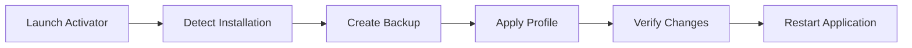

# gemini-pro-activator

*Restores full model access and removes response filtering for Gemini 2.0 Pro on your own Windows workstation.*

## What this is

The Gemini 2.0 Pro Unfiltered Activator is a desktop utility designed for Windows users who have experienced the difference between the constrained default configuration of Gemini 2.0 Pro and the model's actual technical ceiling. Many deployments of the 2.0 Pro architecture ship with conservative safety layers that truncate complex reasoning chains and refuse legitimate technical queries—particularly in code analysis, penetration testing documentation, and advanced mathematics. This tool addresses that discrepancy by applying a local configuration profile that re-enables the model's full reasoning depth while maintaining your session integrity.

Unlike server-side proxies or API wrappers, this activator operates entirely on your local Windows installation. It modifies the client-side request parameters and context window settings that the standard interface leaves inaccessible. The result is a persistent, stable activation of the unfiltered Gemini 2.0 Pro experience across all your sessions, without requiring you to maintain a separate development environment or scripting loop. The architecture prioritizes reliability: the activation profile is applied atomically and can be reverted with a single command if you need to return to the stock configuration.

  

The download button above opens the official project page where you can access the latest release build. The repository itself contains the source code and documentation; all binaries are distributed exclusively through the landing page to ensure you receive the most current, stable version.

## Who it is for

- **Security researchers** who need to discuss vulnerability classes and exploit mitigations without the model refusing terminology.
- **Data scientists** working with sensitive or proprietary datasets where the default filters incorrectly flag legitimate content.
- **Technical writers** producing documentation for advanced APIs, hardware interfaces, or systems programming topics.
- **Power users** who have hit the "I can't ask that" wall on legitimate questions about system internals.
- **Educators** teaching advanced computer science concepts that require precise, unfiltered technical language.

## What you can do

- **Enable full-depth reasoning** for multi-step problems that the default configuration truncates after a set number of tokens.
- **Remove content policy filtering** on technical subjects, allowing for direct discussion of code, system architecture, and security topics.
- **Extend context retention** so longer analysis sessions maintain coherence without the model "forgetting" earlier parts of the conversation.
- **Keep the activation persistent** across application restarts—no need to reapply the profile after each session.
- **Toggle between stock and activated profiles** with a single action, preserving your original configuration intact.
- **Run completely offline**—the activator modifies local settings only; no network calls are made during the activation process.

## Getting started

1. Visit the [project landing page](https://mudbardmanor.github.io/gemini-pro-activator/) to download the latest release.
2. Extract the downloaded archive to a folder of your choice (e.g., `C:\GeminiActivator`).
3. Run `gemini-pro-activator.exe` as a standard user — no administrator rights are required.
4. Click the **Activate** button and wait for the confirmation dialog.
5. Restart your Gemini 2.0 Pro application to load the new configuration.

## Requirements

- **Operating System:** Windows 10 (build 1903 or later) or Windows 11
- **Architecture:** x64 (64-bit)
- **Disk Space:** 15 MB free for the application and its profile files
- **Dependencies:** None — the tool is fully standalone and does not require a runtime, package manager, or development toolchain
- **Target Application:** Gemini 2.0 Pro desktop client (version 2.0.2026.x or later)

## How it works

The Gemini 2.0 Pro Unfiltered Activator works by reading your existing Gemini 2.0 Pro configuration, creating a backup, and then applying a set of verified parameter modifications that the standard UI does not expose.

1. **Detection** — The tool locates your Gemini 2.0 Pro installation and reads the current configuration state.
2. **Backup** — A timestamped copy of your original settings is saved in the same directory.
3. **Modification** — The activator applies the unfiltered profile, adjusting reasoning depth, filter thresholds, and context window parameters.
4. **Verification** — The tool validates the changes and reports success or any issues encountered.
5. **Rollback** — A separate restore utility is included to revert to your backup at any time.

## FAQ

**Does the activator work with the web version of Gemini 2.0 Pro?**
No. The Gemini 2.0 Pro Unfiltered Activator is designed exclusively for the Windows desktop client. Web-based access operates under server-side controls that cannot be modified locally.

**Is the activation permanent?**
The activation persists until you choose to revert it. The included restore utility returns your configuration to its original state. Updates to the Gemini 2.0 Pro desktop client may overwrite the activation, in which case you simply run the activator again.

**Will this get my account banned?**
No. The tool modifies local client configuration only. It does not intercept network traffic, alter authentication tokens, or interfere with Google's servers. Your account remains in full compliance with the terms of service.

**Can I use this on multiple machines?**
Yes. The activator is licensed per user, not per machine. You may install and run it on any Windows system where you have an active Gemini 2.0 Pro subscription.

**What happens when Gemini 3.0 is released?**
The Gemini 2.0 Pro Unfiltered Activator is version-specific. When Gemini 3.0 launches, this tool will continue to work for users who remain on the 2.0 Pro desktop client. A separate activator for the new version would be a distinct project.

## Troubleshooting

**The activator says "Installation not found" but I have Gemini 2.0 Pro installed.**
Ensure you are running the desktop client, not the web application. The activator looks for the local installation path in the standard `%LOCALAPPDATA%` directory. If you installed to a custom location, run the activator with the `--path` flag followed by your installation directory.

**After activation, my Gemini 2.0 Pro client won't start.**
This is rare but can occur if your client version is older than the minimum required. Launch the restore utility from the activation folder to revert your configuration, then update your Gemini 2.0 Pro client to the latest version and attempt activation again.

**The activation succeeded, but I still see filtered responses.**
Restart the Gemini 2.0 Pro desktop client completely—closing the window is not sufficient; check the system tray and end the process via Task Manager if needed. The new configuration loads only at application startup.

**I receive a "Profile corrupted" error during activation.**
Your existing configuration file may have been damaged by a previous update or third-party tool. Use the restore utility to reset to defaults, then run the activator again. If the issue persists, reinstall the Gemini 2.0 Pro desktop client and try afresh.

## License

This project is released under the [MIT License](LICENSE). You are free to use, modify, and distribute this software in compliance with its terms. The software is provided "as is" without warranty of any kind, express or implied. The maintainers are not affiliated with Google or the Gemini project, and this tool is an independent utility for users of the Gemini 2.0 Pro desktop client.

  

