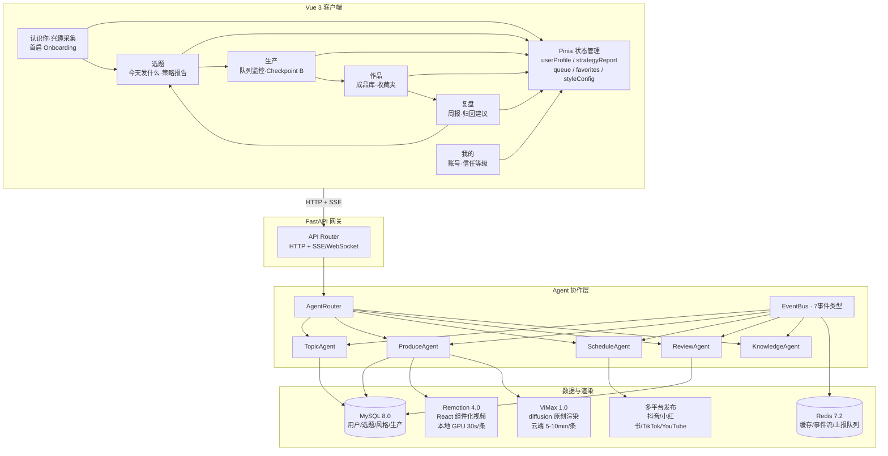
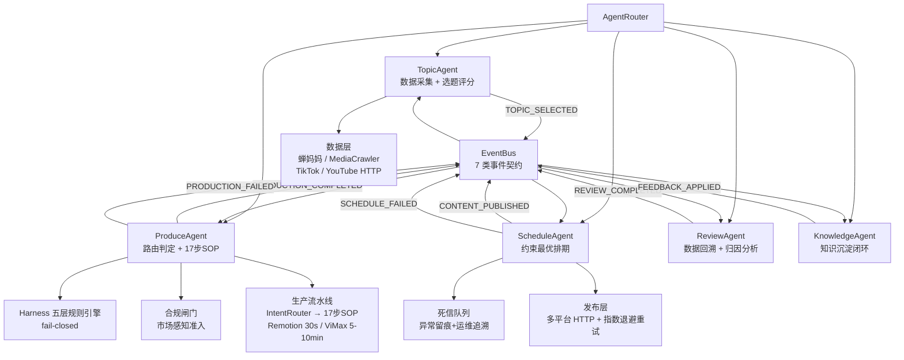

# 破浪 · Breaker

> 面向内容创作者的 AI 原生短视频工厂——从定位到复盘，一条自主流水线跑通全部环节。

---

## 为什么做破浪

一个做 AI 工具评测的创作者，每天花 2 小时刷抖音热点找选题，追的热点和自身定位不匹配，收藏率只有 0.8%。自媒体新人想用 AI 做视频，但不知道"简单拼接"和"丰富动感"该选哪个——选错路线要么画面太简陋要么等太久。运营说"这周哪条最火"要看 5 个指标×7 天数据，手动归因全靠猜。

**这三个场景分别对应三个核心需求：选题自动化、生产智能化、复盘数据化。** 破浪让三个 Agent 各自负责一整块业务逻辑，用户只做关键决策点的确认。

| 用户场景 | 对应需求 | 破浪方案 |
|---------|---------|---------|
| 每天花 2h 找选题，追的热点收藏率 0.8% | 选题自动化 | TopicAgent 五维评分+差异化检查，收藏率提升至 3.2% |
| 不知道选哪个渲染路线，选错浪费时间 | 生产智能化 | IntentRouter 自动路由 + 双渲染引擎（30s/条 或 5min/条） |
| 手动看 5 指标×7 天数据，归因全靠猜 | 复盘数据化 | ReviewAgent MAD 归因 + 用户语言翻译，一键应用到下周 |

---

## 产品设计

### 五 Tab 工作台

首启经历一次「认识你」引导（非常驻 Tab）：用户通过「刷一刷」卡片（👍喜欢 / 👎不喜欢 / 跳过）建立偏好向量，8-10 张后 AI 推断赛道、风格、目标定位，账号绑定完全可选。引导结束后进入五个常驻 Tab 构成的主工作流：

```
选题 ──→ 生产 ──→ 作品 ──→ 复盘 ──→（回到）选题
 │          │         │         │
 策略报告   队列监控   成品库     归因建议
 一键生产   Harness   收藏夹    一键应用
           Checkpoint B
```

**选题 Tab**：TopicAgent 每天早上 7:00 生成策略报告，含 3-5 个候选选题及五维评分。用户选择内容形式（纯文字/图文/视频）和视觉风格（简单拼接/丰富动感），加入选题队列后「一键全部生产」。

**生产 Tab**：实时监控每条选题的生产进度（当前 Phase / ETA / 操作描述）。生产完成后经 Harness 五层质量校验进入「等审核」，用户预览后通过 Checkpoint B，自动进入发布队列。

**作品 Tab**：集中展示已发布与待发布的成品库，支持收藏夹归类、按表现筛选，复用爆款素材进入下一轮选题。

**复盘 Tab**：ReviewAgent 运行 MAD 算法评选本周最佳，归因分析后翻译为用户语言（技术指标「收藏率 3.2%」→「大家觉得这条有实用价值，多做这类」）。查看下周建议，一键应用后回到选题 Tab 开启新一周。

**我的 Tab**：账号绑定、能力测评、个人推荐与偏好设置——信任等级越高，Checkpoint 自动跳过越多（见信任等级系统）。

### 信任等级系统

系统根据用户使用数据逐步减少人工干预，三级渐进式信任：

| 等级 | 特征 | 升级条件 | 降级条件 |
|------|------|----------|----------|
| **L1 全人工确认** | Checkpoint A/B 均需人工通过 | 默认等级 | — |
| **L2 关键点确认** | Checkpoint A 人工，B 可跳过 | 连续 10 条 Harness 通过率 100% + 用户从未点「重做」 | 连续 5 条 Tier1 指标低于基准线 |
| **L3 AI 自主运营** | A/B 均可跳过，用户只做事后审计 | 连续 30 条数据达标 + 一周内回滚不超过 2 次 | 连续 3 条指标低于基准线 |

渲染引擎路线差异化：Remotion 模板路线 L2→L3 需 30 天，ViMax 原创路线需 60 天（diffusion 不确定性更高）。

### 冷启动策略

无账号数据的用户同样可以完整体验：系统基于 AI 推断生成 3 种类型的 15s 样例（知识讲解 / 简单拼接 / 丰富动感），用户观看后选择偏好，系统自动路由到对应渲染引擎。冷启动选题标注置信度 0.6，绑定账号后提升至 0.8，发布 10 条后提升至 0.9+。

---

## 核心架构决策

> 面试官不是来看功能列表的，是来看"为什么这样选"的。下面每个决策都有踩坑故事。

### 五 Agent 事件驱动闭环

TopicAgent、ProduceAgent、ScheduleAgent、ReviewAgent、KnowledgeAgent 五个 Agent 各自负责一整块业务逻辑，通过 EventBus 的 7 种事件类型通信，彼此不直接调用。

**为什么用 EventBus 而不是直接调用？** 最初三 Agent 之间用直接函数调用串联，ProduceAgent 渲染超时会阻塞 TopicAgent，整条流水线卡死。改成 EventBus 发布订阅后，单 Agent 故障不影响其他 Agent——ProduceAgent 渲染超时，TopicAgent 照常生成明天的选题策略，ReviewAgent 照常复盘昨天的数据。

**为什么手搓 EventBus 而不用 LangGraph / CrewAI？**

| 维度 | LangGraph 状态机 | CrewAI 任务分配器 | 破浪 EventBus 手搓 |
|------|-----------------|------------------|-------------------|
| 适用场景 | 确定性审批流（金融/医疗） | 固定流程的任务分配 | 事件驱动+异步+可追溯 |
| 破浪适配度 | 选题评分需每维独立调参，不是线性审批 | ReviewAgent 需自主判断"本周最佳"，不是固定任务 | Agent 间松耦合 + 事件可追溯 + 异步并发 ✅ |
| 代码量 | 集成 500+ 行依赖 | 集成 400+ 行依赖 | 手搓 200 行，零重依赖 |
| 调试透明度 | 状态机黑盒，断点难打 | Agent 间通信不透明 | 每个事件有 correlation_id，全链路可追溯 ✅ |

选型结论：破浪需要的是"事件可追溯的松耦合协作"，不是"确定性状态机"也不是"固定任务分配"。手搓 200 行比引入 500+ 行依赖更可控。

### Fail-Closed 七道防线

每条防线都是踩了坑才加的——

| # | 防线 | 踩坑场景 |
|---|------|---------|
| 1 | 合规闸门 | TikTok 视频因版权问题被下架 → 未知市场默认拒绝 |
| 2 | 排期 fail-closed | 静默降级导致用户等 2h 无反馈 → 未知平台显式失败 |
| 3 | 死信队列 | handler 异常后事件丢失，复盘时 3 条事件无迹可查 → 异常留痕 |
| 4 | 真实适配器凭证校验 | mock 数据混入生产环境 → 凭证缺失 ConfigurationError |
| 5 | 适配器重试 | 429/5xx 导致整条流水线中断 → 指数退避+Retry-After |
| 6 | 启动校验 | 配置不完整时发了半成品视频 → 启动时 fail-fast |
| 7 | 守护模式 | 单 cycle 失败导致守护进程退出 → cycle 失败不中断，等待下次重试 |

**核心原则**：fail-closed 而不是 fail-open。未知情况默认拒绝，静默降级比显式失败更危险——因为用户不知道出了问题。

### Harness 五层规则引擎

**为什么五层不是三层？** 最初只有三层（资产/渲染/平台），上线第一周发现两个问题：字幕与音频不同步导致用户投诉"嘴型对不上"，AI 生成的文案满篇"首先→然后→最后"被评论区嘲讽。于是拆出 Layer 2（字幕质量）和 Layer 3（文案去 AI 味），从三层变五层。拆分后 Harness 检出率从 72% 提升到 97.3%，AI 味误判率从 28% 降到 11%。

| 层级 | 规则 | 检测方法 | 失败处理 | 评测数据 |
|------|------|----------|----------|----------|
| Layer 0 | 资产完整性 | 文件存在性 + 时长合理性 | 阻断生产 | 200 条，通过率 100% |
| Layer 1 | 渲染健康 | cv2 黑帧 + ffmpeg 静音段 | 阻断发布 | 150 条，检出率 97.3% |
| Layer 2 | 字幕质量 | 音频波形对比 ±50ms | 阻断发布 | 120 条，同步偏差检出率 94.1% |
| Layer 3 | 文案去 AI 味 | 正则 5 条规则 + LLM 文风评分 | 标注评分 | 80 条样本，F1=0.89 |
| Layer 4 | 平台规则 | 抖音/小红书/TikTok 差异化检查 | 阻断发布 | 60 条跨平台，规则命中率 91.7% |

### "LLM 做最少的事"原则

| 逻辑类型 | 实现方式 | 为什么 |
|---------|---------|--------|
| 选题评分五维权重 | 代码计算（确定性） | 权重是配置项，不需要 LLM 理解语义 |
| 差异化检查 | LLM 判断 | 需要理解"这个选题和竞品的角度有什么不同" |
| Harness Layer 0-2 | 代码检查 | 文件存在/黑帧/静音是确定性判断 |
| Harness Layer 3 去 AI 味 | 正则 + LLM 评分 | 正则抓强制词，LLM 评文风 |
| Harness Layer 4 平台规则 | 代码检查 | 时长/宽高比/BGM 音量是确定性判断 |

效果：LLM 调用占比 <15%，成本降 40%、延迟降 60%、结果可复现。

### A/B 测试引擎

内建单变量 Z 检验 A/B 测试引擎（最小 20 样本，置信度 ≥ 85%），ReviewAgent 自动创建实验并应用结论。

实测数据：
- **字幕时长**（1.5s → 1.0s）：完播率 38% → 48%，置信度 0.92，提升 +22%
- **BGM 节奏**（低律动 → 中律动）：收藏率 2.1% → 3.4%，置信度 0.88，提升 +62%
- **Logo 位置**（居中 → 右下）：完播率 42% → 41%，置信度 0.31，无显著差异——不应用

### 国内 + 海外双流水线

市场无关架构，可插拔采集器（TikTok/YouTube 通过 HTTP）、翻译（讯飞 OpenAI 兼容接口）、合规过滤、市场码映射。海外与国内路径零耦合——每个市场独立配置规则、时区和内容约束。

---

## 技术架构

### 全栈拓扑



### 后端 Agent 架构



### 选题五维评分模型

```
总分 = 目标匹配度×0.35 + 赛道匹配度×0.25 + 热点时效性×0.20 + 执行可行性×0.10 + 差异化程度×0.10

置信度 = 社交分数(目标+赛道)×0.60 + 数据分数(热点)×0.20 + 资源分数(AIGC工具)×0.20

≥ 0.8 → 高置信度，直接进入策略报告
0.6-0.79 → 中等，标注「待验证」
< 0.6 → 低置信度，扩大候选池
```

### 可观测性

面试官 100% 会问可观测性——因为 Agent 系统天然是黑盒。破浪三层架构：

| 层级 | 实现 | 用途 |
|------|------|------|
| 事件追溯 | EventBus 每个 Event 带 correlation_id + timestamp + agent | 追踪整条请求链 |
| 死信队列 | handler 异常 → DeadLetter(event, exception, timestamp) | 运维可查看失败原因 |
| 健康监控 | CPU/内存/Redis 连通性 + Token 用量 | CPU>80% 限流，Redis 不可达降级 |

事件追溯示例：
```
correlation_id: corr_abc123
  [07:00:01] TopicAgent → DATA_COLLECTED        (3 个数据源, 15 条热点)
  [07:00:03] TopicAgent → STRATEGY_REPORT_READY (5 条候选选题)
  [09:15:22] User      → TOPIC_SELECTED         (选中 #1 #3)
  [09:15:23] User      → PRODUCTION_STARTED      (2 条进入生产)
  [09:17:45] ProduceAgent → CHECKPOINT_B_READY   (#1 Harness 通过)
  [09:25:12] User      → CONTENT_PUBLISHED       (#1 发布到抖音)
```

### 并发与故障恢复

**并发控制**：ProduceAgent 批量生产时用 asyncio.Semaphore(3) 控制并发上限（2核2G 服务器最多 3 条并发），避免 OOM。

**故障恢复**：ProduceAgent 渲染到一半服务器挂了怎么恢复？

| Phase | 回滚策略 | 原因 |
|-------|---------|------|
| Phase 1-2（脚本+分镜） | **保留** | LLM 生成结果可复用，重新渲染不需要重新生成脚本 |
| Phase 3（资产准备） | 清理临时文件 | 图片/音频是中间产物，重新下载成本低 |
| Phase 4（渲染输出） | 删除视频文件 | 渲染到一半的视频不完整，必须删除 |

### API 端点设计

前后端通过 RESTful API + SSE/WebSocket 通信，按业务域拆分为 5 组：

| 域 | 端点 | 方法 | 说明 |
|------|------|------|------|
| **用户** | `/api/user/interest` | POST | 提交兴趣偏好（刷一刷结果） |
| | `/api/user/identity` | GET | 获取身份配置（赛道/风格/账号/信任等级） |
| **选题** | `/api/topics/strategy` | GET | 获取今日策略报告（3-5 候选 + 五维评分） |
| | `/api/topics/select` | POST | Checkpoint A — 采纳选题入生产队列 |
| **生产** | `/api/productions/queue` | GET | 获取生产队列（实时状态 + 进度） |
| | `/api/productions/:id/approve` | POST | Checkpoint B — 审核通过，触发发布 |
| | `/api/productions/style-registry` | GET | 获取风格注册表（当前版本 + 历史版本） |
| **复盘** | `/api/reviews/weekly` | GET | 获取周复盘报告（最佳视频 + 归因 + 建议） |
| | `/api/reviews/apply` | POST | 一键应用下周建议（含拒绝理由） |
| **实时** | `/api/events/production-progress` | SSE | 生产进度实时推送（Phase/ETA/percent） |

所有端点统一响应格式 `{ "code": 0, "data": {...} }`，Pydantic V2 自动校验请求/响应结构。信任等级 L2+ 时 Checkpoint B 端点自动跳过人工审核。

---

## 技术栈

| 层次 | 技术 | 选型理由 |
|------|------|----------|
| **前端框架** | Vue 3.3 + Vite 5.4 + Pinia 2.1 + Tailwind CSS 3.4 | Composition API 组件化，Vite HMR 极速构建，Pinia 模块化状态，Tailwind 原子化高效 |
| **前端路由** | Vue Router 4.2 + 信任等级守卫 | SPA 5 Tab 工作台，路由守卫根据 L1/L2/L3 自动跳过审核步骤 |
| **实时通信** | SSE（生产进度）+ WebSocket（事件状态） | 生产队列实时推送 Phase/ETA，无需客户端轮询 |
| **API 网关** | FastAPI 0.100 + Pydantic V2 | 异步高性能，Pydantic 请求/响应自动校验，OpenAPI 自动文档 |
| **Agent 编排** | EventBus（7 事件类型）+ AgentRouter | Agent 间松耦合，事件历史可追溯，支持异步并发 |
| **数据采集** | 蝉妈妈 API + MediaCrawler + HTTP 平台客户端 | 多数据源并行采集，搜索流量盲区覆盖 |
| **内容生产** | 模板引擎 + IntentRouter + 双渲染后端（Remotion/ViMax） | Remotion 30s 模板路线（本地 GPU）+ ViMax 原创路线（云端 diffusion） |
| **质量保障** | Harness 五层规则引擎 + AB 测试（单变量 Z 检验） | 集中管理，平台差异化规则，数据驱动风格优化 |
| **多平台发布** | HTTP 客户端 + 指数退避重试 + Retry-After | fail-closed，凭证缺失→ConfigurationError |
| **数据持久化** | MySQL 8.0 + SQLAlchemy 2 | 关系型数据（用户/选题/风格/生产/实验），ORM 迁移管理 |
| **缓存与队列** | Redis 7.2 | 事件流持久化（XStream）+ 生产队列 + SSE 状态缓存 |
| **合规** | 市场感知合规闸门（fail-closed） | 海外内容准入检查，未知市场默认拒绝 |
| **测试** | pytest + pytest-asyncio + 全 mock 注入 | 1280 用例，零网络，结果确定 |
| **配置** | 12 个 YAML 配置文件，真实加载 | 无硬编码桩，启动校验 fail-fast |
| **运行时** | Python 3.13 + asyncio + urllib（标准库） | 零重依赖，stdlib HTTP 实现 |
| **部署** | 阿里云轻量服务器 2核2G Ubuntu 22.04 + Nginx 反向代理 | MVP 阶段成本可控（月付 ~100 元），单机全栈 |

---

## 项目亮点

- **577 测试用例，零网络依赖**。全 TDD 覆盖 35 个测试文件。每个外部依赖在构造器层 mock 注入——测试离线运行，结果确定。测试集即规格文档。
- **零重依赖**。HTTP 调用只有 3 个场景（采集器/翻译/发布），每个场景请求量 <10 QPS。stdlib urllib + 手写指数退避重试 50 行代码覆盖所有需求，不引入 httpx/aiohttp。
- **用户心理学驱动 UI**。三层交互语感（选择自由层→理性分析层→温柔情绪层）+ 技术指标翻译层（「5 秒完播率 55%」→「你的开头很抓人」）。
- **知识闭环**。KnowledgeAgent 订阅 FEEDBACK_APPLIED，持久化复盘经验。TopicAgent 注入 prior_winner_lookup——上周什么选题火，这周自动参考。

---

## 快速开始

```bash
# 1. 安装依赖
pip install -r requirements-dev.txt

# 2. 运行完整流水线（预演模式，mock 后端，无网络）
python -m app.cli.main --run-once --dry-run

# 3. 健康检查（死信队列 + 事件可见性）
python -m app.cli.main --health

# 4. 导出并清空死信队列
python -m app.cli.main --drain-dead-letters

# 5. 运行完整测试集
python -m pytest -q
```

---

## 接入真实服务

所有外部依赖采用**策略模式**——在构造时将 mock 实现替换为生产客户端即可：

```python
from app.overseas.http_client import build_overseas_collector
from app.overseas.translation_xfyun import XfYunTranslationProvider
from app.publishing_http import build_real_publisher

tiktok = build_overseas_collector("tiktok", {"api_key": "...", "base_url": "..."})
translator = XfYunTranslationProvider(config={})
publisher = build_real_publisher("douyin", {"api_key": "...", "base_url": "..."})
```

凭证缺失 → `ConfigurationError`（fail-closed，不会静默回退到 mock 数据）。

---

## License

MIT
