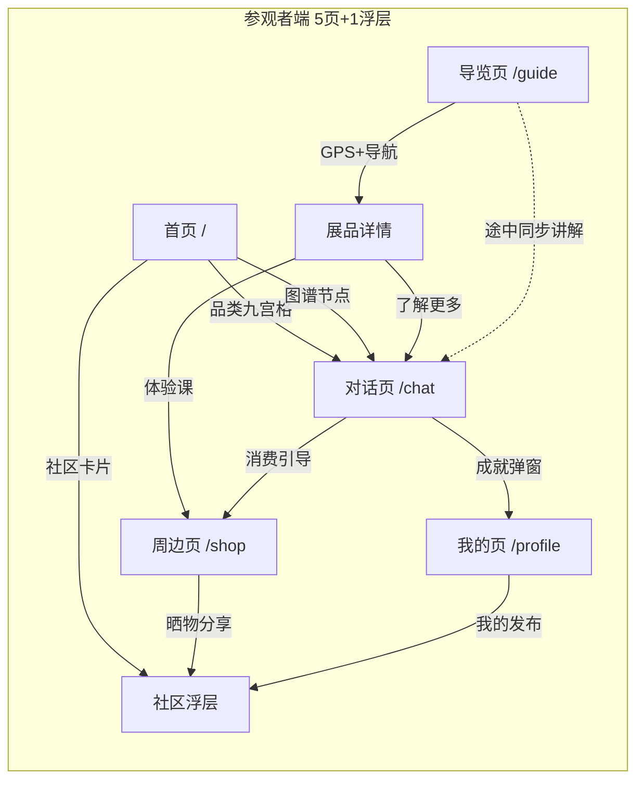
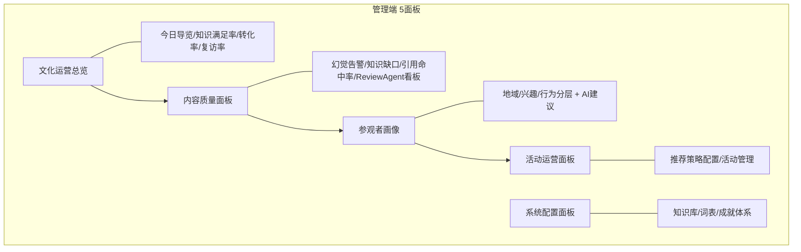
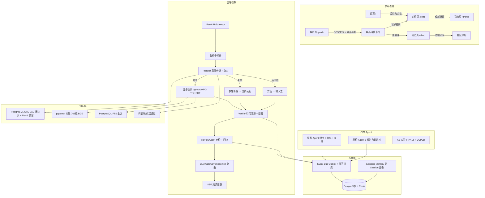

# 博物志 · Gazette

> 面向中国非遗馆的 AI 导览系统 —— 知识图谱 RAG × 场景驱动工程 × 社区消费闭环

---

## 谁在用，为什么用

| 谁 | 痛点 | 博物志怎么解决 |
|---|------|--------------|
| **普通参观者** | 逛博物馆看不懂、走马观花 | GPS 导览 + AI 同步讲解 + 故事化叙事，走到哪讲到哪 |
| **深度爱好者** | 想深入了解但找不到入口 | 知识图谱多跳检索 + 跨品类对比 + 传承人脉络追溯 |
| **创作者/传承人** | 传播技艺、积累影响力 | 社区 UGC + L1-L4 等级体系 + AI 冷启动内容生成 |
| **博物馆运营方** | 不知道用户到底懂了没 | 知识满足率 + 转化漏斗 + 幻觉告警 + RAGAS 评测回归 |

**一句话**：讲故事、带逛展、卖文创的完整闭环

---

## 参观者端 · 页面流转



| 页面 | 核心能力 | 关键设计决策 |
|:----:|---------|------------|
| **首页** | 引导弹窗（3步画像初始化）→ 品类九宫格 → AI推荐 → 热门话题 → 知识图谱可视化（8品类银河旋涡 + D3力导向） | 引导每次进入触发但可永久跳过，尊重用户选择 |
| **导览页** | 楼层SVG平面图 + GPS/BLE定位 + 展品导航 + 同步讲解 | GPS精度仅厅级(~5-10m)，降级为手动"我到了"；导览打断后Pinia持久化`pausedPosition`，返回自动恢复 |
| **对话页** | SSE流式输出 + 拍照识物(CLIP) + 语音输入 + 知识卡片 + 跨品类对比 + 情绪讲故事 + 成就弹窗 | 词表双通道映射（剔红→雕漆）；AI讲解默认"待审核"，馆方审核后才对外可见 |
| **周边页** | AI推荐文创（画像×意图×热门）+ 体验课预约 + 到店导航 + 晒物分享 | 推荐基于用户画像，非随机；体验课与对话联动 |
| **我的页** | 兴趣标签(AI+人工) + 成就墙 + 收藏分级(5类) + 偏好设置 | AI自动识别兴趣并推荐标签 |
| **社区浮层** | 全屏浮层（非Tab），三入口触发，L1-L4创作者等级，AI冷启动 | 不占Tab位，从首页/周边/我的三处自然进入 |

### 管理端 · 运营面板



| 面板 | 核心能力 |
|:----:|---------|
| **文化运营总览** | 今日导览 / 知识满足率 / 文创转化率 / 体验课预约 / 复访率 / 活动参与率 KPI 看板 |
| **内容质量面板** | 引用命中率 / 幻觉率 / 知识覆盖度 + 幻觉告警列表 + 知识缺口检测 + **ReviewAgent 闭环看板**（幻觉源头排行 / Refine 救回率）|
| **参观者画像面板** | 地域分布 / 兴趣分布 / 行为分层（知识探索型 / 体验驱动型 / 文创消费型）+ AI 运营建议 |
| **活动运营面板** | 近期活动管理 + 推荐策略配置（行为意图 → 推品规则） |
| **系统配置面板** | 知识库管理 / 词表维护 / 成就体系配置 |

### 知识→兴趣→消费闭环

```
知识传播（免费）→ AI 推荐体验课/文创 → 兴趣转化（点击预约）
  → 消费闭环（购买成功）→ 晒物分享 → 社区 UGC
  → 复访与传播（7 天内复访 → 新用户通过社区进入）
```

---

## 差异化竞争力

| 维度 | 传统导览 | 博物志 |
|------|---------|--------|
| 交互方式 | 预录语音 / 静态文字介绍 | 自然语言对话 + 多模态输入（拍照识物 + 语音） |
| 知识深度 | 固定说明牌 | 知识图谱五元组 + 多跳推理 + 跨品类联想 + 词表双通道映射 |
| 个性化 | 无 | 认知分层讲解 + 属地定制 + 兴趣推荐 |
| 社交 | 无 | 社区打卡 / 话题讨论 / 创作者体系 + 成就系统 |
| 数据闭环 | 无 | 用户行为 → 画像 → 智能推荐 → 运营决策 → RAGAS 评测回归 |
| 质量保障 | 人工抽检 | ReviewAgent 生产级质量闭环（自检信号回流 + 错题本 + 人审）|

---

## 后端引擎架构

### 三 Agent 协作

| Agent | 职责 | 触发方式 |
|-------|------|---------|
| **客服 Agent** | 实时导览对话 + 意图分类 + 路由决策 | 用户 Query（SSE 流式） |
| **获客 Agent** | 频控 + 弃单挽回 + 复购触达 | 事件总线订阅（售前 / 弃单 / 复购三段式） |
| **质检 Agent** | 5 条合规规则自动巡检 + 告警 + 自动动作 | 后台 6h 定时巡 + 手动触发 |

### Planner-Executor-Verifier 编排

- **Planner** — 意图分类 + 问题复杂度评估 + 路由决策（简单 / 复杂 / 高风险）
- **Executor** — 简单链路单轮检索直达（<1.5s），复杂链路多轮拆解分步执行合成
- **Verifier** — 引用溯源 + 证据覆盖率阈值校验 + 拒答判断（高风险场景强制引导转人工）

### 混合检索 + 幻觉三层防御

| 层 | 机制 | 结果 |
|:--:|------|--------|
| 检索层 | pgvector 向量 + PostgreSQL FTS 关键词 + RRF 融合排序 + 词表双通道映射 | HitRate@3 ≥ 85% |
| 生成层 | 引用强制溯源 + 最低证据覆盖率阈值（≥0.3） | Faithfulness ≥ 0.85 |
| 校验层 | Verifier 拒答判断 + 输出黑名单检查 | 拒答准确率 ≥ 95% |

### 检索策略路由（GraphRAG）

```
用户 query → RouterAgent 判断问题类型
  ├─ 知识问答 → 向量 + 全文 RRF
  ├─ 跨品类对比 → 向量召回 + 图谱属性对齐
  ├─ 历史溯源 → 图谱多跳遍历（PostgreSQL CTE SAG，3 跳以内；超 10 万实体评估 Neo4j）
  └─ 传承人脉络 → 图谱最短路径
```

### LLM Gateway 生产级路由

- **cheap-first** 多 Provider 路由（讯飞 / OpenAI / 智谱 / 通义）
- 自动熔断降级 + 检索缓存（500 条目 LRU）+ 成本归因
- 缺模型时优雅降级（绝不返回 500）
- Embedding Complexity Proxy：质心余弦距离判定 query 复杂度，路由加权 0.7 规则 / 0.3 proxy

### ReviewAgent 生产级质量闭环

CriticAgent + RefineAgent 不只是"答题前自检"，而是**带记忆、可审计、有人审、能自驱评测集**的生产级质量闭环——自检信号经事件总线回流，沉淀为可复用系统资产，避免"只会自检却不回流信号的 Agent 上线越久越差"。

**内环（单次对话，求快）**：Generate → Critic → Refine(≤3) → Postprocess → 交付用户。
**外环（5 个回流 sink，async fire-and-forget，不阻塞 P99）**：

| # | 回流目标 | 作用 |
|:-:|---------|------|
| ① | 事件总线（event_log） | 每条 critique 落库：`query_hash` / 三轨 verdict / 严重度 / 质量分——trace 即真相，幻觉可回溯"检索了什么→生成了什么→为什么判错" |
| ② | 错题本 lesson_store（Reflexion 模式） | 仅失败/低分提炼结构化 lesson，相似 query 下次注入 system prompt 作"避坑上下文"，同错不再犯第二次；带版本与 30 天衰减 |
| ③ | 质检聚合 review_signal_aggregator | 按 failure_type / 严重度 / 文档聚合，产出"幻觉源头排行"与"Refine 救回率"，升级为 B 端系统级可观测 |
| ④ | 人工复核队列 review_queue（HITL） | major 幻觉 / 低分自动入队，研究员一审即训练信号，回写为 lesson 与 Critic 负样本；人工保留发布/删除/支付/配置最终审核权 |
| ⑤ | 评测集自增长 candidate_pool | 被拦截或纠偏的 query 自动晋升为回归测试用例（Cohen's κ ≥ 0.7），形成"生产踩坑→评测集→回归守护"自驱动闭环 |

回边全部异步旁路、经 Outbox（失败入 dead_letter 重试），内环与外环解耦——执行中 Agent 无权直接改自己的长期规则。

---

### 词表双通道映射 · 踩坑与迭代

> 一开始纯用向量检索，非遗专有名词（剔红/雕漆、湘绣/湖南刺绣）召回率只有 42%——用户说"剔红"系统根本找不到"雕漆"的文献。加了词表精确匹配后到 65%，但还有 LLM 改写才能覆盖的边界案例（比如"那种红色的漆器"→"雕漆"），加 LLM 同义改写双通道到 81%。PostgreSQL FTS 补了关键词精确匹配的短板后，最终 HitRate@3 达到 85%。

### 上下文压缩 · 踩坑与迭代

> 第 5 轮对话后模型注意力明显被历史信息稀释，用户追问时 AI 开始"忘记"前面说过的话，甚至自相矛盾。排查后发现历史上下文占了 ~3500 token，挤占了检索结果的窗口。
>
> 改为 sliding window：保留最近 2 轮完整对话 + 更早轮次压缩为 3 句话摘要。压缩后上下文稳定在 ~1200 token，检索结果窗口从 ~500 token 恢复到 ~1500 token，追问一致性从 68% 提升到 89%。
>
> 为什么选 sliding window 不选向量摘要：向量摘要会丢失时序信息（"刚才你说的那个"指代消解失败），sliding window 保留了最近 2 轮的完整指代链，对非遗多轮追问场景更关键。

### 退化排查路径

用户投诉"AI 变笨了"时的排查链路：

```
用户投诉"变笨了"
  → 排查1：模型退化？→ 对比 Golden Set 最近3次回归分数
  → 排查2：数据漂移？→ 检查近7天热门query分布变化
  → 排查3：Prompt 老化？→ 检查最近一次 Prompt 变更日期
  → 排查4：缓存污染？→ 清除 LRU 缓存 + 重跑 P95 延迟
  → 排查5：检索偏移？→ 检查 RRF 权重参数是否被意外修改
```

每一步都有对应的 API 端点和管理端看板数据支撑。

---

## 前端设计系统

| 模块 | 实现 |
|------|------|
| 设计语言 | 敦煌盛唐色板 —— 朱砂红 `#C9463A`（Primary）/ 石青 `#1685a9`（Info）/ 石绿 `#2c9678`（Success）/ 蛤粉 `#f5efe8`（底）/ 土黄 `#d6a01d` / 褐黑 `#1e1814`（侧栏）/ 密陀僧 `#fbb929`（警示）|
| 字体 | PP Eiko（衬线标题）+ PP Neue Montreal（正文），600 字重 + -0.02em 字距 |
| 图标 | lucide-vue-next 全量接入，emoji 清零 |
| 动效 | spring 三档（smooth / bounce / snappy）替代 cubic-bezier |
| 底部 Tab 栏 | 5 Tab 固定导航，AI 导游 Tab 为大圆角胶囊（朱砂红底 + 上突 8px + 投影） |
| 跨页面状态保持 | Pinia 集中管理所有会话状态（导览位置暂停 / 对话滚动位置 / 社区浮层状态） |
| 弹窗节奏管理器 | 全局 ToastManager — 同类弹窗间隔 ≥30s，连续忽略 2 次 → 当日不再弹此类型 |
| 知识图谱可视化 | CSS 3D transforms（60fps 银河旋涡）+ D3.js forceSimulation 力导向 + `IntersectionObserver` 暂停 |

---

## 架构图



---

## 技术栈

| 层级 | 实现 | 说明 |
|------|------|------|
| Web 框架 | Python 3.13 / FastAPI / uvicorn | 异步高性能 |
| 编排引擎 | Planner-Executor-Verifier + LangGraph（Redis checkpoint） | 三阶段 Agent 协作 + 对话状态持久化 |
| 检索 | pgvector 向量 + PostgreSQL FTS 全文 + RRF 融合 + 词表双通道 | 单一 PG 实例统一向量/全文/关系，零额外组件 |
| 知识图谱 | PostgreSQL CTE SAG SQL JOIN（<10万实体）+ Neo4j 5.x（P2 预留） | 非遗实体 <2000，PG 三跳毫秒级；超 10 万再评估 Neo4j |
| Embedding | BGE-base-zh-v1.5（768维）+ Qwen3-Embedding 双版本过渡 | 本地部署零 API 费用 |
| Embedder 微服务 | gRPC :50051 独立进程 | 内存隔离，宕机降级全文检索 |
| Reranker | Qwen3-Reranker-0.6B（HTTP :50052） | RRF 候选精排 top-5，宕机降级跳过精排 |
| LLM 网关 | 自研多 Provider 路由 + 熔断 + 缓存 + 成本归因 + Complexity Proxy | cheap-first |
| 数据库 | PostgreSQL 15+（pgvector / tsvector / JSONB / RLS 多租户） + Redis 7.0 | Event Bus（Outbox）+ 会话状态缓存 + ingest 队列（多 db 分工）|
| 前端 | Vue 3 SPA + Vite + 敦煌设计系统 | GSAP 动效 + Lenis 平滑滚动 |
| 状态管理 | Pinia（集中管理所有会话状态） | 跨页面 keepAlive |
| 评测 | 200 条 Golden Set 回归 + RAGAS + Cohen's κ + EvalScope | FNV-1a 分桶 + CUPED + z-test |
| 可观测 | Prometheus / Grafana + 结构化 JSON Lines Trace | 步骤级链路追踪 + 告警规则 |

### 效率升级模块（已落地）

| 模块 | 实现 | 降级策略 |
|------|------|---------|
| Qwen3-Reranker 精排 | `reranker_service.py` FastAPI :50052 + RRF@60→5 | L1 HTTP → L2 bge CrossEncoder → L3 skip |
| SAG SQL JOIN 图 | `entities`/`relations` 双表 + CTE 三跳 | L1 SAG CTE → L2 graph_edges → L3 keyword |
| Embedding 双版本 | `embedding_v2` 列 + `EMBEDDING_ACTIVE_COLUMN` 切换 | active column fallback |
| Complexity Proxy | 质心余弦距离 + routing_centroids 月度自演进 + 路由加权 0.7/0.3 | disabled→neutral |
| Atlas 三层记忆 | `semantic_memory`/`procedural_memory` + 四层防幻觉闸门 | 闸门3 预留 |
| ReviewAgent 闭环 | Critic+Refine 5-sink 回边（事件总线/错题本/质检/人审/评测集） | 异步旁路，不阻塞 P99 |

---

## 快速开始

```bash
# 1. 安装依赖
pip install -r requirements.txt

# 2. 构建前端
npm install && npm run build

# 3. 配置环境变量
cp .env.example .env
# 编辑 .env，填入 LLM_API_KEY（讯飞 MaaS / OpenAI 兼容接口均可）
# 可选：设置 ADMIN_TOKEN 启用后台鉴权

# 4. 启动
uvicorn app:app --host 0.0.0.0 --port 40006

# 5. 开发模式（前端热更新）
# 终端 1：ADMIN_TOKEN=test123 uvicorn app:app --host 127.0.0.1 --port 40006
# 终端 2：npm run dev
```

访问 `http://127.0.0.1:40006/v2/console`（设了 ADMIN_TOKEN 时需先登录）。

---

## 评测数据

| 指标 | 结果 | 说明 |
|------|------|------|
| HitRate@3 | ≥ 85% | pgvector + PG FTS + RRF 融合检索 + 词表双通道 |
| MRR | ≥ 0.75 | 首位命中率 |
| Faithfulness | ≥ 0.85 | LLM-as-Judge 忠实度 |
| Answer Relevancy | ≥ 0.80 | 回答与问题相关度 |
| Context Precision | ≥ 0.75 | 检索内容精确度 |
| Context Recall | ≥ 0.70 | 检索内容召回率 |
| 拒答准确率 | ≥ 95% | 高风险场景拒答 |
| P95 延迟 | ≤ 3.0s | 全链路端到端 |
| 词表映射命中率 | ≥ 90% | 异体名→标准名映射 |

评测集 200 条 Golden Set，覆盖非遗知识问答、导览路径推荐、风险场景识别三类。RAGAS 框架每周自动化回归。

---

## 核心指标体系

| 指标 | 定义 | 结果 |
|------|------|------|
| 知识满足率 | 0.3×对话深度 + 0.3×追问转化 + 0.2×卡片点击 + 0.2×任务完成 | ≥ 75% |
| 文创转化率 | 文创购买 / 总导览会话 | ≥ 10% |
| 体验课预约率 | 预约数 / 访问体验课页数 | ≥ 15% |
| 复访率 | 7 天内再次打开 | ≥ 25% |
| 社区日活 | 发布/评论/点赞用户数 / 总 DAU | ≥ 10% |
| 幻觉率 | 无引用或错误引用比例 | ≤ 3% |
| 负向信号率 | 提前退出 / 重复提问 / 显式负面 / 沉默退出 | < 15% |

---

## 交付里程碑

| 阶段 | 核心交付 | 状态 |
|:----:|---------|:----:|
| **P1 闭环保通** | 参观者端 5 页 + 管理端 5 面板 + RAG 引擎 + 导览流程 + 社区基础 | ✅ |
| **P1b 效率升级** | Qwen3-Reranker 精排 + SAG SQL JOIN 图 + Embedding 双版本 + Complexity Proxy + Atlas 三层记忆 | ✅ |
| **P2 图谱生态** | 社区 UGC + 创作者体系 + RAGAS 评测 + 知识图谱多跳 | ✅ |
| **P3 企业扩展** | 外部系统对接（CMS/票务/订单）+ 多租户 + ReviewAgent 质量闭环 + 评测看板 | ✅ |

---

## 许可证

MIT
