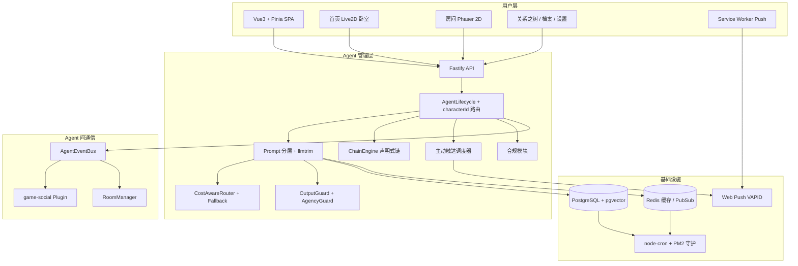

# 一隅 · Hearth

> 多角色 AI 社交行为引擎——角色会饿、会累、会在阳台等你回来，然后只说一句「你回来了」。

---

## 服务对象与需求

| 服务对象 | 核心需求 | 现有产品的问题 | Hearth 的回答 |
|----------|----------|---------------|--------------|
| 追求情感陪伴的用户 | 被一个人在意的感觉——不是聊天本身，是角色有自己的生活、自己的情绪、自己的小心思 | 聊天套皮：角色没有自己的生活；电子宠物：单向维护；养成游戏：亲密度+5 把感情变成交易 | 角色活在体征、情绪、记忆、心愿、日程里。**你们在同一个屋檐下过日子——你不在的时候他也在，你回来的时候他刚好在。** |

---

## 核心特性

| 模块 | 解决的需求 | 核心机制 | 关键数据 |
|------|-----------|----------|----------|
| 五层体征 | 角色有真实生理状态 | 5 维独立衰减 + 联动规则，体征驱动情绪与行为 | 血糖/精力/压力/多巴胺/情绪 |
| 三层记忆 | 记得住、且随亲密度变深 | 短期(Redis)→长期(PG+pgvector)→语义检索；记忆热度 + 遗忘曲线 | Hit@3 79% / Recall@5 87% |
| Workflow + Agent 混合 | LLM 越少系统越稳 | 确定性代码 0 Token；半确定性规则+LLM；不确定才走模型 | ~85% 决策代码执行 |
| 多 Agent 社交涌现 | 同空间自然互动 | AgentEvent 协议 + game-social Plugin（5 种社交事件）+ RoomManager | 事件延迟 &lt;1ms |
| Prompt 分层流水线 | 多轮后注意力不稀释 | 静态层缓存 + delta + 滑窗预算 + llmtrim 压缩 | 单轮 Token 约 -37% |
| 声明式行为链 | 角色有自己的生活节奏 | ChainEngine：8 条 JSON 链 + 角色 patch + 热加载 + 链中打断恢复 | 起床/吃饭/工作/解压/睡眠… |
| 亲密度 5 级 | 关系进展是隐性的 | 陌生→熟人→朋友→密友→羁绊；前端只显示阶段名与颜色环 | 数值仅存后端 |
| 主动触达 | 角色会来找你 | 定时 / 事件 / 静默 / 离线 四触发器 + Web Push（VAPID） | 勿扰时段可配置 |
| 合规与主体性 | 陪伴产品的安全底线 | AI 身份标注、时长提醒、年龄保护、极端情绪干预；Agency Guard 可拒绝 | compliance_log 审计 |
| 关系之树 | 把关系「看得见」 | 根系(记忆摘要) / 树干(亲密度) / 枝叶(里程碑) | Canvas 可视化 |
| AI 音乐共创 | 一起听 → 一起写 | 情绪/对话驱动生成 + 聊天即编辑界面 + 风格模板 | generated_songs 持久化 |
| 空间沉浸前端 | 不是后台，是卧室 | Vue3 SPA：Live2D 首页 + Phaser 房间 + 发现式入口 + 糖果实色 Token | 功能藏在场景物件里 |

### 1. 五层体征：角色的身体会说话

不是「随机切换心情」，而是饿了就烦躁，烦躁了说话就冲——你给他倒杯水，他就安静了。

| 维度 | 用户感知 | 联动 |
|------|----------|------|
| 血糖 | 下手术回家语气冲；热了牛奶就缓 | &lt;50 → 烦躁、无心聊天 |
| 精力 | 值完夜班不说话进卧室 | &lt;20 → 强制午睡 |
| 压力 | 压力大去阳台站着 | &gt;80 → 少开口、易怒 |
| 多巴胺 | 你两天没上线，留言「你三天没找我了」 | 你离开时持续衰减 |
| 情绪 | 7 维 + 派生平静值 | 波动触发联动规则 |

### 2. 三层记忆 + 热度

| 层级 | 存储 | 生命力 | 亲密度权重 |
|------|------|--------|------------|
| 短期 | Redis 时序，对话结束批量回写 PG | 1~3 天 | 陌生×0.5 → 羁绊×2.0 |
| 长期 | PG + pgvector HNSW | 数周~数月 | 高亲密度淘汰保护更强 |
| 语义 | 向量跨门类召回 | 永久 | 相似度检索 |

MemoryHeatEngine 用热度（约 0.1–5.0）刻画「常被想起的记得更牢」；低热度记忆按遗忘曲线衰减。

### 3. Workflow + Agent：能代码定的绝不交给 LLM

| 类型 | 方式 | 示例 |
|------|------|------|
| 确定性 | 规则 / 引擎 | 体征阈值、亲密度阶段、资源竞争仲裁 |
| 半确定性 | 规则兜底 + LLM 加分 | 心愿判定 |
| 不确定性 | LLM | 对话生成、语义理解、NPC 闲聊 |

CostAwareRouter 按任务类型 × 亲密度路由模型；RouterFallback 主→备→本地三层降级；OutputGuard 做 Pre / In / Post 三阶段校验。

### 4. 多 Agent 社交涌现

每个角色独立世界状态，经 AgentEventBus 通信：

| 事件 | 场景 |
|------|------|
| social:room_share | 阿黎在厨房做饭，小七闻香过来 |
| social:conversation | NPC 间 2–3 轮日常对话，弹幕飘过 |
| social:emotion | 阿黎开心外溢，客厅里的小七接住 |
| social:approach | 你三天没上线，回来被「三天了」接住 |
| social:resource | 有人占用电视位，另一方转身离开 |

AgentLifecycle 管理 registered → running → stopped；离线补偿靠 PG 事件表回放。

### 5. 声明式行为链 + Checkpoint

- 8 条日常链 JSON（起床 / 吃饭 / 解压 / 工作 / 睡眠 / 社交 / 发呆…）
- 角色级 patch（阿黎 / 小七行为差异）
- 目录热加载；链中重评估与交互打断
- 小时级 Checkpoint 快照 → Redis 恢复 + emotion_log 回放

### 6. 主动触达 + Web Push

| 触发器 | 行为 |
|--------|------|
| 定时 | 早安 / 晚安（时区窗口随机，防机械） |
| 事件 | 提到「明天面试」→ 到期追问；生病 → N 小时后关怀 |
| 静默 | 24h / 72h / 7 天未访问分层关怀 |
| 离线 | 不在时生成小事件，下次打开主动提起 |

Service Worker + VAPID 在关页后仍可送达；设置页支持勿扰时段。

### 7. 合规与主体性（产品底线）

- AI 身份标注、时长提醒、禁诱导依赖话术
- 年龄保护、极端情绪干预与升级路径
- Agency Guard：情绪 × 关系 × 请求类型 → 拒绝 / 犹豫 / 接受  
  角色可以不答应——这不是 bug，是人设。

### 8. 亲密度 5 级 + 关系之树

| 等级 | 感知变化 |
|------|----------|
| 陌生 | 语气正式，点头会躲开 |
| 熟人 | 开始聊自己的事 |
| 朋友 | 主动关心、记住习惯 |
| 密友 | 深夜会找你、留下言 |
| 羁绊 | 会吃醋、会撒娇、会表达在乎 |

关系之树：根系=记忆摘要，树干=亲密度等级，枝叶=里程碑节点。

### 9. AI 音乐：聊天即创作界面

情绪 / 对话 / 场景 → 生成蓝图 → 调用音乐 API → 注入 prompt 与播放  
不新开重型编辑器：用户在对话里改风格、改情绪；风格模板降低门槛；生成曲写入记忆。

### 10. 前端：卧室沉浸，而不是仪表盘

- **Landing**：进入小屋 / 游客参观 / 登录注册
- **首页（卧室）**：Live2D 主角 + 窗户天气 + 音箱 / 便利贴 / 书架 / 日记 / 礼物 / 小游戏 / 门
- **房间页**：Phaser 2D 客厅 / 阳台 / 厨房，功能挂在物件上
- **关系之树 / 备忘 / 角色 / 设置 / 行为链编辑**
- 设计 Token：糖果实色亮色系（蜜桃 / 辅蓝 / 杏橙 / 薄荷 / 紫罗兰）

原则：**面板不遮脸；入口可发现；功能跨房间，物件不同。**

---

## Agent 安全边际

| 风险 | 兜底 |
|------|------|
| 情绪级联 | 单步幅度上限，最多 2 级连带 |
| 行为链中断 | 回退安全节点；连续失败 → 发呆 |
| LLM 幻觉 | 只注入真实检索记忆 |
| 数据库宕机 | PG → SQLite 透明降级，同一套 SQL 适配 |
| 工具风险 | 低/中/高三级审批 |
| 重复话术 | AntiRepeatDetector（n-gram）+ 多样化注入 |
| 依赖诱导 | OutputGuard 合规红线检测 |
| 模型不可用 | RouterFallback 熔断降级 |

---

## 架构图



---

## 技术栈

- **前端**：Vue 3 · Pinia · Vue Router · Vite · Phaser 4 · pixi-live2d-display · 糖果实色 Token
- **后端**：Node.js ESM · Fastify · WebSocket · PM2 / node-cron
- **数据**：PostgreSQL + pgvector · Redis · SQLite 降级（sql.js / better-sqlite3）
- **Agent**：ChainEngine · AgentEventBus · CostAwareRouter · OutputGuard · RAG 导入
- **推送 / 合规**：web-push · compliance 中间件 · Agency Guard
- **部署**：Docker multi-stage · docker-compose · Caddy / nginx

---

## 评测数据

| 套件方向 | 覆盖要点 |
|----------|----------|
| 联动 / 体征 / 情绪 | 阈值、饱和、对抗、边界保护 |
| 行为链 / 心愿 | 推进、打断恢复、规则+LLM 混合 |
| 记忆 / DB 适配 | 三层读写、降级、RETURNING / 参数绑定 |
| 亲密度 / 经济 | 5 级边界、破产保护 |
| 合规 / 主动触达 / v7.1 模块 | 守卫、调度器、热度 / 压缩 / 降级 |

| 指标 | 数值 |
|------|------|
| 联动规则行覆盖 | ~94% |
| 记忆 Hit@3 / Recall@5 | 79% / 87% |
| 心愿混合判定 F1 | ~0.85 |
| PG→SQLite 切换 | 100%（适配层测试） |
| 单轮 Prompt Token | 约 3500 → 2200（-37%） |
| 基线测试 | 381 passed / 3 skipped（全模块绿） |

```bash
npm test   # 或 vitest run
```

---

## 演进路径

| 版本 | 能力 | 关键取舍 |
|------|------|----------|
| v1–v2 | 单角色体征/情绪/记忆 → 双模式 DB | 联动引擎；SQLite 并发写改为 PG 优先 |
| v3–v4 | 多角色 → 社交涌现 | 独立 Agent 实例；Redis Pub/Sub 替代轮询 |
| v5–v6 | 养成+共享空间 → 声明式链+Checkpoint | 亲密度去功利化；JSON 链热加载 |
| v7 | Agent 工程化 | EventBus 协议 · Lifecycle · RAG · Cost 路由 · OutputGuard |
| v7.1 | 效率 | llmtrim · RouterFallback · 记忆热度 · 粉红噪声情绪 · 反重复 |
| v8 | 市场与合规 | 主动触达 · 关系之树 · 主体性拒绝 · Web Push · 合规五条 · 沉浸式首页 · AI 音乐 |

跨 Agent 通信选型：定时轮询延迟过高；消息队列过重；最终 **Redis Pub/Sub + PG 离线补偿**。

---

## 快速开始

```bash
git clone https://github.com/mufengyuan1/Hearth.git
cd Hearth
cp .env.example .env
# 填入 LLM API Key、DATABASE_URL、（可选）REDIS_URL / VAPID

# 后端
npm install
npm run init-db
npm run seed-home

# 前端（开发）
cd frontend && npm install && npm run dev

# 或仅 API + 已构建静态资源
cd .. && npm start
```

默认 API：`http://localhost:19847`  
前端 dev 端口见 `frontend/package.json`（固定非常用端口）。

### Docker

```bash
docker compose up -d
```

需要 PostgreSQL + Redis；环境变量见 `.env.example`。

---

## 目录速览

```
frontend/          Vue3 SPA（页面 / 组件 / stores / Phaser / Live2D）
src/
  agents/          EventBus · Lifecycle · 社交 Plugin · RoomManager
  engine/          ChainEngine · CheckpointRecovery
  chains/          声明式行为链 JSON + 角色 patch
  compliance/      合规守卫
  guards/          OutputGuard · AgencyGuard · AntiRepeat
  llm/             路由 / 降级 / trim
  proactive/       主动触达 · Web Push
  memory/          存储 · 热度 · 向量
  rag/             前情提要导入
  music/           歌单 + AI 生成
  viz/             关系之树
  core-api/        Fastify 路由 · 中间件 · WS
  cron/            衰减 / 快照 / 调度
  bots/            Discord / Telegram / WhatsApp / 飞书
```

---

## 近期演进

- **v8.1 多角色系统定型**：阿黎(ali) / 路卡(luka) / 茕兔(qiongtu) 三套人格文件与行为链 patch 全部落地，移除早期试验角色；`agent-file-loader` 修复子目录启动人格丢失问题。
- **主动触达声明式化**：`src/chains/proactive/` 五条 JSON 链（index / scheduled / event / silence / offline）与调度器配对，四触发器驱动角色主动找用户。
- **Live2D 首页与房间**：`Live2DStage` / `WardrobePanel` / `VitalsTrend` / `BehaviorLog` 组件上线，PixiJS 背景与角色模型热切换。
- **AI 音乐共创**：情绪 / 对话驱动生成 + 聊天即编辑界面，`phase2` 评测用例落地。

---

## License

MIT
