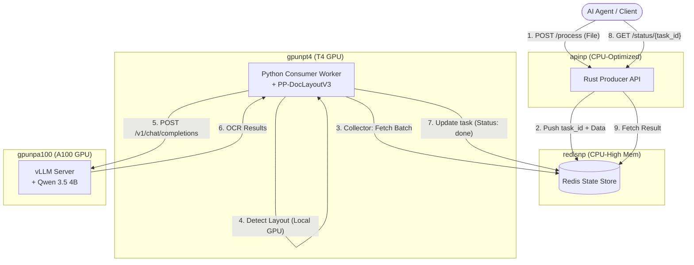

  <h1>📄 Production-Grade SLM-Powered OCR Course 📄</h1>
  <h3>Build a self-scaling, event-driven OCR pipeline on Kubernetes (AKS / GKE) with Qwen 3.5 + the GLM-OCR SDK</h3>

 

    

## Table of Contents

- [Table of Contents](#table-of-contents)
- [Course Overview](#course-overview)
- [Who is this course for?](#who-is-this-course-for)
- [Course Breakdown: Week by Week](#course-breakdown-week-by-week)
- [Getting Started](#getting-started)
- [✨ Beyond Traditional OCR: The SLM Advantage](#-beyond-traditional-ocr-the-slm-advantage)
- [🧠 Pipeline Architecture: Deep Dive into Throughput \& Scaling](#-pipeline-architecture-deep-dive-into-throughput--scaling)
- [🔄 The Exact Document Workflow](#-the-exact-document-workflow)
- [🧩 Robustness: Why a Pre-layout Encoder Improves Fidelity](#-robustness-why-a-pre-layout-encoder-improves-fidelity)
- [📑 Technical Report: Document Handoff](#-technical-report-document-handoff)
- [🏛️ Formal Architecture Assessment: Production Robustness](#️-formal-architecture-assessment-production-robustness)
- [📈 Scaling Philosophy: Real-Time Workloads (Metric-Driven)](#-scaling-philosophy-real-time-workloads-metric-driven)
- [The tech stack](#the-tech-stack)
- [Contributors](#contributors)
- [License](#license)

## Course Overview

Most OCR tutorials stop at "call an API and get some text back." This isn't that.

Instead, we're building a **production-grade, self-scaling Visual Document Understanding pipeline**, deployed for real on Kubernetes (AKS or GKE), that goes far beyond flat text extraction: it reasons about charts, tables, and layout the way a human reader would — powered by a Small Language Model (**Qwen 3.5**) instead of a bloated frontier model.

By the end of this course, you'll have your own event-driven OCR system capable of:

* 🧠 Understanding documents, not just transcribing them — charts, tables, handwriting, and contextual reasoning via **Qwen 3.5 (4B)**
* ⚡ Serving generative OCR at **1.86 pages/second** with vLLM's continuous batching, PagedAttention, and Multi-Token Prediction (MTP)
* 🦀 Ingesting files through a high-concurrency **Rust (Axum) gateway**, decoupled from GPU inference via Redis
* 🔄 Running a **zero-copy, `/dev/shm`-based** document handoff between the layout encoder and the inference engine
* ☸️ Auto-scaling T4 (layout) and A100 (inference) node pools independently with **KEDA**, from zero to bursting load
* 🔒 Locking the whole pipeline behind an **Internal Load Balancer + Enterprise API Gateway** (Azure APIM / GCP API Gateway), with zero public exposure
* 🤖 Wrapping the pipeline as an **MCP server** for native use by AI agents, including Claude Code

Excited? Let's get started!

---

<table style="border-collapse: collapse; border: none;">
  <tr style="border: none;">
    <td width="20%" style="border: none;">
      
    </td>
    <td width="80%" style="border: none;">
      

        <h2>📬 Stay Updated</h2>
        
<b><a href="https://theneuralmaze.substack.com/">Join The Neural Maze</a></b> and learn to build AI Systems that actually work, from principles to production. Every Wednesday, directly to your inbox. Don't miss out!

      

    </td>
  </tr>
</table>

  

---

## Who is this course for?

This course is for ML/AI Engineers and Platform Engineers who already know how to call an OCR API and want to know **what it takes to run one in production**: GPU node pools, autoscaling economics, network security, and the systems-design tradeoffs behind serving a generative model at throughput.

## Course Breakdown: Week by Week

We run this as a 6-week hands-on engineering cohort. The entire repository is open-source from day one — every week combines a deep-dive systems article with a step-by-step codebase walkthrough.

### 📅 Weekly Cadence
*   📘 **Weekly Production Article (Wednesday)**: Architectural deep dives, systems design math, and codebase explanations.
*   🎙️ **Live Office Hours (Friday)**: Live coding, cluster provisioning, load-testing, scaling demonstration, and Q&A.

| Week | Focus | Hands-on |
| :--- | :--- | :--- |
| ⛵ **1. Kubernetes for AI Systems** | Pods, Services, Node Pools, resource scheduling | Cluster setup on AKS/GKE, T4 & A100 node pools, GPU drivers/operators with proper security profiles and taints |
| 🧠 **2. SOTA OCR Approaches & VDU** | Single-stage end-to-end models vs. our two-stage layout-first pipeline | Evaluating GLM-OCR SDK's layout detection and measuring performance trade-offs |
| ⚡ **3. Deploying the vLLM Inference Engine** | Continuous batching, PagedAttention, scheduling optimizations | Deploying Qwen 3.5 4B on vLLM, tuning `MAX_NUM_BATCHED_TOKENS`, chunked prefills, Multi-Token Prediction (MTP) |
| 🦀 **4. Rust Ingest Gateway** | High-concurrency gateways for heavy payloads; ownership, borrowing, async Rust | Building the Axum gateway (`client_rt_producer`), 10MB limits, atomic `HSET` writes to Redis |
| 🔄 **5. Async Architectures & Zero-Copy Ingestion** | Queue buffers, dynamic batching collectors, RAM-disk transfer | Building the Python worker (`client_rt_consumer`), 100ms collection window, `/dev/shm` handoff, scale-to-zero with KEDA |
| 🛡️ **6. Enterprise Gateways & Claude Code MCP** | Security boundaries, JWT verification, rate limiting, agentic workflows | Configuring Azure APIM / GCP API Gateway policies and wrapping the pipeline in an MCP server for Claude Code |

  
  
  

  
  
  

## Getting Started

For step-by-step provisioning and configuration commands, refer to the cloud-specific deployment guides:
* 📘 [Azure Kubernetes Service (AKS) Deployment Guide](docs/aks_deployment.md)
* 📗 [Google Kubernetes Engine (GKE) Deployment Guide](docs/gke_deployment.md)
* ☁️ [Cloud Provider Comparison & Discrepancies Matrix](docs/cloud_comparison.md)

---

## ✨ Beyond Traditional OCR: The SLM Advantage

Modern OCR has evolved from simple character recognition to **Visual Document Understanding (VDU)**. By leveraging Small Language Models (SLMs) like **Qwen 3.5 (4B)**, this pipeline moves beyond "flat" text extraction to provide:

*   **Fine-Grained Chart & Image Description**: Unlike task-specific models that only see text, Qwen 3.5 can interpret trends in graphs, describe complex diagrams, and identify semantic relationships between visual elements.
*   **Contextual Reasoning**: The model understands the *intent* of a document. It can distinguish between an invoice total and a line-item subtotal based on spatial reasoning, not just keyword matching.
*   **High-Density Recognition**: Achieving state-of-the-art results on benchmarks like OmniDocBench, these models handle "noisy" real-world inputs—handwriting, annotations, low-resolution scans—with a record-breaking accuracy that outperforms much larger frontier models.

### Key Technical Innovations

  * **Hybrid Orchestration**: Combines a deterministic **PP-DocLayoutV3** visual encoder (via GLM-OCR SDK) with the **Qwen 3.5** language decoder. This ensures that every image crop is semantically labeled before it hits the generative engine.
  * **Multi-Token Prediction (MTP)**: The architecture is optimized for MTP-enabled VLMs, resulting in a **~50% throughput increase** by predicting multiple tokens per decoding step without increasing VRAM overhead.
  * **Zero-Copy RAM Handoff**: Documents are rasterized into `/dev/shm` (Shared Memory), allowing the layout engine and the inference engine to share high-resolution buffers without costly disk I/O.

---

## 🧠 Pipeline Architecture: Deep Dive into Throughput & Scaling

The architecture leverages the **GLM-OCR SDK** as a high-concurrency orchestration layer to bridge the gap between deterministic layout analysis and generative SLM recognition.

### 1\. The Engine: vLLM + MTP-Accelerated Inference

By deploying models via **vLLM**, we leverage continuous batching and PagedAttention to maximize the A100's utility.

  * **MTP Speed Hack**: Because vLLM supports Multi-Token Prediction (MTP), the generative stage is significantly faster than traditional VLMs, reaching throughputs of **1.86 pages/second** for PDFs.
  * **Two-Stage Parallelism**: While the vLLM sidecar handles the intensive recognition of `Batch N`, the Orchestrator/Layout pod is already pre-processing `Batch N+1` using the **PP-DocLayoutV3** detector.
  * **Dynamic Cropping**: The system doesn't feed full-page images into the SLM (which is token-expensive). Instead, it crops semantic regions (paragraphs, tables, formulas, charts), allowing the model to focus its parameters on high-density information.

### 2. Throughput Optimization Matrix: Tuning for A100

To maximize the ROI of the A100 nodes, the system is tuned to balance the asymmetric load between CPU-bound preprocessing and GPU-bound inference.

| Parameter | Optimized Value | Technical Rationale |
| :--- | :--- | :--- |
| **`max_workers`** | **512** | Matches the `MAX_NUM_SEQS` of the vLLM server. Ensures that the worker can saturate the continuous batching engine with concurrent region-recognition requests. |
| **`layout/batch_size`** | **4** | For multi-page PDFs, this allows the **PP-DocLayoutV3** model to process multiple pages in a single GPU forward pass, reducing kernel launch overhead. |
| **`layout/workers`** | **4** | Utilizes multi-core CPUs for parallel image decoding, resizing, and normalization, preventing the GPU from idling while waiting for input tensors. |
| **`connection_pool`** | **1024** | Prevents HTTP connection exhaustion when handling high-concurrency bursts across the 512 workers. |

### 3. vLLM Engine Optimizations: Pushing the A100

To fully utilize the massive 80GB VRAM of the A100 node for models like **Qwen3.5-4B**, we aggressively tune the internal parameters of the vLLM engine:

*   **`MAX_NUM_SEQS=512`**: Increased from default to allow the vLLM continuous batching scheduler to process up to 512 concurrent image crops or text completions in parallel.
*   **`MAX_NUM_BATCHED_TOKENS=262144`**: Massively increased to eliminate the "prefill bottleneck". Because each layout crop contains \~6K tokens, a standard batch size limits prefilling to only \~5 crops at a time. By pushing this to 262K, the engine can prefill \~42 images simultaneously in a single forward pass.
*   **`MAX_MODEL_LEN=16384`**: Explicitly reduced from 32K. Setting this to 16K perfectly covers the worst-case scenario (6K image + 8K generation) while preventing overly pessimistic reservations. This frees up gigabytes of VRAM to physically accommodate the 512 sequences.
*   **Chunked Prefill Enabled (`--enable-chunked-prefill`)**: Prevents large prefill tasks from blocking decoding steps of currently running requests. By chunking prefills and co-scheduling them with decoding tokens, the engine guarantees lower latency spikes under heavy concurrent workloads.
*   **CUDA Graphs Enabled (No `--enforce-eager`)**: Critical for Multi-Token Prediction (MTP). We allow vLLM to compile CUDA graphs during cold-start. This eliminates the massive CPU bottleneck caused by dispatching thousands of micro-kernels per generation step.

### 4. Motivation: Hardware Asymmetry & Workload Profiling

Colocating the SDK worker and vLLM across T4 (Layout) and A100 (OCR) node pools allows for optimized resource utilization. The system uses a **Sequential Dynamic Batching** strategy to saturate the GPU without causing kernel contention.

| Component | Hardware Target | Workload Profile | Batching Strategy |
| :--- | :--- | :--- | :--- |
| **Worker (SDK)** | T4 GPU | **Layout Bound**: Uses **PP-DocLayoutV3** to identify regions. | **Dynamic Collector**: Batches up to 4 tasks in 100ms windows to reduce kernel overhead. |
| **vLLM (SLM)** | A100 GPU | **Compute Bound**: High-speed generative OCR/Reasoning using MTP. | **Continuous Batching**: Saturates A100 via 512+ concurrent SDK workers. |

#### **Optimized Data Flow & Concurrency**

*   **Sequential Batching**: The worker collects tasks from Redis and dispatches them to the `GlmOcr` engine in batches. It waits for the entire batch to complete before fetching more, preventing T4 VRAM over-contention and ensuring stable throughput.
*   **Shared Memory**: Using `/dev/shm`, the worker renders documents into RAM. The SDK reads directly from this RAM disk, eliminating disk I/O bottlenecks during high-concurrency bursts.
*   **Aggressive Scaling**: KEDA is configured for **Scale-on-Single-Task** (T4) and **Scale-on-Waiting-Request** (A100), ensuring the cluster spins up resources immediately as demand arrives.

---

## 🔄 The Exact Document Workflow

This workflow is specifically designed for low-latency tool use by AI Agents. It decouples the API from the GPU-heavy inference through a Redis state store.

| Component | Node Pool | Role |
| :--- | :--- | :--- |
| **Redis (State Store)** | `redisnp` (CPU-High Mem) | Stores task status, binary data, and final OCR results. |
| **Producer (API)** | **`apinp` (CPU-Optimized)** | Rust gateway that receives files and queues `task_id` in Redis. Scales independently of the DB. |
| **Consumer (Worker)** | `gpunpt4` (T4 GPU) | Pulls from Redis, runs **PP-DocLayoutV3** layout detection with dynamic batching. |
| **Server (vLLM)** | `gpunpa100` (A100 GPU) | Central vLLM engine for high-speed generative OCR. |

**Step-by-Step Execution:**
1.  **Submission**: An AI Agent sends a PDF/Image to the **Producer API**.
2.  **Queuing**: The API generates a `task_id`, stores the file as base64 in **Redis**, and pushes the ID to an `ocr_tasks` list.
3.  **Activation (KEDA)**: KEDA monitors the `ocr_tasks` list length and the API CPU usage. It scales the **Producer API**, **Consumer Worker** and **vLLM Server** nodes.
4.  **Dynamic Batching (Collector Pattern)**: The **Consumer Worker** pops a `task_id`, then waits up to 100ms to collect up to 4 tasks from the queue. This ensures that the T4 GPU processes layout detection in batches, maximizing throughput.
5.  **Layout Analysis**: The Worker decodes the batch into `/dev/shm` and runs **PP-DocLayoutV3** (T4 GPU) to identify semantic regions for all files in the batch.
6.  **Inference**: The Worker sends recognized regions to the **vLLM Server** (A100 GPU) for high-speed transcription.
7.  **Resolution**: The Worker updates the **Redis** task status to `done` and stores the final Markdown/JSON.
8.  **Retrieval**: The AI Agent polls the status endpoint; once `done`, it retrieves the structured result instantly from Redis memory.

---

## 🧩 Robustness: Why a Pre-layout Encoder Improves Fidelity

*   The **layout detector** acts as a **pre-input encoder** that **delimits semantic regions** (text, tables, figures, formulas) and their orientation before generative inference. This **narrows the VLM's decision space** and reduces visual noise (skew/warp/lighting), mitigating hallucinations typical of generative models.
*   Robust and **irregular localization** in GLM-OCR (powered by PP-DocLayoutV3) increases the quality of the crop consumed by the VLM in real-world scenarios (scans, mobile photos, etc.). [\[HuggingFace: GLM-OCR\]](https://huggingface.co/zai-org/GLM-OCR)

  

---

## 📑 Technical Report: Document Handoff

To ensure high-throughput and minimize network overhead, this pipeline uses a **Shared RAM-disk (`/dev/shm`)** for document handoff. This strategy is specifically optimized for the **GLM-OCR SDK**'s ability to handle raw file paths.

### 1. Universal "Path-First" Ingestion
Regardless of the input format (Single-page Image or Multi-page PDF), the worker follows a unified ingestion pattern:
1.  **Binary Download**: The worker downloads the raw blob bytes from Redis.
2.  **RAM-disk Write**: The binary is saved as a temporary file in `/dev/shm` (Linux Shared Memory), preserving its original extension.
3.  **Permission Fix**: The worker explicitly grants read access (`0o644`) to the file, ensuring that the SDK's internal sub-processes can read the file regardless of their UID.
4.  **SDK Handoff**: The worker passes the **local file path** to `ocr_engine.parse(temp_path)`.

### 2. Format Auto-Detection via Magic Bytes
The **GLM-OCR SDK** does not rely on manual "file type" flags. When it receives a file path:
*   **Identification**: It reads the file's **magic bytes** (e.g., `%PDF-` for PDFs, `\xFF\xD8` for JPEGs).
*   **Routing**:
    *   **PDF Pipeline**: Triggers the internal **PyMuPDF/pdf2image** engine. It rasterizes the document into high-resolution images (based on the `pdf_dpi` config) before hitting the layout detector.
    *   **Image Pipeline**: Directly loads the image array into memory for layout segmentation.

### 3. Benefits of this Architecture
*   **Zero-Copy Communication**: No base64 encoding/decoding is required to move 10MB+ images between the worker logic and the AI engine.
*   **Reduced Context Window Noise**: By allowing the SDK to handle the PDF rasterization internally, the worker code remains clean and doesn't need to manage individual page buffers or rasterization libraries.
*   **Reliability**: Using a RAM-disk ensures that even under high load, disk I/O wait times never bottleneck the GPU's inference cycles.

---

## 🏛️ Formal Architecture Assessment: Production Robustness

This deployment architecture is designed for top-tier quality and resilience in a production environment.

### 🔒 Network Security & Zero Public Exposure

For enterprise deployments, exposing the Rust Producer API directly to the public internet is a critical security and cost risk (e.g., unauthorized access triggering expensive GPU auto-scaling).

To prevent this, the deployment architecture is designed around strict network boundary controls:
1. **Internal Load Balancer (ILB)**: The Kubernetes service (`ocr-api-service`) is annotated to provision an Internal Load Balancer within the cloud virtual network (Azure VNet / GCP VPC), assigning it a private IP. This ensures the Rust Producer API is never directly reachable from the public internet.
2. **Enterprise API Gateway (Azure APIM / GCP API Gateway / Apigee)**:
   - The Gateway is deployed in **Internal Virtual Network Mode** (or private backend integration) within the same virtual network. This ensures the gateway itself has no unprotected public internet footprint.
   - Traffic can only reach the gateway via secure channels such as **VNet/VPC Peering**, **VPN Gateway**, or **ExpressRoute/Interconnect** from corporate networks.
3. **Alternative: External Gateway Mode with Strict Governance Policies**:
   - If clients must access it from the internet, the gateway can be configured in **External Mode** to act as a secure, public-facing entry point.
   - Public access is strictly guarded by **Subscription Key (API Key)** checks, **Entra ID / GCP IAM (JWT) tokens**, and **IP Whitelisting**.
   - **Rate Limiting (Throttling)** policies protect backend GPU resources (vLLM and worker pods) from DDoS or burst misuse, preventing runaway autoscaling costs.

## 📈 Scaling Philosophy: Real-Time Workloads (Metric-Driven)

For the real-time API, we use an aggressive, low-latency scaling strategy that ensures resources are provisioned the moment a task enters the pipeline:

*   **Warm Start (Cron)**: Maintains at least **1 replica** of both T4 (Layout) and A100 (OCR) during business hours (08:00 - 18:00 ET) to eliminate cold-start latency for the first request of the day.
*   **Aggressive Bursting (KEDA & Prometheus)**:
    *   **API Gateway**: Scales on **CPU Utilization > 70%**. Ensures that the Rust API can handle high-concurrency bursts of file uploads.
    *   **T4 (Layout)**: Scales on **Redis List Length = 1**. Because our worker now uses **Sequential Dynamic Batching**, we want to spin up a new T4 node for *every* pending task in the queue to ensure that even if one worker is currently busy with a batch, the next task doesn't wait.
    *   **A100 (OCR)**: Scales when **vLLM Waiting Requests >= 1**. We no longer wait for a queue depth of 5. If the vLLM scheduler has even a single region waiting for a KV-cache slot, KEDA triggers an immediate upscale of the A100 node pool.
*   **Fast Reallocation**: Reduced Prometheus polling to **10s** and cooldown to **300s**, allowing the cluster to scale down faster when idle while remaining highly responsive to bursts.

---

## The tech stack

| Technology | Description |
| :--- | :--- |
| **Qwen 3.5 (4B)** | The Small Language Model powering generative OCR and document reasoning. |
| **vLLM** | High-throughput inference engine — continuous batching, PagedAttention, chunked prefill, and Multi-Token Prediction (MTP). |
| **GLM-OCR SDK + PP-DocLayoutV3** | Deterministic layout detection layer that pre-encodes semantic regions before generative inference. |
| **Rust (Axum)** | The high-concurrency ingest gateway (`client_rt_producer`) that receives files and queues tasks. |
| **Redis** | Decoupled state store between the API and the GPU-heavy inference pipeline. |
| **Kubernetes (AKS / GKE)** | The orchestration layer for CPU, T4, and A100 node pools. |
| **KEDA** | Event-driven autoscaling — scale-on-queue-depth for the layout pool, scale-on-waiting-request for the inference pool. |
| **Azure APIM / GCP API Gateway** | Enterprise API gateway enforcing JWT auth, rate limiting, and zero public exposure. |

## Contributors

<table>
  <tr>
    <td align="center"></td>
    <td>
      <strong>Miguel Otero Pedrido | Senior ML / AI Engineer </strong> 
      <i>Founder of The Neural Maze. Just a guy who builds AI Systems that actually work.</i>  
      <a href="https://www.linkedin.com/in/migueloteropedrido/">LinkedIn</a> 
      <a href="https://www.youtube.com/@TheNeuralMaze">YouTube</a> 
      <a href="https://theneuralmaze.substack.com/">The Neural Maze Newsletter</a>
    </td>
  </tr>
  <tr>
    <td align="center"></td>
    <td>
      <strong>Antonio Zarauz Moreno | Cognitive-AI R&D / AI Engineer</strong> 
      <i>Doesn't build AI wrappers — builds the infrastructure that makes them profitable, from PoC to thousands of concurrent users.</i>  
      <a href="https://www.linkedin.com/in/antonio-zarauz-moreno/">LinkedIn</a>
    </td>
  </tr>
</table>

## License

This project is licensed under the MIT License - see the [LICENSE](LICENSE) file for details.
</content>
