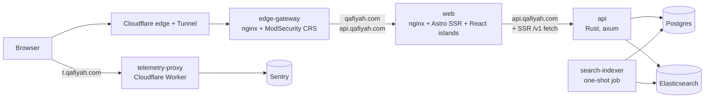

<picture>
  <source media="(prefers-color-scheme: dark)" srcset=".github/readme_banner_darkmode.webp">
  <source media="(prefers-color-scheme: light)" srcset=".github/readme_banner_lightmode.webp">
  
</picture>

<p align="center" dir="rtl">مرجع الشعر العربي</p>
<p align="center">Qafiyah, the Arabic poetry reference.</p>

<p align="center">
  <a href="https://qafiyah.com"></a>
  <a href="https://api.qafiyah.com/v1/docs"></a>
  <a href="data/db"></a>
  <a href="LICENSE"></a>
  <a href="rust-toolchain.toml"></a>
  <a href="package.json"></a>
</p>

Qafiyah is an open-source catalog of Arabic poetry: over 374,000 poems and 6.2 million verses by more than 17,000 poets, searchable by any word or phrase and browsable by poet, meter, rhyme, era, and theme. The site is in Arabic, at [qafiyah.com](https://qafiyah.com). The code, the data, and a free JSON API are all public, and the project grows with every contribution: [pull requests are welcome](#contributing).

<p align="center">
  
  
</p>

## Try it

**Read.** Search and browse at [qafiyah.com](https://qafiyah.com), or follow [@qafiyahx](https://x.com/qafiyahx) on X for a poem every day (also on [Telegram](https://t.me/qafiyahx)).

**Call the API.** No key, no sign-up:

```bash
curl "https://api.qafiyah.com/v1/poems/random?option=lines"
```

That prints a random verse and its poet. Every other endpoint returns JSON, see [Public API](#public-api).

**Run it locally.** You need [Bun](https://bun.sh) 1.3.14, a Docker engine ([OrbStack](https://orbstack.dev) or Docker Desktop), and Rust through [rustup](https://rustup.rs) (`rust-toolchain.toml` pins 1.98.1).

```bash
git clone https://github.com/raaqimorg/qafiyah.git
cd qafiyah
bun install
bun run dev
```

The first run starts Postgres and Elasticsearch in Docker, restores a bundled 100-poem sample, builds the search index, compiles the API, and starts the web app at http://localhost:4321 (API at http://localhost:8787). No `.env` or secrets needed. To run the full corpus, get a passphrase (see [The data](#the-data)); everyday commands and troubleshooting are in [`docs/development.md`](docs/development.md).

## By the numbers

|   Poems |    Verses |  Poets | Meters | Rhymes | Eras | Themes | Collections |
| ------: | --------: | -----: | -----: | -----: | ---: | -----: | ----------: |
| 374,176 | 6,287,322 | 17,338 |     44 |     36 |   12 |     10 |           1 |

Counted from snapshot `0031_23_09_2026` (23 September 2026). Poets, eras, and meters each include one "unknown" entry for unattributed records.

## Public API

Base URL: `https://api.qafiyah.com/v1`. Read-only JSON over HTTPS for poems, poets, eras, meters, rhymes, themes, collections, and full-text search. Browse the [interactive docs](https://api.qafiyah.com/v1/docs), the [OpenAPI document](https://api.qafiyah.com/v1/openapi.json), or [llms.txt](https://api.qafiyah.com/llms.txt).

| Access   | Limit                                         |
| -------- | --------------------------------------------- |
| No key   | 60 requests per hour per address              |
| Free key | 500 requests per hour, burst of 10 per second |
| Higher   | write to api@qafiyah.com                      |

Get a key from the developers page (`/developers` on the site) after signing in with Google or GitHub, and send it as the `x-api-key` header. Every response carries `x-ratelimit-remaining`, a refused request returns 429 with `Retry-After`, and errors are RFC 9457 problem+json.

## The data

Postgres is the source of truth for poems, poets, and every taxonomy table. Elasticsearch is a derived index, rebuilt from Postgres on demand. Poet avatars live in Cloudflare R2, served from `cdn.qafiyah.com`. Snapshots are versioned in this repo in directories named `{sequence}_{DD}_{MM}_{YYYY}`:

- [`data/db/`](data/db/README.md): PostgreSQL custom-format dumps, committed in parts to stay under GitHub's file size limit. `bun run db:up` reassembles them.
- [`data/avatars/`](data/avatars/README.md): zips of poet avatar images, mirroring the CDN.

`data/db/0000_default/` is a plaintext 100-poem sample, and it is what `bun run dev` restores by default. Every other snapshot is encrypted. The data is still public and MIT licensed like the code; encryption only keeps it possible to withdraw a record later, since a plaintext file pushed to a public repo stays in every clone for good.

To get a passphrase, email dumps@qafiyah.com (database) or avatars@qafiyah.com (avatars) and say what you will use it for. You get it right away, with no vetting. More in [`data/README.md`](data/README.md).

## How it works

A request enters through Cloudflare, passes the web application firewall, and reaches either the web app or the API. The web app renders pages on the server by calling the API, and the API reads Postgres for records and Elasticsearch for search.



- [`apps/api`](apps/api/AGENTS.md): read-only Rust and axum service, versioned under `/v1`, with the OpenAPI contract generated from the code.
- [`apps/web`](apps/web/AGENTS.md): Astro pages rendered on the server, with React islands for search, the random poem, and settings.
- [`apps/search-indexer`](apps/search-indexer/AGENTS.md): one-shot Rust job that builds a fresh Elasticsearch index from Postgres and swaps the alias, so the API never notices a rebuild.
- [`apps/edge-gateway`](apps/edge-gateway/AGENTS.md): the OWASP ModSecurity Core Rule Set nginx image in front of everything, configuration only.
- [`apps/telemetry-proxy`](apps/telemetry-proxy/AGENTS.md): Cloudflare Worker that forwards browser error reports to Sentry from a first-party hostname.
- [`apps/inspector`](apps/inspector/AGENTS.md): dev-only report of the metadata on one live example of every page type.
- [`crates/elasticsearch`](crates/elasticsearch/AGENTS.md): the index schema, analyzers, and client shared by the API and the indexer.
- [`scripts/`](scripts/AGENTS.md): repo tooling and the CI gate, one `bun run` name per entry point.

Search treats Arabic the way readers do: hamza forms, alif maqsura, and ta marbuta fold to their base letters, diacritics are ignored for matching and kept for display, and an exact title hit always outranks scattered content matches. The full account is in [`docs/search.md`](docs/search.md).

Production is one VPS running six containers behind a Cloudflare Tunnel, with nothing reachable inbound. Deploys are a separate manual step, not triggered by merging. See [`docs/topology.md`](docs/topology.md) for the whole map and [`docs/deployment/README.md`](docs/deployment/README.md) for operations.

## Tech stack

| Layer     | Stack                                                            |
| --------- | ---------------------------------------------------------------- |
| API       | Rust, axum, tokio, sqlx, utoipa                                  |
| Web       | Bun, TypeScript, Astro, React, Tailwind CSS                      |
| Data      | PostgreSQL 18, Elasticsearch 9                                   |
| Edge      | OWASP ModSecurity CRS on nginx, Cloudflare Tunnel, Cloudflare R2 |
| Telemetry | Cloudflare Workers, Sentry, PostHog                              |
| Tooling   | Turborepo, oxlint, oxfmt, vitest, Docker Compose                 |

Exact versions are pinned in `rust-toolchain.toml`, `Cargo.lock`, `bun.lock`, and `docker-compose.yml`.

## Contributing

Bugs and ideas go to [GitHub issues](https://github.com/raaqimorg/qafiyah/issues). To change code: fork, branch off `main`, follow the conventions in `docs/`, run `bun run ci`, and open a pull request. The details are in [`CONTRIBUTING.md`](.github/CONTRIBUTING.md).

Good places to start: the web app (Astro and React), search relevance ([`docs/search.md`](docs/search.md)), and the repo tooling in [`scripts/`](scripts/AGENTS.md). Each component has an `AGENTS.md` describing its shape, and [`docs/exceptions.md`](docs/exceptions.md) lists where the code departs from the usual approach, and why.

`bun run ci` ([`scripts/ci.ts`](scripts/ci.ts)) is the full gate: lint and format, type and repo checks, unit tests, contract snapshots (OpenAPI, generated client, Elasticsearch queries), and, with Docker, database-backed tests and smoke tests against the built stack. The pre-commit hook runs it without Docker and the pre-push hook runs the Docker phase. GitHub Actions runs the same gate without the Docker phases (`bun run ci --no-docker`) on every push and PR, plus gitleaks. Clippy denies `unwrap`, `expect`, `panic`, indexing, and lossy casts in production code. See [`docs/testing.md`](docs/testing.md).

Report security issues privately to security@qafiyah.com, as described in [`SECURITY.md`](.github/SECURITY.md), not in a public issue. This project follows the [Contributor Covenant](.github/CODE_OF_CONDUCT.md); conduct concerns go to conduct@qafiyah.com.

### Documentation map

- [`docs/development.md`](docs/development.md): running the stack locally, everyday commands, worktrees, committing.
- [`docs/topology.md`](docs/topology.md): a diagram-first map of the whole system, code and production.
- [`docs/deployment/README.md`](docs/deployment/README.md): the production entry point.
- [`docs/domain.md`](docs/domain.md): what a poem, poet, meter, rhyme, era, theme, and collection mean.
- [`docs/search.md`](docs/search.md): Arabic text handling, relevance tiers, snippet selection.
- [`docs/code-conventions.md`](docs/code-conventions.md) and the TypeScript, Rust, testing, and pull-request files next to it: how code, tests, and commits are written.
- [`docs/identity.md`](docs/identity.md): canonical name, description, organization, and links.
- [`AGENTS.md`](AGENTS.md), `apps/<app>/AGENTS.md`, [`crates/elasticsearch/AGENTS.md`](crates/elasticsearch/AGENTS.md), [`scripts/AGENTS.md`](scripts/AGENTS.md): repo layout and each component's shape, written for AI agents and useful to anyone.
- [`data/README.md`](data/README.md): the encrypted database and avatar snapshots.

## Who we are

Qafiyah is maintained by [Raaqim](https://raaqim.org), an open-source organization behind several Arabic-language projects, together with its contributors. Find us on [X](https://x.com/qafiyahx), [Telegram](https://t.me/qafiyahx), and the site's [about page](https://qafiyah.com/about), or write to the address that fits:

| For                                | Write to             |
| ---------------------------------- | -------------------- |
| General contact                    | mail@qafiyah.com     |
| Problems with the site or the data | issues@qafiyah.com   |
| API questions and higher limits    | api@qafiyah.com      |
| Database dump passphrases          | dumps@qafiyah.com    |
| Avatar snapshot passphrases        | avatars@qafiyah.com  |
| Security reports                   | security@qafiyah.com |
| Code of conduct concerns           | conduct@qafiyah.com  |

## License and credits

The code, the documentation, and the data snapshots are released under the [MIT license](LICENSE).

- [Amiri](https://github.com/aliftype/amiri), the typeface used across the site and bundled in `apps/web/public/fonts`, is used under the SIL Open Font License 1.1.
- The code of conduct is adapted from the [Contributor Covenant](https://www.contributor-covenant.org), version 2.1.
- The edge gateway runs the stock `owasp/modsecurity-crs` nginx image from the OWASP Core Rule Set project.
