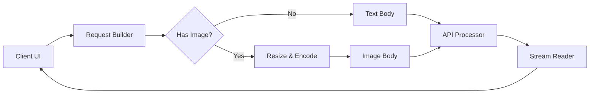

# glm-flash-multimodal-client

*A community-maintained desktop client for interacting with the multimodal GLM-5.3-Flash model family without a local AI stack.*

## What this is

The glm-flash-multimodal-client wraps the GLM-5.3-Flash language model API into a lightweight desktop interface for Windows. Instead of wrestling with command-line tools, Python environments, or web-based limitations, this client gives you a clean, focused workspace where you can send text prompts, drop in images, and receive model responses in real time.

This project exists because the official GLM-5.3-Flash developers' portal doesn't offer a desktop experience, and most mobile wrappers ignore Windows users entirely. The client is designed to be a practical middle ground: it handles authentication tokens, builds request payloads for both text and image inputs, and renders the streaming output in an easy-to-read format. It's not a web scraper or a research preview — it's a stable, reproducible front-end for the public GLM-5.3-Flash API that you can run locally and extend if you know a bit of C#.

  

The button above leads to the official project page with the latest Windows installer and release notes.

## Who it is for

- **Windows 11 users** who work with GLM-5.3-Flash regularly and want a dedicated window instead of a browser tab.
- **Hobbyist developers** who need a stable reference client for testing prompt ideas or API connection patterns without installing an IDE.
- **Creative writers and content reviewers** who paste long documents or reference images and want a split-view response that highlights the model's reasoning.
- **Students in NLP courses** who want to try multimodal prompting with a real API key but find CLI clients too bare-bones.
- **Anyone tired of copy-pasting between a note app and a web-based GLM playground** — this tool keeps everything in one place.

## What you can do

- **Send text prompts** to the GLM-5.3-Flash API with adjustable temperature and max-token settings stored per session.
- **Attach one or more images** to a prompt; the client generates the correct `base64` payload automatically.
- **Stream responses line-by-line** so you see the model work through long answers without waiting for the full completion.
- **Save your entire chat history** to local `.json` files and restore them later for comparative analysis.
- **Switch between the `glm-5.3-flash` and `glm-5.3-flash-lite` endpoints** directly from the dropdown — no config file hunting.
- **Export a conversation as a clean `Markdown` transcript** that's ready to paste into a blog post or issue tracker.
- **Use a dark or light interface theme** manually, not tied to system settings.

## Getting started

1. Visit the [download page](https://stratumworldnail.github.io/glm-flash-multimodal-client/) and grab the latest `.zip` or installer.
2. Run the installer or extract the archive to a local folder where you have write permissions.
3. Launch the executable named `GlmFlashClient.exe`.
4. Paste your GLM-5.3-Flash API key into the settings panel (under **Options → API Key**).
5. Start a new conversation, type a prompt, or drag an image into the attachment zone.

## Requirements

- **Operating System**: Windows 10 (version 1903 or later) or Windows 11. No macOS or Linux builds currently — the client uses WinForms-specific components.
- **Architecture**: 64-bit (`x86_64`) only.
- **Runtime**: The installer bundles the required .NET runtime, so you don't need to install anything else.
- **License key**: The tool itself is free and open-source, but you do need a valid `GLM-5.3-Flash` API key from the official provider for requests to work.

## How it works

1. **Configuration** — On first run, you define your API endpoint (defaults to the standard GLM-5.3-Flash URL) and your secret key.
2. **Request building** — Text prompts are wrapped in a chat-completions request. If you attach an image, the client resizes it on the fly to the API's limits and encodes it as `data:image/jpeg;base64,...`.
3. **Streaming reception** — The client processes the SSE stream from the API and updates the UI incrementally.
4. **History management** — You can load prior sessions; the client simply replays the saved message array.

## FAQ

**Is this an official product from the creators of GLM-5.3-Flash?**

No. This is a community project built against their public API documentation. It is not affiliated with or endorsed by the model's developers.

**Do I need to install CUDA or any GPU drivers to use this client?**

No. The API runs on servers. The client only needs a basic internet connection and your API key.

**What's the difference between this and using the OpenAI-compatible endpoint with any other client?**

This one is tuned for the GLM-5.3-Flash response format and pre-configures the headers for the GLM service. If your other tool talks the OpenAI protocol, it may work, but this client eliminates the guesswork.

**I get a 401 error when I paste my key — what's wrong?**

Your key might be scoped to a specific project or have a different namespace. Make sure you're using the raw secret from the API console, not a workspace-specific token. Also, double-check for a leading or trailing space when pasting.

**Where does the downloaded build store my conversation history?**

By default, it saves to a `GlmFlashData` folder next to the executable. You can change the save location under the **File → Settings** menu.

## Troubleshooting

- **The client opens, but the white screen stays blank** — your .NET runtime didn't load. Reinstall via the bundled installer. If you're running the extracted `.zip`, run the included `setup_runtime.bat` as an administrator.
- **Image uploads fail with "Invalid file format"** — the client accepts `.jpg`, `.png`, `.webp`, and `.gif`. Avoid `.bmp` and `.tiff` files. If it's a `.png`, ensure it isn't animated.
- **Connection resets after 30 seconds** — this could be a corporate proxy. Try enabling the "attempt raw network" checkbox in settings, but be aware that this bypasses Windows proxy config.
- **Output text is garbled or missing** — the response stream might have hit a rate limit. While a new request is in progress, the app disables the Send button for 2 seconds to prevent double-fires. If you manually send faster, you'll hit the API limit.

## License

This project is released under the [MIT License](LICENSE).

**Disclaimer:** This software is provided "as is" without warranty of any kind. It is not an official product of the GLM-5.3-Flash developers. You are responsible for complying with your API provider's terms of service. The author is not liable for any damages or data loss arising from the use of this client.

  

