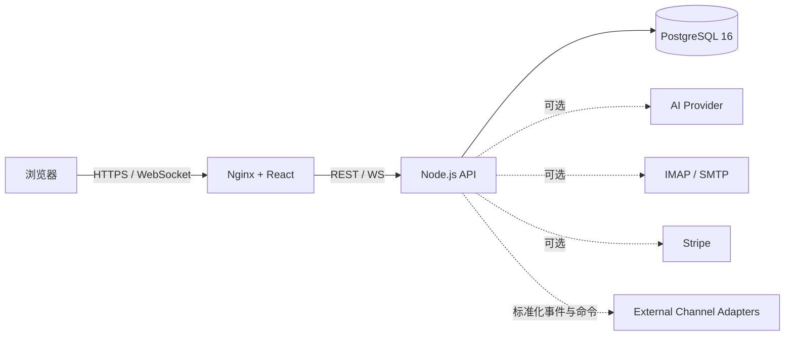

# 灵犀跨境 Community

[](https://github.com/wumingqi60/lingxi/actions/workflows/ci.yml)
[](LICENSE)

灵犀跨境 Community 是一套面向跨境团队的多租户客户经营 SaaS。它将统一消息工作台、多语言翻译、意图与情绪分析、客户画像、知识库、商机、任务、团队协作和经营分析放在同一套产品中。

本仓库提供可独立运行的 Web、业务 API 和 PostgreSQL 数据层。Telegram 与 WhatsApp 网关实现不在本仓库中；平台仅保留可选的外部适配接口。详细边界见 [开源范围](docs/OPEN_SOURCE_SCOPE.md)。

> Community edition for multilingual customer operations. The repository includes the SaaS application, API and database layer, but excludes Telegram and WhatsApp gateway implementations and all production credentials.

## 功能概览

- 多租户注册、登录、团队、角色权限、Token 撤销与审计日志。
- 统一消息中心、会话分页、已读、引用、媒体元数据和 WebSocket 增量更新。
- 上下文感知翻译、逐句意图、情绪、风险、摘要与人工确认的回复建议。
- 独立会话记忆、上下文压缩、客户画像和雷达图。
- 客户、标签、商机、跟进任务、知识库、通知和经营分析。
- 企业邮箱 IMAP/SMTP 接入，以及可选 Stripe 结算接口。
- Telegram/WhatsApp 外部适配器契约；网关实现由部署者自行提供。

## 架构



核心原则：PostgreSQL 是业务事实来源；WebSocket 只负责实时加速；AI 失败不阻断原始业务；所有租户资源必须在服务端校验归属。

完整说明见 [核心架构](docs/ARCHITECTURE.md) 和 [数据模型](docs/DATA_MODEL.md)。

## 快速启动

要求：Docker Engine 24+、Docker Compose v2。

```bash
git clone git@github.com:wumingqi60/lingxi.git
cd lingxi
cp .env.example .env
```

编辑 `.env`，至少替换：

```env
LX_DB_PASSWORD=<独立随机密码>
LX_JWT_SECRET=<至少 32 字节随机值>
```

启动：

```bash
docker compose --env-file .env up -d --build
docker compose ps
curl -fsS http://127.0.0.1:8088/health
```

打开 `http://127.0.0.1:8088` 注册第一个企业和管理员账号。AI、邮箱、支付和消息适配器没有配置时，对应功能会显示未配置，但登录、客户、知识、商机、任务和管理能力仍可运行。

生产部署、HTTPS、更新和回滚见 [部署指南](docs/DEPLOYMENT.md)。

## 本地开发

```bash
npm ci
npm run dev

cd server
npm ci
DATABASE_URL=postgresql://... JWT_SECRET=... npm start
```

质量检查：

```bash
npm run typecheck
npm run build
npm test --prefix server
npm run test:e2e
```

## 仓库结构

| 路径 | 内容 |
| --- | --- |
| `src/` | React 页面、组件、状态、API 客户端、类型与国际化 |
| `server/src/` | 认证、租户业务、消息、AI、邮箱、知识库、Webhook 和 WebSocket |
| `server/test/` | 业务、可靠性、邮箱协议与身份归并测试 |
| `tests/e2e/` | Playwright 桌面与移动端验收 |
| `docker/` | Nginx 和测试辅助配置 |
| `docs/` | 架构、部署、配置、接口、安全和运维文档 |

## 文档

- [开源范围与排除项](docs/OPEN_SOURCE_SCOPE.md)
- [系统架构](docs/ARCHITECTURE.md)
- [数据模型](docs/DATA_MODEL.md)
- [技术选型](docs/TECH-STACK.md)
- [部署与回滚](docs/DEPLOYMENT.md)
- [配置说明](docs/CONFIGURATION.md)
- [API 目录](docs/API.md)
- [渠道适配器契约](docs/CHANNEL_ADAPTERS.md)
- [测试策略](docs/TESTING.md)
- [运维手册](docs/OPERATIONS.md)
- [备份恢复](docs/BACKUP-RESTORE.md)
- [路线图](docs/ROADMAP.md)
- [贡献指南](CONTRIBUTING.md)
- [安全策略](SECURITY.md)

## 参与共建

欢迎提交 Issue、设计讨论和 Pull Request。开始前请阅读 [CONTRIBUTING.md](CONTRIBUTING.md)。涉及租户隔离、认证、消息发送、支付或数据库结构的变更，需要补充测试和安全说明。

## 安全与隐私

禁止提交真实客户数据、`.env`、API Key、访问令牌、数据库导出、邮箱密码、SSH 私钥或任何消息平台登录态。漏洞请使用 GitHub Security Advisory 私下报告，不要公开披露。

## License

代码采用 [Apache License 2.0](LICENSE)。品牌名称和标识不因开源许可证自动授予商标使用权，详见 [NOTICE](NOTICE)。
