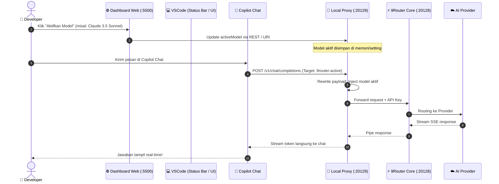

# 🚀 9Router Model Connector

<div align="center">


### Switch Model AI di GitHub Copilot Chat VSCode Hanya dengan 1 Klik — Zero Reload!

[](https://github.com/yudaprasetya007/routeVSCODE)
[](https://github.com/yudaprasetya007/routeVSCODE/releases)
[](https://www.npmjs.com/package/9router)
[](LICENSE)

[**Fitur Utama**](#-fitur-utama) •
[**Cara Kerja**](#-cara-kerja) •
[**Instalasi Cepat**](#-instalasi-cepat) •
[**Panduan Pemakaian**](#-cara-pakai) •
[**Dokumentasi Lengkap**](#-dokumentasi) •
[**Troubleshooting**](#-troubleshooting)

</div>

---

## 💡 Apa Itu 9Router Model Connector?

**9Router Model Connector** adalah integrasi pintar yang menghubungkan **Visual Studio Code (GitHub Copilot Chat)** dengan gateway AI **9Router** melalui **Zero-Reload Dynamic Local Proxy**.

Dengan tool ini, Anda tidak perlu lagi mengubah file konfigurasi JSON atau me-reload window VSCode setiap kali ingin berganti model AI (Claude 3.5 Sonnet, GPT-4o, Gemini 1.5 Pro, DeepSeek V3/R1, Llama 3, dll). Cukup **1 klik di dashboard web**, dan model yang aktif di Copilot Chat akan langsung berubah saat itu juga!

---

## ✨ Fitur Utama

- ⚡ **Zero-Reload Model Switching**: Ganti model AI instan tanpa mematikan sesi chat atau restart VSCode.
- 🌐 **Modern Web Dashboard**: Tampilan visual futuristik dengan dark mode, neon accents, dan filter provider instan.
- 🤖 **Status Bar Integration**: Ganti model langsung dari status bar VSCode di pojok kanan bawah.
- 📊 **Live Model Comparison & Benchmark**: Uji respon prompt dan ukur latency antar model secara berdampingan.
- 🔌 **Dynamic Local Proxy (Port 20129)**: Menangani injeksi model, streaming token SSE, dan header otentikasi secara otomatis.
- 🛡️ **Universal Provider Support**: Terhubung ke 40+ provider AI (OpenAI, Anthropic, Google Gemini, DeepSeek, Groq, OpenRouter).

---

## 🏗️ Cara Kerja



- **Port 20128** → 9Router core engine (AI gateway & load balancer).
- **Port 20129** → Local proxy extension (injeksi model dinamis secara transparan).
- **Port 5500** → Web dashboard antarmuka pengguna.

---

## 🚀 Instalasi Cepat

### 🪟 Windows (Satu Perintah)
Buka Terminal atau Command Prompt di folder project:
```cmd
scripts\setup.bat
```
Atau via npm:
```bash
npm run setup
```

### 🐧 Linux / 🍎 macOS
```bash
chmod +x scripts/setup.sh
./scripts/setup.sh
```

---

## 🛠️ Instalasi Manual

1. **Install 9Router (Core Gateway)**:
   ```bash
   npm install -g 9router
   ```

2. **Clone Repository**:
   ```bash
   git clone https://github.com/yudaprasetya007/routeVSCODE.git
   cd routeVSCODE
   ```

3. **Install Extension VSCode**:
   ```bash
   code --install-extension releases/routevscode.model-connector-2.5.0.vsix --force
   ```

4. **Jalankan Web Dashboard**:
   ```bash
   npm start
   # Buka http://localhost:5500 di browser Anda
   ```

---

## 📖 Cara Pakai

### 1. Jalankan 9Router
```bash
9router
```
- Buka dashboard di `http://localhost:20128/dashboard` untuk mengambil **API Key**.

### 2. Jalankan Dashboard Connector
```bash
npm start
```
- Dashboard akan aktif di `http://localhost:5500`.

### 3. Konfigurasi Sekali di VSCode
- Di VSCode, tekan `Ctrl+Shift+P` → pilih:
  ```
  9Router: Set API Key & Base URL
  ```
- Masukkan Base URL (`http://localhost:20128/v1`) dan tempelkan API Key 9Router Anda.

### 4. Pilih Model di Copilot Chat (Hanya 1 Kali!)
1. Buka Copilot Chat di VSCode (`Ctrl+Alt+I`).
2. Klik dropdown **Model Picker** di pojok bawah chat.
3. Pilih **"9Router via Proxy"**.
4. Selesai! Sekarang Copilot akan selalu menggunakan model yang aktif di proxy.

### 5. Ganti Model Sesuka Hati
- Buka dashboard `http://localhost:5500` lalu klik model apa saja.
- Atau klik status bar VSCode di pojok kanan bawah `🤖 [9Router: ...]`.
- Model langsung berganti seketika **tanpa reload**! 🎉

---

## ⌨️ Daftar Command VSCode

Tekan `Ctrl+Shift+P` (atau `Cmd+Shift+P`) lalu ketik salah satu perintah berikut:

| Command | Keterangan |
|---|---|
| `9Router: Pilih Model AI` | Membuka quick pick untuk memilih model aktif |
| `9Router: Status & Info` | Menampilkan status koneksi, proxy port, dan model aktif |
| `9Router: Set API Key & Base URL` | Mengatur kredensial endpoint 9Router |
| `9Router: Sync Semua Model ke Copilot` | Menulis ulang konfigurasi ke `chatLanguageModels.json` |
| `9Router: Buka Dashboard Web` | Membuka dashboard lokal di browser |
| `9Router: Tambah Model Manual` | Mendaftarkan ID model kustom secara manual |
| `9Router: Hapus Semua Entry 9Router` | Membersihkan konfigurasi proxy dari VSCode |

---

## 📚 Dokumentasi

Dokumentasi teknis lebih detail dapat dibaca di folder `docs/`:
- 🏛️ [**Arsitektur Sistem & Alur Data**](docs/ARCHITECTURE.md)
- 📖 [**Panduan Lengkap Setup & Konfigurasi**](docs/SETUP_GUIDE.md)
- 🛠️ [**Panduan Troubleshooting & FAQ**](docs/TROUBLESHOOTING.md)

---

## 🗂️ Struktur Project

```
routeVSCODE/
├── index.html              # Antarmuka Dashboard Web
├── app.js                  # Logika aplikasi dashboard, perbandingan model & API caller
├── style.css               # Desain UI modern, glassmorphism, responsive
├── logo.svg                # Logo vector resmi project
├── favicon.svg             # Favicon neon vector
├── package.json            # Manifest package & npm scripts
├── docs/                   # Dokumentasi teknis terperinci
│   ├── ARCHITECTURE.md     # Desain sistem & diagram alur
│   ├── SETUP_GUIDE.md      # Panduan instalasi multi-platform
│   └── TROUBLESHOOTING.md  # Pemecahan masalah & FAQ
├── extension/              # Source code VSCode Extension
│   ├── extension.js        # Core extension & Local HTTP Proxy (:20129)
│   ├── package.json        # Extension manifest & commands definition
│   └── icon.png            # Icon extension
├── releases/               # Paket rilis extension siap pasang
│   └── routevscode.model-connector-2.5.0.vsix
└── scripts/                # Script utilitas dan instalasi
    ├── setup.bat           # Setup otomatis Windows
    ├── setup.sh            # Setup otomatis Linux/Mac
    ├── setup.js            # Setup wizard Node.js
    └── install.js          # Installer .vsix via Node.js
```

---

## ❓ Troubleshooting

Jika mengalami kendala:
1. **Proxy Port Conflict (20129)**: Pastikan tidak ada instance VSCode lama yang menggantung atau port lain yang memakai `20129`.
2. **Model Picker Copilot Belum Muncul**: Jalankan `Developer: Reload Window` di VSCode setelah instalasi pertama kali.
3. **9Router Tidak Merespon**: Pastikan command `9router` berjalan di terminal terpisah.

👉 Baca solusi lengkap di [**docs/TROUBLESHOOTING.md**](docs/TROUBLESHOOTING.md).

---

## 🤝 Kontribusi

Kontribusi, perbaikan bug, dan ide fitur baru sangat kami hargai!
1. Fork repository ini
2. Buat feature branch (`git checkout -b feature/FiturKeren`)
3. Commit perubahan (`git commit -m 'feat: tambah fitur keren'`)
4. Push ke branch (`git push origin feature/FiturKeren`)
5. Buka Pull Request

---

## 📜 Lisensi

Didistribusikan di bawah lisensi **MIT**. Lihat file [LICENSE](LICENSE) untuk detail lengkap.

---

<div align="center">

Dibuat dengan ❤️ untuk developer AI oleh **[yudaprasetya007](https://github.com/yudaprasetya007)**

</div>
