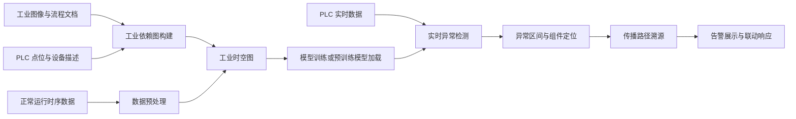

# InduSecAgent

面向工业控制系统的智能异常检测、攻击溯源与联动响应平台。

InduSecAgent 将工业流程图、设备与点位说明、正常运行时序数据等多模态信息统一建模为工业时空图（Industrial Spatio-Temporal Graph，ISTG），利用图神经网络学习传感器、执行器和工艺环节之间的空间依赖与时间演化规律，为工业现场提供可解释、可追踪的安全监测能力。

> 当前仓库包含可视化演示界面、模型训练与推理代码、实时数据采集服务及示例数据。接入真实 PLC 前，请在隔离的测试网络中完成配置校验和风险评估。

## 功能特性

- **多模态信息融合**：支持工业流程图、工艺说明、PLC 点位描述和正常运行数据等输入。
- **工业依赖图构建**：建立传感器、执行器、控制器与工艺过程之间的物理、控制和数据依赖关系。
- **时空异常检测**：结合空间拓扑与滑动时间窗口，对多变量工业时序数据进行重构和异常评分。
- **异常节点定位**：展示异常区间、受影响组件、重构误差及关联路径。
- **攻击溯源分析**：根据依赖图追踪异常传播链路，辅助研判潜在攻击源与影响范围。
- **实时监测与响应**：通过 PLC 数据采集、异步检测任务和可视化控制台形成监测闭环。
- **多场景示例**：内置码垛、液位控制、汇流站、按高度分拣和按重量分拣等工业场景数据。

## 系统流程



## 技术栈

| 模块 | 技术 |
| --- | --- |
| Web 控制台 | Vue 3、TypeScript、Vite、Vue Router、Pinia |
| 检测服务 | Python、FastAPI、Uvicorn |
| 模型与数据 | PyTorch、PyTorch Geometric、NumPy、Pandas、scikit-learn |
| 实时采集 | python-snap7 |
| 图谱生成 | Transformers（可选） |

## 快速开始

### 1. 环境要求

- Node.js `20.19+` 或 `22.12+`
- npm
- Python `3.10+`
- 支持 S7 通信的 PLC 或仿真环境（仅实时检测需要）

### 2. 启动 Web 控制台

```bash
git clone <your-repository-url>
cd InduSecAgent
npm ci
npm run dev
```

浏览器访问终端中显示的本地地址，通常为 `http://localhost:5173`。

仅体验页面流程时，无须连接 PLC；实时检测功能需要继续启动检测服务。

### 3. 启动检测服务

建议使用独立虚拟环境：

```bash
python3 -m venv .venv
source .venv/bin/activate
python -m pip install --upgrade pip
python -m pip install -r I*/requirements.txt
python I*/main.py
```

服务默认监听 `http://127.0.0.1:8000`。可通过健康检查确认服务状态：

```bash
curl http://127.0.0.1:8000/api/health
```

预期响应：

```json
{"status":"ok"}
```

### 4. 配置前端接口地址

前端默认请求 `http://127.0.0.1:8000/api/detect`。如检测服务部署在其他地址，可在项目根目录创建 `.env.local`：

```dotenv
VITE_DETECTION_API_URL=http://127.0.0.1:8000/api/detect
```

修改后需重新启动开发服务器。

## 使用说明

### 构建工业时空图

1. 在 **Upload** 页面上传工业流程图或仿真截图。
2. 上传工艺说明、PLC 点位描述或设备清单。
3. 上传正常运行时序数据。
4. 配置训练参数并开始构建。
5. 在图谱页面检查节点、依赖边及时间展开结果。

支持的常见文件格式：

- 图像：PNG、JPG、BMP
- 文档：TXT、MD、PDF、DOCX、JSON、XML
- 时序数据：CSV、TSV、XLSX

### 实时异常检测

1. 准备与目标场景匹配的依赖图和模型检查点。
2. 在 **Detection** 页面上传依赖图并选择模型。
3. 输入测试环境中的 PLC IPv4 地址。
4. 启动检测任务，查看实时曲线、异常分数和受影响组件。
5. 在异常出现后查看溯源路径与响应状态。

> 模型检查点、依赖图和实时数据的特征顺序必须与训练数据一致，否则检测结果无效或任务会失败。

## 数据约定

每个工业场景的数据目录通常包含：

```text
<dataset>/
├── train_orig.csv          # 正常训练数据
├── test_orig.csv           # 测试或验证数据
├── list.txt                # 点位/特征列表
├── llm_edge_index.pt       # 空间依赖边
├── tc_edge_index.pt        # 时间依赖边
└── sensor_dependency_graph_physical_final.json
```

CSV 文件应满足以下约定：

- 每行表示一个采样时刻，每列表示一个传感器、执行器或控制变量。
- 训练集应以正常运行数据为主。
- 实时数据列名应与训练特征一致，或能映射到对应 PLC 点位。
- 若提供标签，使用 `attack` 列表示样本状态；模型输入时该列不会作为普通特征使用。

## API 概览

| 方法 | 路径 | 说明 |
| --- | --- | --- |
| `GET` | `/api/health` | 服务健康检查 |
| `POST` | `/api/detect` | 同步执行检测 |
| `POST` | `/api/detect/tasks` | 创建异步检测任务 |
| `GET` | `/api/detect/tasks/{task_id}` | 查询任务状态与结果 |

创建检测任务的基本请求示例：

```json
{
  "dataset": "Palletizer",
  "load_model_path": "<checkpoint-path>",
  "plc_ip": "<plc-ipv4-address>",
  "realtime_monitor_seconds": 60,
  "collector_ready_timeout": 30,
  "traceback_enabled": true
}
```

## 项目结构

```text
.
├── src/                    # Vue Web 控制台
│   ├── components/         # 图表、图谱和通用组件
│   ├── data/               # 演示数据
│   ├── router/             # 页面路由
│   ├── types/              # TypeScript 类型
│   ├── utils/              # 依赖图解析工具
│   └── views/              # 首页、上传、图谱和检测页面
├── public/                 # 静态资源
├── Sim with TimeStamp/     # 工业场景仿真与时序样例
├── 测试用例/               # 示例输入与模型结果
├── package.json            # 前端依赖与脚本
└── vite.config.ts          # Vite 配置
```

## 开发命令

```bash
npm run dev          # 启动开发服务器
npm run type-check   # TypeScript 类型检查
npm run build        # 生产构建
npm run preview      # 本地预览生产构建
```

提交代码前建议至少执行：

```bash
npm run type-check
npm run build
```

## 安全说明

- 仅在获得授权的工业控制环境或隔离仿真网络中使用本项目。
- 不要将生产 PLC、控制网络或安全仪表系统直接暴露到公网。
- 首次接入现场前，请核对 PLC 地址、rack/slot、点位映射和模型版本。
- 联动操作应配置人工复核、权限控制、审计记录与故障安全策略。
- 本项目输出用于辅助安全分析，不应作为生产控制决策的唯一依据。

## 贡献

欢迎通过 Issue 提交缺陷、场景适配需求和改进建议。提交 Pull Request 时，请说明变更目的、验证方式及对现有工业场景的影响，并确保构建与类型检查通过。

## 许可证

当前仓库尚未声明开源许可证。在许可证文件补充之前，代码的复制、修改与分发需获得项目维护者许可。

